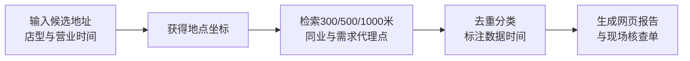

# 开店半径：便利店签租前查重报告

> **一句话讲清楚：** 在全国市场、首期聚焦石家庄主城区，给准备签便利店铺面的个体开店者卖一份自动生成的地址报告；它把 300、500、1000 米内的同业门店与社区、写字楼、交通入口等需求代理点列清楚，因为 2026 年 7 月国家首次提出探索商业设施饱和度评估，而便利店单店经营正在变薄。

**五分钟读完：** 这是一个 149 元一次的数据商品，不是选址咨询，也不承诺营业额。公开地图数据只有取得商用授权后才能用于收费产品；证据、完整测算和授权门槛放在文末附录。

## 1. 先看懂：在付押金之前，买一张“周边到底挤不挤”的证据卡

一个准备开便利店的人看中一间临街铺面。房东说小区人多，加盟经理说位置不错，他自己在地图上搜了几次“便利店”，但不同关键词得到的结果不同，也没有人把 24 小时门店、夫妻店、社区入口、办公楼和公交地铁口放在同一张图里。几天后就要付押金，判断却主要靠走一圈和听人讲。

“开店半径”让客户输入候选地址、计划营业时间和店型，付款后得到一个网页报告：三个距离圈内有多少同类店、哪些是连锁品牌、哪些营业到深夜，周边有哪些社区、学校、医院、写字楼和交通入口；末尾列出数据没法回答的事项，例如真实人流、租金、店面可见性和竞争店实际生意。

**最小可售单元：** 一个地址、一种便利店店型、一份带查询时间戳的报告。它不替客户说“能开”或“不能开”，只把签租前最容易漏查的事实放在一页。

## 2. 为什么偏偏是现在：选址正在从经验问题变成可复核的数据问题

2026 年 7 月 2 日，商务部等 9 部门发布《关于加快零售业创新发展的意见》，明确提出加强零售商业设施运行监测，探索商业设施饱和度评估机制。7 月 9 日的商务部发布会进一步解释，这是首次提出以“市场晴雨表”供项目立项和社会投资参考；同一场发布会披露，全国有超过 3200 万零售个体户。

另一条独立信号来自中国连锁经营协会与毕马威发布的《2026 年中国便利店发展报告》。其样本调查显示，2025 年便利店平均单店日销售额降至 4453 元，同比下降 3.9%；平均单店日来客数降至 284.4 人，同比下降 8.7%，样本企业净利率为 2.7%。这些是样本数据，不能代表每家店，却说明选错位置可供消化的利润空间并不厚。

同时，百度地图开放平台已经提供圆形地点检索、品牌、营业时间、营业状态等接口能力。于是三件事碰到一起：开店者数量大、单店经营承压、周边地点数据可机器读取。新的付费理由不是“听专家判断”，而是花一笔小钱，在交押金前拿到标准化查重底稿。

## 3. 谁会付钱：不是大连锁，而是第一次或第二次开店的人

唯一付费客户是：**准备在 7 天内决定是否签下一间便利店铺面的个体开店者**。他们可能加盟，也可能开夫妻店，但尚未拥有专业拓展团队。购买触发点是房东要求付定金、加盟商要求确认地址，或者两个铺面必须二选一。

客户今天的替代方案是地图搜索、加盟经理免费评估、经纪人口述和自行蹲点。地图搜索便宜但零散；加盟方和经纪人掌握信息，却不一定与开店者利益完全一致；人工选址公司更贵、更慢。“开店半径”的位置在两者之间：149 元、几分钟交付、能保存、能拿着去现场逐项核对。

这里仍有一个未经验证的 AI 推断：开店者会为了“少漏一家竞争店、少听一句模糊话”支付 149 元。政策和行业报告只证明问题存在，不证明这个价格一定有人买。

## 4. 它具体怎么运转：数据自动拉取，最后的脚步留给客户



系统先调用获得正式商用授权的地图位置服务，把地址转成坐标，再按三个半径查询便利店、超市、烟酒店，以及社区、办公楼、学校、医院和交通入口。规则引擎负责同名门店去重、品牌归类、距离分层和营业时间冲突；生成模型只负责把结构化结果翻译成人话，不能虚构客流或销售额。

完成定义是：客户能看到数据来源、查询时间、检索关键词、覆盖范围、缺失提示，并下载一张现场核查单。产品明确不做租金估值、不预测营业额、不推断居民收入、不抓取点评平台评论，也不把自己的指标叫作“官方饱和度评分”。

## 5. 怎么赚钱：149 元卖一次，自动化上限由数据授权决定

**建议定价假设：149 元/地址报告**，三地址比较包 299 元。单份报告的接口调用、生成、托管与支付通道按 8 元估算，内容获客按 35 元估算，则单份贡献约 106 元。三项数字均为测算假设，不是实际报价或收益承诺。

可自动化的部分包括收款、地址补全、半径查询、去重、图表、风险提示、报告生成和 24 小时内一次数据刷新。必须人工处理地址匹配失败、商户分类争议、退款、地图服务异常和授权审计。若每份报告需要人工整理超过 12 分钟，这就不再是自动化数据商品。

最大的固定成本不是模型，而是地图数据权利。百度官方条款说明，商业使用需要付费授权，技术服务授权目前仅限公司申请；符合条件的初创或小微企业可能获得 180 天商用权限。具体报价和是否允许把统计结果放入收费报告，必须在上线前取得书面确认，也可以采购已获授权的位置数据供应商按次服务。

## 6. 最大问题与最终判断：有条件值得，但数据授权不过就立刻放弃

结论是：**有条件值得继续关注。** 它抓住了一个刚被官方命名的新问题，把昂贵的选址工作压缩成低价、自动化、签租前即时购买的数据商品；但它不能靠偷偷爬地图起步。

最可能失败的三件事是：地图商用授权成本吃掉毛利；地图地点不全或关店状态滞后，让客户失去信任；客户真正需要的是现场人流和租金判断，而不是周边查重。停止条件也应直接：拿不到允许收费交付的书面数据授权；50 份报告中退款或数据异议超过 10%；单份人工处理超过 12 分钟；获客成本超过 60 元；90 天没有卖出 100 份。

用户的系统架构能力可迁移到多源数据去重、规则解释、报告生成和异常熔断；缺口是零售选址口径、地图数据商务授权与本地获客，可分别找便利店拓展人员审核指标、采购授权数据服务、与本地商铺经纪或加盟社群按成交付费合作。机会形态仍是数据商品，不改写成咨询。

---

## 事实与推演附录

### A. 行业坐标与商业系统

- **主行业：** 实体零售 / 便利店选址。
- **商业模式：** 一次性自动化数据报告；不是咨询、撮合或加盟代理。
- **价值链位置：** 找到候选铺面之后、签租和交押金之前。
- **新鲜信号：** 2026 年 7 月国家首次提出探索商业设施饱和度评估；2026 年行业报告显示便利店单店营收和客流承压。
- **受益者与付款者：** 均为准备签店的个体开店者。
- **最小可售单元：** 一个候选地址的一份带时间戳报告。
- **交易落点：** 全国地图位置服务可覆盖；首期产品和获客只聚焦石家庄主城区，避免把城市差异藏进全国平均值。
- **角色政策：** 用户角色未参与候选筛选，只在选定后用于执行适配。

### B. 市场证据与事实来源

| 日期 | 一手或独立来源 | 可直接复核的事实 | AI 推断 | 证据局限 |
|------|----------------|------------------|---------|----------|
| 2026-07-02 | [商务部等9部门《关于加快零售业创新发展的意见》](https://www.mofcom.gov.cn/zfxxgk/fdzdgknr/ztfl/gnmygl/art/2026/art_8262ebcc8cf045d9bab632146c3e5ff2.html) | 提出运行监测和商业设施饱和度评估；支持第三方科技企业开发面向中小零售主体的数字系统 | 低价选址数据商品会获得更多认知 | 政策没有承诺采购，也没有定义具体评估模型 |
| 2026-07-09 | [商务部专题新闻发布会](https://interview.mofcom.gov.cn/detail/202607/ff8080819f5fa88b019f5fc0d64c0006.html) | 首次提出饱和度评估作为社会投资参考；全国超过3200万零售个体户 | 潜在开店决策者基数大 | 零售个体户不等于准备开便利店的人 |
| 2026-05 | [中国连锁经营协会、毕马威《2026年中国便利店发展报告》](https://assets.kpmg.com/content/dam/kpmgsites/cn/pdf/zh/2026/05/china-convenience-store-development-report-2026.pdf.coredownload.inline.pdf) | 样本企业2025年平均单店日销4453元、日来客284.4人、净利率2.7% | 选址错误更难被利润吸收 | 是样本企业数据，不能外推到某城市或某店 |
| 更新于2026-04-01 | [百度地图地点检索2.0文档](https://lbs.baidu.com/docs/webapi?title=placev2%2Fguide%2Fwebservice-placeapi%2Fuse) | 支持圆形区域地点检索和地点详情 | 技术上可自动生成半径清单 | API数据可能缺失、滞后，字段因类别而异 |
| 查阅于2026-08-11 | [百度地图商用授权页面](https://lbs.baidu.com/cashier/auth) | 商用授权仅限公司申请；符合条件者可获180天商用权限 | 可通过公司主体或授权供应商解决 | 具体费用、统计结果再交付权需书面确认 |
| 更新于2026-07-08 | [百度地图开放平台服务条款](https://lbs.baidu.com/docs/pcsa?title=law%2Fopen%2Flaw) | 商业目的使用需要购买授权，不能把免费配额当商业许可 | 授权是产品第一门槛 | 条款可能变化，应以上线时协议为准 |

### C. 收入与单位经济

| 收入项 | 建议定价假设 | 可变成本假设 | 毛利逻辑 | 回款与复购 |
|--------|--------------|--------------|----------|------------|
| 单地址报告 | 149元 | 8元生成与接口 + 35元获客 | 单份贡献约106元，未扣固定授权和税费 | 先付款后生成；同一客户复购低 |
| 三地址比较包 | 299元 | 18元生成与接口 + 45元获客 | 单包贡献约236元，未扣固定授权和税费 | 适合二选一、三选一时购买 |

- **固定成本未知：** 公司主体、地图商用授权、法律审阅、域名与基础设施。
- **授权盈亏公式：** 年固定授权成本 ÷ 单份贡献 = 仅覆盖授权所需的年报告量。
- **不做收益承诺：** 公开数据没有证明 149 元成交率、35 元获客成本或 106 元贡献能够实现。

### D. 运营与自动化系统

- **输入：** 地址、店型、营业时段、候选店面积等非敏感业务信息。
- **自动化：** 地址解析、授权 API 调用、多半径检索、POI 去重分类、覆盖缺口检测、报告渲染、支付与刷新。
- **人工责任：** 数据授权、异常核对、退款、客户争议和模型规则迭代。
- **异常熔断：** 地址置信度低、接口返回不足、数据时间过旧时不生成结论，自动退款或转人工。
- **沉淀资产：** 合法授权下的查询规则、分类词典、城市差异参数、异议样本和报告模板；不沉淀未经许可的地图原始数据库。

### E. 30 / 90 天演进路线

- **0—30 天：** 向地图服务商或已授权数据供应商书面确认收费报告场景；只用虚构地点做页面原型；请一名便利店拓展人员审核指标定义。
- **31—90 天：** 权利确认后上线石家庄主城区自助购买页；先支持便利店一种店型，再增加三地址比较；累计数据异议和人工分钟数。
- **90 天后：** 只有达到停止条件反面指标时，才复制到药店、咖啡店等相邻业态；不能直接套同一套权重。
- **可沉淀资产：** 可解释的地点分类、数据完整度标签、城市版本和现场核查清单。

### F. 风险、合规与停止条件

- **最大风险：** 位置数据授权昂贵或禁止二次收费交付；POI滞后；消费者把报告误解为营业额预测。
- **合规边界：** 只用正式授权接口；不爬取地图和点评；不缓存或转售原始数据；不使用“官方评估”“政府推荐”等表达；地图展示和统计口径遵守供应商协议及地图管理要求。
- **停止条件：** 无书面商用授权；50份中退款或数据异议超过10%；人工超过12分钟/份；获客成本超过60元；90天少于100份。
- **未知项：** 授权最终报价、再交付权限、石家庄地址数据完整度、付费转化、渠道成本、报告是否真正影响签租决定。

## 反馈（skill_run）

```yaml
skill_run:
  skill: creative-capture-assistant
  workflow_stage: single-idea
  plan: Plans/创意捕捉/2026-08-11-副业创意-开店半径便利店签租前查重报告.md
  date: 2026-08-11
  contexts_used:
    - path: Contexts/决策/Skill反馈协议.md
      utility: high
      reason: "每次只深挖一个有公开市场证据的副业创意，并用五分钟正文与事实附录分离理解和审计。"
  contexts_missing: []
  contexts_stale: []
```
