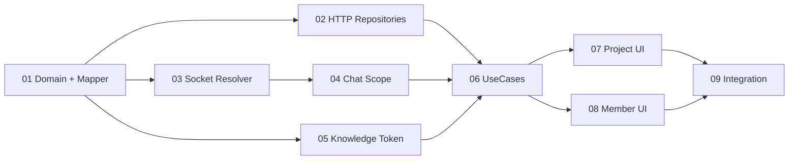

# 功能开发：项目模块重构

**创建日期**：2026-07-27  
**状态**：进行中  
**平台**：iOS / UIKit / Swift Concurrency  
**含业务逻辑**：是

---

## 一、需求分析（开工门禁）

| 项 | 内容 |
|----|------|
| 需求分析 plan | `Plans/需求分析/2026-07-27-项目模块重构.md` |
| 分析结论 | ✅ 已采纳，P0=0，24 组 GWT、20 条 AC |
| 技术方案 | `Plans/技术方案/2026-07-27-项目模块重构.md`，✅ 已采纳 |
| 测试计划 | `Plans/自动化测试/2026-07-27-项目模块重构.md`，✅ AC1–AC20 已映射 |
| 核心补充 | 非本人项目必须创建/复用项目独立 Socket；失败不得回退 personal |

---

## 二、背景与目标

- **业务目标**：以企业 HTTP 为项目、任务、专家、成员权威数据源；保留 Gateway 创建与项目会话；按项目隔离知识 Token 和协同项目 Socket。
- **技术目标**：建立 Domain / Repository / Resolver / UseCase 边界，项目 Chat 显式携带 Gateway Access，项目快速切换无跨作用域污染。
- **非目标**：不重写底层 Gateway/Chat 栈，不猜测未公开的任务/专家写接口，不提升连接池容量。

---

## 三、设计稿

| 页面 | Figma |
|------|-------|
| 项目列表 | `Ljv8hHoMjFRTNMdeEptgjI · 209:3939` |
| 任务 / 四 Tab 容器 | `209:3723` |
| 成员 Tab | `264:1883` |
| 管理成员 | `209:4157` |
| 申请记录 | `219:10371` |

UI 子任务已通过 `figma-ui` 读取并截图核对上述五个节点；代码静态对照已完成，运行态截图对稿仍受工程构建阻塞。

---

## 四、架构概要

| 模块 | 职责 |
|------|------|
| `Projects/Domain` | 项目、任务、专家、成员、权限、scope 值对象 |
| `Projects/Data/HTTP` | Items/组织/project-token DTO、Mapper、Repository |
| `Projects/Data/Gateway` | 创建 Adapter、Endpoint Builder、Gateway Resolver |
| `Projects/UseCase` | 进入项目、加载 Tab、创建对账、成员 diff、审核 |
| `Projects/Presentation` | 项目列表、四 Tab、成员管理、申请记录 |
| `ClawChat GatewayAccess` | 显式项目 Access、事件按 gatewayKey 路由 |

**硬约束**：

1. owner/current identity 缺失 fail-closed。
2. 本人项目只返回 personal，不调用 Pool。
3. 他人项目 key 包含 env + tenant + vim + projectId。
4. 任务/专家/成员列表不调用 personal activeRPC。
5. 项目 Chat 入口不得使用默认 personal 参数。
6. Token/HTTP/Socket 回包提交前校验 project scope generation。

---

## 五、实施切片

| # | 原子任务 | 输入 | 输出 | 覆盖 AC | 验收 | 依赖 / 阻塞 |
|---|----------|------|------|---------|------|-------------|
| 01 | 领域模型、DTO Mapper 与首批 Mapper 红测 | 需求字段字典、HTTP/Web 契约 | `NMProject` 等 Domain、Mapper、UT | AC1, AC8, AC10, AC11, AC19 | 坏数据不进入可执行 UI；Mapper UT 通过 | 无 |
| 02 | 项目 HTTP Repository | 子任务01、现有 `NMEnterpriseAPI` | Catalog/Task/Expert/Member async Repository | AC1, AC8, AC10, AC11, AC12, AC13, AC15, AC19 | 列表与管理均不走 personal activeRPC | 任务/专家写 Route 未公开时使用协议 fake，禁止 Gateway 回退 |
| 03 | 项目 Socket Endpoint 与 Resolver | 架构 ADR、通用连接池 | query items、Endpoint Builder、Resolver、UT | AC3, AC4, AC6, AC18 | own=personal；shared=pooled；失败不降级 | 子任务01 |
| 04 | Chat 显式 Access、scope 与生命周期隔离 | 子任务03、现有 Chat Access | Project AccessContext、导航注入、旧事件丢弃、drain | AC5, AC7, AC17 | 所有项目会话 RPC/流式匹配同 gatewayKey | 子任务03 |
| 05 | 项目知识 Token 隔离 | project-token Web 契约 | Token API/Store、owner QID、scope cache、UT | AC9, AC17 | A Token 不能用于 B；切账号/租户/环境清空 | 子任务01 |
| 06 | 项目 UseCase、状态与权限 | 子任务01–05 | 进入项目、创建对账、四 Tab state、成员 diff、审核 | AC2, AC6, AC12, AC14, AC15, AC16 | 所有写操作二次权限校验；失败刷新权威数据 | 子任务01–05 |
| 07 | 项目列表与四 Tab 界面 | Figma、子任务06 | 项目列表、任务/知识/专家/成员容器及 Variant | AC1, AC4, AC8, AC9, AC10, AC19, AC20 | Figma 静态/交互走查；连接中和四类空错态齐全 | 子任务06；须先用 figma-ui |
| 08 | 成员管理、申请记录、只读界面 | Figma、子任务06 | 成员 Tab、管理成员、申请记录、公开项目只读态 | AC11, AC12, AC13, AC14, AC15, AC16, AC20 | owner 锁定；申请终态；权限与 UI 一致 | 子任务06；须先用 figma-ui |
| 09 | 真接口联调、回归与 AC 验收 | 子任务01–08、测试 plan | API/Gateway/Token 联调、UT/IT/UI、iPad 回归 | AC1, AC2, AC3, AC4, AC5, AC6, AC7, AC8, AC9, AC10, AC11, AC12, AC13, AC14, AC15, AC16, AC17, AC18, AC19, AC20 | AC1–AC20 通过；无 personal 串线和 Token 串用 | 需 Xcode 支持 Swift tools 6.2；任务/专家正式写契约 |

### Checklist（双链子任务）

- [ ] [01 领域模型与映射](Plans/功能开发/2026-07-27-项目模块重构-子任务01-领域模型与映射.md)
- [ ] [02 项目 HTTP 仓储](Plans/功能开发/2026-07-27-项目模块重构-子任务02-项目HTTP仓储.md)
- [ ] [03 项目 Socket 路由](Plans/功能开发/2026-07-27-项目模块重构-子任务03-项目Socket路由.md)
- [ ] [04 Chat 作用域隔离](Plans/功能开发/2026-07-27-项目模块重构-子任务04-Chat作用域隔离.md)
- [ ] [05 知识 Token 隔离](Plans/功能开发/2026-07-27-项目模块重构-子任务05-知识Token隔离.md)
- [ ] [06 项目用例与权限](Plans/功能开发/2026-07-27-项目模块重构-子任务06-项目用例与权限.md)
- [ ] [07 项目列表与四 Tab 界面](Plans/功能开发/2026-07-27-项目模块重构-子任务07-项目列表与四Tab界面.md)
- [ ] [08 成员与申请界面](Plans/功能开发/2026-07-27-项目模块重构-子任务08-成员与申请界面.md)
- [ ] [09 联调回归与验收](Plans/功能开发/2026-07-27-项目模块重构-子任务09-联调回归与验收.md)

### Epic WBS 投影

```text
[x] 5. 原子任务拆分（主 Plan + 9 个子任务 + AC1–AC20 覆盖）
[ ] 6. Domain / UseCase 实现（子任务01、06）
[ ] 7. Data / API 实现与联调（子任务02–05）
[ ] 8. UI 骨架 + 静态设计走查（子任务07、08）
[ ] 9. 交互 + 全 Variant（子任务07、08）
[ ] 10. 单元测试补充与回归（子任务01–06、09）
[ ] 11. 真机联调 + 集成设计走查（子任务09）
```

### 当前实施快照

| 范围 | 代码状态 | 尚未闭环 |
|------|----------|----------|
| Domain / Mapper / HTTP | 项目、任务、专家、成员模型与 HTTP Repository 已落地；创建仍复用 Gateway | 底层 HTTP 主动取消桥接、任务/专家写 Route 与真实接口联调 |
| 非本人项目 Socket | 按 env/tenant/vim/project 建独立 key，iPhone/iPad 详情和设置均先 resolve；失败不回退 personal | UT/IT 与同 VIM 快切运行时验证 |
| 知识 Token | 他人项目按项目取 Token，owner QID 与凭证贯穿云盘和上传；本人项目保持个人凭证 | Token/Cloud 真接口与过期场景执行 |
| UI | 项目列表、四 Tab、成员管理、申请记录已按五个 Figma 节点调整 | 可运行 App 的截图、全 Variant、团队模块未加入只读入口 |
| 验证 | 全部变更 Swift 文件 `swiftc -parse` 通过，`git diff --check` 通过 | 工程构建、XCTest、真机：Swift 6.2 与 `BRCommonModules` 头文件依赖未满足 |

---

## 六、依赖关系



01 完成后，02/03/05 可以并行；04 只依赖 03；06 汇总 Data 能力；07/08 在 06 后并行；09 最后收口。

**子编号 / 跳过策略**：当前没有确定可跳过的切片，因此不使用 `[-]`，蓝图 `optionalWbsSlices` 无需调整；若 UI 数据绑定在执行中需要拆分，使用 `7a`（基础态）/`7b`（Variant）并保持父切片 7 的门禁不变。

---

## 七、变更与阻塞管理

- 若服务端给出任务/专家独立 HTTP Route，只修改子任务02的 Adapter 和子任务09的真实 IT，不改变 Domain/UI。
- 若正式契约要求 HTTP 任务 ID 与 Socket session 标识分离，保持两个字段，不做推导。
- 若 Socket 目标路由不接受 `project_id` query，必须回到架构 Plan 重开 ADR，禁止开发阶段自行删掉项目作用域。
- 本机当前 Xcode 只支持 Swift tools 6.1，`OpenClawKit` 要求 6.2；实际测试执行需切换工具链。

---

## 八、验收

- [ ] 9 个子任务均有输入、输出、验收和依赖
- [ ] P0 AC 均至少有一个开发任务和一个测试用例覆盖
- [ ] 本人/他人项目连接路径均有单测与集成测试
- [ ] 项目 Chat 不存在默认 personal 的调用点
- [ ] 四 Tab、成员管理、申请记录完成 Figma 走查
- [ ] AC1–AC20 全部通过

---

## 续做

```text
/resume plan=Plans/功能开发/2026-07-27-项目模块重构-子任务09-联调回归与验收.md 进度=功能代码与Figma静态对照已完成；切换Swift tools 6.2并补齐BRCommonModules依赖后执行构建、UT/IT/UI和真机对稿
```

**下一阶段 Skill**：继续由 `feature-dev-assistant` 收口真接口联调，并用 `test-generator` / `figma-ui` 执行测试与运行态设计走查。

## 反馈（skill_run）

```yaml
skill_run:
  skill: task-splitter
  plan: Plans/功能开发/2026-07-27-项目模块重构.md
  date: 2026-07-27
  contexts_used:
    - path: Plans/技术方案/2026-07-27-项目模块重构.md
      utility: high
      reason: "用于按Domain、HTTP、Socket Resolver、Chat scope、Token、UseCase与UI模块边界拆成9个原子任务"
    - path: Plans/需求分析/2026-07-27-项目模块重构.md
      utility: high
      reason: "用于确保AC1-AC20、非本人项目独立Socket和权限边界均有开发任务覆盖"
    - path: Plans/自动化测试/2026-07-27-项目模块重构.md
      utility: high
      reason: "用于把首批红测、真实接口联调和回归门槛分配到对应原子任务"
    - path: Contexts/决策/Skill原子契约.md
      utility: high
      reason: "用于保证每个任务具备显式输入、输出、验收、依赖和单一职责"
    - path: Templates/客户端功能开发模板.md
      utility: high
      reason: "用于保留实施切片覆盖AC列、Checklist、架构概要、WBS投影与续做入口"
  contexts_missing:
    - "任务与专家写操作的正式HTTP Route，已隔离在子任务02与09"
  contexts_stale: []
  outcome_status: pass
  friction: "接口汇总页无正文；拆分时将未确认的写接口限制在HTTP Adapter与联调任务，未扩散到Domain/UI"
  revisit_needed: false
```

```yaml
skill_run:
  skill: feature-dev-assistant
  plan: Plans/功能开发/2026-07-27-项目模块重构.md
  date: 2026-07-27
  contexts_used:
    - path: Plans/需求分析/2026-07-27-项目模块重构.md
      utility: high
      reason: "用于落实创建仍走Gateway、列表/成员HTTP、他人项目独立Socket和fail-closed边界"
    - path: Plans/技术方案/2026-07-27-项目模块重构.md
      utility: high
      reason: "用于实现Domain、Repository、Gateway Resolver、知识Token Store与显式Access注入"
    - path: Plans/自动化测试/2026-07-27-项目模块重构.md
      utility: high
      reason: "用于编写Mapper、Resolver、Token Store和HTTP读取测试并约束验收声明"
    - path: Contexts/Figma/Figma-MCP配置.md
      utility: high
      reason: "用于通过Figma MCP读取五个设计节点并对齐移动端页面结构；Web行为契约由需求与技术方案记录"
  contexts_missing:
    - "任务与专家正式HTTP写Route"
    - "Swift tools 6.2可用的构建环境"
    - "BRCommonModules/UIColor+BRHex.h可解析的本地依赖配置"
  contexts_stale: []
  outcome_status: partial
  friction: "完整构建在正式清单下被Swift tools 6.2阻断；临时兼容性探测恢复原清单前确认下一层阻塞为既有BRCommonModules头文件缺失"
  revisit_needed: true
```
