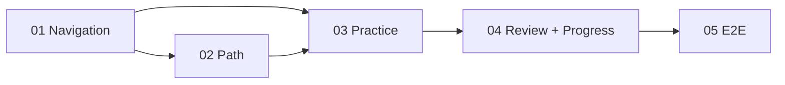

# 功能开发：R4 Flutter 学习工作台补全

## 一、需求分析（开工门禁）

| 项 | 内容 |
|----|------|
| 需求分析 plan | `Plans/需求分析/2026-08-03-R4Flutter学习工作台补全.md` |
| 技术方案 plan | `Plans/技术方案/2026-08-03-R4Flutter学习工作台补全.md` |
| 结论 | P0=0，方案已采纳 |

## 二、目标与边界

补齐父 plan MVP-4 的 Path、Practice、Review、Progress，与现有 Graph 组成五视图工作台。复用现有 Flutter 工程和 Learning API；不接真实模型、云同步或部署。

## 三、子任务 Checklist

- [x] [01 工作台导航状态](2026-08-03-R4Flutter学习工作台补全-子任务01-工作台导航状态.md)
- [x] [02 学习路径推荐](2026-08-03-R4Flutter学习工作台补全-子任务02-学习路径推荐.md)
- [x] [03 练习 Evidence 闭环](2026-08-03-R4Flutter学习工作台补全-子任务03-练习Evidence闭环.md)
- [x] [04 复盘与进度视图](2026-08-03-R4Flutter学习工作台补全-子任务04-复盘与进度视图.md)
- [x] [05 端到端回归验收](2026-08-03-R4Flutter学习工作台补全-子任务05-端到端回归验收.md)

## 四、依赖关系



## 五、实施切片

| 状态 | # | 原子任务 | 输入 | 输出 | 覆盖 AC | 验收 | 依赖 | Skill |
|------|---|----------|------|------|---------|------|------|-------|
| [x] | 01 | 工作台导航状态 | 当前 Shell/Controller | destination 状态、桌面/移动导航、页面唯一切换 | AC-S6-1 | Flutter 5 tests passed | — | feature-dev-assistant |
| [x] | 02 | 学习路径推荐 | CourseGraph/Progress | recommendation endpoint、DTO、PathView | AC-S6-2, AC-S6-反 | Agent 122 tests；Flutter analyze + 7 tests | 01 | feature-dev-assistant |
| [x] | 03 | 练习 Evidence 闭环 | selected node/session API | PracticeView、题目、Evidence/Eval 后自动进入 Review | AC-S6-3 | Agent 122 tests；Flutter analyze + 10 tests | 01,02 | feature-dev-assistant |
| [x] | 04 | 复盘与进度视图 | Runtime events/course DTO | Review timeline、decision state、mastery/state counts | AC-S6-4, AC-S6-5, AC-S6-反 | Agent 122 tests；Flutter analyze + 12 tests | 03 | feature-dev-assistant |
| [x] | 05 | 端到端回归验收 | 01–04 | 真实 HTTP 主链、Flutter analyze/test/build、README/父 plan 回写 | AC-S6-1~5 | Agent 122；Flutter 13；Web build 通过 | 04 | test-generator |

## 六、续做

```text
/resume plan=Plans/学习循环/2026-08-02-学习实践-智能体开发-09-R4知识图谱驱动学习系统.md 进度=S5 5/5 已完成；真实 HTTP、Agent/Flutter 全量与 Web build 通过；下一步批量复盘智能体学习线 L1-L4
```

## 七、反馈（skill_run）

```yaml
skill_run:
  skill: task-splitter
  plan: Plans/功能开发/2026-08-03-R4Flutter学习工作台补全.md
  date: 2026-08-03
  contexts_used:
    - path: Plans/需求分析/2026-08-03-R4Flutter学习工作台补全.md
      utility: high
      reason: "将五视图与禁止客户端伪推荐/Trace 的 AC 投影为 5 个可独立验收切片。"
    - path: Plans/技术方案/2026-08-03-R4Flutter学习工作台补全.md
      utility: high
      reason: "依据共享 controller、recommendation API 与视图模块边界确定依赖顺序。"
    - path: Contexts/决策/Skill原子契约.md
      utility: high
      reason: "保证每个任务有单一输出、输入、覆盖 AC、依赖和独立门禁。"
  contexts_missing: []
  contexts_stale: []
  outcome_status: pass
  revisit_needed: false
```
