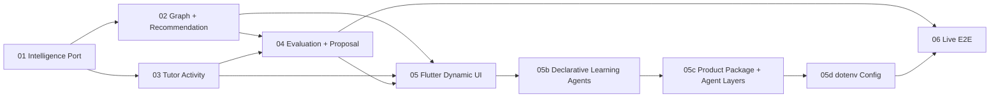

# 功能开发：R4 真实 DeepSeek 学习智能接入

## 一、需求分析（开工门禁）

| 项 | 内容 |
|----|------|
| 需求分析 | `Plans/需求分析/2026-08-03-R4真实DeepSeek学习智能接入.md` |
| 技术方案 | `Plans/技术方案/2026-08-03-R4真实DeepSeek学习智能接入.md` |
| 结论 | `p0_open: 0`，方案已采纳；真实 DeepSeek 复用 `agent/infrastructure/llm.py`，R4 产品与通用 Agent 底座分离。 |

## 二、目标与边界

将现有确定性演示端口升级为真实 DeepSeek 学习系统。生产路径不得包含固定课程、固定推荐理由、固定 Tutor/题目、答案长度评分、固定图谱提案或假用户指标。保留本地 repository、受控 Agent Runtime、trace 和 proposal → confirm → apply；不新增账号、RAG、云同步或部署。

## 三、子任务 Checklist

- [x] [01 学习智能端口](2026-08-03-R4真实DeepSeek学习智能接入-子任务01-学习智能端口.md)
- [x] [02 动态图谱与推荐](2026-08-03-R4真实DeepSeek学习智能接入-子任务02-动态图谱与推荐.md)
- [x] [03 Tutor 学习活动](2026-08-03-R4真实DeepSeek学习智能接入-子任务03-Tutor学习活动.md)
- [x] [04 真实评估与提案](2026-08-03-R4真实DeepSeek学习智能接入-子任务04-真实评估与提案.md)
- [x] [05 Flutter 动态工作台](2026-08-03-R4真实DeepSeek学习智能接入-子任务05-Flutter动态工作台.md)
- [x] [05b 声明式 AgentDefinition 统一](2026-08-03-R4真实DeepSeek学习智能接入-子任务05b-声明式AgentDefinition统一.md)
- [x] [05c 产品目录与 Agent 分层重构](2026-08-03-R4真实DeepSeek学习智能接入-子任务05c-产品目录与Agent分层重构.md)
- [x] [05d dotenv 本地配置](2026-08-03-R4真实DeepSeek学习智能接入-子任务05d-dotenv本地配置.md)
- [ ] [06 在线闭环验收](2026-08-03-R4真实DeepSeek学习智能接入-子任务06-在线闭环验收.md)

## 四、依赖关系



## 五、实施切片

| 状态 | # | 原子任务 | 输入 | 输出 | 覆盖 AC | 验收 | 依赖 | Skill |
|------|---|----------|------|------|---------|------|------|-------|
| [x] | 01 | 学习智能端口 | `agent/infrastructure/llm.py`、S6 架构 | Protocol、DTO、DeepSeek 实现、validators、typed errors、scripted fake | AC-S7-反1, AC-S7-反2 | Agent 130 tests OK | — | feature-dev-assistant |
| [x] | 02 | 动态图谱与推荐 | 01、Learning API/repository | goal graph generation、真实推荐、原子持久化 | AC-S7-1, AC-S7-2 | Agent 137 tests | 01 | feature-dev-assistant |
| [x] | 03 | Tutor 学习活动 | 01、session API | LearningActivity、真实 Tutor/题目、session response | AC-S7-3 | Agent 137 tests | 01 | feature-dev-assistant |
| [x] | 04 | 真实评估与提案 | 02,03、runtime/tools | DeepSeek Eval/gaps/proposal、成功后 progress、失败不污染 | AC-S7-4, AC-S7-5, AC-S7-反2 | Agent 137 tests | 02,03 | feature-dev-assistant |
| [x] | 05 | Flutter 动态工作台 | 02–04 API | 动态 DTO/布局、真实 activity/eval、清除固定/假展示 | AC-S7-3, AC-S7-6 | Flutter analyze；13 tests；Web build | 02,03,04 | feature-dev-assistant |
| [x] | 05b | 声明式 AgentDefinition 统一 | R3 loader/BaseAgent、01–05 | 四定义/Prompt、LearningAgentTeam、definition-bound LLM/trace、移除 API `_roles()` | AC-S7-8 | Agent 142 tests | 05 | feature-dev-assistant |
| [x] | 05c | 产品目录与 Agent 分层重构 | 05b、现有 Flutter/Backend | `knowledge_graph_learning/` 正式产品包；`agent/` 五层通用底座；`.runtime/` 数据边界；新启动入口 | AC-S7-8 | Agent 45 + Backend 97；Flutter analyze/test | 05b | feature-dev-assistant |
| [x] | 05d | dotenv 本地配置 | 05c、CLI/DeepSeek adapter | 根目录 `.env` 自动加载、环境优先、`--env-file`、安全示例 | AC-S7-反1 | Backend 99 + Agent 45 | 05c | feature-dev-assistant |
| [ ]（离线已过，待 key） | 06 | 在线闭环验收 | 01–05d | full regression、opt-in DeepSeek smoke、README 启动说明 | AC-S7-1~8, AC-S7-反1~2 | Python 144；Flutter 13；build；live 待 key | 04,05,05b,05c,05d | test-generator |

## 六、当前续点

```text
/resume plan=Plans/功能开发/2026-08-03-R4真实DeepSeek学习智能接入-子任务06-在线闭环验收.md 进度=S6 8/9；dotenv自动加载完成，Python144/Flutter13通过；根目录创建.env并重启后仅待在线smoke
```

## 七、反馈（skill_run）

```yaml
skill_run:
  skill: task-splitter
  plan: Plans/功能开发/2026-08-03-R4真实DeepSeek学习智能接入.md
  date: 2026-08-03
  contexts_used:
    - path: Plans/需求分析/2026-08-03-R4真实DeepSeek学习智能接入.md
      utility: high
      reason: "把 AC-S7 的真实生成、评估、UI、声明式四 Agent、产品目录、dotenv 配置与失败反例完整投影到 9 个原子切片。"
    - path: Plans/技术方案/2026-08-03-R4真实DeepSeek学习智能接入.md
      utility: high
      reason: "依据 Intelligence port、API、Runtime、Flutter 和 live gate 模块边界确定依赖顺序。"
    - path: Contexts/决策/Skill原子契约.md
      utility: high
      reason: "保证每个任务具有单一输出、显式输入、独立验收和可续做入口。"
  contexts_missing: []
  contexts_stale: []
  outcome_status: pass
  revisit_needed: false
```

## 八、变更影响反馈（skill_run）

```yaml
skill_run:
  skill: change-impact-analysis
  plan: Plans/功能开发/2026-08-03-R4真实DeepSeek学习智能接入.md
  date: 2026-08-03
  contexts_used:
    - path: Plans/学习循环/2026-08-01-学习记录-智能体开发-08-R3.3-声明式Agent定义.md
      utility: high
      reason: "确认 R3 Definition 只承载策略、Runtime 保留控制流，R4 应复用而非另造角色定义。"
    - path: Plans/技术方案/2026-08-03-R4真实DeepSeek学习智能接入.md
      utility: high
      reason: "将影响收敛到 Definition、DeepSeek、Team/trace，以及 knowledge_graph_learning 产品包与 agent 通用底座的单向依赖。"
  contexts_missing: []
  contexts_stale: []
  outcome_status: pass
  revisit_needed: false
```
