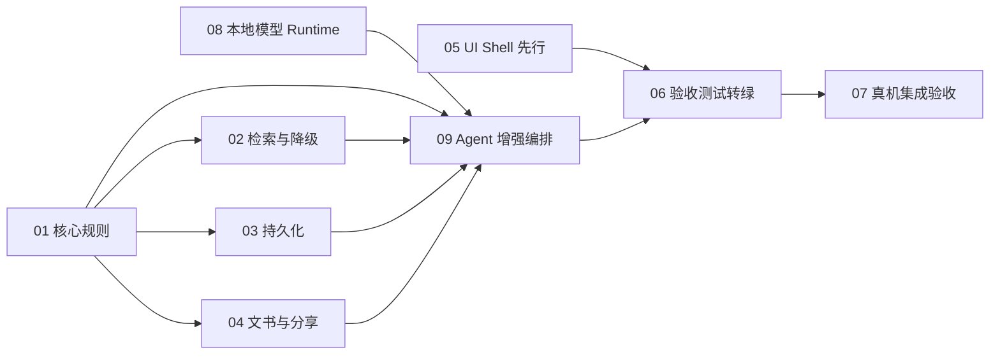

# 功能开发：Flutter版劳动仲裁生成式智能助手App

## 一、需求分析（开工门禁）

| 项 | 内容 |
|----|------|
| 需求分析 plan | `Plans/需求分析/2026-08-04-Flutter版劳动仲裁生成式智能助手App.md` |
| 技术方案 plan | `Plans/技术方案/2026-08-04-Flutter版劳动仲裁生成式智能助手App.md` |
| 验收测试 plan | `Plans/自动化测试/2026-08-04-Flutter版劳动仲裁生成式智能助手App.md` |
| 结论 | P0=0，技术方案已采纳，AC1-AC12 已建立测试追溯 |

## 二、目标与边界

把当前可演示 Flutter 骨架补齐为可验证的本地优先闭环：有效输入才计算、金额与法条可追溯、模型不可用可降级、报告/文书可本地保存和清理、UI 覆盖关键异常态，并在 iOS/Android 完成真机验收。

不在本轮实现云端同步、团队协作、正式 Web 发布、付费订阅、多领域扩展；确定性 P0 不依赖真实模型，但本次计划调整新增本地模型 Runtime 与增强 Agent 的正式开发切片，作为 P1/生成式增强版本推进。

## 三点一：本轮范围调整（用户确认）

本轮优先完成可自动化验证的业务闭环：Domain/Data/RAG/文书、Widget 状态、VM/Chrome 回归与 iOS `integration_test`。Android SDK/AVD、Android 真机和正式 Figma/UI 像素级对稿暂缓，不作为当前行为验收的阻塞项；后续恢复时只补对应平台与视觉证据，不重写业务测试契约。

## 三点二：调整后的执行顺序（用户确认）

1. **UI Shell 先行**：先把案情、报告、文书、设置四页和空态/加载态容器生成出来，使用稳定 `AppTestIds` 和 fake Provider，尽早确认产品入口、导航和关键状态。
2. **模型/Agent 接入前置**：并行完成子任务 08 的本地模型 Runtime 契约和子任务 09 的 Prompt/JSON Schema/工具编排；先用 fake backend 验证主链，不等待真实模型权重。
3. **业务工具接入**：再把赔偿计算、法条检索、文书生成、持久化接到 Agent 工具注册表，保持金额与法条的确定性权威。
4. **全状态与回归**：最后补完整错误态、降级态、文书/清理闭环和 iOS 集成；Android 与视觉像素对稿按既定范围暂缓。

## 三、子任务 Checklist

- [x] [01 核心规则与输入校验](2026-08-04-Flutter版劳动仲裁生成式智能助手App-子任务01-核心规则与输入校验.md)
- [x] [02 本地检索与模型降级](2026-08-04-Flutter版劳动仲裁生成式智能助手App-子任务02-本地检索与模型降级.md)
- [x] [03 本地持久化与隐私清理](2026-08-04-Flutter版劳动仲裁生成式智能助手App-子任务03-本地持久化与隐私清理.md)
- [x] [04 文书生成与分享闭环](2026-08-04-Flutter版劳动仲裁生成式智能助手App-子任务04-文书生成与分享闭环.md)
- [ ] [05 移动端界面与全状态](2026-08-04-Flutter版劳动仲裁生成式智能助手App-子任务05-移动端界面与全状态.md)
- [x] [06 验收测试转绿](2026-08-04-Flutter版劳动仲裁生成式智能助手App-子任务06-验收测试转绿.md)
- [ ] [07 真机集成验收](2026-08-04-Flutter版劳动仲裁生成式智能助手App-子任务07-真机集成验收.md)
- [~] [08 本地模型 Runtime 与 GGUF 接入](2026-08-04-Flutter版劳动仲裁生成式智能助手App-子任务08-本地模型Runtime与GGUF接入.md)
- [~] [09 Agent 增强编排与工具契约](2026-08-04-Flutter版劳动仲裁生成式智能助手App-子任务09-Agent增强编排与工具契约.md)

## 四、依赖关系



## 五、实施切片

| 状态 | # | 原子任务 | 输入 | 输出 | 覆盖 AC | 验收 | 依赖 | Skill |
|------|---|----------|------|------|---------|------|------|-------|
| [x] | 5 | 原子任务拆分 | 需求、方案、测试 plan | 主 plan + 9 个子 plan | AC1, AC2, AC3, AC4, AC5, AC6, AC7, AC8, AC9, AC10, AC11, AC12 | 任务具备输入、输出、验收、依赖和 Skill；新增模型/Agent 切片 | — | task-splitter |
| [x] | 6 | 核心规则与输入校验 | Domain 模型、计算器、AC2/3/4/12 | 校验结果、确定性计算契约 | AC1, AC2, AC3, AC4, AC12 | 14 项目标测试通过，`flutter analyze` 通过 | 5 | feature-dev-assistant |
| [x] | 7a | 本地检索与模型降级 | 法条资产、RAG/LLM 端口 | Top-K 检索、内置兜底、降级状态 | AC5, AC9 | 5 项检索/降级测试通过 | 6 | feature-dev-assistant |
| [x] | 7b | 本地持久化与隐私清理 | SQLite/Hive 依赖、数据模型 | Case/Report/Document 仓储与清理 | AC11 | 重开读取与原子清理测试通过 | 6 | feature-dev-assistant |
| [x] | 7c | 文书生成与分享闭环 | TemplateFiller、文件系统、share_plus | 可注入 fallback、保存索引、分享结果 | AC6, AC7, AC8 | 4 项 docx/分享测试通过 | 6 | feature-dev-assistant |
| [~] | 7d | 本地模型 Runtime 与 GGUF 接入 | `LlmClient`、`LocalLlmService`、GGUF manifest | 模型生命周期、真实本地推理 adapter、失败恢复 | AC9, AC12 | Runtime 状态机、可注入 fake backend 和 JSON 接缝已通过；真实 native backend 待接 | 7a,6 | feature-dev-assistant |
| [~] | 7e | Agent 增强编排与工具契约 | AgentEngine、Prompt、JSON Schema、Domain 工具 | 参数提取、缺字段追问、工具调用、报告/文书改写、trace | AC1, AC3, AC4, AC9, AC12 | fake LLM、四个确定性工具（赔偿/法条/评估/文书字节）、工具边界、fallback、trace 和 AgentEngine 入口已通过；真实模型润色待接 | 6,7a,7d | feature-dev-assistant |
| [~] | 8 | 移动端界面骨架 | 需求线框、现有 Flutter Shell | 四页入口、导航、fake Provider 和关键状态容器 | AC1, AC6, AC10 | UI Shell 可运行；像素级走查按用户确认暂缓 | 5 | figma-ui |
| [~] | 9 | 交互与全状态 | 校验、模型、存储、分享状态 | 缺字段/降级/空态/错误态/二次确认 | AC4, AC9, AC10, AC11 | 关键行为已由 Widget/Integration 覆盖，视觉对稿暂缓 | 8 | figma-ui |
| [x] | 10 | 验收测试转绿 | test-first Plan、实现结果 | AC1-AC12 自动化测试与回归记录 | AC1, AC2, AC3, AC4, AC5, AC6, AC7, AC8, AC9, AC10, AC11, AC12 | VM 47、Chrome 43、Web build、覆盖率 89.7%；关键动作统一按 `AppTestIds` 定位，四个 Agent 工具与 JSON Schema 契约测试通过 | 6-9,7d,7e | test-generator |
| [~] | 11 | 真机集成验收 | 全部实现、iOS/Android 设备 | 保存、分享取消、清理、模型失败验证记录 | AC5, AC6, AC7, AC8, AC9, AC10, AC11 | iOS 18.5 模拟器通过；Android 按用户确认暂缓 | 10 | feature-dev-assistant |

```text
[x] 5.  原子任务拆分（主 plan + 9 个子任务）
[x] 6.  Domain / UseCase 实现
[~] 7.  Data / API 实现与联调（7a-7c 已完成；7d-7e 新增模型/Agent 切片）
[~] 7d. 本地模型 Runtime 与 GGUF 接入（Runtime 契约/测试已完成，native backend 待接）
[~] 7e. Agent 增强编排与工具契约（fake LLM 契约、evaluate_case 工具/测试已完成，独立法条/文书工具与真实模型联调待接）
[~] 8.  UI 骨架 + 静态设计走查（本轮暂缓，按用户确认不作为行为闭环门槛）
[~] 9.  交互 + 全 Variant（关键行为已由 Widget/Integration 覆盖，视觉对稿暂缓）
[x] 10. 单元测试补充与回归
[~] 11. 真机联调 + 集成设计走查（iOS 已通过；Android/视觉走查暂缓）
```

## 六、验收

- [ ] AC1-AC12 自动化/真机追溯闭环
- [ ] `flutter analyze`、`flutter test --coverage`、Chrome smoke、Web build 全绿
- [ ] iOS/Android 文书保存、分享取消、数据清理、模型失败降级通过
- [ ] 金额只来自 Dart 计算器，法条只来自本地知识库或内置兜底

## 七、续做

```text
/resume plan=Plans/功能开发/2026-08-04-Flutter版劳动仲裁生成式智能助手App-子任务08-本地模型Runtime与GGUF接入.md 进度=开始实现
```

## 八、反馈（skill_run）

```yaml
skill_run:
  skill: task-splitter
  plan: Plans/功能开发/2026-08-04-Flutter版劳动仲裁生成式智能助手App.md
  date: 2026-08-04
  contexts_used:
    - path: Plans/需求分析/2026-08-04-Flutter版劳动仲裁生成式智能助手App.md
      utility: high
      reason: 用于将 AC1-AC12、边界和异常流程完整投影到原子任务。
    - path: Plans/技术方案/2026-08-04-Flutter版劳动仲裁生成式智能助手App.md
      utility: high
      reason: 用于按模块边界、端口和 ADR 确定任务依赖顺序。
    - path: Plans/自动化测试/2026-08-04-Flutter版劳动仲裁生成式智能助手App.md
      utility: high
      reason: 用于把 Red/Partial 验收项分配到实现和回归任务。
    - path: Contexts/决策/Skill原子契约.md
      utility: high
      reason: 用于确保每个子任务单一职责且具备输入、输出、验收和依赖。
  contexts_missing: []
  contexts_stale: []
  outcome_status: pass
  revisit_needed: false
```

```yaml
skill_run:
  skill: change-impact-analysis
  plan: Plans/功能开发/2026-08-04-Flutter版劳动仲裁生成式智能助手App.md
  date: 2026-08-04
  contexts_used:
    - path: Plans/Epic/2026-08-04-Flutter版劳动仲裁生成式智能助手App.md
      utility: high
      reason: 用于记录用户确认的本轮范围调整及 WBS 8/9/11 的暂缓边界。
    - path: Plans/自动化测试/2026-08-04-Flutter版劳动仲裁生成式智能助手App.md
      utility: high
      reason: 用于确认行为自动化、截图视觉证据与 Android 真机验收的影响范围。
    - path: Plans/技术方案/2026-08-04-Flutter版劳动仲裁生成式智能助手App.md
      utility: high
      reason: 用于确认 Domain/Data/RAG/文书和本地优先边界无需因平台暂缓而重写。
    - path: Contexts/决策/Skill反馈协议.md
      utility: high
      reason: 用于按协议追加范围变更分析的 skill_run 记录。
  contexts_missing:
    - 正式 Figma 设计稿与 node-id。
    - Android SDK、AVD 或可用 Android 设备。
  contexts_stale: []
  outcome_status: pass
  friction: "用户已确认本轮不追 Figma/UI 视觉和 Android；业务行为闭环继续执行，后续只补平台/视觉证据。"
  revisit_needed: true
```

```yaml
skill_run:
  skill: task-splitter
  plan: Plans/功能开发/2026-08-04-Flutter版劳动仲裁生成式智能助手App.md
  date: 2026-08-04
  contexts_used:
    - path: Plans/技术方案/2026-08-04-Flutter版劳动仲裁生成式智能助手App.md
      utility: high
      reason: 用于把 LocalLlmClient/Runtime、Prompt/JSON Schema、Agent 工具边界和 ADR 拆成独立实施切片。
    - path: Plans/自动化测试/2026-08-04-Flutter版劳动仲裁生成式智能助手App.md
      utility: high
      reason: 用于为模型生命周期、结构化提取、追问、工具调用和 fallback 建立测试映射。
    - path: Plans/Epic/2026-08-04-Flutter版劳动仲裁生成式智能助手App.md
      utility: high
      reason: 用于在现有 client-dev WBS 下增补 7d/7e，并保留 P0 确定性基线不受影响。
    - path: Contexts/决策/Skill原子契约.md
      utility: high
      reason: 用于保证新增子任务各自具备输入、输出、验收、依赖和职责边界。
  contexts_missing:
    - 真实 GGUF 权重与最终 Prompt 评测集；作为后续实现/Spike 输入，不阻塞本次拆分。
  contexts_stale: []
  outcome_status: pass
  friction: "模型 Runtime 与 Agent 增强已从远期路线图提升为 7d/7e 正式开发切片；当前仍未实现代码。"
  revisit_needed: false
```

```yaml
skill_run:
  skill: change-impact-analysis
  plan: Plans/功能开发/2026-08-04-Flutter版劳动仲裁生成式智能助手App.md
  date: 2026-08-04
  contexts_used:
    - path: Plans/技术方案/2026-08-04-Flutter版劳动仲裁生成式智能助手App.md
      utility: high
      reason: 用于评估 UI Shell、模型 Runtime、Agent 编排和 Domain/Data 接入之间的依赖重排。
    - path: Plans/Epic/2026-08-04-Flutter版劳动仲裁生成式智能助手App.md
      utility: high
      reason: 用于保持 Epic 的 WBS 编号不变，同时记录新的先行执行顺序。
    - path: Plans/自动化测试/2026-08-04-Flutter版劳动仲裁生成式智能助手App.md
      utility: high
      reason: 用于把 fake UI、fake LLM 和工具契约测试前置到业务工具联调之前。
    - path: Contexts/决策/Skill反馈协议.md
      utility: high
      reason: 用于按协议记录本次顺序调整的影响分析。
  contexts_missing: []
  contexts_stale: []
  outcome_status: pass
  friction: "WBS 编号和门禁保持兼容，仅调整执行顺序：UI Shell → 模型 Runtime → Agent 编排 → 业务工具 → 全状态回归。"
  revisit_needed: false
```

```yaml
skill_run:
  skill: task-splitter
  plan: Plans/功能开发/2026-08-04-Flutter版劳动仲裁生成式智能助手App.md
  date: 2026-08-04
  contexts_used:
    - path: Plans/技术方案/2026-08-04-Flutter版劳动仲裁生成式智能助手App.md
      utility: high
      reason: 用于将 UI Shell 和模型/Agent 契约前置，同时保留 Domain/Data 工具的后置接入依赖。
    - path: Plans/功能开发/2026-08-04-Flutter版劳动仲裁生成式智能助手App-子任务05-移动端界面与全状态.md
      utility: high
      reason: 用于确认 UI 先行采用 fake Provider 和稳定 AppTestIds，而不是等待业务接口完成。
    - path: Plans/功能开发/2026-08-04-Flutter版劳动仲裁生成式智能助手App-子任务08-本地模型Runtime与GGUF接入.md
      utility: high
      reason: 用于确认 Runtime 可以先用 fake backend 固定生命周期和失败契约。
    - path: Plans/功能开发/2026-08-04-Flutter版劳动仲裁生成式智能助手App-子任务09-Agent增强编排与工具契约.md
      utility: high
      reason: 用于确认 Agent 在工具接入前先固定 Prompt/Schema/trace/fallback 契约。
    - path: Contexts/决策/Skill原子契约.md
      utility: high
      reason: 用于保证顺序调整不混淆 UI、Runtime、Agent 和 Domain/Data 职责。
  contexts_missing: []
  contexts_stale: []
  outcome_status: pass
  friction: "界面先行是可运行 Shell 和状态容器，不等同于暂缓的 Figma 像素级对稿。"
  revisit_needed: false
```
