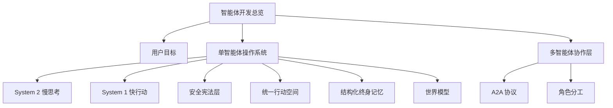

# 学习资料：智能体开发-01-总览与目标循环

**创建日期**：2026-07-08  
**存放路径**：`Plans/学习循环/2026-07-08-学习资料-智能体开发-01-总览与目标循环.md`  
**状态**：已采纳  
**workflow**：`learning-loop`

---

## 三、资料准备

| 资料 | 为什么读/看 | 使用方式 | 状态 |
|------|-------------|----------|------|
| 用户图：`deepseek_mermaid_20260708_cff3f8.PNG` | 本旅程的结构来源，定义学习范围 | 必读 | ✅ |
| 本轮学习答疑 plan | 承载第一课解释、问题、用户回答 | 必读 | ✅ |
| 后续实践工程 | 用来把概念转成代码 | 后续创建/复用 | ⬜ |

### AI 讲解稿

这张图可以先不要当成“复杂架构图”看，而要当成“一个智能体怎么活着”的生命循环：

1. 用户给出高层目标，例如“帮我学习智能体开发”。
2. System 2 慢思考负责把目标拆开，做规划、反思，并在世界模型里做内在模拟。
3. System 1 快行动负责把计划变成动作，例如调用工具、写代码、读文件、操作电脑或给出直接响应。
4. 安全宪法层夹在行动前后，限制权限、要求审批、记录审计。
5. 统一行动空间承载真实动作：代码执行、计算机使用、MCP 工具总线。
6. 环境与工具返回观察结果，系统再反馈给快行动和慢思考。
7. 结构化终身记忆保存工作记忆、情景记忆、语义记忆和程序记忆，把一次经验变成下一次能力。
8. 多智能体协作层把一个智能体扩展成团队：规划者、执行者、评审者通过 A2A 协议分工。

本轮先学主干，不急着学所有盒子。你先抓住一句话：智能体 = 目标驱动的循环系统，不是单次问答。

---

## 四、最小概念树



| 概念 | 一句话解释 | 常见误区 | 对应实践 |
|------|------------|----------|----------|
| 智能体 | 围绕目标反复规划、行动、观察、修正的系统 | 把智能体等同于一次聊天回复 | 写最小目标循环 |
| 目标 | 用户真正想达成的结果，不一定等于一句指令 | 只执行字面命令，不追踪目标是否完成 | 把“学习智能体开发”拆成学习地图 |
| System 2 | 慢思考层，负责规划、反思、模拟 | 以为所有智能都靠一次模型输出完成 | 让 AI 先列计划再行动 |
| System 1 | 快行动层，负责执行工具和快速响应 | 让执行层自己决定长期方向 | 调工具完成一个小动作 |
| 世界模型 | 行动前预测后果的内部模拟器 | 只等真实环境失败后才修 | 执行前写 expected outcome |
| 安全宪法层 | 限制行动边界并记录审计 | 智能体越自主越好，不需要约束 | 给工具加权限白名单 |
| 记忆 | 让经验可复用的结构化存储 | 把聊天历史当成唯一记忆 | 分工作/情景/语义/程序记忆 |
| A2A | 多智能体之间委派、发现和协作的协议 | 多开几个模型窗口就叫多智能体 | 设计 planner/executor/reviewer |

---

## 续做

```text
/resume plan=Plans/学习循环/2026-07-08-学习资料-智能体开发-01-总览与目标循环.md 进度=资料准备完成，进入学习答疑
```

## 反馈（skill_run）

```yaml
skill_run:
  skill: material-prep-assistant
  plan: Plans/学习循环/2026-07-08-学习资料-智能体开发-01-总览与目标循环.md
  date: 2026-07-08
  contexts_used:
    - path: Templates/学习循环模板.md
      utility: high
      reason: "用于组织资料准备和最小概念树。"
    - path: Contexts/决策/Skill反馈协议.md
      utility: high
      reason: "用于按反馈协议记录资料准备阶段完成情况。"
  contexts_missing: []
  contexts_stale: []
  outcome_status: pass
  revisit_needed: false
```

