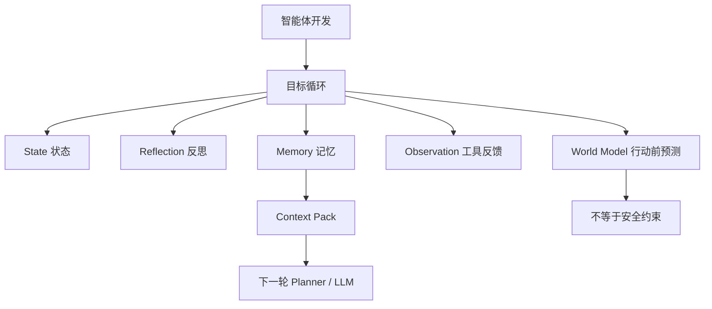

# 学习记录：智能体开发-01-总览与目标循环

**创建日期**：2026-07-09  
**存放路径**：`Plans/学习循环/2026-07-09-学习记录-智能体开发-01-总览与目标循环.md`  
**状态**：已采纳  
**workflow**：`learning-loop`

---

## 十三、学习记录

| 日期 | 本轮主题 | 结果 | 实践产物 |
|------|----------|------|----------|
| 2026-07-09 | 总览与目标循环：用户目标如何进入智能体 | 通过。已理解 Agent 不等于工具调用，核心是状态、反思、记忆驱动的目标循环。 | 人员列表需求分析 → 框架设计 context pack 的口头最小循环 |

### 本轮已掌握

```text
1. Agent 不是单次问答，也不只是工具调用。
2. Agent 至少需要状态、反思、记忆，才能围绕目标形成循环。
3. 世界模型是行动前预测，不是安全约束。
4. 工具反馈是行动后的真实观察。
5. memory 应整理成 context pack，作为下一轮 Planner / LLM 的输入约束。
```

### 本轮实践样例

```text
目标：人员列表从需求分析进入框架设计

state：
  人员列表需求分析完成，所有需求 case 已闭合，下一步进入框架设计。

reflection：
  如果所有 case 逻辑闭合且无未确认边界，就进入框架设计；否则返回需求补充。

memory：
  保存所有需求用例、公共原则、框架设计原则、边界条件、验收标准。

next_round_use_memory：
  将 memory 组织成 context pack，交给 LLM / Planner，用于输出模块边界、状态流、数据结构、API 契约和测试点。
```

---

## 十四、知识图谱增量



| 新增概念 | 关系 | 应更新到旅程图谱 |
|----------|------|------------------|
| 目标循环 | Agent 的基础运行单元 | ✅ |
| State 状态 | 保存当前目标、阶段、完成事实、阻塞和下一步 | ✅ |
| Reflection 反思 | 根据观察和验收标准判断是否推进或返工 | ✅ |
| Memory 记忆 | 保存可复用经验，不等于聊天历史 | ✅ |
| Context Pack | memory 给下一轮 LLM / Planner 使用的结构化输入 | ✅ |
| World Model | 行动前预测，不等于安全约束 | ✅ |
| 工具反馈 | 行动后的真实观察，用来纠正判断 | ✅ |

---

## 十五、用户确认

- [x] 用户确认本轮学完
- [x] 用户选择继续下一个主题
- [ ] 用户要求生成阶段总结
- [ ] 用户确认整个学习旅程结束

---

## 续做

```text
/resume plan=Plans/Epic/2026-07-08-智能体开发.md 进度=第02轮 / L1 System 2 慢思考
```

## 反馈（skill_run）

```yaml
skill_run:
  skill: material-prep-assistant
  plan: Plans/学习循环/2026-07-09-学习记录-智能体开发-01-总览与目标循环.md
  date: 2026-07-09
  contexts_used:
    - path: Templates/学习循环模板.md
      utility: high
      reason: "用于按 record 阶段沉淀学习记录、知识图谱增量和用户确认。"
    - path: Contexts/决策/Skill反馈协议.md
      utility: high
      reason: "用于记录 record 阶段完成反馈，关闭本轮学习循环。"
  contexts_missing: []
  contexts_stale: []
  outcome_status: pass
  revisit_needed: false
```
