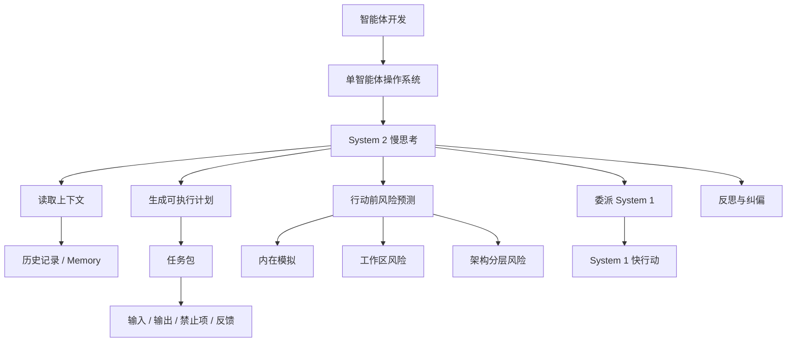

# 学习记录：智能体开发-02-System2慢思考

**创建日期**：2026-07-09  
**存放路径**：`Plans/学习循环/2026-07-09-学习记录-智能体开发-02-System2慢思考.md`  
**状态**：已采纳  
**workflow**：`learning-loop`

---

## 十三、学习记录

| 日期 | 本轮主题 | 结果 | 实践产物 |
|------|----------|------|----------|
| 2026-07-09 | System 2 慢思考：规划、反思、内在模拟 | 通过。已理解 System 2 要读取历史/上下文，生成计划，预判风险，并把任务交给 System 1。验证阶段保留 partial 缺口：状态流、API 契约、System 1 任务包粒度仍需补练。 | 人员列表框架设计 System 2 计划卡 |

### 本轮已掌握

```text
1. System 2 不只是“想久一点”，而是慢决策层。
2. System 2 要读取历史、状态、记忆、约束和当前代码环境。
3. System 2 要把目标转成可执行计划，而不是只列一个宽泛 TODO。
4. System 2 要在行动前预测风险，尤其是工作区风险、分层风险、状态遗漏风险。
5. System 2 要把任务包交给 System 1，并约束 System 1 不乱删、不越权、不破坏架构原则。
```

### 本轮仍需补练

```text
1. 业务状态流不能写成 workflow 状态。
2. API 契约不能省略；“我明白”不能作为 System 1 的执行输入。
3. System 1 任务包要写清输入、输出、禁止项和反馈格式。
```

### 用户最终复盘句

```text
读取之前的历史，做计划，预判风险，让 1 干活。
```

### 校正后的核心句

```text
System 2 的职责是读取上下文，生成可执行计划，行动前预测风险，并约束 System 1 不跑偏。
```

---

## 十四、知识图谱增量



| 新增概念 | 关系 | 应更新到旅程图谱 |
|----------|------|------------------|
| System 2 慢思考 | 属于单智能体操作系统的决策层 | ✅ |
| 读取上下文 | System 2 规划前必须读取历史、状态、记忆和约束 | ✅ |
| 可执行计划 | System 2 的输出要能被 System 1 执行 | ✅ |
| 行动前风险预测 | System 2 通过内在模拟降低返工和误操作 | ✅ |
| 任务包 | System 2 委派给 System 1 的执行合同 | ✅ |
| 工作区风险 | 行动前检查代码是否正在被修改，不能删除无关改动 | ✅ |
| 状态流/API 契约缺口 | 本轮未完全掌握，后续补练 | ✅ |

---

## 十五、用户确认

- [x] 用户完成本轮复盘
- [x] 用户选择进入学习记录
- [ ] 用户确认整个学习旅程结束
- [ ] 用户选择下一轮主题

---

## 续做

```text
/resume plan=Plans/Epic/2026-07-08-智能体开发.md 进度=L1 System 2 慢思考已记录，等待用户选择下一轮学习主题
```

## 反馈（skill_run）

```yaml
skill_run:
  skill: material-prep-assistant
  plan: Plans/学习循环/2026-07-09-学习记录-智能体开发-02-System2慢思考.md
  date: 2026-07-09
  contexts_used:
    - path: Plans/学习循环/2026-07-09-学习复盘-智能体开发-02-System2慢思考.md
      utility: high
      reason: "用于沉淀 L1 System 2 的掌握点、缺口和最终复盘句。"
    - path: Plans/学习循环/2026-07-09-学习验证-智能体开发-02-System2慢思考.md
      utility: high
      reason: "用于把验证发现的状态流、API 契约和任务包缺口写入记录。"
    - path: Plans/Epic/2026-07-08-智能体开发.md
      utility: high
      reason: "用于更新学习地图、循环索引和知识图谱来源索引。"
    - path: Templates/学习循环模板.md
      utility: high
      reason: "用于保持学习记录和知识图谱增量结构一致。"
    - path: Contexts/决策/Skill反馈协议.md
      utility: high
      reason: "用于按协议补齐 record 阶段完成反馈。"
  contexts_missing: []
  contexts_stale: []
  outcome_status: pass
  revisit_needed: false
```
