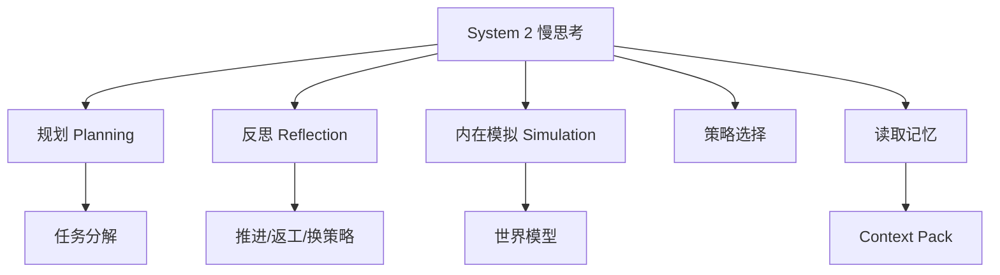

# 学习资料：智能体开发-02-System2慢思考

**创建日期**：2026-07-09  
**存放路径**：`Plans/学习循环/2026-07-09-学习资料-智能体开发-02-System2慢思考.md`  
**状态**：已采纳  
**workflow**：`learning-loop`

---

## 三、资料准备

| 资料 | 为什么读/看 | 使用方式 | 状态 |
|------|-------------|----------|------|
| L0 学习记录 | 作为本轮输入，继续使用 state / reflection / memory 这个框架 | 必读 | ✅ |
| 用户图中的 System 2 节点 | 本轮学习范围：规划、反思、世界模型模拟 | 必读 | ✅ |
| 人员列表需求分析例子 | 用真实业务场景理解慢思考 | 必读 | ✅ |

### AI 讲解稿

System 2 是 Agent 里的“慢思考层”。它不是简单多想几秒，而是负责把目标变成可执行计划，并且在行动前后做判断：

1. **规划**：把目标拆成步骤，决定先做什么、后做什么。
2. **反思**：行动后检查结果是否符合目标，决定推进、返工还是换策略。
3. **内在模拟**：行动前预测可能后果，提前发现风险。
4. **选择策略**：多个方案都可行时，按成本、风险、收益选择。
5. **调用记忆**：读取上一轮 memory / context pack，让下一步不是凭空生成。

对应你刚才的人员列表例子：

```text
目标：进入人员列表框架设计
memory：需求 case + 公共原则 + 框架设计原则
System 2：
  先检查 case 是否闭合
  再生成候选设计方案
  再预测每个方案的风险
  再选一个方案进入 System 1 执行
```

---

## 四、最小概念树



| 概念 | 一句话解释 | 常见误区 | 对应实践 |
|------|------------|----------|----------|
| 规划 | 把目标拆成可执行步骤 | 把规划等同于列 TODO | 人员列表框架设计拆成模块、数据、状态、接口 |
| 反思 | 根据反馈判断是否继续、返工、换策略 | 只写总结，不影响下一步 | case 不闭合就回需求，闭合才进设计 |
| 内在模拟 | 行动前预测方案后果 | 以为它是安全约束 | 框架设计前预判状态遗漏、接口不稳定 |
| 策略选择 | 多方案比较后选择一条路径 | 只生成第一个方案 | 比较页面驱动、数据驱动、状态机驱动 |
| 读取记忆 | 把上一轮经验作为本轮输入约束 | 只贴聊天历史 | context pack 约束框架设计 |

---

## 续做

```text
/resume plan=Plans/学习循环/2026-07-09-学习资料-智能体开发-02-System2慢思考.md 进度=资料准备完成，进入学习答疑
```

## 反馈（skill_run）

```yaml
skill_run:
  skill: material-prep-assistant
  plan: Plans/学习循环/2026-07-09-学习资料-智能体开发-02-System2慢思考.md
  date: 2026-07-09
  contexts_used:
    - path: Plans/学习循环/2026-07-09-学习记录-智能体开发-01-总览与目标循环.md
      utility: high
      reason: "用 L0 学习记录作为 L1 慢思考的输入上下文。"
    - path: Templates/学习循环模板.md
      utility: high
      reason: "用于组织资料准备和最小概念树。"
    - path: Contexts/决策/Skill反馈协议.md
      utility: high
      reason: "用于按反馈协议记录资料准备阶段完成情况。"
  contexts_missing: []
  contexts_stale: []
  outcome_status: pass
  revisit_needed: false
```
