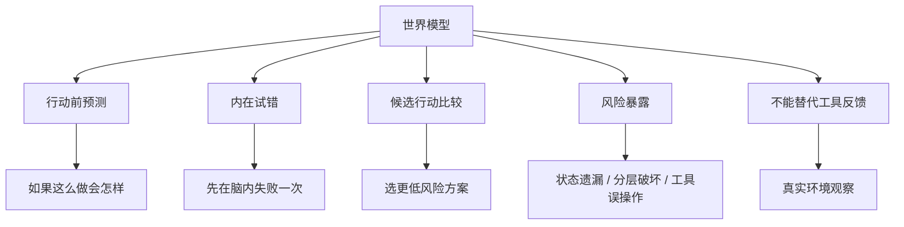

# 学习资料：智能体开发-03-世界模型

**创建日期**：2026-07-09  
**存放路径**：`Plans/学习循环/2026-07-09-学习资料-智能体开发-03-世界模型.md`  
**状态**：已采纳  
**workflow**：`learning-loop`

---

## 三、资料准备

| 资料 | 为什么读/看 | 使用方式 | 状态 |
|------|-------------|----------|------|
| L0 学习记录 | 复用“世界模型不是安全约束，而是行动前预测”的纠偏 | 必读 | ✅ |
| L1 学习记录 | 承接 System 2 的行动前风险预测和 System 1 任务包 | 必读 | ✅ |
| 用户图中的世界模型节点 | 本轮学习范围：行动后果预测、内在试错 | 必读 | ✅ |
| 人员列表框架设计例子 | 用真实场景写预测，而不是停留在概念 | 必读 | ✅ |

### AI 讲解稿

世界模型可以先理解成 Agent 脑子里的“沙盘”。

它不是一个必须独立部署的模型，也不一定是另一个 LLM。它更像一种能力：在真正行动前，先模拟“如果我这么做，可能会发生什么”。

拿人员列表框架设计举例：

```text
计划：让 System 1 实现人员列表框架骨架

世界模型先预测：
1. 如果只设计一个 loading 状态，会覆盖不了下拉刷新和上拉加载更多。
2. 如果 UI 直接请求 API，会破坏 clean arch 的分层。
3. 如果任务包没写禁止项，System 1 可能会删除无关代码或硬编码 mock 数据。
4. 如果 API 契约不写，System 1 可能凭感觉造字段，导致前后端对不上。
```

注意它和另外两个东西的区别：

```text
世界模型：行动前预测。
工具反馈：行动后真实环境返回的结果。
记忆：跨轮次保留下来的经验和上下文。
```

所以世界模型不能替代工具反馈。它只能降低试错成本，不能证明结果真实正确。

---

## 四、最小概念树



| 概念 | 一句话解释 | 常见误区 | 对应实践 |
|------|------------|----------|----------|
| 世界模型 | 行动前预测后果的内部模拟能力 | 以为它就是安全约束或另一个工具 | 写出人员列表设计前的后果预测 |
| 内在试错 | 在真正调用工具前先模拟失败路径 | 以为想一想就等于验证通过 | 先预测状态/接口/分层会怎样出错 |
| 工具反馈 | 行动后的真实返回 | 把预测当成事实 | 代码运行、测试失败、接口返回才是事实 |
| 记忆 | 过去经验的可复用沉淀 | 把聊天历史当完整记忆 | L1 记录成为 L2 预测输入 |
| 候选行动比较 | 比较不同方案的后果 | 只生成第一个方案就执行 | 比较“一个 loading” vs “细分加载状态” |

---

## 续做

```text
/resume plan=Plans/学习循环/2026-07-09-学习答疑-智能体开发-03-世界模型.md 进度=资料准备完成，进入学习答疑
```

## 反馈（skill_run）

```yaml
skill_run:
  skill: material-prep-assistant
  plan: Plans/学习循环/2026-07-09-学习资料-智能体开发-03-世界模型.md
  date: 2026-07-09
  contexts_used:
    - path: Plans/学习循环/2026-07-09-学习记录-智能体开发-02-System2慢思考.md
      utility: high
      reason: "用于承接 System 2 行动前风险预测，进入世界模型学习。"
    - path: Plans/学习循环/2026-07-09-学习记录-智能体开发-01-总览与目标循环.md
      utility: high
      reason: "用于复用世界模型不是安全约束的早期纠偏。"
    - path: Plans/Epic/2026-07-08-智能体开发.md
      utility: high
      reason: "用于确认 L2 学习地图节点和本轮资料边界。"
    - path: Templates/学习循环模板.md
      utility: high
      reason: "用于组织资料准备和最小概念树。"
    - path: Contexts/决策/Skill反馈协议.md
      utility: high
      reason: "用于按协议补齐 material-prepare 阶段完成反馈。"
  contexts_missing: []
  contexts_stale: []
  outcome_status: pass
  revisit_needed: false
```
