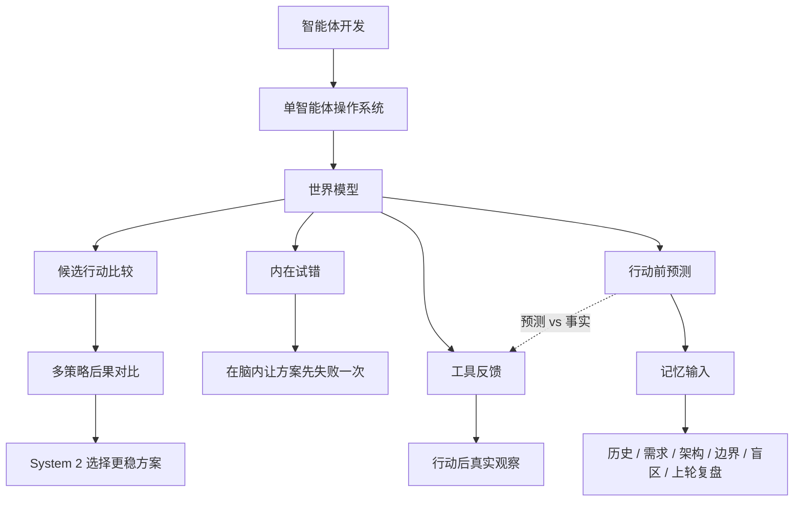

# 学习记录：智能体开发-03-世界模型

**创建日期**：2026-07-11  
**存放路径**：`Plans/学习循环/2026-07-11-学习记录-智能体开发-03-世界模型.md`  
**状态**：已采纳  
**workflow**：`learning-loop`

---

## 十三、学习记录

| 日期 | 本轮主题 | 结果 | 实践产物 |
|------|----------|------|----------|
| 2026-07-09 ~ 2026-07-11 | 世界模型：行动前预测与内在试错 | 通过（带校正）。已理解世界模型是行动前预测，要从记忆读取输入来推演后果，能区分预测 vs 事实反馈。验证发现规避动作应正向表达、应比较多策略后果再选择。 | 项目多智能体场景世界模型行动前预测卡 |

### 本轮已掌握

```text
1. 世界模型是行动前预测，不是安全规则，不是工具反馈。
2. 世界模型要从记忆中读取历史、需求、架构、边界、盲区、上一轮复盘来推演后果。
3. 世界模型和工具反馈最根本的区别：预测 vs 事实。
4. 世界模型不只预测"会出错"，还要比较多种候选策略的后果，让 System 2 选择。
5. "不知道"本身是有价值的——显式暴露未知是世界模型的能力，不是缺陷。
```

### 本轮仍需补练

```text
1. 规避动作要写成"必须做 Y"，不能只写"禁止 X"。
2. 多策略比较：先列候选方案，各自预测后果，再选择。不能跳过比较直接默认。
3. 边界/盲区显式声明要养成习惯。
```

### 用户最终复盘句

```text
世界模型：预测；工具反馈：事实反馈。
```

### 校正后的核心句

```text
世界模型是行动前预测，可能出错；工具反馈是行动后真实观察，是事实。
世界模型的职责不只是"预测问题"，还要比较多种策略的后果，让 System 2 做更好的选择。
```

---

## 十四、知识图谱增量



| 新增概念 | 关系 | 应更新到旅程图谱 |
|----------|------|------------------|
| 世界模型 | 属于单智能体操作系统，行动前预测后果 | ✅ |
| 行动前预测 | 世界模型的核心能力，从记忆输入推演后果 | ✅ |
| 内在试错 | 在行动前让方案在脑内失败，降低真实试错成本 | ✅ |
| 候选行动比较 | 世界模型为多种策略各自预测后果，交给 System 2 选择 | ✅ |
| 工具反馈 | 行动后的真实观察，是事实而非预测 | ✅ |
| 记忆输入 | 世界模型预测所需的历史/需求/架构/边界/盲区/上轮复盘 | ✅ |
| 规避动作正向表达 | 规避要写"必须做 Y"而非只写"禁止 X"（本轮校正点） | ✅ |

---

## 十五、用户确认

- [x] 用户完成本轮复盘
- [x] 用户进入学习记录
- [ ] 用户确认整个学习旅程结束
- [ ] 用户选择下一轮主题

---

## 续做

```text
/resume plan=Plans/Epic/2026-07-08-智能体开发.md 进度=L2 世界模型已记录，等待用户选择下一轮学习主题
```

## 反馈（skill_run）

```yaml
skill_run:
  skill: material-prep-assistant
  plan: Plans/学习循环/2026-07-11-学习记录-智能体开发-03-世界模型.md
  date: 2026-07-11
  contexts_used:
    - path: Plans/学习循环/2026-07-11-学习复盘-智能体开发-03-世界模型.md
      utility: high
      reason: "用于沉淀 L2 世界模型的掌握点、缺口和最终复盘句。"
    - path: Plans/学习循环/2026-07-09-学习验证-智能体开发-03-世界模型.md
      utility: high
      reason: "用于把验证发现的规避动作校正和多策略比较缺口写入记录。"
    - path: Plans/Epic/2026-07-08-智能体开发.md
      utility: high
      reason: "用于更新学习地图、循环索引和知识图谱来源索引。"
    - path: Templates/学习循环模板.md
      utility: high
      reason: "用于保持学习记录和知识图谱增量结构一致。"
    - path: Contexts/决策/Skill反馈协议.md
      utility: high
      reason: "用于按协议补齐 record 阶段完成反馈。"
  contexts_missing: []
  contexts_stale: []
  outcome_status: pass
  revisit_needed: false
```
