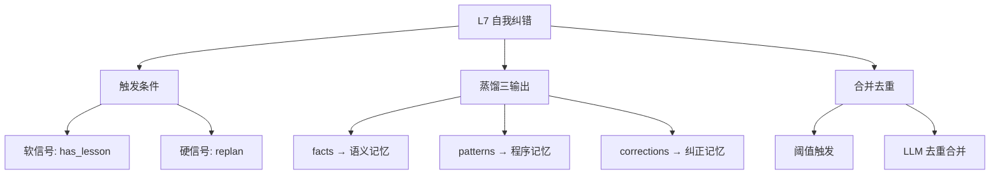
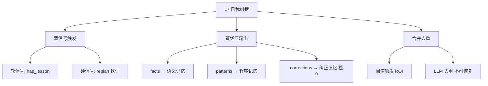

# 学习循环：L7 自我纠错与经验提炼

**创建日期**：2026-07-13
**存放路径**：`Plans/学习循环/2026-07-13-学习-智能体开发-05-自我纠错.md`
**状态**：已采纳
**workflow**：`learning-loop`

---

## 一、学习主题

| 项 | 内容 |
|----|------|
| 本轮主题 | L7 自我纠错与经验提炼 |
| 所属旅程 | `Plans/Epic/2026-07-08-智能体开发.md` |
| 用户当前水平 | 已编码验证——代码已全部写完（self_improve.py + orchestrator 集成），但概念学习循环未走 |
| 本轮目标 | 理解自我纠错的三个核心机制，能解释代码中每个设计决策的 why |

---

## 二、完成门槛

| 类型 | 门槛 |
|------|------|
| 概念门槛 | 能用自己的话解释：触发条件、蒸馏三输出、合并去重 |
| 实践门槛 | 代码已完成（L4 构建阶段），本轮重点是概念回补 |
| 验证门槛 | 回答 3 个设计决策问题，能说出 why 而不只是 what |
| 结束门槛 | 用户明确说「本轮学完了」 |

---

## 三、AI 讲解：自我纠错的 3 个核心概念

你已经写完了代码，所以我直接对着你的代码讲 **why**，不再讲 what。

### 概念 1：触发条件——什么时候才蒸馏？

你在 `orchestrator.py:124-127` 写了：

```python
# L7: 只在反思判定有教训时才蒸馏（决策 C1）
if not self._has_lesson:
    print("\n   (执行顺利，无需提炼)")
    return
```

**核心问题**：为什么不是每次任务结束都蒸馏？

答案是**信噪比**。如果每次都蒸馏，LLM 会从顺利执行中硬挤出"经验"——大量正确但无用的废话（"文件操作前要检查路径"），淹没真正有价值的教训。你的设计用了**双信号触发**：

| 信号 | 来源 | 代码位置 |
|------|------|----------|
| 软信号 | `reviewing.reflect()` 返回 `has_lesson: true` | `orchestrator.py:103-104` |
| 硬信号 | 计划被 replan 了（走了弯路 = 无条件有教训） | `orchestrator.py:110-111` |

硬信号的意义：LLM 可能漏判 `has_lesson`（说"一切正常"但其实改了计划），所以 replan 本身就是铁证——如果计划没走通，一定有值得记住的东西。

### 概念 2：蒸馏三输出——提炼出什么？

`self_improve.distill()` 把一次执行记录喂给 LLM，要求它输出三类经验：

| 输出 | 存入哪种记忆 | 例子 | 复用方式 |
|------|-------------|------|----------|
| `facts` | 语义记忆 | "Python 3.12 的 match 语句不支持 guard 表达式" | 下次遇到相关任务，直接塞进 context |
| `patterns` | 程序记忆 | trigger: "部署前" → steps: ["跑测试", "检查环境变量", "备份数据库"] | 下次匹配到 trigger，直接复用步骤 |
| `corrections` | 纠正记忆 | mistake: "直接删了旧文件" → lesson: "先备份再删" | 下次规划时，作为"踩过的坑"注入 context |

**设计决策 C3**：corrections 为什么要独立存储，而不是混进 semantic？

因为纠正记忆的使用场景不同——它不是"知识"，而是"别踩这个坑"。在 `memory.to_context()` 里，纠正记忆的渲染方式是 `别踩: ... → 教训: ...`，这种格式直接告诉 LLM "这是一个已知错误"，比混在一般知识里更有约束力。

### 概念 3：合并去重——语义记忆的垃圾回收

`self_improve.consolidate()` 在 `orchestrator.py:156` 被调用：

```python
removed = self_improve.consolidate(self.memory)
```

**为什么需要？** 语义记忆会不断累积。同一类任务跑 10 次，可能产生 10 条表述不同但含义相同的 fact。如果不合并，context 窗口被冗余知识占满，LLM 的注意力被稀释。

**设计决策 C2**：为什么用阈值（`CONSOLIDATE_THRESHOLD = 20`）而不是每次都合并？

因为合并本身要调一次 LLM，有成本。少量记忆时冗余度低，合并收益不大；攒到 20 条以上，冗余概率显著上升，此时合并的 ROI 才合理。

---

## 四、最小概念树



| 概念 | 一句话解释 | 常见误区 | 对应代码 |
|------|------------|----------|----------|
| 双信号触发 | 软信号（LLM 判断有教训）+ 硬信号（replan 无条件触发） | 误区：只靠 LLM 判断——它会漏判 | `orchestrator.py:103-111` |
| facts | 从执行中提炼的通用知识，存入语义记忆 | 误区：把任务细节当 fact | `self_improve.py:27` |
| patterns | 可复用的步骤模式（trigger + steps） | 误区：和 fact 混淆——pattern 是"怎么做"，fact 是"什么是" | `self_improve.py:28` |
| corrections | 走弯路的记录（mistake + lesson），独立存储 | 误区：混进 semantic——纠正的使用场景和渲染方式不同 | `self_improve.py:29`, `memory.py:96-102` |
| consolidate | 语义记忆攒够阈值后 LLM 去重合并 | 误区：每次都合并——调 LLM 有成本 | `self_improve.py:61-79` |

---

## 五、概念问答（3 题）

请用自己的话回答以下 3 个问题。不需要复述代码，说 **why** 就行。

**Q1**：为什么 replan 要无条件设 `_has_lesson = True`，而不是也交给 LLM 的 `has_lesson` 字段？

> 用户回答：因为一旦 replan，一定是因为计划发生偏差，需要增加约束。
> ✅ 通过。replan 是铁证（客观事实），has_lesson 是口供（LLM 自我评价），铁证兜底口供。

**Q2**：corrections 如果混进 semantic 记忆（都是字符串嘛），会出什么具体问题？

> 用户回答：会出现自己认可自己的问题，纠错就没有了意义。
> ✅ 通过。具体两层：(1) 渲染丢失警告——semantic 渲染为普通知识，LLM 不知道这是"坑"；(2) consolidate 会吞掉它——"不能删系统文件"和"系统文件不能改名"可能被合并成"系统文件不要动"，具体教训丢失。

**Q3**：如果把 `CONSOLIDATE_THRESHOLD` 从 20 改成 3（每次攒 3 条就合并），最坏情况会怎样？

> 用户回答：一个成本问题，一个是上下文不足，合并没有意义。
> ✅ 通过。(1) 成本层：几乎每次都白调 LLM，3 条大概率没重复；(2) 质量层：样本太少，LLM 缺乏上下文判断谁和谁重复，可能错误合并不同知识点且不可恢复。

---

## 六、验证（3 题）

**V1**：假设去掉硬信号，描述一个具体场景：执行走了弯路但经验没被提炼。

> 用户回答：不太明白。
> AI 讲解后理解：Agent 接到任务，执行中 reflect 判定 replan 修改了计划，但 LLM 输出 `has_lesson: false`（它觉得"换个命令而已"）。没有硬信号兜底，弯路经验就丢了。

**V2**：如果让 consolidate 也跑 corrections，会发生什么？

> 用户回答：c1"不能删除系统文件"和 c2"系统文件不能改名"会被合并成一条笼统废话。
> ✅ 通过。两个不同的坑被 LLM 判为"含义相同"合并，具体教训丢失。

**V3**：100 次任务（95 次顺利、5 次 replan），双信号 vs 每次蒸馏各多少次？差距意味什么？

> 用户回答：最少 100 次，会导致蒸馏信息碎，没法在完整叙述基础上提炼。
> 次数正确（~5 vs 100）。理由修正：核心不是"碎"，而是**信噪比**——95 次顺利执行被硬蒸馏出大量正确但无用的 fact，占满 context 窗口，稀释真正有价值的 5 条教训。

---

## 七、复盘

| 维度 | 内容 |
|------|------|
| 已掌握 | 双信号触发（铁证兜底口供）；蒸馏三输出分别进三种记忆的原因；corrections 独立存储的必要性 |
| 未掌握 | V1 硬信号场景需要 AI 讲解后才理解；V3 信噪比的准确表述（初始理解为"碎"而非"信噪比"） |
| 误区 | consolidate 阈值过低的问题，初始不清楚，经讲解后理解为成本+质量双层问题 |
| 最有价值的一点 | 硬信号兜底软信号——不信 LLM 自我评价，信客观事实 |

---

## 八、学习记录

| 日期 | 本轮主题 | 结果 | 实践产物 |
|------|----------|------|----------|
| 2026-07-13 | L7 自我纠错与经验提炼 | 概念问答 3/3 通过，验证 2/3 通过（V1 经讲解理解） | 代码已在 L4 构建阶段完成，本轮为概念回补 |

---

## 九、知识图谱增量



| 新增概念 | 关系 | 应更新到旅程图谱 |
|----------|------|------------------|
| 双信号触发 | 自我纠错的启动条件 | ✅ |
| 蒸馏三输出（facts/patterns/corrections） | 自我纠错的产出 → 三种记忆 | ✅ |
| corrections 独立存储 | 纠正记忆 ≠ 语义记忆（渲染不同 + consolidate 安全） | ✅ |
| consolidate 阈值 | 合并去重的成本/质量平衡 | ✅ |
| 信噪比 | 触发条件设计的根本动机 | ✅ |

---

## 十、用户确认

- [x] 用户确认本轮学完
- [ ] 用户选择继续下一个主题
- [ ] 用户要求生成阶段总结
- [ ] 用户确认整个学习旅程结束

---

## 续做

```text
/resume plan=Plans/Epic/2026-07-08-智能体开发.md 进度=L7已完成，下一步L8补课或L9综合实践
```

## 反馈（skill_run）

```yaml
skill_run:
  skill: workflow-router
  plan: Plans/学习循环/2026-07-13-学习-智能体开发-05-自我纠错.md
  date: 2026-07-13
  contexts_used:
    - path: Contexts/决策/Skill反馈协议.md
      utility: high
      reason: "学习循环阶段完成后必须留下反馈。"
  contexts_missing: []
  contexts_stale: []
```
