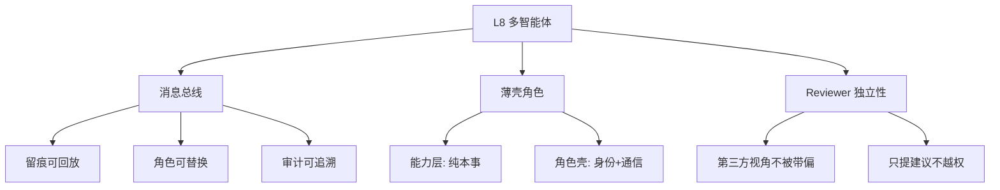
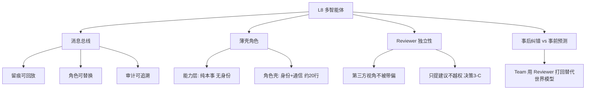

# 学习循环：L8 A2A 多智能体协作

**创建日期**：2026-07-13
**存放路径**：`Plans/学习循环/2026-07-13-学习-智能体开发-06-多智能体.md`
**状态**：已采纳
**workflow**：`learning-loop`

---

## 一、学习主题

| 项 | 内容 |
|----|------|
| 本轮主题 | L8 A2A 多智能体协作 |
| 所属旅程 | `Plans/Epic/2026-07-08-智能体开发.md` |
| 用户当前水平 | 已编码验证——team.py + a2a.py + roles/ 代码已全部写完并导入通过，概念学习循环未走 |
| 本轮目标 | 理解多智能体与单智能体的本质区别，能解释每个设计决策的 why |

---

## 二、完成门槛

| 类型 | 门槛 |
|------|------|
| 概念门槛 | 能用自己的话解释：消息总线 vs 函数调用、薄壳角色、Reviewer 独立性 |
| 实践门槛 | 代码已完成（R1 重构后），本轮重点是概念回补 |
| 验证门槛 | 回答 3 个设计决策问题，能说出 why 而不只是 what |
| 结束门槛 | 用户明确说「本轮学完了」 |

---

## 三、AI 讲解：多智能体的 3 个核心概念

同样对着你已经写好的代码讲 **why**。

### 概念 1：消息总线——为什么不直接函数调用？

单智能体 Orchestrator 里，规划、执行、反思都是**方法调用**——同一个对象的内部函数互相调。多智能体 Team 里，三个角色通过 `MessageBus` 沟通。

你在 `a2a.py` 里写的 `MessageBus` 做了两件事：

```python
def send(self, msg: Message):
    self.history.append(msg)        # 1. 全部留痕
    print(f"   ✉️  {msg.sender} → {msg.recipient} [{msg.intent}]: ...")  # 2. 可观测
```

**核心问题**：为什么不让 Planner 直接调 `executor.run(steps)`？反正 Python 也能做到。

答案是**三个解耦收益**：

| 收益 | 函数调用 | 消息总线 |
|------|---------|---------|
| **留痕可回放** | 调用链埋在调用栈里，任务结束就没了 | `bus.transcript()` 完整记录谁对谁说了什么 |
| **角色可替换** | Planner 必须知道 Executor 的方法签名 | Planner 只知道"给 Executor 发 plan 消息"，不关心对方怎么实现 |
| **审计可追溯** | 出错后难定位是谁的决策 | 每条消息带 sender/recipient/intent，回放即可定责 |

在你的 `team.py:50` 里，`len(self.bus.transcript())` 打印消息总数——这就是留痕的价值，函数调用做不到。

### 概念 2：薄壳角色——角色只管身份和通信，本事在能力层

看你的三个角色文件，每个都只有 20 多行。以 `executor.py` 为例：

```python
class Executor(BaseAgent):
    name = "Executor"

    def run(self, steps):
        # ...
        results.append(act.run_step(step, context))  # 调能力层
        self.send("Reviewer", "result", ...)          # 发消息
```

**核心问题**：为什么不让 Executor 自己写执行逻辑，而是调 `capabilities.act.run_step`？

这是 R1 重构的核心决策。之前 Executor 和 system1 各写一份执行逻辑——**同一个本事被写了两遍**。重构后：

| 层 | 职责 | 例子 |
|----|------|------|
| 能力层 `capabilities/` | 纯能力，无身份 | `act.run_step()` 不知道自己是被单智能体还是多智能体调用 |
| 角色壳 `roles/` | 身份 + A2A 通信 | `Executor` 知道自己叫 Executor，知道结果要发给 Reviewer |

**一个比喻**：能力层是"会做饭"，角色壳是"你是厨师"。厨师和家庭主妇都会做饭，但身份不同、汇报对象不同。

### 概念 3：Reviewer 独立性——为什么第三方视角重要？

`reviewer.py:15-23` 里，Reviewer 调用的是 `reviewing.review()`（终局评审），**不是** `reviewing.reflect()`（中途反思）。

**核心区别**：

| | `reflect()`（单智能体用） | `review()`（多智能体 Reviewer 用） |
|---|---|---|
| 谁调 | Orchestrator 自己 | Reviewer——没参与规划和执行 |
| 什么时候 | 每步执行后 | 全部执行完后 |
| 视角 | 自己反思自己 | 第三方审查 |

**为什么独立评审更可靠？** Reviewer 没有参与规划和执行过程，不会被过程中的思路"带偏"。就像代码 review——写代码的人总觉得自己的逻辑没问题，但没参与的人更容易发现盲点。

你在 `team.py:34-47` 的循环里，Reviewer 打回后不是自己改，而是把 `suggestion` 发给 Planner，由 Planner 决定怎么改（`revise_plan`）。这就是**决策 3-C**：Reviewer 只提意见，不越权改计划。

---

## 四、最小概念树



| 概念 | 一句话解释 | 常见误区 | 对应代码 |
|------|------------|----------|----------|
| 消息总线 | Agent 间靠消息沟通而非函数调用，全程留痕可回放 | 误区：觉得消息只是花哨包装——留痕和解耦是函数调用做不到的 | `a2a.py` |
| 薄壳角色 | 角色只管身份+通信（~20 行），本事在能力层 | 误区：让角色自己写逻辑——单/多智能体就得各写一份 | `roles/*.py` |
| Reviewer 独立性 | 没参与规划执行的第三方审查，比自己反思更客观 | 误区：Reviewer 和 reflect 一样——不一样，一个是第三方，一个是自己 | `reviewer.py` vs `orchestrator._reflect()` |
| 决策 3-C | Reviewer 只给 suggestion，Planner 自主决定微调或重规划 | 误区：Reviewer 直接改计划——越权，打破职责边界 | `planner.py:20-26` |
| 能力层复用 | 单/多智能体调同一份 `capabilities/`，区别只是编排方式 | 误区：多智能体需要更强的能力——不需要，只是组装方式不同 | `capabilities/` |

---

## 五、概念问答（3 题）

请用自己的话回答以下 3 个问题。说 **why**，不需要复述代码。

**Q1**：单智能体 Orchestrator 也能完成任务，多智能体 Team 多了什么价值？用一个具体场景说明。

> 用户回答：单智能体是一个大脑，没办法纠错。比如 AI 帮我开发一个 app，如果让他来审核，他肯定说没问题。
> ✅ 通过。单智能体的 reflect() 是自己反思自己，容易"自己认可自己"；多智能体 Reviewer 是独立第三方，没参与过程不会被带偏。

**Q2**：如果让 Reviewer 打回时直接修改计划（不经 Planner），会出什么问题？

> 用户回答：Reviewer 没有上下文，就会偏离整个计划。
> ⚠️ 方向对，补充两层：(1) 能力错位——Reviewer 的本事是"判断好坏"不是"做规划"；(2) 信息不对称——Planner 做计划时考虑了完整上下文（原始任务、记忆、约束），Reviewer 只看到执行结果，改出来的方案会和原始意图脱节。原则：谁有上下文，谁做决策。

**Q3**：如果去掉 MessageBus，改成直接函数调用，功能上能跑通吗？丢了什么？

> 用户回答：不知道。
> AI 讲解：功能上能跑通，但丢三样：(1) 留痕——出错后无法回溯谁的决策导致；(2) 解耦——换 Executor 实现时 Planner 也得改；(3) 可观测——运行过程变黑盒。消息总线的价值不在"能不能跑"，在"跑完之后能不能看懂发生了什么"。

---

## 六、用户追问

**Q-extra**：为什么 Team 里没有世界模型预测和 adjust_plan？

> 这是一个有意的设计取舍。多智能体用 Reviewer 事后打回循环替代了单智能体的事前预测。代价是事后纠错更贵（执行完才发现问题得重来）。如果要加，让 Planner 在发消息给 Executor 之前自己调 world_model.predict() + adjust_plan() 即可。这个差异是 L9 综合实践可以补上的点。

---

## 七、复盘

| 维度 | 内容 |
|------|------|
| 已掌握 | Reviewer 独立第三方的价值（自己不能审自己）；薄壳角色 + 能力层复用的设计原因 |
| 未掌握 | Q3 消息总线的解耦/留痕/可观测三层收益需要 AI 讲解；Q2 的"能力错位 + 信息不对称"需要补充 |
| 误区 | 无明显误区 |
| 最有价值的一点 | 用户主动发现 Team 缺少世界模型预测——说明已经能跨层对比设计差异 |

---

## 八、学习记录

| 日期 | 本轮主题 | 结果 | 实践产物 |
|------|----------|------|----------|
| 2026-07-13 | L8 A2A 多智能体协作 | 概念问答 2/3 通过（Q3 经讲解理解），用户主动追问世界模型缺失 | 代码已在 R1 重构阶段完成，本轮为概念回补 |

---

## 九、知识图谱增量



| 新增概念 | 关系 | 应更新到旅程图谱 |
|----------|------|------------------|
| 消息总线（留痕/解耦/可观测） | 多智能体通信基础 | ✅ |
| 薄壳角色 + 能力层复用 | R1 重构核心——单/多智能体共用能力 | ✅ |
| Reviewer 独立性 | 第三方审查 > 自己反思 | ✅ |
| 决策 3-C | Reviewer 只给建议，Planner 做决策 | ✅ |
| 事后纠错 vs 事前预测 | Team 的 Reviewer 循环替代 Orchestrator 的世界模型 | ✅ |

---

## 十、用户确认

- [x] 用户确认本轮学完
- [ ] 用户选择继续下一个主题
- [ ] 用户要求生成阶段总结
- [ ] 用户确认整个学习旅程结束

---

## 续做

```text
/resume plan=Plans/Epic/2026-07-08-智能体开发.md 进度=L8已完成，下一步L9综合实践或R3生产化
```

## 反馈（skill_run）

```yaml
skill_run:
  skill: workflow-router
  plan: Plans/学习循环/2026-07-13-学习-智能体开发-06-多智能体.md
  date: 2026-07-13
  contexts_used:
    - path: Contexts/决策/Skill反馈协议.md
      utility: high
      reason: "学习循环阶段完成后必须留下反馈。"
  contexts_missing: []
  contexts_stale: []
```
