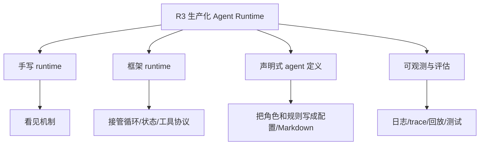
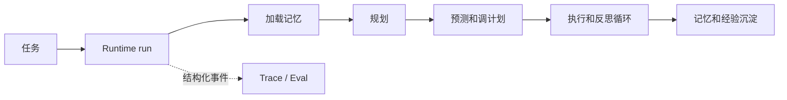
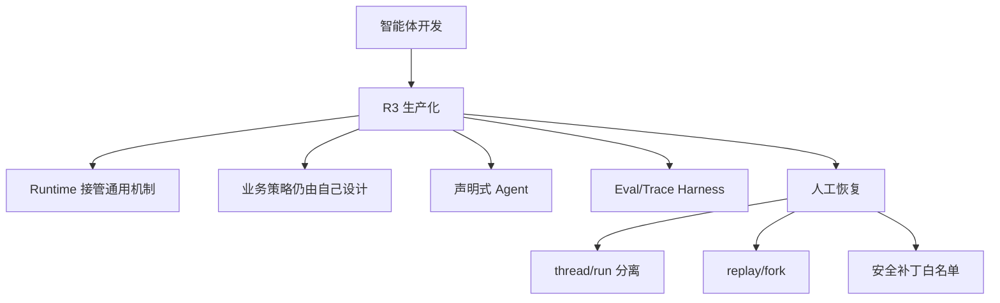

# 学习循环：R3 生产化 Agent Runtime

**创建日期**：2026-07-17  
**存放路径**：`Plans/学习循环/2026-07-17-学习-智能体开发-08-R3生产化.md`  
**状态**：进行中  
**workflow**：`learning-loop`

---

## 一、学习主题

| 项 | 内容 |
|----|------|
| 本轮主题 | R3：从手写 Agent runtime 迁移到生产化 runtime |
| 所属旅程 | `Plans/Epic/2026-07-08-智能体开发.md` |
| 用户当前水平 | L0-L9 已完成；已经手写过规划、执行、世界模型、安全、记忆、自我纠错、多智能体协作 |
| 本轮目标 | 理解“生产化”到底替你接管什么，哪些机制仍必须自己设计 |

---

## 二、完成门槛

| 类型 | 门槛 |
|------|------|
| 概念门槛 | 能区分手写 runtime、框架 runtime、声明式 agent 定义 |
| 设计门槛 | 能为当前 `agent/` 选择一条迁移路径，并说清楚取舍 |
| 实践门槛 | 先完成迁移方案卡；下一步再决定是否编码 |
| 结束门槛 | 用户明确说「本轮学完了」 |

---

## 三、资料准备

### AI 讲解稿

你前面手写的 `agent/` 已经很完整：有 Orchestrator、Team、能力层、工具、安全、记忆、世界模型、自我纠错。它的学习价值很高，因为每一层你都看见了。

R3 要学的不是“再加一个功能”，而是**把这些手写机制拆成两类**：

| 类别 | 继续自己掌控 | 可以交给 runtime/framework |
|------|--------------|----------------------------|
| 业务判断 | 安全原则、记忆结构、任务边界、角色职责 | 不应完全交出去 |
| 运行机制 | 工具调用循环、状态流转、消息传递、重试、日志、可观测性 | 可以交给成熟 runtime |

一句话：**生产化 Agent 不是更会思考，而是更可靠地运行。**

手写 runtime 像你自己搭了一辆车：发动机、方向盘、刹车都懂了。生产化 runtime 是换成可上路的底盘：刹车系统、仪表盘、故障灯、保养接口都更标准。但目的地、驾驶规则、什么时候停，还是你决定。

---

## 四、最小概念树



| 概念 | 一句话解释 | 常见误区 | 对应实践 |
|------|------------|----------|----------|
| 手写 runtime | 自己控制 goal loop、工具循环、状态流转和多角色调度 | 觉得手写才“高级” | 当前 `agent/` |
| 框架 runtime | 用框架接管通用执行机制，自己只补业务策略 | 以为用了框架就不用懂内部 | 迁移 Orchestrator/Team |
| 声明式 agent | 用 Markdown/YAML/配置声明角色、工具、边界、验收 | 把声明式当提示词堆砌 | 类比本仓 `Skills/*.md` |
| 可观测性 | 每一步为什么做、用了什么工具、哪里失败都能追踪 | 只看最终答案 | trace、事件、日志、回放 |
| 评估 harness | 用固定任务集验证 Agent 是否稳定 | 只靠一次人工试跑 | tests + fixtures |

---

## 五、学习过程

| 时间 | 学习动作 | 结果 |
|------|----------|------|
| 2026-07-17 | 从 L9 之后续学 R3 | 已确认下一主题是生产化 runtime |
| 2026-07-17 | 选择 R3 第一刀 | 选择 A：先迁移单智能体 Orchestrator |
| 2026-07-17 | 选择 runtime 实现方式 | 选择不引入外部依赖的最小 runtime adapter |

---

## 六、问题与澄清

| 问题 | AI 回答 | 是否已懂 |
|------|---------|----------|
| 生产化是不是换一个更强模型？ | 不是。模型只是推理核心，生产化主要解决状态、工具、重试、权限、观测、评估和发布。 | ⬜ |
| 手写 runtime 还有价值吗？ | 有。它让你知道框架接管了什么，也知道什么时候不该把业务判断交给框架。 | ⬜ |

---

## 七、设计决策

> 用户根据概念理解，做出架构/方案选择。AI 只提供选项和 trade-off，不替用户决定。

| 决策点 | 选项 | 用户选择 | 理由 |
|--------|------|----------|------|
| R3 第一刀先迁移什么？ | A. Orchestrator 单智能体<br>B. Team 多智能体<br>C. 先做 eval/trace harness，不迁移 runtime | A. Orchestrator 单智能体 | 用户已选择 A；单智能体循环是最小、最可控的迁移样板。 |
| R3 学习完成后的落地路线 | 继续自建 runtime<br>引入第三方 runtime | 学完后引入第三方 runtime | 最小 adapter 只用于看清运行时契约；完成学习后应把通用运行机制交给成熟 runtime。 |

### 选择题

**Q1：你觉得 R3 第一刀应该选 A / B / C 哪个？为什么？**

- A：先迁移 Orchestrator。优点是路径最短，能把单智能体 goal loop 映射到框架 runtime；缺点是多智能体价值暂时看不到。
- B：先迁移 Team。优点是能直接验证角色、消息、独立 Predictor/Reviewer；缺点是复杂度最高，容易一上来被框架细节淹没。
- C：先做 eval/trace harness。优点是不动核心架构，先建立“稳定性仪表盘”；缺点是生产化 runtime 迁移会晚一点。

### A 的迁移方案卡

迁移的目标不是把 `Orchestrator` 的业务逻辑“藏进框架”，而是把它从一个依赖 `print`、只返回最终字符串的脚本式循环，变成一个可追踪、可取消、可评估、可替换 runtime 的执行单元。

| 边界 | 第一刀的处理 | 原因 |
|------|--------------|------|
| 保持自有 | `planning`、`act`、`reviewing`、`world_model`、记忆结构、安全原则、经验蒸馏 | 这些是本项目的 Agent 策略与领域判断，不能因为换 runtime 而丢失。 |
| runtime 接管 | 一次 run 的生命周期、阶段事件、步骤状态、失败/取消、重试策略、trace 关联 ID | 这些是通用运行机制，生产环境需要标准化。 |
| 本轮暂不迁移 | `Team`、A2A 消息总线、角色壳、Markdown 角色定义 | 先验证单智能体的运行时契约，再把同一契约推广到多智能体。 |



第一份可编码的迁移切片：

1. 定义 `RunEvent` 与 `RunResult`，让规划、预测、执行、反思、记忆沉淀都产出结构化事件。
2. 保留 `Orchestrator` 作为业务编排策略，把运行生命周期收敛到一个 runtime adapter；命令行只消费 `RunResult`，不再依赖 `print` 作为唯一观察面。
3. 建一个固定任务 fixture，比较迁移前后是否仍会经过相同关键阶段，并检查失败、提前完成、重规划三类分支能被 trace 捕获。

**本切片完成的标准**：同一任务的业务结果不退化；每次执行有唯一 run ID；关键阶段可回放；评估不再只依赖人工看终端输出。

### R3 后续路线（已确定）

R3 不会停在自建 adapter。它的作用是让你亲手看见 runtime 接管的边界；在本轮学习的 trace、评估和声明式定义切片完成后，**下一阶段必须接入第三方 Agent runtime**。届时根据已形成的 `RunEvent`、`RunResult`、评估任务集和角色边界选择框架，并把自建 adapter 作为迁移对照与兼容层，而不是持续扩写成另一套框架。

| 阶段 | 目标 | 状态 |
|------|------|------|
| R3.1 | 最小自建 adapter：看清运行 ID、事件、结果和失败收口 | ✅ 已完成 |
| R3.2 | trace 持久化与 eval harness：让运行行为可回放、可判定 | ✅ 已完成：本地 JSON trace、非致命持久化告警与 6 项离线测试已通过 |
| R3.3 | 声明式 Agent 定义：将角色、工具、边界和验收版本化 | ✅ 已完成：单智能体与 Team 四角色均已加载独立定义，概念验证通过。 |
| R3.4 | 接入第三方 Agent runtime：将通用执行机制迁出自建 adapter | ✅ 已完成：LangGraph 已接管单智能体和 Team 的控制流。 |
| R3.5 | 人工审批与可恢复工具执行：把危险工具调用变成可审查状态 | ✅ 已完成：工具提议、审批暂停、SQLite durable checkpoint、`thread_id` / `run_id` 分离，以及统一的 replay / fork 恢复入口已验证。 |

### Team Graph 改造交接契约

后续迁移 `Team` 时，以下结论是已确认约束，不再重新讨论：

| 层 | 归属 | Team 改造时的处理 |
|----|------|--------------------|
| Agent Definition | `agent/definitions/*.json` + `agent/prompts/*.md` | Planner/Predictor/Executor/Reviewer 各自声明身份、目标、工具边界和验收。 |
| Capability | `planning`、`world_model`、`act`、`reviewing` | 保持 Python 共享实现；不复制到 role 或配置文件。 |
| Team 控制流 | 新的 LangGraph Team runtime | 节点、条件边、重试、终止和失败收口写 Python `StateGraph`。 |
| Tool 安全 | `safety.py` | 定义 allowlist 先过滤，安全层仍拥有运行时最终裁决。 |
| 人工审批 | `pending_approval` 图状态 + `approve_tool` 节点 | 工具名、参数与审批原因先持久化；`interrupt` 只暂停审批节点，恢复时执行同一份提议。 |
| 失败恢复 | checkpoint + 人工决策 | runtime 不自动重试；`checkpoint_history()` 列出归档点，`recover()` 不带状态修改则 replay，带 `state_patch` 则 fork。为避免篡改审批或执行事实，fork 补丁白名单第一版只允许字符串列表 `steps`；改步骤等同人工修订计划，图强制回到 `predict` 再执行。`thread_id` 表示 checkpoint 状态链，恢复生成新的子 `run_id`，保留 `parent_run_id` 和来源 checkpoint。自动重试、幂等键和重试预算留给后续更高层的恢复策略。安全拒绝不可通过恢复绕过。 |
| Checkpoint 保留 | SQLite 全量历史 | 永久保存，不设置 TTL 或自动清理；不做定期导出或备份。以存储增长和单机文件故障风险换取完整审计、任意历史 replay 与 fork 能力。 |
| 运行证据 | `RunResult`、TraceStore、eval | Team 迁移必须复用 R3.2 的 run/trace/eval 契约。 |

**明确不做**：不创建 `team.json` / YAML 来描述任意控制流；不让配置声明函数路径或自由表达式；不因引入 LangGraph 删除 capability 的实际实现。

---

## 八、编码实现

| 任务 | 输入 | 产物 | 验收 |
|------|------|------|------|
| 迁移方案卡 | 用户选择 A/B/C | R3 迁移任务拆分 | 能说清先迁移什么、不迁移什么、如何验证 |
| Orchestrator runtime adapter | 迁移方案卡 | `RunEvent`、`RunResult`、runtime 边界 | 业务语义不变且 trace 可回放 |
| LangGraph runtime 迁移 | 用户要求改为第三方 runtime | `agent/langgraph_runtime.py`、图节点/边、checkpoint、离线测试 | 图回环与失败收口通过 |
| Team Graph 迁移 | Team Graph 改造交接契约 | `agent/team_graph_runtime.py`、结构化角色交接 trace | 风险调整、评审返工和 trace 告警均由图与测试覆盖 |
| 可恢复工具审批 | 安全优先原则 | action session、`approve_tool` 节点、`RunResult.interrupts`、SQLite checkpoint | 未获审批不执行；恢复不重新生成工具提议；新 runtime 从同一 `thread_id` 恢复，产生独立子 `run_id` |

---

## 九、代码产物

| 产物 | 路径/链接 | 说明 |
|------|-----------|------|
| LangGraph Runtime | `agent/langgraph_runtime.py` | 第三方 StateGraph 接管单智能体主调度。 |
| Team Graph Runtime | `agent/team_graph_runtime.py` | Planner/Predictor/Executor/Reviewer 通过条件边协作；交接写入 trace，不再依赖 MessageBus 路由。 |
| 工具执行会话 | `agent/capabilities/act.py` | `pending_calls` 保存精确工具提议；执行、审批和恢复可被图状态接管。 |
| Durable checkpoint | `agent/checkpoint_store.py` | SQLite 按 `thread_id` 保存 LangGraph 图状态；运行重启后可继续同一状态链。 |
| 兼容结果类型 | `agent/runtime.py` | `RunEvent`、`RunResult` 保持调用方稳定。 |

---

## 十、验证清单

| 验证项 | 方法 | 结果 |
|--------|------|------|
| 概念问答 | 用户选择 Q1 = A | ✅ |
| 设计检查 | 已明确保留策略层、runtime 接管的通用机制和暂不迁移边界 | ✅ |
| 反例检查 | Team 迁移会混入 A2A 复杂性；先做 eval/trace 会推迟 runtime 契约落地 | ✅ |
| Team Graph 回归 | 15 项离线测试覆盖安全直达、风险调整、评审返工、重试上限、checkpoint 和 trace 失败告警 | ✅ |
| 工具审批与恢复回归 | 21 项离线测试覆盖单智能体和 Team 的暂停、恢复与提议不重生成；历史 checkpoint 可 replay 或 fork，fork 不可修改审批状态，改 `steps` 必须重新预测，恢复生成子 `run_id` 且保留原 trace；其中 1 项验证 SQLite 上的新 runtime 实例恢复 | ✅ |

---

## 十一、验证结论

| 项 | 结论 |
|----|------|
| 是否通过 | R3.1-R3.5 通过；用户已确认本轮学完 |
| 证据 | LangGraph StateGraph 已接管单智能体和 Team 控制流；21 项离线测试覆盖审批暂停、精确恢复、SQLite 跨 runtime 恢复、历史 replay/fork、状态补丁白名单与改计划后重新预测，均通过 |
| 需要返工 | 无 |

---

## 十二、复盘

| 维度 | 内容 |
|------|------|
| 已掌握 | runtime 管理 task 执行；`thread_id` 是 checkpoint 状态链，`run_id` 是一次独立执行与 trace；checkpoint、trace、eval 分别服务恢复、证据与判定。 |
| 未掌握 | 生产级分布式存储、备份、自动重试和幂等键留到后续规模化阶段。 |
| 误区 | checkpoint 不是单一存档，也不等于 trace；历史恢复不是天然安全，修改计划必须重新经过预测。 |
| 最有价值的一点 | 先把恢复作为人工受控操作：独立 trace、可选 replay/fork、补丁白名单与安全节点重走，才能既可恢复又不绕过安全。 |

---

## 十三、下一步建议

| 方向 | 建议 | 理由 |
|------|------|------|
| 继续深化 | 评估持久 checkpoint 的存储增长与备份策略 | 当前选择永久本地保存、不备份；规模化前需重新评估。 |
| 进入实践 | 为恢复链路补人工操作界面或 CLI | 让操作者能列出 checkpoint、选择 replay/fork，并提交 `steps` 修订。 |
| 后续学习 | 自动重试与工具幂等性 | 在更高层定义重试预算、失败分类和副作用去重。 |

---

## 十四、学习记录

| 日期 | 本轮主题 | 结果 | 实践产物 |
|------|----------|------|----------|
| 2026-07-17 | R3 生产化 Agent Runtime | R3.1 最小 adapter + R3.4 LangGraph runtime 已通过 | `Plans/功能开发/2026-07-17-Orchestrator迁移LangGraphRuntime.md` |
| 2026-07-29 | R3.5 人工审批与可恢复执行 | 用户确认学完；持久 checkpoint、恢复分支与安全边界已验证 | `agent/checkpoint_store.py`、`agent/langgraph_runtime.py`、`agent/team_graph_runtime.py` |

---

## 十五、知识图谱增量



| 新增概念 | 关系 | 应更新到旅程图谱 |
|----------|------|------------------|
| 生产化 runtime | 接管通用运行机制，不替代业务判断 | ✅ |
| 声明式 agent | 把角色、工具、边界和验收写成可版本化定义 | ⬜ |
| eval/trace harness | 生产化前的稳定性仪表盘 | ⬜ |
| checkpoint 恢复链 | thread 状态链、run trace、replay/fork 与人工修订计划 | ✅ |

---

## 十六、用户确认

- [x] 用户确认本轮学完
- [ ] 用户选择继续下一个主题
- [ ] 用户要求生成阶段总结
- [ ] 用户确认整个学习旅程结束

---

## 续做

```text
R3 学习循环已完成。后续如扩展恢复策略，从「自动重试与工具幂等性」主题新建学习 plan。
```

## 反馈（skill_run）

```yaml
skill_run:
  skill: workflow-router
  plan: Plans/学习循环/2026-07-17-学习-智能体开发-08-R3生产化.md
  date: 2026-07-29
  contexts_used:
    - path: Contexts/决策/Skill反馈协议.md
      utility: high
      reason: "学习循环阶段完成后必须留下反馈，供后续流程进化。"
    - path: Plans/Epic/2026-07-08-智能体开发.md
      utility: high
      reason: "用于承接 L0-L9 已完成后的 R3 生产化待办。"
  contexts_missing: []
  contexts_stale: []
  outcome_status: pass
  revisit_needed: false
```
