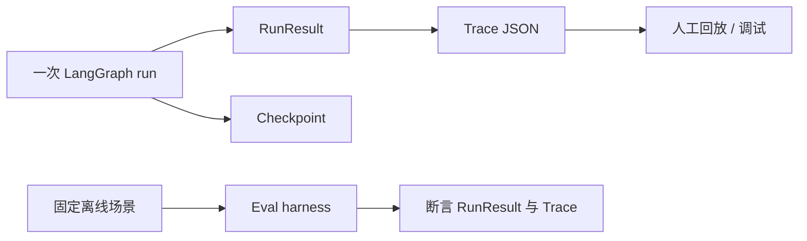
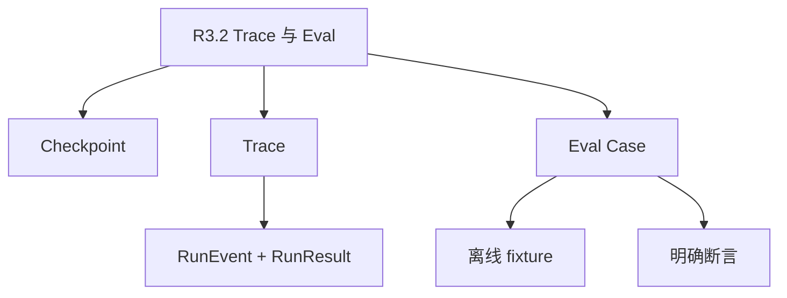

# 学习资料：R3.2 可回放 Trace 与离线 Eval Harness

**学习循环**：`learning-loop`
**当前阶段**：`material-prepare` / AI 准备核心概念
**存放路径**：`Plans/学习循环/2026-07-17-学习资料-智能体开发-08-R3.2-Trace与Eval.md`

---

## 一、学习主题

| 项 | 内容 |
|----|------|
| 本轮主题 | R3.2：给现有 LangGraph Orchestrator 补齐可持久化 trace 与离线 eval harness |
| 已有基础 | `RunEvent`、`RunResult`、LangGraph `InMemorySaver`、重规划和失败的离线单测 |
| 本轮目标 | 将一次运行保存为可读取证据，并用固定场景判断关键行为是否回归 |
| 非目标 | 不迁移 Team、不接云端 LangSmith、不换模型客户端、不把业务判断交给框架 |

## 二、完成门槛

| 类型 | 门槛 |
|------|------|
| 概念门槛 | 能区分 checkpoint、trace 与 eval：状态恢复、行为证据、可重复判定分别解决不同问题 |
| 设计门槛 | 能说明 trace 的最小记录字段，以及 eval 为什么必须脱离真实 LLM |
| 实践门槛 | 成功/重规划/失败三类固定场景均能保存 trace 并通过断言 |
| 结束门槛 | 用户明确说「R3.2 学完了」 |

## 三、资料准备

### AI 讲解稿

你已经有了 LangGraph checkpoint，但它只解决“图下次能从哪里继续”。它不是一份稳定的运行报告：当前使用的是 `InMemorySaver`，进程结束就没了，而且 checkpoint 的内部结构是框架实现细节。

R3.2 要额外建两层：

1. **Trace**：把一次 `RunResult` 序列化为项目自己的证据文件。它记录任务、run ID、终态、错误和每个标准化事件；人和测试都能读，不依赖 LangGraph 内部对象。
2. **Eval harness**：把“这次看起来跑通”变成固定案例。每个案例用离线替身控制规划、预测、执行和反思，再断言预期事件和终态。

它们的关系是：checkpoint 供 runtime 恢复，trace 供人回放和调试，eval 供改代码后判定是否回归。三者不要互相替代。



| 概念 | 它回答的问题 | 本项目的最小实现 | 常见误区 |
|------|--------------|------------------|----------|
| checkpoint | 失败后从何处恢复？ | LangGraph 的 `InMemorySaver` | 把 checkpoint 当审计日志 |
| trace | 这次实际上发生了什么？ | 每个 run 一个 JSON 文件 | 只保存最终文本 |
| eval case | 改动后关键行为还在吗？ | 纯离线的 fixture + 断言 | 让真实 LLM 决定测试结果 |
| harness | 如何批量运行并汇总案例？ | Python 标准库测试与命令入口 | 把测试名称当评估标准 |

### 本轮最小设计

- trace 位置：`agent/traces/<run_id>.json`，一个 run 一个文件，便于按 run ID 回放和删除。
- trace 信封：`schema_version`、`saved_at`、`result`；其中 `result` 含 `task`、`outcome`、`error` 和完整事件列表。
- 写入时机：无论成功或失败，都由 runtime 在得到 `RunResult` 后尝试保存；保存失败不能掩盖原运行错误。
- eval 案例：`normal_completion`、`replan`、`planning_failure`。每个案例断言终态、关键 phase 和持久化后的 trace 内容。

## 四、最小概念树



## 五、学习过程

| 时间 | 学习动作 | 结果 |
|------|----------|------|
| 2026-07-17 | 用户选择 R3.2，暂缓 Team 迁移 | 已进入 trace/eval 资料阶段 |
| 2026-07-17 | 盘点现有 runtime 和测试 | 已确认已有内存 checkpoint 与两类离线测试，缺跨进程 trace 与场景化 eval |
| 2026-07-17 | 用户复述 checkpoint / trace / eval 的边界 | 已通过；补充 checkpoint 是同一 thread 下多个时间点的状态快照 |

## 六、问题与澄清

| 问题 | AI 回答 | 是否已懂 |
|------|---------|----------|
| 为什么已有 checkpoint 还要 trace？ | checkpoint 服务于 runtime 恢复；trace 是稳定、可读、可跨进程保存的项目证据。 | ✅ |
| 为什么 eval 不能直接跑真实 LLM？ | 模型输出、网络和价格都会让测试不稳定；eval 首先要锁住编排行为。 | ✅ |

## 七、设计决策

| 决策点 | 本轮默认方案 | 理由 |
|--------|--------------|------|
| 本地 trace 格式 | 一个 run 一个 JSON 文件 | 不引入数据库，人工可读，失败时仍能保留完整运行样本。 |
| 评估执行方式 | 标准库 `unittest` + 明确命名的 fixture | 沿用现有测试工具链，不用真实 API Key 或网络。 |
| 评估对象 | runtime 契约，而非最终文案质量 | 先验证状态图分支、终态和事件证据；模型质量另设评估层。 |

## 八、编码实现

| 任务 | 产物 | 验收 |
|------|------|------|
| TraceStore | 保存和读取 `RunResult` 的本地 JSON 契约 | 成功与失败 run 均可 round-trip |
| Runtime 接口 | `run_with_trace()` 自动落盘 trace | 保存错误不覆盖业务运行结果 |
| Eval fixtures | 正常、重规划、规划失败三个离线案例 | 每项断言终态、phase 和 trace 文件内容 |

## 十、验证清单

| 验证项 | 方法 | 结果 |
|--------|------|------|
| 概念问答 | 用户区分 checkpoint / trace / eval | ⬜ |
| 正常场景 | 离线 fixture 运行并读取 trace | ⬜ |
| 重规划场景 | 断言 reflect 后回到 execute_step，trace 可回放 | ⬜ |
| 失败场景 | 断言 failed 终态也保存 trace | ⬜ |

## 十三、下一步建议

资料阶段已完成，进入 `study`：把概念判断映射到当前代码中的实际边界，再进入设计与编码阶段。

## 十六、用户确认

- [ ] 用户确认已理解 R3.2 核心概念
- [ ] 用户确认本轮学完

## 续做

```text
/resume plan=Plans/学习循环/2026-07-17-学习资料-智能体开发-08-R3.2-Trace与Eval.md 进度=资料已准备；等待概念答疑后进入设计与编码
```

## 反馈（skill_run）

```yaml
skill_run:
  skill: material-prep-assistant
  plan: Plans/学习循环/2026-07-17-学习资料-智能体开发-08-R3.2-Trace与Eval.md
  date: 2026-07-17
  contexts_used:
    - path: Plans/学习循环/2026-07-17-学习-智能体开发-08-R3生产化.md
      utility: high
      reason: "提供 R3.2 的既定范围和已完成的 LangGraph runtime 边界。"
    - path: agent/langgraph_runtime.py
      utility: high
      reason: "确认当前已有 InMemorySaver、RunEvent 和 RunResult，定位本轮缺口。"
  contexts_missing: []
  contexts_stale: []
```
