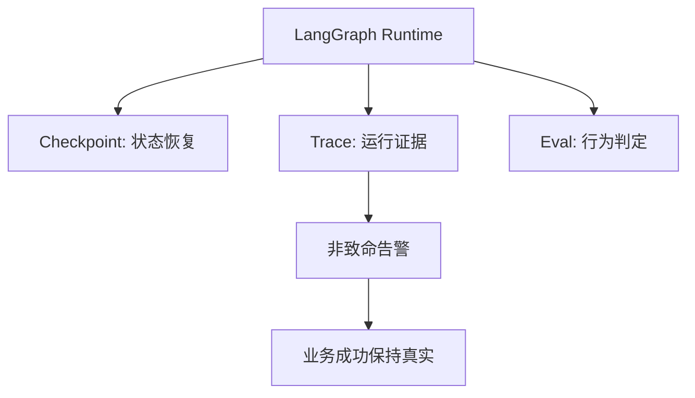

# 学习记录：R3.2 Trace 与 Eval

## 十四、学习记录

| 日期 | 本轮主题 | 已完成实践 | 核心结论 |
|------|----------|------------|----------|
| 2026-07-22 | R3.2 可回放 Trace 与离线 Eval Harness | `TraceStore`、`RunResult.warnings`、LangGraph 非致命持久化、6 项离线测试 | checkpoint 管恢复，trace 管证据，eval 管可重复判定；观测降级通常不改变业务成功。 |

## 十五、知识图谱增量



| 新增概念 | 关系 | 应更新到旅程图谱 |
|----------|------|------------------|
| TraceStore | 将 runtime-neutral RunResult 保存为可回读证据 | ✅ |
| Observability degradation | trace 失败是告警，不默认改写业务结果 | ✅ |
| Audit-required flow | 审计证据本身是交付时，观测失败升级为流程失败 | ✅ |

## 十六、用户确认

- [x] 用户确认 R3.2 学完
- [x] 用户选择进入 R3.3 声明式 Agent 定义
- [ ] 用户确认整个学习旅程结束

## 续做

```text
/resume plan=Plans/学习循环/2026-07-22-学习记录-智能体开发-08-R3.2-Trace与Eval.md 进度=学习记录已准备；等待用户确认 R3.2 是否学完
```

## 反馈（skill_run）

```yaml
skill_run:
  skill: material-prep-assistant
  plan: Plans/学习循环/2026-07-22-学习记录-智能体开发-08-R3.2-Trace与Eval.md
  date: 2026-07-22
  contexts_used:
    - path: Plans/学习循环/2026-07-22-学习验证-智能体开发-08-R3.2-Trace与Eval.md
      utility: high
      reason: "将已通过的行为验证转化为可复用的学习结论。"
  contexts_missing: []
  contexts_stale: []
```
