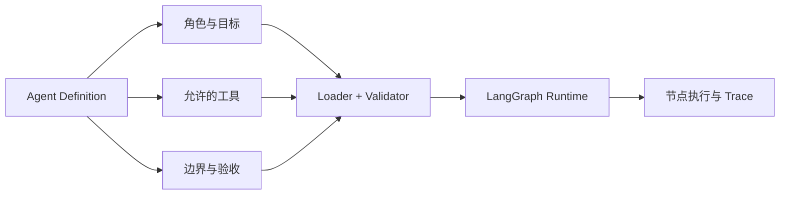
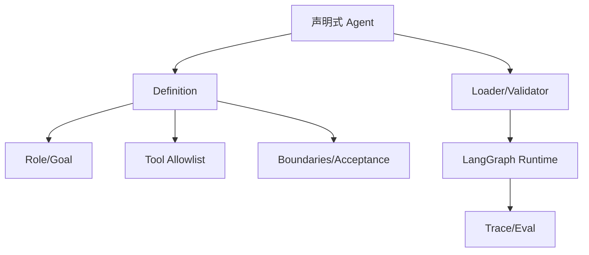

# 学习资料：R3.3 声明式 Agent 定义

## 三、资料准备

### AI 讲解稿

声明式 Agent 不是把整个智能体塞进 YAML。它是把**经常变化、需要审阅、可以组合**的策略信息从 Python 里提出来，做成有版本的定义；运行时仍由代码负责加载、校验、执行图、错误处理和安全兜底。

当前 `LangGraphRuntime` 里，节点和边是运行机制：`plan -> predict -> execute_step -> reflect`。这些留在代码，因为它们定义状态机和失败行为。适合声明的，是某个 Agent 的身份、目标、可用工具、工具边界、给模型的规则和验收标准。



| 应声明 | 为什么 | 例子 |
|--------|--------|------|
| 角色与目标 | 产品策略，常要评审和调整 | `researcher`、任务目标、输出格式 |
| 工具 allowlist | 权限边界，应可审查 | 允许 `read_file`，不允许 `shell` |
| 行为边界与验收 | 让行为变成可测试契约 | 必须引用证据；缺信息时停止 |
| 模型提示词片段 | 文案策略，需要版本化 | 系统约束、领域术语 |

| 应留在代码 | 为什么 | 例子 |
|------------|--------|------|
| LangGraph 节点与边 | 运行状态机，不是角色文案 | 重规划回环、终止条件 |
| 输入解析与 schema 校验 | 不可信配置必须被防御 | 缺工具、未知字段、无效名称 |
| 安全最终裁决 | 配置不能自行扩大权限 | `safety.py` 审核与拒绝 |
| Trace / eval 基础设施 | 是跨定义的运行契约 | `RunResult`、TraceStore |

### 格式选择的第一原则

先选“谁要读和改它”，再选格式：

- **YAML**：结构化、适合机器校验和工具权限；本轮最适合当最小定义格式。
- **Markdown**：更适合长说明、角色手册和示例；结构字段仍需额外解析。
- **Python**：能力最强，但不再是可被非开发者审阅的纯声明。

因此本轮的默认实验是：一个小 YAML Agent 定义，Python loader 把它校验为不可变对象，LangGraph 节点只读取已校验的定义，不直接信任原始文件。

## 四、最小概念树



## 五、学习过程

| 时间 | 学习动作 | 结果 |
|------|----------|------|
| 2026-07-22 | 用户完成 R3.2 并进入下一阶段 | R3.3 声明式 Agent 定义已启动 |
| 2026-07-22 | 对照当前 LangGraph runtime 划分声明与代码边界 | 节点/边/安全裁决留代码；角色/工具边界/验收可声明 |
| 2026-07-22 | 用户判断声明工具与安全裁决冲突 | ✅ `safety.py` 优先；有效权限是声明允许与运行时安全允许的交集 |

## 六、问题与澄清

| 问题 | AI 回答 | 是否已懂 |
|------|---------|----------|
| 为什么不把 graph 也写进 YAML？ | 图的循环、终止和失败策略是运行机制；过早配置化会把关键控制流藏起来，降低可读性和测试性。 | ✅ |
| 工具 allowlist 写在定义里就足够安全吗？ | 不够。它只能表达策略；真实执行仍必须由代码中的安全层二次拦截。 | ✅ |

## 七、下一步设计题

已完成。安全层优先；定义的 allowlist 不能升级运行时权限。

## 续做

```text
/resume plan=Plans/学习循环/2026-07-22-学习资料-智能体开发-08-R3.3-声明式Agent定义.md 进度=资料已准备；等待回答安全裁决优先级
```

## 反馈（skill_run）

```yaml
skill_run:
  skill: material-prep-assistant
  plan: Plans/学习循环/2026-07-22-学习资料-智能体开发-08-R3.3-声明式Agent定义.md
  date: 2026-07-22
  contexts_used:
    - path: agent/safety.py
      utility: high
      reason: "确认声明式工具权限不能取代代码中的最终安全裁决。"
    - path: agent/langgraph_runtime.py
      utility: high
      reason: "用于划分应留在状态图中的运行机制与可声明策略。"
  contexts_missing: []
  contexts_stale: []
```
