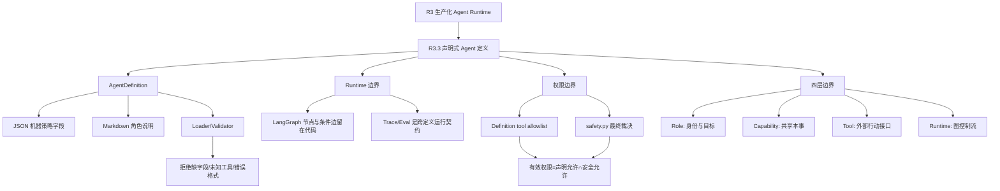

# 学习记录：R3.3 声明式 Agent 定义

## 十四、学习记录

| 日期 | 本轮主题 | 结果 | 实践产物 |
|------|----------|------|----------|
| 2026-08-01 | R3.3 声明式 Agent 定义 | 已完成 Agent Definition 与 runtime 的职责切分：声明承载可审阅策略，代码保留图控制流、安全裁决、trace/eval 契约。 | `agent/agent_definition.py`、`agent/definitions/`、`agent/prompts/`、`agent/langgraph_runtime.py`、`agent/team_graph_runtime.py`、`agent/tests/` |

### 本轮核心记录

| 维度 | 结论 | 代码/验证证据 |
|------|------|---------------|
| Agent 定义边界 | Agent Definition 是经 loader 校验后的策略对象，描述身份、目标、工具 allowlist 与验收，不拥有运行图控制流。 | `agent/agent_definition.py` |
| 格式取舍 | 机器策略字段用 JSON，长角色说明用 Markdown；Python loader 负责解析、校验和拒绝未知工具。 | `agent/definitions/general-assistant.json`、`agent/prompts/general-assistant.md` |
| Runtime 边界 | LangGraph 节点、条件边、重规划回环、失败收口和 checkpoint 留在代码中。 | `agent/langgraph_runtime.py`、`agent/team_graph_runtime.py` |
| 安全边界 | 工具 allowlist 只是策略输入，最终有效权限是声明允许与 `safety.py` 允许的交集。 | `agent/capabilities/act.py`、`agent/safety.py` |
| 四层模型 | Role 定义身份/目标，Capability 提供共享能力，Tool 是外部行动接口，Runtime 负责控制流。 | Planner/Predictor/Executor/Reviewer 定义与 role tests |
| 验证结果 | 单智能体声明、四角色声明、allowlist、未知工具拒绝、Team Graph 协作与 trace/checkpoint 回归均通过。 | R3.3 验证与复盘记录：11 项、15 项离线测试通过 |

### 用户已形成的关键判断

- Orchestrator 不是 Agent；`orchestrator.yaml` 是错误命名，声明应属于独立 Agent Definition。
- 配置不能扩大权限，安全层拥有最终裁决权。
- Team Graph 的路由、重试和终止条件应由 LangGraph 代码图表达，不应塞进 JSON/Markdown 声明。
- Planner 没有外部工具权限也能调用 `planning` capability，因为 capability 与 tool 不在同一层。

## 十五、知识图谱增量



| 新增概念 | 关系 | 应更新到旅程图谱 |
|----------|------|------------------|
| AgentDefinition | 声明式 Agent 的稳定策略对象；runtime 只读取校验后的定义。 | ⬜ 待用户确认后归位到 `Contexts/智能体开发/00-智能体开发知识图谱.md` |
| JSON + Markdown 混合定义 | JSON 承载可校验机器字段，Markdown 承载长角色说明。 | ⬜ 待归位 |
| Loader/Validator | 把不可信声明转成受 schema 限制的不可变对象。 | ⬜ 待归位 |
| Tool allowlist ∩ safety | 声明只缩小权限，不能绕过安全层。 | ⬜ 待归位 |
| Role / Capability / Tool / Runtime 四层边界 | 角色定义身份，能力提供本事，工具连接外部世界，runtime 控制状态流。 | ⬜ 待归位 |
| Team Graph 控制流 | 多角色协作由 LangGraph 条件边、重试和 checkpoint 驱动，消息/交接只作为 trace 证据。 | ⬜ 待归位 |

## 十六、重生成计划：R3 收口 → R4 生产化

### 路线判断

| 选择 | 处理 |
|------|------|
| R3 是否继续深挖 | 不继续扩展，只做最小收口。 |
| 是否直接进入 R4 | 是。R3.3 已经建立 definition/runtime/tool/safety 边界，继续抠声明层收益下降。 |
| R3 遗留生产化问题 | 不在 R3 内消化，迁移到 R4+：runtime、trace、eval、replay、checkpoint、observability。 |

### R3 收口标准

| 收口项 | 标准 | 状态 |
|--------|------|------|
| Agent Definition 边界 | 能说明声明只承载身份、目标、工具 allowlist、验收标准，不承载运行图控制流。 | 已完成 |
| Loader / Validator | 能说明 JSON/Markdown 如何被 loader 校验成稳定策略对象。 | 已完成 |
| 权限边界 | 能说明有效权限 = definition allowlist ∩ runtime safety。 | 已完成 |
| 四层模型 | 能区分 Role / Capability / Tool / Runtime。 | 已完成 |
| 生产化缺口 | 明确 registry/version/eval/replay/deploy 不在 R3 深挖，进入 R4+。 | 已收口 |

### R4 新计划

主题：**R4 生产级 Agent Runtime、Trace 与 Eval 闭环**

| 阶段 | 学习问题 | 实践产物 |
|------|----------|----------|
| R4.1 Runtime 状态契约 | Agent 一次运行到底应该有哪些状态、事件和结束条件？ | 定义 runtime state schema、run id、step event、terminal status。 |
| R4.2 Checkpoint / Interrupt | Agent 中断后如何恢复？什么时候必须让人确认？ | 增加 checkpoint、human interrupt、resume 契约。 |
| R4.3 Trace 体系 | 怎么记录模型决策、工具调用、失败原因和安全裁决？ | 结构化 trace event、tool call event、safety decision event。 |
| R4.4 Eval Harness | 怎么判断 Agent 是否真的做对，而不是只看输出像不像？ | golden tasks、expected outcome、offline eval runner、失败分类。 |
| R4.5 Replay / Regression | Prompt 或 definition 改了以后，怎么知道有没有退化？ | trace replay、definition version 对比、回归报告。 |
| R4.6 Production Signals | 上线后看什么指标？怎么控制成本、延迟和失败率？ | metrics：success rate、tool error、cost、latency、retry count。 |

### R4 验收标准

- 能解释一个生产级 Agent runtime 为什么不是简单 while loop。
- 能把一次 Agent 运行拆成状态、事件、工具调用、安全裁决和终止结果。
- 能用 golden tasks 验证 Agent 行为是否回归。
- 能通过 trace/replay 定位失败来自 prompt、definition、tool、runtime 还是 safety。
- 能说清楚这套能力为什么比普通 Agent demo 更接近职业壁垒。

## 十七、用户确认

- [x] 用户采纳“R3 最小收口，直接进入 R4”的路线
- [x] 用户确认 R3.3 本轮学完
- [x] 用户选择进入下一主题：R4 生产级 Agent Runtime / Trace / Eval 闭环
- [ ] 用户要求生成阶段总结
- [ ] 用户确认整个学习旅程结束

## 收口结论

R3.3 已收口为 Agent Definition 的定义层能力：声明式策略、loader/validator、工具 allowlist、安全交集、Role / Capability / Tool / Runtime 四层边界均已完成。生产级 registry、version、trace、eval、replay、checkpoint 和 observability 不在 R3 继续扩展，迁移到 R4 作为主线。

## 续做

```text
/resume plan=Plans/学习循环/2026-08-02-学习实践-智能体开发-09-R4知识图谱驱动学习系统.md 进度=R3.3 已收口完成；R4 已升级为知识图谱驱动学习系统实践主线；下一步做 R4.1 Runtime 状态契约与领域模型
```

## 反馈（skill_run）

```yaml
skill_run:
  skill: material-prep-assistant
  plan: Plans/学习循环/2026-08-01-学习记录-智能体开发-08-R3.3-声明式Agent定义.md
  date: 2026-08-01
  contexts_used:
    - path: Plans/学习循环/2026-07-22-编码实现-智能体开发-08-R3.3-声明式Agent定义.md
      utility: high
      reason: "提取 R3.3 的代码产物、定义边界与测试证据。"
    - path: Plans/学习循环/2026-07-22-学习验证-智能体开发-08-R3.3-声明式Agent定义.md
      utility: high
      reason: "确认 loader、allowlist、安全交集和角色定义已经通过验证。"
    - path: Plans/学习循环/2026-07-22-学习复盘-智能体开发-08-R3.3-声明式Agent定义.md
      utility: high
      reason: "沉淀用户已掌握的四层边界与 Team Graph 控制流结论。"
    - path: agent/agent_definition.py
      utility: high
      reason: "作为声明式 Agent 定义的当前实现锚点。"
  contexts_missing: []
  contexts_stale: []
```
