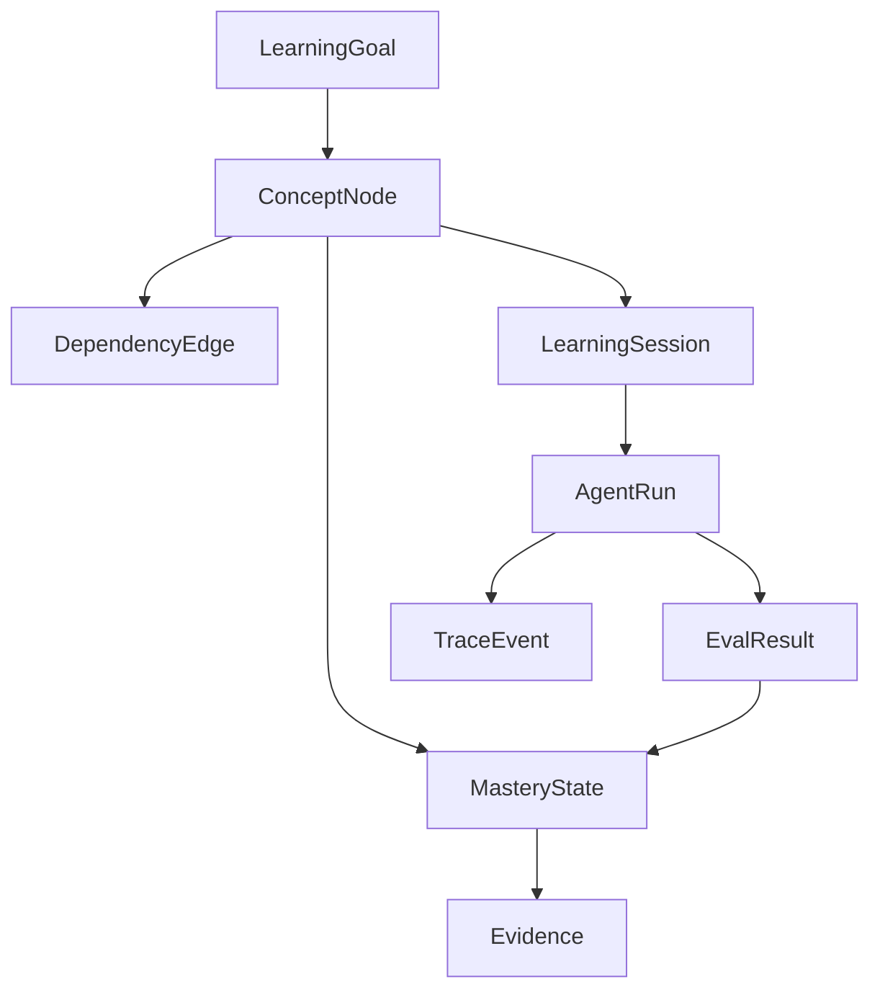
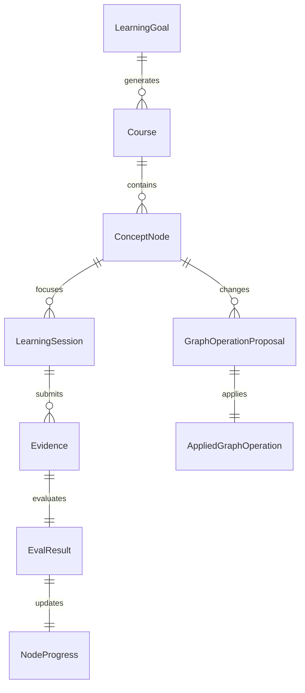

# 学习实践：R4 知识图谱驱动学习系统

## 一、路线调整

R4 不再只作为抽象的 Agent Runtime 学习主题，而升级为 **学习 + 产品实践** 双主线：

| 主线 | 目标 |
|------|------|
| 学习主线 | 掌握生产级 Agent Runtime、Trace、Eval、Checkpoint、Replay、Observability。 |
| 实践主线 | 设计并逐步实现一个知识图谱驱动的学习系统，用真实产品约束承载 R4 能力。 |

核心判断：只学 runtime/eval 仍然偏底层，必须放进一个真实系统里，才能形成作品集与职业壁垒。

## 二、产品愿景

构建一个 **知识图谱驱动的体系化学习系统**：

> 通过知识图谱表达知识结构、前置依赖、掌握程度和学习路径；通过智能体编排系统生成学习计划、解释知识、设计练习、评估效果和更新学习状态；通过 Flutter 实现多端学习体验。

### 目标

- 让学习不再只是线性笔记，而是围绕知识节点、依赖关系和掌握证据持续推进。
- 让智能体不只是聊天助手，而是围绕学习目标运行的编排系统。
- 让每次学习都有 trace、eval、复盘和图谱更新，形成可回放、可改进的学习闭环。
- 形成一个能展示 Agent 工程能力的产品级作品。

## 三、系统边界

### 本阶段纳入

| 模块 | 范围 |
|------|------|
| 知识图谱 | 知识节点、依赖边、学习目标、掌握状态、证据来源。 |
| Agent 编排 | 学习规划、概念讲解、练习生成、评估反馈、图谱更新。 |
| Runtime | 状态机、run/session、checkpoint、interrupt、trace event、terminal status。 |
| Eval | 学习任务验收、测验结果、练习完成度、节点掌握度评估。 |
| 前端 | Flutter 多端原型：图谱视图、学习路径、学习会话、练习与复盘。 |
| 后端接口 | 面向前端暴露 graph、session、agent run、eval result。 |

### 暂不纳入

| 暂不做 | 原因 |
|--------|------|
| 复杂社交/社区功能 | 与 R4 runtime/eval 主线无关。 |
| 商业化订阅/支付 | 会干扰学习系统核心闭环。 |
| 大规模推荐算法 | 先用知识图谱规则和 Agent 规划验证产品闭环。 |
| 全量云端化部署 | 先做本地/单用户 MVP，后续再进入部署与多租户。 |

## 四、核心用户故事

| 编号 | 用户故事 | 验收 |
|------|----------|------|
| US-1 | 作为学习者，我可以创建一个学习目标，并看到对应知识图谱。 | 系统能生成或加载节点、依赖边和阶段目标。 |
| US-2 | 作为学习者，我可以知道下一步最该学什么。 | Agent 根据目标、依赖关系和掌握状态推荐下一个节点。 |
| US-3 | 作为学习者，我可以围绕某个知识节点进行学习会话。 | 系统提供解释、例子、追问和练习。 |
| US-4 | 作为学习者，我完成练习后能获得评估。 | Eval 输出通过/未通过、原因、薄弱点和下一步建议。 |
| US-5 | 作为学习者，我的掌握状态会回写到知识图谱。 | 节点状态随证据更新，而不是手动随便勾选。 |
| US-6 | 作为系统开发者，我能回放一次学习会话。 | trace 记录 agent 决策、工具调用、评估结果和状态转移。 |
| US-7 | 作为系统开发者，我能对 Agent 改动做回归检查。 | golden learning tasks 可重复运行并生成回归报告。 |

## 五、知识图谱模型草案

| 实体 | 说明 |
|------|------|
| LearningGoal | 用户想达成的学习目标，例如“成为生产级 Agent 开发者”。 |
| ConceptNode | 知识节点，例如 Runtime State、Trace Event、Eval Harness。 |
| DependencyEdge | 前置依赖，例如 Eval Harness 依赖 Trace Event。 |
| LearningSession | 一次围绕节点或目标的学习过程。 |
| MasteryState | 节点掌握状态：unknown / learning / practiced / verified / retained。 |
| Evidence | 掌握证据：回答、练习、代码、测试、复盘。 |
| AgentRun | 一次智能体编排运行。 |
| TraceEvent | 运行过程中的状态转移、决策、工具调用、评估事件。 |
| EvalResult | 对学习效果或 Agent 行为的评估结果。 |

### 关键关系



## 六、智能体编排草案

| 角色 | 职责 | 输入 | 输出 |
|------|------|------|------|
| GraphCurator | 维护知识图谱结构，识别节点和依赖。 | 学习目标、资料、历史图谱 | 节点、依赖边、缺口 |
| LearningPlanner | 选择下一步学习路径。 | 图谱、掌握状态、用户目标 | 学习计划、下一节点 |
| TutorAgent | 讲解知识并答疑。 | 当前节点、用户问题、上下文 | 解释、类比、追问 |
| PracticeDesigner | 生成练习任务。 | 当前节点、目标能力 | 练习题、实践任务 |
| EvaluatorAgent | 评估学习效果。 | 用户回答、练习结果、验收标准 | 评分、原因、薄弱点 |
| ReflectionAgent | 更新图谱与学习记忆。 | EvalResult、TraceEvent、用户反馈 | MasteryState 更新、复盘摘要 |

### 编排主循环

```text
学习目标
  → 读取知识图谱
  → 判断当前掌握状态
  → 选择下一知识节点
  → 生成学习会话
  → 讲解 / 练习 / 评估
  → 写入 trace
  → 更新掌握状态
  → 生成下一步建议
```

## 七、R4 学习主题与实践映射

| R4 阶段 | 学习问题 | 在本系统中的实践 |
|---------|----------|------------------|
| R4.1 Runtime 状态契约 | 一次 Agent run 应该有哪些状态和事件？ | 定义 LearningSession、AgentRun、TraceEvent、TerminalStatus。 |
| R4.2 Checkpoint / Interrupt | 学习或工具调用中断后如何恢复？什么时候要人确认？ | 学习会话 checkpoint；图谱更新前 human review。 |
| R4.3 Trace 体系 | 如何记录决策、工具调用、评估与失败？ | 记录推荐下个节点的理由、练习生成、评估结果、状态变更。 |
| R4.4 Eval Harness | 如何判断 Agent 是否真的促进学习？ | golden learning tasks、节点掌握验收、练习评分。 |
| R4.5 Replay / Regression | Prompt/definition/runtime 改动后如何防退化？ | 回放同一学习目标，对比路径、评估结果和成本。 |
| R4.6 Production Signals | 上线后看哪些指标？ | 学习完成率、节点通过率、重试次数、学习时长、成本、失败率。 |
| R4.7 Flutter 多端原型 | 如何把 runtime 能力变成产品体验？ | 图谱页、学习路径页、会话页、练习页、复盘页。 |

## 八、MVP 切片

### MVP-0：需求与领域建模

- 明确目标用户：自学者 / 转行学习者 / 技术学习者。
- 明确核心闭环：目标 → 图谱 → 学习 → 练习 → 评估 → 图谱更新。
- 输出领域模型与核心页面草图。

### MVP-1：后端最小闭环

- 本地知识图谱存储。
- 创建学习目标。
- 查询下一知识节点。
- 记录一次 LearningSession。
- 保存 EvalResult 与 MasteryState。

### MVP-2：Agent Runtime 接入

- 引入 GraphCurator / LearningPlanner / Tutor / Evaluator。
- 用 runtime state machine 管理 agent run。
- 每一步写入 TraceEvent。
- 支持失败收口和 terminal status。

### MVP-3：Eval 与 Replay

- 建立 golden learning tasks。
- 对同一目标重复运行 eval。
- 对比不同 prompt / definition / runtime 改动。
- 输出 regression report。

### MVP-4：Flutter 多端原型

- 图谱视图。
- 学习路径视图。
- 学习会话视图。
- 练习与评估视图。
- 复盘与进度视图。

## 九、默认技术取舍草案

| 层 | 初始建议 | 原因 |
|----|----------|------|
| Agent Runtime | 先沿用当前 Python/LangGraph 学习产物 | 复用 R3 已有基础，避免一开始就重写平台。 |
| 图谱存储 | 先用本地 JSON/SQLite 表达节点和边 | 快速验证闭环，后续再考虑 Neo4j/图数据库。 |
| 后端 API | Python 服务封装 graph/session/agent/eval 接口 | 与当前 agent runtime 语言一致。 |
| 前端 | Flutter | 满足多端目标，先做核心页面原型。 |
| Eval | 离线 golden tasks + trace replay | 贴合 R4 生产化学习目标。 |

以上是初始取舍，后续可在需求设计阶段重新决策。

## 十、待完善需求设计

| 问题 | 当前状态 | 后续要产出 |
|------|----------|------------|
| 第一版目标用户是谁？ | 待细化 | persona、使用场景、核心痛点。 |
| 学习图谱如何生成？ | 待细化 | 手动创建 / 资料抽取 / Agent 生成 / 混合模式。 |
| 节点掌握度如何判定？ | 待细化 | mastery rubric、证据类型、评分规则。 |
| Agent 编排边界多宽？ | 待细化 | 哪些由代码状态机决定，哪些由 LLM 决策。 |
| Flutter 首屏是什么？ | 待细化 | 信息架构、页面列表、首版交互草图。 |
| 数据是否本地优先？ | 待细化 | 单机、本地账号、云同步、多设备同步策略。 |
| 是否支持导入已有笔记？ | 待细化 | Obsidian/Markdown/网页资料导入范围。 |

## 十一、R4 验收标准

- 不是只完成 R4 概念学习，而是形成知识图谱学习系统的可执行产品计划。
- 至少完成一个后端最小闭环：目标、节点、学习会话、评估、图谱状态更新。
- 至少完成一条 agent runtime trace，能解释每个状态为什么发生。
- 至少完成一组 golden learning tasks，用于验证学习效果和 Agent 行为回归。
- 至少完成 Flutter 多端原型的信息架构和一个可运行页面。
- 能把该项目讲成“生产级 Agent 工程作品”，而不是普通聊天 demo。

## 十二、下一步

优先进入 **R4.1：Runtime 状态契约 + 学习系统领域模型**。

第一步不写 Flutter，也不急着接模型，而是先把下面两个东西定清楚：

1. 学习系统的核心领域对象：LearningGoal、ConceptNode、LearningSession、Evidence、EvalResult。
2. Agent Runtime 的状态契约：AgentRun、TraceEvent、Checkpoint、TerminalStatus。

## 十三、R4.1 启动：领域模型与 Runtime 状态契约

### R4.1 产品原则补充

本系统不是“AI 自动灌输知识”，而是 **用户参与驱动的个性化学习系统**。知识图谱、Agent Runtime 和 Flutter 前端都必须围绕两个关键原则设计：

| 原则 | 含义 | 对系统的影响 |
|------|------|--------------|
| 交互性 | 用户必须能直观参与学习路径、节点展开、追问、练习和复盘，而不是被动接收 Agent 输出。 | 前端不能只是聊天框；需要图谱交互、节点操作、学习方式切换、反馈入口。 |
| 个性化 | 每个人的知识水平、理解障碍和偏好不同，系统必须能根据用户反馈调整图谱深度、解释方式、练习方式和学习节奏。 | 领域模型要记录用户画像、学习偏好、困难点、解释策略和图谱扩展请求。 |

这两个原则是一等需求，不是后续 UI 美化。

### 交互性需求初版

| 场景 | 用户可以做什么 | 系统响应 |
|------|----------------|----------|
| 图谱浏览 | 点击节点查看含义、依赖、掌握状态和证据。 | 展开节点详情和下一步建议。 |
| 路径调整 | 用户觉得当前节点太难、太浅或不相关。 | 重新规划路径，记录调整原因。 |
| 深入追问 | 用户对某个知识点一直不明白。 | 展开子节点、换解释方式或生成更小练习。 |
| 学习方式切换 | 用户不喜欢当前讲解方式。 | 切换为类比、案例、代码、问答、练习驱动等模式。 |
| 反馈评估 | 用户认为评估不准或解释不清。 | 触发二次评估或 human review 记录。 |
| 图谱编辑 | 用户要求补充、合并、拆分知识节点。 | 生成 graph_update_proposed，必要时等待用户确认。 |

### 个性化对象增量

| 对象 | 核心字段 | 说明 |
|------|----------|------|
| LearnerProfile | user_id、background、target_role、available_time、preferred_depth | 用户背景与学习目标画像。 |
| LearningPreference | user_id、explanation_style、practice_style、pace、interaction_mode | 用户偏好的学习方式。 |
| ConfusionPoint | id、user_id、node_id、description、attempt_count、resolved | 用户反复卡住的具体障碍点。 |
| AdaptationRule | id、trigger、strategy、priority | 个性化调整规则，例如“连续两次未通过则拆分节点”。 |
| GraphExpansionRequest | id、node_id、reason、requested_by、status | 用户或 Agent 触发的知识图谱深化/扩展请求。 |

### 个性化策略初版

| 触发 | 策略 |
|------|------|
| 用户连续不理解同一节点 | 把 ConceptNode 拆成更小子节点，降低粒度。 |
| 用户觉得内容太浅 | 增加 advanced 子节点或实践任务。 |
| 用户更喜欢案例 | TutorAgent 优先使用案例解释，再给抽象定义。 |
| 用户更喜欢代码 | PracticeDesigner 优先生成代码/伪代码练习。 |
| 用户不喜欢问答式学习 | 切换为项目任务驱动或图谱路径驱动。 |
| Eval 多次失败 | 记录 ConfusionPoint，触发路径回退或前置节点补课。 |

### R4.1 目标

R4.1 的任务不是先写 Flutter 页面，也不是马上接模型，而是先把学习系统的 **业务状态**、**用户交互状态** 和 Agent 编排的 **运行状态** 分开定义清楚。

| 层 | 关注点 | 产物 |
|----|--------|------|
| 学习领域层 | 用户要学什么、知识如何组织、掌握状态如何变化。 | LearningGoal、ConceptNode、MasteryState、Evidence、LearningSession。 |
| 用户交互层 | 用户如何参与路径调整、追问、反馈、图谱扩展和学习方式切换。 | LearnerProfile、LearningPreference、ConfusionPoint、GraphExpansionRequest。 |
| Agent Runtime 层 | 一次智能体运行如何开始、推进、中断、失败、完成、可回放。 | AgentRun、RuntimeState、TraceEvent、Checkpoint、TerminalStatus。 |
| Eval 层 | 如何判断一次学习是否有效，如何把证据回写图谱。 | EvalRubric、EvalResult、MasteryUpdate。 |

### 领域对象初版

| 对象 | 核心字段 | 说明 |
|------|----------|------|
| LearningGoal | id、title、description、target_level、created_at、status | 用户的长期学习目标，例如“掌握生产级 Agent Runtime”。 |
| ConceptNode | id、goal_id、title、summary、level、status、tags | 知识图谱中的节点，既可以是概念，也可以是工程能力点。 |
| DependencyEdge | id、source_node_id、target_node_id、relation、reason | 表达前置依赖、组成关系、相似关系或进阶关系。 |
| MasteryState | node_id、state、score、confidence、updated_at | 节点掌握状态，不等于用户手动勾选。 |
| Evidence | id、node_id、session_id、type、content_ref、quality、created_at | 掌握证据：回答、练习、代码、测试、复盘。 |
| LearningSession | id、goal_id、focus_node_id、status、started_at、ended_at | 一次围绕目标或节点展开的学习过程。 |
| EvalRubric | id、node_id、criteria、pass_threshold | 某个节点的验收标准。 |
| EvalResult | id、session_id、node_id、passed、score、reason、weaknesses | 对学习效果或练习结果的评估。 |
| MasteryUpdate | id、eval_result_id、node_id、from_state、to_state、reason | Eval 之后对图谱状态的变更记录。 |

### MasteryState 状态机

```text
unknown
  → learning
  → practiced
  → verified
  → retained
```

| 状态 | 含义 | 进入条件 |
|------|------|----------|
| unknown | 节点存在，但尚未开始学习。 | 图谱生成或导入后默认状态。 |
| learning | 正在学习，还没有完成练习。 | 用户开启该节点学习会话。 |
| practiced | 已完成练习，但尚未稳定通过验证。 | Evidence 存在，但 Eval 未达到 verified。 |
| verified | 已通过当前验收。 | EvalResult 达到 pass_threshold。 |
| retained | 间隔一段时间后仍能通过回忆/应用验证。 | 后续复测通过。 |

### Agent Runtime 对象初版

| 对象 | 核心字段 | 说明 |
|------|----------|------|
| AgentRun | id、session_id、agent_definition_id、status、input、output、started_at、ended_at | 一次 Agent 编排运行，不等同于一次学习会话。 |
| RuntimeState | run_id、phase、step_index、current_node_id、scratchpad、last_error | Agent 当前运行状态，用于 checkpoint 和 resume。 |
| TraceEvent | id、run_id、step_index、event_type、actor、payload、created_at | 统一记录状态转移、模型决策、工具调用、安全裁决、评估结果。 |
| Checkpoint | id、run_id、step_index、runtime_state_ref、reason、created_at | 可恢复点。 |
| TerminalStatus | run_id、status、reason、recoverable、next_action | AgentRun 的最终状态与后续动作。 |

### AgentRun 状态机

```text
created
  → planning
  → tutoring
  → practicing
  → evaluating
  → updating_graph
  → completed
```

异常路径：

```text
任何状态
  → interrupted
  → resumed
  → 原状态继续

任何状态
  → failed
  → completed_with_partial_result 或 abandoned
```

| 状态 | Runtime 责任 | 不能交给 LLM 的部分 |
|------|--------------|----------------------|
| created | 建立 run_id、绑定 session、读取输入。 | run_id 生成、状态初始化。 |
| planning | 选择学习节点和路径。 | 状态转移是否合法、是否已达到终止条件。 |
| tutoring | 围绕节点解释和答疑。 | 会话边界、trace 写入、上下文裁剪策略。 |
| practicing | 生成练习或实践任务。 | 练习提交状态、证据落库。 |
| evaluating | 评估回答或练习结果。 | pass_threshold、rubric 版本、结果持久化。 |
| updating_graph | 生成 MasteryUpdate。 | 是否允许自动更新图谱，必要时 human review。 |
| completed | 输出下一步建议。 | terminal status、最终 trace 收口。 |

### TraceEvent 类型初版

| event_type | 何时产生 | payload 至少包含 |
|------------|----------|------------------|
| run_started | AgentRun 创建后 | goal_id、session_id、input_summary |
| state_transition | Runtime phase 改变时 | from_phase、to_phase、reason |
| node_selected | LearningPlanner 选择知识节点时 | node_id、alternatives、selection_reason |
| tutor_response | TutorAgent 输出讲解时 | node_id、response_ref、context_used |
| practice_created | PracticeDesigner 生成练习时 | node_id、practice_ref、rubric_id |
| evidence_submitted | 用户提交回答/练习时 | evidence_id、type、content_ref |
| eval_completed | EvaluatorAgent 完成评估时 | eval_result_id、passed、score、weaknesses |
| graph_update_proposed | ReflectionAgent 提出图谱更新时 | mastery_update_id、from_state、to_state、reason |
| graph_expansion_requested | 用户或 Agent 要求深化/拆分知识图谱时 | request_id、node_id、reason、requested_depth |
| learning_preference_changed | 用户切换学习方式时 | preference_id、from_mode、to_mode、reason |
| confusion_detected | 用户反复卡在同一知识点时 | confusion_point_id、node_id、attempt_count、signal |
| graph_update_applied | 图谱更新落地时 | mastery_update_id、approved_by |
| checkpoint_saved | Runtime 保存 checkpoint 时 | checkpoint_id、reason |
| interrupt_requested | 需要用户确认时 | reason、pending_action |
| run_failed | 运行失败时 | error_type、recoverable、failed_phase |
| run_completed | 运行完成时 | terminal_status、next_action |

### R4.1 第一版闭环

```text
LearningGoal
  → ConceptNode + DependencyEdge
  → LearningSession
  → AgentRun
  → TraceEvent
  → Evidence
  → EvalResult
  → MasteryUpdate
  → MasteryState
```

这个闭环的关键不是“能聊天”，而是每一次学习推进都必须留下：

- 学了哪个节点；
- 为什么学这个节点；
- 产生了什么练习或回答；
- 如何评估；
- 图谱状态为什么变化；
- 失败时能否回放和恢复。

### 本阶段暂不做

| 暂不做 | 原因 |
|--------|------|
| Flutter 页面实现 | 领域模型未稳定前，UI 容易变成假原型。 |
| 图数据库选型 | 先验证对象和状态契约，存储可以后置。 |
| 多用户/账号体系 | R4.1 只验证单用户学习闭环。 |
| 自动导入任意资料 | 会扩大范围，先从手工/种子图谱开始。 |
| 复杂推荐算法 | 先用依赖边 + 掌握状态 + Agent reason 验证。 |

### R4.1 验收标准

- 能画出学习领域对象之间的关系。
- 能说清交互性为什么不是前端细节，而是学习系统能否让用户充分参与的核心机制。
- 能说清个性化为什么会影响知识图谱深度、解释方式、练习方式和学习节奏。
- 能说清 LearningSession 和 AgentRun 为什么不是同一个东西。
- 能说清 MasteryState 为什么必须由 Evidence/Eval 驱动，而不是手动勾选。
- 能列出一次学习会话至少应该写入哪些 TraceEvent。
- 能基于这些对象进入下一步代码建模或接口设计。

### R4.1 下一步任务

1. 把上述对象收敛成第一版数据 Schema。
2. 明确 Flutter 原型必须支持的交互入口：图谱点击、路径调整、追问、学习方式切换、反馈评估。
3. 定义个性化最小闭环：LearnerProfile、LearningPreference、ConfusionPoint 如何影响下一节点选择与解释方式。
4. 选择 MVP-1 的最小存储方案：JSON 文件或 SQLite。
5. 设计三个最小 API：创建目标、查询下一节点、提交 evidence 并触发 eval。
6. 决定哪些图谱更新需要 human review。

## 十四、R4.1 用户输入后的产品需求草案

### 目标用户与入口

| 项 | 决策 |
|----|------|
| 目标用户 | 面向所有有体系化学习需求的用户，不限制在技术学习者。 |
| 第一入口 | 用户输入学习目标，系统生成或加载对应课程。 |
| 课程组织 | 课程列表页承载“输入课程 + 课程列表”。 |
| 核心学习页 | 知识图谱页承载“知识图谱 + 知识点学习界面 + 输入框”。 |

说明：目标用户虽然是所有用户，但第一版能力必须先围绕“输入任意学习目标 → 生成可交互知识图谱 → 围绕节点学习”这个最小闭环落地。

### 页面结构

| 页面 | 核心组件 | 说明 |
|------|----------|------|
| 课程列表页 | 学习目标输入框、课程列表、最近学习入口 | 用户输入学习目标后生成课程；已有课程可继续学习。 |
| 知识图谱页 | 知识图谱、节点状态、底部学习面板、输入框 | 主学习页面；点击图谱节点后，底部展开该节点关联学习界面。 |
| 知识点菜单 | 扩展下级节点、总结当前节点、拆分/合并节点、评估/复盘入口 | 评估与复盘不单独做一级页面，先收敛在节点菜单中。 |

### 知识图谱交互

| 交互 | 规则 |
|------|------|
| 点击节点 | 底部展开学习界面，当前学习内容与被点击知识点绑定。 |
| 节点状态展示 | 知识图谱节点显示学习状态和进度圆环。 |
| 扩展下级节点 | 用户在上一级节点菜单中点击“扩展下一级节点”，由智能体根据相关知识拆分子节点。 |
| 对话操作节点 | 用户可以通过对话要求拆分、合并、扩展、深入某个节点。 |
| 智能拆分/合并 | 即使用户主动要求拆分或合并，也必须由智能体结合相关知识点进行合理拆分/合并，而不是机械执行。 |
| 图谱动态深化 | 用户觉得某个点不够细时，可通过菜单或对话触发图谱扩展。 |

### 学习面板交互

| 组件 | 要求 |
|------|------|
| 流式学习内容 | 学习内容必须支持流式输出，避免长等待。 |
| 底部输入框 | 用户可围绕当前节点持续提问、要求换方式、要求扩展图谱。 |
| 推荐提示词 | 输入框上方推荐与当前知识点相关的 prompt，降低用户学习成本。 |
| 多学习方式 | 支持文本、代码、表格、脑图、多媒体等表达方式；实际实现可分阶段。 |
| 当前节点绑定 | 学习面板所有对话、总结、评估和图谱操作都默认绑定当前点击的知识点。 |

### 个性化原则调整

个性化不是常驻画像驱动，而是 **用户请求驱动的即时适配**。

| 用户请求 | 系统行为 |
|----------|----------|
| “这个点不够细” | 扩展当前节点的下级知识图谱。 |
| “我要更深入学习” | 增加更深层节点或进阶内容。 |
| “帮我扩展一下知识图谱” | 生成 GraphExpansionRequest，由智能体拆分节点。 |
| “这个解释我不喜欢” | 切换学习方式，不一定改变图谱结构。 |
| “把这两个点合并” | 智能体判断是否可合并，并给出合并后的节点结构。 |
| “把这个点拆细” | 智能体根据知识结构拆成多个子节点。 |

第一版不做复杂常驻个性化画像；先记录用户在节点上的即时请求、图谱操作和学习方式切换。

### 学习进度与掌握确认

| 机制 | 规则 |
|------|------|
| 用户确认 | 用户可以自己确认某个知识点“已学会”。 |
| 节点总结 | 节点菜单提供“总结当前知识点”能力，汇总该节点所有会话。 |
| 掌握程度整理 | 系统根据会话、总结、用户确认和可能的评估结果整理掌握程度，并在学习界面列出。 |
| 进度圆环 | 空圆环表示未开始，圆环走完表示完成。 |
| 递归进度 | 父节点进度由子节点递归计算；叶子节点变化时，所有相关父节点进度同步变化。 |
| 评估/复盘入口 | 评估、复盘、总结都先放在知识点菜单里，不单独做复杂流程。 |

### 产品闭环更新

```text
用户输入学习目标
  → 系统生成课程与知识图谱
  → 用户点击知识节点
  → 底部展开节点学习面板
  → 系统流式输出学习内容
  → 用户通过输入框或推荐 prompt 深入学习
  → 用户通过菜单/对话扩展、拆分、合并知识图谱
  → 用户确认学会或触发节点总结
  → 叶子节点进度更新
  → 父节点进度递归更新
```

### R4.1 需求收敛后的新增对象

| 对象 | 说明 |
|------|------|
| Course | 由用户学习目标生成或维护的课程容器。 |
| NodeProgress | 节点进度，支持叶子节点更新和父节点递归汇总。 |
| NodeMenuAction | 节点菜单操作：扩展、总结、拆分、合并、评估、复盘。 |
| PromptSuggestion | 当前知识点相关的推荐提示词。 |
| LearningContentBlock | 流式学习内容块，可承载文本、代码、表格、脑图、多媒体引用。 |
| GraphOperationRequest | 用户通过菜单或对话触发的图谱操作请求。 |

### 节点操作硬规则

节点操作不是简单 CRUD。用户可以表达意图，但图谱结构变更必须通过智能体智能生成或校验后执行。

| 规则 | 说明 |
|------|------|
| 用户表达意图 | 用户可以说“拆细这个点”“合并这两个点”“扩展下一级”“总结当前节点”。 |
| 智能体生成方案 | 智能体根据当前节点、上下游依赖、会话内容和学习目标生成操作方案。 |
| 操作必须结构化 | 拆分、合并、扩展、总结都要产出结构化结果，而不是只返回自然语言。 |
| 图谱变更可解释 | 每次变更都要说明为什么这样拆、为什么这样合、为什么新增这些子节点。 |
| 用户可确认 | 影响图谱结构的操作默认先展示方案，用户确认后落地。 |
| Trace 必须记录 | GraphOperationRequest、智能体方案、用户确认和落地结果都要进入 TraceEvent。 |

### 图谱操作类型

| 操作 | 用户输入 | 智能体输出 |
|------|----------|------------|
| 扩展节点 | “这个点不够细，展开下一级” | 子节点列表、依赖关系、学习顺序、拆分理由。 |
| 拆分节点 | “把这个节点拆细” | 新节点集合、原节点保留/替换策略、迁移原会话与进度的方案。 |
| 合并节点 | “这两个点感觉重复，合并一下” | 是否建议合并、合并后节点定义、被合并节点的证据与进度处理方式。 |
| 总结节点 | “总结这个知识点” | 当前节点摘要、已学内容、未掌握点、建议下一步。 |
| 评估节点 | “评估我掌握了吗” | 掌握判断、证据引用、薄弱点、是否更新进度。 |
| 复盘节点 | “复盘这个节点的学习过程” | 会话时间线、关键问题、卡点、图谱调整记录。 |

### R4.1 下一步更新

1. 先画出两个页面的信息架构：课程列表页、知识图谱页。
2. 定义节点菜单的第一版操作集合。
3. 定义 `NodeProgress` 的递归计算规则。
4. 定义 `GraphOperationRequest` 如何交给智能体拆分/合并/扩展。
5. 定义学习面板的流式内容块和推荐 prompt 结构。

## 十五、R4.1 节点操作智能生成设计

### 核心结论

节点操作分成两层：

| 层 | 责任 |
|----|------|
| 用户意图层 | 用户通过菜单或对话表达想做什么，例如扩展、拆分、合并、总结、评估、复盘。 |
| 智能体方案层 | 智能体理解当前知识结构后，生成结构化操作方案，并解释原因。 |

图谱结构不能被 UI 直接机械修改。UI 只能创建 `GraphOperationRequest`，真正的图谱变更必须来自智能体生成的 `GraphOperationProposal`。

### GraphOperationRequest

`GraphOperationRequest` 表达用户想对某个节点做什么。

| 字段 | 含义 |
|------|------|
| id | 操作请求 ID。 |
| course_id | 所属课程。 |
| node_id | 当前被操作的知识点。 |
| operation_type | expand / split / merge / summarize / evaluate / review。 |
| user_intent | 用户原始意图，例如“这个点不够细，帮我展开”。 |
| source | menu / chat_input / prompt_suggestion。 |
| target_node_ids | 合并等多节点操作时涉及的节点。 |
| context_refs | 当前节点会话、已有总结、上下游节点、学习目标。 |
| status | created / planning / proposed / confirmed / applied / rejected / failed。 |

### GraphOperationProposal

`GraphOperationProposal` 是智能体生成的结构化方案。

| 字段 | 含义 |
|------|------|
| request_id | 对应的 GraphOperationRequest。 |
| operation_type | 操作类型。 |
| summary | 方案摘要。 |
| rationale | 为什么建议这样操作。 |
| affected_nodes | 会受影响的节点。 |
| proposed_nodes | 新增或变更后的节点。 |
| proposed_edges | 新增或变更后的依赖关系。 |
| progress_migration | 原节点进度、证据和会话如何迁移。 |
| risks | 可能的问题，例如拆得太细、合并后语义过宽。 |
| requires_confirmation | 是否需要用户确认。 |

### 操作生命周期

```text
用户点击节点菜单或输入对话
  → 创建 GraphOperationRequest
  → Agent 读取课程目标、当前节点、上下游依赖、会话历史、进度证据
  → 生成 GraphOperationProposal
  → UI 展示结构化方案和理由
  → 用户确认 / 修改 / 拒绝
  → Runtime 应用图谱变更
  → 写入 TraceEvent
  → 递归更新 NodeProgress
```

### 节点菜单第一版

| 菜单项 | 创建的请求 | 智能体要输出 |
|--------|------------|--------------|
| 扩展下一级节点 | expand | 子节点、依赖边、推荐学习顺序、拆分理由。 |
| 拆分当前节点 | split | 拆分后节点、原节点处理方式、证据迁移方式。 |
| 合并相关节点 | merge | 是否适合合并、合并后节点定义、进度和证据迁移方式。 |
| 总结当前节点 | summarize | 节点摘要、已学内容、卡点、未完成事项。 |
| 评估掌握程度 | evaluate | 掌握判断、证据引用、进度建议。 |
| 复盘学习过程 | review | 会话时间线、关键问题、学习方式建议。 |

### NodeProgress 递归规则

节点进度分为两类：

| 类型 | 计算方式 |
|------|----------|
| 叶子节点 | 由用户确认、评估结果、总结结果共同决定。 |
| 非叶子节点 | 由所有子节点进度递归汇总。 |

第一版规则：

```text
leaf_progress = max(user_confirmed_progress, eval_progress, summary_progress)
parent_progress = average(child_progress)
```

约束：

- 空圆环表示 `0%`，未开始。
- 圆环走完表示 `100%`，已完成。
- 父节点不能被直接手动标满，除非所有子节点都完成，或智能体建议该父节点无需继续拆分。
- 子节点新增后，父节点进度必须重新计算。
- 节点合并后，进度不能简单相加，必须由智能体根据 evidence 和语义覆盖度重新给出迁移建议。
- 节点拆分后，原节点进度需要迁移到子节点，迁移方案由智能体生成，用户确认后生效。

### TraceEvent 增量

| event_type | 何时产生 | payload 至少包含 |
|------------|----------|------------------|
| graph_operation_requested | 用户创建节点操作请求时 | request_id、node_id、operation_type、source、user_intent。 |
| graph_operation_proposed | 智能体生成操作方案时 | proposal_id、request_id、affected_nodes、rationale。 |
| graph_operation_confirmed | 用户确认方案时 | proposal_id、confirmed_by、changes_requested。 |
| graph_operation_applied | 图谱变更落地时 | proposal_id、created_nodes、updated_nodes、updated_edges。 |
| node_progress_recomputed | 节点进度递归更新时 | node_id、old_progress、new_progress、reason。 |
| graph_operation_rejected | 用户拒绝方案时 | proposal_id、reason。 |

### R4.1 设计收口判断

这一版之后，节点操作的产品逻辑变成：

```text
用户不是在编辑图谱；用户是在表达学习意图。
智能体不是替用户随便改图；智能体是在生成可解释、可确认、可追踪的知识结构变更方案。
```

下一步进入两个方向：

1. 画 Flutter 两个核心页面的信息架构。
2. 把 `GraphOperationRequest / GraphOperationProposal / NodeProgress` 收敛成第一版数据 Schema。

## 十六、R4 横向工程主线：Agent 应用开发最佳实践

### 范围修正

R4 不能只变成一个学习系统产品需求文档。它同时承担两个目标：

| 目标 | 含义 |
|------|------|
| 产品目标 | 做一个知识图谱驱动、交互式、个性化的学习系统。 |
| 学习目标 | 通过这个系统掌握智能体应用开发最佳实践：编排、Skill、MCP/Tool、Trace、Eval、安全、前后端协作。 |

因此后续每个产品能力都要映射到一个 Agent 工程能力点，避免只做 UI 或只做概念。

### Agent 编排主线

| 主题 | 本系统里的落点 | 学习目标 |
|------|----------------|----------|
| Orchestrator | 接收用户目标，决定调用图谱、学习规划、讲解、练习、评估、节点操作哪个 Agent。 | 学会区分代码状态机和 LLM 决策边界。 |
| Multi-Agent Roles | GraphCurator、LearningPlanner、TutorAgent、PracticeDesigner、EvaluatorAgent、ReflectionAgent。 | 学会角色拆分、职责边界、handoff 和 reviewer gate。 |
| Runtime State | AgentRun、RuntimeState、TraceEvent、Checkpoint、TerminalStatus。 | 学会生产级 agent run 不是简单 while loop。 |
| Human-in-the-loop | 图谱结构变更、节点合并/拆分、进度迁移需要用户确认。 | 学会把用户确认设计成 runtime 的一等状态。 |
| Failure Handling | 图谱生成失败、评估不确定、工具调用失败、流式输出中断。 | 学会失败收口、可恢复状态和 next_action。 |
| Replay / Regression | 同一学习目标、同一节点操作可回放对比。 | 学会用 trace/eval 验证 agent 改动是否退化。 |

### LangGraph 底层实现取舍

R4 底层可以使用 LangGraph 作为 Agent Runtime 实现，不从零自研图运行时。

| LangGraph 能力 | 在本系统中的用途 |
|----------------|------------------|
| StateGraph | 表达课程生成、节点学习、图谱操作、评估、进度更新的状态流。 |
| Node | 封装 GraphCurator、LearningPlanner、TutorAgent、EvaluatorAgent 等角色节点。 |
| Conditional Edge | 根据用户输入、评估结果、是否需要确认、是否失败来路由。 |
| Checkpoint | 支持学习会话中断恢复、节点操作确认前后恢复。 |
| Interrupt | 图谱结构变更、进度迁移、合并/拆分方案需要用户确认时暂停。 |
| State | 承载 AgentRun、RuntimeState、当前节点、GraphOperationRequest、TraceEvent。 |

实现边界：

- LangGraph 负责 runtime 控制流。
- Agent Definition / Skill 负责角色与能力声明。
- MCP/Tool 负责外部动作边界。
- 知识图谱、知识库、记忆系统负责业务数据。
- Flutter 只表达交互，不直接修改 runtime 状态或图谱结构。

第一版目标不是“学会所有 LangGraph API”，而是掌握生产级 Agent 应用里为什么需要图状态、条件边、checkpoint、interrupt 和 trace。

### Skill 设计主线

这里的 Skill 不是 UI 功能，而是可复用的 Agent 能力包：一组指令、输入约束、输出格式、工具权限和验收标准。

| Skill | 触发 | 输入 | 输出 |
|-------|------|------|------|
| goal-to-course | 用户输入学习目标 | 学习目标、用户补充说明 | Course 草案、初始知识图谱范围。 |
| graph-expand | 用户要求扩展节点 | 当前节点、上下游依赖、会话摘要 | 子节点、依赖边、学习顺序、拆分理由。 |
| graph-split | 用户要求拆分节点 | 当前节点、证据、会话历史 | 拆分方案、证据迁移方案、风险。 |
| graph-merge | 用户要求合并节点 | 多个节点、边、证据 | 合并判断、合并后节点、进度迁移。 |
| node-tutor | 用户点击节点学习 | 当前节点、学习偏好、上下文 | 流式学习内容、推荐 prompt。 |
| practice-generate | 用户请求练习 | 当前节点、掌握状态、学习方式 | 练习任务、验收标准。 |
| mastery-evaluate | 用户请求评估 | Evidence、Rubric、会话摘要 | EvalResult、掌握判断、薄弱点。 |
| node-summarize | 用户总结节点 | 当前节点所有会话与证据 | 节点总结、掌握程度、下一步建议。 |

Skill 设计要验证：

- 每个 Skill 是否有明确输入/输出 schema。
- Skill 是否只声明能力，不拥有 runtime 控制流。
- Skill 是否有工具 allowlist。
- Skill 输出是否可被 Trace/Eval 记录。
- Skill 是否能作为作品集里的“可复用智能体能力模块”展示。

### MCP / Tool 设计主线

Tool 是外部动作接口，MCP 是把外部能力标准化接入 Agent Runtime 的方式。第一版不追求接很多工具，但要把边界设计完整。

| Tool / MCP 能力 | 用途 | 权限边界 |
|-----------------|------|----------|
| graph.read | 读取课程图谱、节点、依赖、进度。 | 只读。 |
| graph.propose_update | 生成待确认图谱操作方案。 | 只创建 proposal，不直接落地。 |
| graph.apply_update | 用户确认后应用图谱变更。 | 需要 human confirmation。 |
| session.read | 读取当前节点会话历史。 | 只读当前课程/节点范围。 |
| session.write | 写入学习消息、学习内容块、用户反馈。 | 只能写当前 session。 |
| progress.recompute | 根据叶子节点变化递归更新父节点进度。 | 只能由 runtime 或确认后的图谱变更触发。 |
| eval.run | 对 evidence 或节点掌握度做评估。 | 输出 EvalResult，不直接覆盖用户确认。 |
| content.render | 生成文本、代码、表格、脑图、多媒体引用等内容块。 | 不直接访问外部网络或文件，除非显式授权。 |

MCP/Tool 设计要验证：

- 工具是动作边界，不是 Agent 角色。
- Tool schema 必须稳定、可测试、可 mock。
- 图谱写操作必须有 proposal → confirm → apply 三段式。
- 工具调用必须进入 TraceEvent。
- destructive 或结构变更类操作必须 human-in-the-loop。

### 知识库设计主线

知识图谱不是完整知识库本身。知识图谱负责结构和路径，知识库负责承载可引用、可检索、可更新的学习资料。

| 模块 | 责任 | 典型内容 |
|------|------|----------|
| KnowledgeBase | 课程资料与知识内容的长期存储。 | 文档、网页摘录、代码片段、图片/视频引用、用户上传资料。 |
| KnowledgeChunk | 被检索和引用的最小内容块。 | 概念解释、例子、代码段、表格、脑图片段。 |
| SourceReference | 内容来源与可信度。 | 来源 URL、文件、用户输入、Agent 生成内容、版本。 |
| RetrievalIndex | 面向 Agent 的检索索引。 | embedding、关键词、节点绑定、标签。 |
| NodeKnowledgeBinding | ConceptNode 与知识库内容的绑定关系。 | 某节点关联哪些 chunk、哪些来源、哪些内容过期。 |

知识库要解决：

- 当前节点学习内容从哪里来。
- Agent 讲解时引用了哪些资料。
- 用户上传或补充的资料如何进入课程。
- 知识图谱节点和原始知识材料如何绑定。
- 内容更新后哪些节点需要重新总结或评估。

第一版原则：

```text
知识图谱管结构，知识库管内容，Trace 管使用证据。
```

### 记忆系统设计主线

记忆系统不是知识库。知识库偏“知识内容”，记忆系统偏“用户学习过程、偏好、卡点和历史证据”。

| 记忆类型 | 记录什么 | 用途 |
|----------|----------|------|
| Profile Memory | 用户背景、目标、基础水平。 | 生成课程和调整默认难度。 |
| Preference Memory | 用户偏好的学习方式。 | 决定优先用文本、代码、案例、表格、脑图等方式。 |
| Session Memory | 当前学习会话上下文。 | 支持连续追问和流式学习面板。 |
| Mastery Memory | 节点掌握状态和证据。 | 驱动 NodeProgress 与下一步学习建议。 |
| Confusion Memory | 用户反复不理解的点。 | 触发节点拆分、换解释方式、补前置知识。 |
| Operation Memory | 用户对图谱做过的操作及原因。 | 支持回放、复盘、避免重复错误拆分。 |

记忆系统要解决：

- 为什么同一个知识点，对不同用户要讲得不一样。
- 用户卡住时如何知道应该拆节点、换方式还是补前置知识。
- 用户下次回来时如何接着学。
- 节点进度为什么这样变化。
- Agent 如何避免重复问已知信息。

第一版原则：

```text
知识库回答“学什么内容”。
记忆系统回答“这个用户怎么学、学到哪、卡在哪里”。
知识图谱回答“内容之间是什么结构、下一步该去哪”。
```

### 知识库 / 记忆 / 图谱边界

| 系统 | 主要问题 | 不负责什么 |
|------|----------|------------|
| 知识图谱 | 知识点之间如何组织、依赖和递进。 | 不存完整学习资料，不直接代表用户掌握证据。 |
| 知识库 | 学习内容和资料从哪里来、如何引用。 | 不决定用户是否学会。 |
| 记忆系统 | 用户偏好、卡点、会话、掌握证据。 | 不替代知识库作为事实来源。 |
| Agent Runtime | 如何调用图谱、知识库、记忆和工具完成一次学习。 | 不把业务事实硬编码进流程。 |

### 知识库与记忆的 Tool / MCP 边界

| Tool / MCP 能力 | 用途 | 权限边界 |
|-----------------|------|----------|
| kb.search | 检索当前节点相关资料。 | 只读。 |
| kb.attach_source | 把资料绑定到课程或节点。 | 需要用户上传或确认来源。 |
| kb.create_chunk | 从资料中生成可引用知识块。 | 需要记录 SourceReference。 |
| memory.read_profile | 读取用户背景与偏好。 | 只读当前用户。 |
| memory.write_preference | 用户明确表达偏好时写入。 | 不自动猜测敏感偏好。 |
| memory.write_confusion | 记录用户卡点。 | 仅与学习上下文相关。 |
| memory.write_mastery | 写入掌握证据和进度变化。 | 需要 EvalResult、用户确认或节点总结支撑。 |
| memory.summarize_session | 汇总当前节点会话。 | 只处理当前课程/节点范围。 |

### 学习目标保护规则

R4 的学习系统项目必须持续服务“学习智能体应用开发最佳实践”这个目标。

| 规则 | 说明 |
|------|------|
| 每个产品需求要映射一个工程学习点 | 例如节点菜单映射 GraphOperationRequest、Skill、Tool、安全确认。 |
| 每个 Agent 能力要有可解释边界 | 角色、Skill、Tool、Runtime 不能混成一团。 |
| 每个关键流程要有 Trace | 没有 trace 的能力不能算生产级。 |
| 每个智能生成要有 Eval 或 Review | 图谱拆分、合并、评估不能只信模型输出。 |
| 每阶段都要沉淀“我学会了什么” | 不能只推进产品需求，要明确掌握的 Agent 工程能力。 |

### R4 后续验收补充

- 能画出 Agent 编排图：哪些由 runtime 控制，哪些由智能体决策。
- 能定义至少 3 个 Skill 的输入/输出 schema。
- 能定义至少 3 个 MCP/Tool 的 schema 与权限边界。
- 能说明图谱变更为什么必须 proposal → confirm → apply。
- 能用 TraceEvent 回放一次“用户扩展节点”的完整链路。
- 能说清这套系统体现了哪些智能体应用开发最佳实践。

## 十七、Phase 0 范围收口与执行契约

### 17.1 范围收口

R4 本轮只认一个主闭环：

```text
目标 → 课程/图谱 → 节点学习 → Evidence → Eval → Progress → Trace → 图谱扩展 proposal/confirm/apply
```

| 纳入 | 不纳入 |
|------|--------|
| 单用户、本地优先的学习系统领域契约。 | Flutter 页面、图数据库、账号体系、多端同步。 |
| 领域对象与 Runtime 状态契约。 | 大规模推荐算法、商业化、社区功能。 |
| Trace/Eval/Progress 可回放的最小闭环。 | 任意资料自动导入与复杂知识库治理。 |
| 图谱结构变更 proposal → confirm → apply。 | UI 直接 CRUD 图谱结构。 |

### 17.2 模块边界

| 模块 | 责任 | 边界 |
|------|------|------|
| Learning Domain | LearningGoal、Course、ConceptNode、LearningSession、Evidence、EvalResult、NodeProgress。 | 只表达学习业务事实，不拥有 LangGraph 控制流。 |
| Runtime Trace | 复用 `agent.runtime.RunEvent` 记录状态变化。 | 不新建第二套 trace/run 模型。 |
| Progress/Eval | EvalResult 驱动叶子节点进度，父节点递归汇总。 | 进度不能脱离 Evidence/Eval/Trace 单独变更。 |
| Graph Operation | GraphOperationProposal 与 AppliedGraphOperation。 | 图谱变更必须可确认、可解释、可追踪。 |
| API/Storage | 后续封装创建目标、开始节点学习、提交 evidence、应用图谱更新。 | Phase 1 先不实现服务与持久化。 |

### 17.3 第一版数据关系



| 对象 | 当前字段约束 |
|------|--------------|
| LearningGoal | id、title。 |
| Course | id、goal_id、title、node_ids。 |
| ConceptNode | id、course_id、title。 |
| LearningSession | id、goal_id、course_id、node_id、status。 |
| Evidence | id、session_id、node_id、kind、content_ref。 |
| EvalResult | id、evidence_id、node_id、passed、score、reason。 |
| NodeProgress | node_id、percent、mastery_state。 |
| GraphOperationProposal | id、request_id、operation_type、summary、rationale、affected_nodes、proposed_nodes、proposed_edges、progress_migration、risks、requires_confirmation。 |
| AppliedGraphOperation | proposal_id、request_id、operation_type、status、applied_nodes。 |

### 17.4 API Schema 与错误码草案

| API | 输入 | 输出 | 错误码 |
|-----|------|------|--------|
| start_node_learning | goal、course、node、session_id | LearningSession + node_learning_started TraceEvent | COURSE_GOAL_MISMATCH、NODE_NOT_IN_COURSE_GRAPH |
| submit_eval_progress | Evidence、EvalResult、previous_percent | NodeProgress + progress_updated TraceEvent | EVAL_EVIDENCE_MISMATCH |
| recompute_parent_progress | parent_node_id、children progress | NodeProgress + node_progress_recomputed TraceEvent | EMPTY_CHILD_PROGRESS |
| apply_graph_operation | GraphOperationProposal、confirmed_by | AppliedGraphOperation + graph_update_applied TraceEvent | GRAPH_OPERATION_CONFIRMATION_REQUIRED |

### 17.5 执行契约

| 规则 | 执行方式 |
|------|----------|
| 测试先行 | Phase 1 每个生产契约先写 RED unittest，再补最小 GREEN 实现。 |
| 不复制 runtime | R4 领域契约放在 `agent/learning_contracts.py`；运行事件继续复用 `agent/runtime.py` 的 RunEvent。 |
| Trace 是一等产物 | 每次 session start、eval progress、parent recompute、graph apply 都返回 RunEvent。 |
| 图谱变更需要确认 | `requires_confirmation=True` 时，缺 confirmed_by 必须拒绝 apply。 |
| 失败不扩大范围 | 缺本地依赖只记录阻塞，不顺手改依赖或安装环境。 |

## 十八、Phase 1 领域模型与 Runtime 状态契约测试先行

### 18.1 已落地第一刀

| 文件 | 内容 |
|------|------|
| `agent/tests/test_learning_contracts.py` | 新增 R4 学习闭环契约测试。 |
| `agent/learning_contracts.py` | 新增最小领域对象、进度计算、图谱应用与 RunEvent 输出。 |

### 18.2 已覆盖契约

| 契约 | 测试 |
|------|------|
| 主闭环事件顺序固定 | `test_main_loop_event_types_are_ordered` |
| 目标/课程/节点能启动学习会话并写 trace | `test_start_node_learning_emits_trace` |
| 节点必须属于课程图谱 | `test_start_node_learning_requires_course_node` |
| 课程必须属于学习目标 | `test_start_node_learning_requires_goal_course_match` |
| EvalResult 必须引用 Evidence 才能更新进度 | `test_eval_result_must_reference_evidence` |
| EvalResult 更新叶子进度并写 progress trace | `test_eval_result_updates_leaf_progress_with_trace` |
| 图谱 apply 必须有人确认 | `test_graph_operation_requires_confirmation` |
| 已确认图谱 apply 写 graph_update trace | `test_confirmed_graph_operation_emits_apply_trace` |
| 父节点进度由子节点递归平均 | `test_parent_progress_uses_child_average` |
| 图谱操作 request 写 graph_operation_requested trace | `test_graph_operation_request_emits_request_trace` |
| 图谱操作 confirmation 写 graph_operation_confirmed trace | `test_graph_operation_confirmation_emits_confirmation_trace` |
| 图谱 apply 必须绑定匹配的 confirmation | `test_graph_operation_apply_requires_matching_confirmation` |
| 图谱 request/confirm/apply trace 可通过 TraceStore 往返保存 | `test_trace_store_round_trips_graph_operation_events` |
| 图谱操作 proposal 写 graph_operation_proposed trace | `test_graph_operation_proposal_emits_proposal_trace` |
| 图谱操作 proposal 承载 affected_nodes / progress_migration / risks 方案字段 | `test_graph_operation_proposal_carries_structured_plan_fields` |
| Eval/Evidence mismatch 映射为 API 错误码 | `test_submit_eval_progress_maps_evidence_mismatch_to_error_code` |
| Graph apply 缺确认映射为 API 错误码 | `test_apply_graph_operation_api_maps_missing_confirmation_to_error_code` |
| Graph apply 确认不匹配映射为 API 错误码 | `test_apply_graph_operation_api_maps_confirmation_mismatch_to_error_code` |
| start_node_learning API 使用统一输入/输出契约 | `test_start_node_learning_api_returns_contract_result` |
| start_node_learning API 映射目标/课程不匹配错误码 | `test_start_node_learning_api_maps_course_goal_mismatch_to_error_code` |
| start_node_learning API 映射节点/课程图谱不匹配错误码 | `test_start_node_learning_api_maps_node_course_mismatch_to_error_code` |
| submit_eval_progress API 使用统一输入/输出契约 | `test_submit_eval_progress_returns_contract_result_from_request_schema` |
| apply_graph_operation_api 使用统一输入/输出契约 | `test_apply_graph_operation_api_returns_contract_result_from_request_schema` |
| Course/Node/Progress 可通过本地 JSON repository 往返保存 | `test_json_learning_repository_round_trips_course_node_and_progress` |
| GraphOperationRequest/Proposal/Confirmation/AppliedGraphOperation 可通过 repository-backed API 持久化并保留 trace 顺序 | `test_repository_backed_graph_operation_api_persists_lifecycle_and_trace_order` |

### 18.3 验证结果

| 命令 | 结果 |
|------|------|
| `python -m unittest agent.tests.test_learning_contracts` | 通过：26 tests OK。 |
| `python -m unittest discover -s agent/tests` | 通过：69 tests OK。 |

### 18.4 第二刀：图谱操作三段式 Trace 与 TraceStore

| 文件 | 内容 |
|------|------|
| `agent/tests/test_learning_contracts.py` | 补齐 GraphOperationRequest、GraphOperationConfirmation、apply 匹配确认与 TraceStore round-trip 测试。 |
| `agent/learning_contracts.py` | 新增 GraphOperationRequest、GraphOperationConfirmation、create/confirm/apply 三段式 trace helper。 |
| `agent/trace_store.py` | 保存/读取 RunResult 时保留 tuple payload，避免 graph operation trace 往返后结构漂移。 |

### 18.5 第三刀：Proposal Trace 与 API 错误码映射

| 文件 | 内容 |
|------|------|
| `agent/tests/test_learning_contracts.py` | 补 GraphOperationProposal trace、Eval API error、Graph apply API error 的 RED/GREEN 契约测试。 |
| `agent/learning_contracts.py` | 新增 `propose_graph_operation`、`ContractApiResult`、`submit_eval_progress`、`apply_graph_operation_api`。 |

### 18.6 第四刀：start_node_learning 服务 API 契约

| 文件 | 内容 |
|------|------|
| `agent/tests/test_learning_contracts.py` | 补 `StartNodeLearningInput`、`start_node_learning_api` 成功输出与 COURSE_GOAL_MISMATCH / NODE_NOT_IN_COURSE_GRAPH 错误码 RED/GREEN 契约测试。 |
| `agent/learning_contracts.py` | 新增 `StartNodeLearningInput` 与 `start_node_learning_api`，把 session/event 成功输出和领域异常统一收敛到 `ContractApiResult`。 |

### 18.7 第五刀：Eval/Graph 服务 API 输入契约

| 文件 | 内容 |
|------|------|
| `agent/tests/test_learning_contracts.py` | 补 `submit_eval_progress` 与 `apply_graph_operation_api` 的 request schema 成功输出契约，并把既有错误码测试同步到 request 输入形态。 |
| `agent/learning_contracts.py` | 新增 `SubmitEvalProgressInput` 与 `ApplyGraphOperationInput`，让 Eval/Graph API 入口统一接收 request contract 并返回 `ContractApiResult`。 |

### 18.8 第六刀：GraphOperationProposal 方案字段

| 文件 | 内容 |
|------|------|
| `agent/tests/test_learning_contracts.py` | 补 `affected_nodes`、`progress_migration`、`risks` 的 RED/GREEN 契约测试，并验证字段写入 proposal trace。 |
| `agent/learning_contracts.py` | `GraphOperationProposal` 新增结构化方案字段，`propose_graph_operation` 默认从 request 当前节点和 target 节点推导 affected_nodes。 |

### 18.9 测试依赖与安装契约修复

| 文件 | 内容 |
|------|------|
| `pyproject.toml` | 补齐 `openai` 运行依赖，并限定 setuptools 只发现 `agent*` 包，避免 Plans/Contexts/Skills 等目录导致 editable install 失败。 |

### 18.10 第七刀：Course/Node/Progress 最小 JSON Repository

| 文件 | 内容 |
|------|------|
| `agent/tests/test_learning_contracts.py` | 新增 `JsonLearningRepository` 对 Course、ConceptNode、NodeProgress 的本地 JSON 往返契约测试。 |
| `agent/learning_contracts.py` | 新增 `JsonLearningRepository`，以 `courses/`、`nodes/`、`progress/` 三类 JSON 文件承载 MVP-1 最小持久化边界。 |

### 18.11 第八刀：Progress 更新后的持久化回放契约

| 文件 | 内容 |
|------|------|
| `agent/tests/test_learning_contracts.py` | 新增 `test_json_learning_repository_persists_updated_progress`，覆盖 EvalResult 更新 NodeProgress 后 save/load 仍恢复更新后进度。 |
| `agent/learning_contracts.py` | 现有 `JsonLearningRepository.save_progress/load_progress` 已满足该契约，本刀无需新增生产代码。 |

### 18.12 第九刀：Graph operation proposal/confirm/apply 持久化与 trace replay

| 文件 | 内容 |
|------|------|
| `agent/tests/test_learning_contracts.py` | 新增 `test_trace_replay_persists_graph_operation_lifecycle`，覆盖 TraceStore load 后 replay proposal / confirmation / applied 三类记录并写入 `JsonLearningRepository`。 |
| `agent/learning_contracts.py` | 新增 `GraphOperationReplay`、graph operation 三类 repository save/load 方法、`replay_graph_operations_from_trace`，并补全 proposal trace 的 summary / operation_type / requires_confirmation 字段以支持精确回放。 |

### 18.13 第十刀：Repository 缺失记录与 API 错误码边界

| 文件 | 内容 |
|------|------|
| `agent/tests/test_learning_contracts.py` | 新增 `test_json_learning_repository_missing_record_raises_domain_error`、`test_repository_operation_api_maps_missing_record_to_error_code`、`test_repository_operation_api_maps_file_errors_to_error_code`，覆盖缺失记录 domain error 与 repository API 错误码映射。 |
| `agent/learning_contracts.py` | 新增 `LearningRecordNotFound` 和 `repository_operation_api`，让缺失记录映射为 `LEARNING_RECORD_NOT_FOUND`，文件层 `OSError` 映射为 `LEARNING_REPOSITORY_IO_ERROR`。 |

### 18.14 第十一刀：Repository 数据损坏 / JSON 字段缺失错误码边界

| 文件 | 内容 |
|------|------|
| `agent/tests/test_learning_contracts.py` | 新增 `test_repository_operation_api_maps_corrupt_json_to_error_code`、`test_repository_operation_api_maps_non_object_json_to_data_corrupted_error_code`、`test_repository_operation_api_maps_missing_json_field_to_error_code`，覆盖坏 JSON、可解析但非 object JSON 与合法 JSON 缺必需字段在 repository API 层的错误码映射。 |
| `agent/learning_contracts.py` | 新增 `LearningRepositoryDataCorrupted` 与 `LearningRepositoryJsonFieldMissing`，让无法解析/非 object JSON 映射为 `LEARNING_REPOSITORY_DATA_CORRUPTED`，必需字段缺失映射为 `LEARNING_REPOSITORY_JSON_FIELD_MISSING`。 |

### 18.15 验证结果

| 命令 | 结果 |
|------|------|
| `python -m unittest agent.tests.test_learning_contracts.LearningContractTests.test_repository_operation_api_maps_corrupt_json_to_error_code agent.tests.test_learning_contracts.LearningContractTests.test_repository_operation_api_maps_missing_json_field_to_error_code` | RED：失败 2 tests，分别暴露 `JSONDecodeError` 与 `KeyError`；GREEN：通过。 |
| `python -m unittest agent.tests.test_learning_contracts.LearningContractTests.test_repository_operation_api_maps_non_object_json_to_data_corrupted_error_code` | RED：失败 1 test，暴露可解析但非 object JSON 被误归为字段缺失；GREEN：通过。 |
| `python -m unittest agent.tests.test_learning_contracts` | 通过：33 tests OK。 |
| `python -m unittest discover -s agent/tests` | 通过：76 tests OK。 |

### 18.16 第十二刀：创建学习目标 / 课程图谱初始化最小 Repository + API 契约

| 文件 | 内容 |
|------|------|
| `agent/tests/test_learning_contracts.py` | 按 TDD 新增 `test_create_learning_goal_api_persists_goal_and_emits_trace`、`test_initialize_course_graph_api_persists_graph_and_emits_trace`、`test_initialize_course_graph_api_maps_invalid_graph_to_error_code`，覆盖 goal 创建、course graph 初始化、本地 JSON 往返与错误码映射。 |
| `agent/learning_contracts.py` | 新增 `DependencyEdge`、`CourseGraph`、`CreateLearningGoalInput`、`InitializeCourseGraphInput`、goal/course graph repository 读写方法，以及 `create_learning_goal_api` / `initialize_course_graph_api` 本地合同入口。 |

### 18.17 验证结果

| 命令 | 结果 |
|------|------|
| `python -m unittest agent.tests.test_learning_contracts.LearningContractTests.test_create_learning_goal_api_persists_goal_and_emits_trace agent.tests.test_learning_contracts.LearningContractTests.test_initialize_course_graph_api_persists_graph_and_emits_trace agent.tests.test_learning_contracts.LearningContractTests.test_initialize_course_graph_api_maps_invalid_graph_to_error_code` | RED：失败 3 tests，暴露缺少 `CreateLearningGoalInput`、`DependencyEdge` / `CourseGraph` 与 API 入口；GREEN：通过。 |
| `python -m unittest agent.tests.test_learning_contracts` | 通过：36 tests OK。 |
| `python -m unittest discover -s agent/tests` | 通过：79 tests OK。 |

### 18.18 下一刀

1. 定义 LearningSession / Evidence 的最小 repository + API 契约，继续补齐目标 → 课程/图谱 → 节点学习 → Evidence → Eval 的本地后端闭环。

### 18.19 第十三刀：LearningSession / Evidence 最小 Repository + API 契约

| 文件 | 内容 |
|------|------|
| `agent/tests/test_learning_contracts.py` | 按 TDD 新增 `test_start_node_learning_api_persists_session_when_repository_provided`、`test_submit_evidence_api_persists_evidence_and_emits_trace`、`test_submit_evidence_api_maps_session_mismatch_to_error_code`，覆盖节点学习会话持久化、Evidence 提交流程 trace 与错误码边界。 |
| `agent/learning_contracts.py` | 新增 `SubmitEvidenceInput`、`submit_evidence`、`submit_evidence_api`，并为 `JsonLearningRepository` 补齐 `LearningSession` / `Evidence` 本地 JSON 读写；`start_node_learning_api` 在传入 repository 时保存 session。 |

### 18.20 验证结果

| 命令 | 结果 |
|------|------|
| `python -m unittest agent.tests.test_learning_contracts.LearningContractTests.test_start_node_learning_api_persists_session_when_repository_provided agent.tests.test_learning_contracts.LearningContractTests.test_submit_evidence_api_persists_evidence_and_emits_trace agent.tests.test_learning_contracts.LearningContractTests.test_submit_evidence_api_maps_session_mismatch_to_error_code` | RED：失败 3 tests，暴露缺少 `submit_evidence` / `SubmitEvidenceInput` 与 session/evidence repository 契约；GREEN：通过。 |
| `python -m unittest agent.tests.test_learning_contracts` | 通过：39 tests OK。 |
| `python -m unittest discover -s agent/tests` | BLOCKED：66 tests 中 2 个 import error，当前环境缺少 `langgraph.checkpoint.sqlite`；`pyproject.toml` 已声明 `langgraph-checkpoint-sqlite==3.1.0`，本轮不安装环境依赖。 |

### 18.21 下一刀

1. 将 EvalResult / NodeProgress 接入 repository-backed `submit_eval_progress` API，继续补齐 Evidence → Eval → Progress 的本地持久化闭环。

### 18.22 第十四刀：EvalResult / NodeProgress repository-backed API 契约

| 文件 | 内容 |
|------|------|
| `agent/tests/test_learning_contracts.py` | 新增 `test_submit_eval_progress_persists_eval_result_and_progress_when_repository_provided`，覆盖 `submit_eval_progress` 传入 repository 时必须持久化 `EvalResult` 与 `NodeProgress`。 |
| `agent/learning_contracts.py` | 为 `JsonLearningRepository` 新增 `save_eval_result/load_eval_result`，并让 `submit_eval_progress` 可选接收 repository，通过 `repository_operation_api` 保存 eval 与 progress。 |

### 18.23 验证结果

| 命令 | 结果 |
|------|------|
| `python -m unittest agent.tests.test_learning_contracts.LearningContractTests.test_submit_eval_progress_persists_eval_result_and_progress_when_repository_provided` | RED：失败 1 test，暴露 `submit_eval_progress()` 还不接受 repository；GREEN：通过。 |
| `python -m unittest agent.tests.test_learning_contracts` | 通过：40 tests OK。 |
| `python -m unittest discover -s agent/tests` | BLOCKED：67 tests 中 2 个 import error，当前环境缺少 `langgraph.checkpoint.sqlite`；`pyproject.toml` 已声明 `langgraph-checkpoint-sqlite==3.1.0`，本轮不安装环境依赖。 |

### 18.24 下一刀

1. 将 `recompute_parent_progress` 接入 repository-backed API，并补齐 `EMPTY_CHILD_PROGRESS` 错误码边界，完成叶子进度更新后的父节点递归持久化闭环。

### 18.25 第十五刀：recompute_parent_progress repository-backed API 契约

| 文件 | 内容 |
|------|------|
| `agent/tests/test_learning_contracts.py` | 按 TDD 新增 `test_recompute_parent_progress_api_persists_parent_progress_when_repository_provided`、`test_recompute_parent_progress_api_maps_empty_children_to_error_code`，覆盖父节点进度持久化与空子进度错误码边界。 |
| `agent/learning_contracts.py` | 新增 `RecomputeParentProgressInput` 与 `recompute_parent_progress_api`；`recompute_parent_progress` 对空子节点显式失败，API 映射为 `EMPTY_CHILD_PROGRESS`，传入 repository 时保存父节点 `NodeProgress`。 |

### 18.26 验证结果

| 命令 | 结果 |
|------|------|
| `python -m unittest agent.tests.test_learning_contracts.LearningContractTests.test_recompute_parent_progress_api_persists_parent_progress_when_repository_provided agent.tests.test_learning_contracts.LearningContractTests.test_recompute_parent_progress_api_maps_empty_children_to_error_code` | RED：失败 2 tests，暴露缺少 `RecomputeParentProgressInput` / `recompute_parent_progress_api`；GREEN：通过。 |
| `python -m unittest agent.tests.test_learning_contracts` | 通过：42 tests OK。 |
| `python -m unittest discover -s agent/tests` | BLOCKED：69 tests 中 2 个 import error，当前环境缺少 `langgraph.checkpoint.sqlite`；本轮不安装环境依赖。 |

### 18.27 下一刀

1. 新增 repository-backed 端到端闭环契约测试，串联 `create_learning_goal_api` → `initialize_course_graph_api` → `start_node_learning_api` → `submit_evidence_api` → `submit_eval_progress` → `recompute_parent_progress_api`，校验持久化记录与 trace event 顺序。

### 18.28 第十六刀：repository-backed 端到端闭环契约

| 文件 | 内容 |
|------|------|
| `agent/tests/test_learning_contracts.py` | 新增 `test_repository_backed_main_loop_persists_records_and_trace_order`，串联 goal/course graph/session/evidence/eval progress/parent progress，校验 JSON repository 持久化记录与 TraceStore 事件顺序。 |
| `agent/learning_contracts.py` | 现有 API 与 repository 已满足本刀端到端契约，本刀未新增生产代码。 |

### 18.29 验证结果

| 命令 | 结果 |
|------|------|
| `python -m unittest agent.tests.test_learning_contracts.LearningContractTests.test_repository_backed_main_loop_persists_records_and_trace_order` | 通过：1 test OK。 |
| `python -m unittest agent.tests.test_learning_contracts` | 通过：43 tests OK。 |
| `python -m unittest discover -s agent/tests` | 通过：安装 `langgraph-checkpoint-sqlite==3.1.0` 并同步 `langgraph==1.2.9` 后，86 tests OK。 |
| `python -m pip check` | 通过：升级/清理旧版 `langchain*`、`fastapi`、`sse-starlette`、`pydantic`、`starlette` 后 No broken requirements found。 |

### 18.30 下一刀

1. 将图谱扩展 `GraphOperationRequest` → `GraphOperationProposal` → `GraphOperationConfirmation` → `AppliedGraphOperation` 接入 repository-backed API 或端到端契约，补齐主闭环最后一段 Trace → 图谱扩展 proposal/confirm/apply 的本地持久化边界。

### 18.31 第十七刀：Graph operation repository-backed API 生命周期契约

| 文件 | 内容 |
|------|------|
| `agent/tests/test_learning_contracts.py` | 新增 `test_repository_backed_graph_operation_api_persists_lifecycle_and_trace_order`，串联 graph operation request / proposal / confirmation / apply API，校验 repository 持久化记录与 trace 顺序。 |
| `agent/learning_contracts.py` | 新增 `CreateGraphOperationRequestInput`、`ProposeGraphOperationInput`、`ConfirmGraphOperationInput` 与对应 repository-backed API；为 `JsonLearningRepository` 补齐 GraphOperationRequest 读写，并让 apply API 可选保存 AppliedGraphOperation。 |

### 18.32 验证结果

| 命令 | 结果 |
|------|------|
| `python -m unittest agent.tests.test_learning_contracts.LearningContractTests.test_repository_backed_graph_operation_api_persists_lifecycle_and_trace_order` | RED：失败 1 test，暴露缺少 `CreateGraphOperationRequestInput` 与 graph operation API 入口；GREEN：通过。 |
| `python -m unittest agent.tests.test_learning_contracts` | 通过：44 tests OK。 |
| `python -m unittest discover -s agent/tests` | 通过：87 tests OK。 |

### 18.33 下一刀

1. 将图谱扩展生命周期接入 repository-backed 主闭环端到端 trace，串联目标 → 课程/图谱 → 节点学习 → Evidence → Eval/Progress → GraphOperation request/proposal/confirm/apply，校验完整 R4 主闭环事件顺序与回放边界。

### 18.34 第十八刀：完整 R4 主闭环 Trace 与 GraphOperation Replay 边界

| 文件 | 内容 |
|------|------|
| `agent/tests/test_learning_contracts.py` | 新增 `test_repository_backed_learning_loop_persists_graph_expansion_trace_and_replay_boundary`，串联目标、课程图谱、节点学习、Evidence、Eval/Progress、父节点进度、GraphOperation request/proposal/confirmation/apply，校验完整 trace 顺序与 graph operation replay 边界。 |
| `agent/learning_contracts.py` | 更新 `LEARNING_LOOP_EVENT_TYPES` 为当前 repository-backed API 实际事件顺序；`GraphOperationReplay` 新增 `requests`，`replay_graph_operations_from_trace` 支持从完整 RunResult 中恢复 `graph_operation_requested` 并只回放图谱操作记录。 |

### 18.35 验证结果

| 命令 | 结果 |
|------|------|
| `python -m unittest agent.tests.test_learning_contracts.LearningContractTests.test_main_loop_event_types_are_ordered agent.tests.test_learning_contracts.LearningContractTests.test_repository_backed_learning_loop_persists_graph_expansion_trace_and_replay_boundary` | RED：失败 2 tests，暴露事件常量仍使用旧命名且 replay 未恢复 GraphOperationRequest；GREEN：通过。 |
| `python -m unittest agent.tests.test_learning_contracts` | 通过：45 tests OK。 |
| `python -m unittest discover -s agent/tests` | 通过：88 tests OK。 |

### 18.36 下一刀

1. 将 `GraphOperation apply` 从“记录已应用”推进到“可选更新 CourseGraph / ConceptNode / DependencyEdge”的最小持久化契约，明确新增节点、边与初始进度如何落库。

### 18.37 第十九刀：GraphOperation apply 的 CourseGraph 实际变更

| 文件 | 内容 |
|------|------|
| `agent/tests/test_learning_contracts.py` | 新增 `test_repository_backed_apply_graph_operation_updates_course_graph_and_initializes_progress`，要求 repository-backed apply 将新增节点写入 CourseGraph、落库 ConceptNode、DependencyEdge，并初始化 NodeProgress。 |
| `agent/learning_contracts.py` | 新增 `apply_graph_operation_to_course_graph`，并让 `apply_graph_operation_api` 在 repository 存在 CourseGraph 时可选更新课程图谱、依赖边和新增节点初始进度；缺少 CourseGraph 时保持只记录 applied 的旧行为。 |

### 18.38 验证结果

| 命令 | 结果 |
|------|------|
| `python -m unittest agent.tests.test_learning_contracts.LearningContractTests.test_repository_backed_apply_graph_operation_updates_course_graph_and_initializes_progress` | RED：失败，暴露新增节点初始进度未落库；GREEN：通过。 |
| `python -m unittest agent.tests.test_learning_contracts && python -m unittest discover -s agent/tests` | 通过：learning_contracts 46 tests OK，agent/tests 89 tests OK。 |

### 18.39 下一刀

1. 将 CourseGraph 实际变更纳入完整 R4 主闭环测试，校验 graph expansion 后可从 repository 读取更新后的图谱、节点、依赖边和初始进度。

### 18.40 第二十刀：完整 R4 主闭环中的 CourseGraph 变更校验

| 文件 | 内容 |
|------|------|
| `agent/tests/test_learning_contracts.py` | 扩展 `test_repository_backed_learning_loop_persists_graph_expansion_trace_and_replay_boundary`，在 GraphOperation apply 后从 repository 读取更新后的 CourseGraph、ConceptNode、DependencyEdge 与新增节点初始 NodeProgress，并校验 apply trace 携带 `course_id` 与 `initialized_progress`。 |

### 18.41 验证结果

| 命令 | 结果 |
|------|------|
| `python -m unittest agent.tests.test_learning_contracts.LearningContractTests.test_repository_backed_learning_loop_persists_graph_expansion_trace_and_replay_boundary` | 通过：完整 R4 主闭环可读取 graph expansion 后的课程图谱、节点、依赖边与初始进度。 |
| `python -m unittest agent.tests.test_learning_contracts && python -m unittest discover -s agent/tests` | 通过：learning_contracts 46 tests OK，agent/tests 89 tests OK。 |

### 18.42 下一刀

1. 进入 LearningPlanner 最小下一节点选择契约：基于 CourseGraph、DependencyEdge 和 NodeProgress 返回 next node 与选择理由 trace，验证 graph expansion 后新增节点能进入后续学习路径。

### 18.43 第二十一刀：LearningPlanner 最小下一节点选择契约

| 文件 | 内容 |
|------|------|
| `agent/tests/test_learning_contracts.py` | 新增 LearningPlanner 纯函数与 repository-backed API 契约测试，验证在 CourseGraph 扩展后，父节点 learning、前置节点 verified、新增节点 unknown 时，planner 会选择第一个前置依赖已满足的 unknown 节点，并输出 `node_selected` trace。 |
| `agent/learning_contracts.py` | 新增 `NextLearningNode`、`SelectNextLearningNodeInput`、`select_next_learning_node` 与 `select_next_learning_node_api`，按课程节点顺序选择第一个 `unknown` 且 prerequisite 已 verified/retained 的节点；repository API 可从本地图谱与进度中派生下一节点。 |

### 18.44 验证结果

| 命令 | 结果 |
|------|------|
| `python -m unittest agent.tests.test_learning_contracts.LearningContractTests.test_learning_planner_selects_first_unknown_node_with_verified_prerequisites agent.tests.test_learning_contracts.LearningContractTests.test_learning_planner_api_loads_expanded_graph_and_progress_from_repository` | RED：失败 2 tests，暴露缺少 NextLearningNode、SelectNextLearningNodeInput 与 planner 函数/API；GREEN：通过。 |
| `python -m unittest agent.tests.test_learning_contracts && python -m unittest discover -s agent/tests` | 通过：learning_contracts 48 tests OK，agent/tests 91 tests OK。 |

### 18.45 下一刀

1. 将 LearningPlanner 的 `node_selected` trace 接入完整 R4 主闭环后续一步：在 graph expansion apply 后选择下一节点，并校验主闭环事件序列扩展到下一轮 planning。

### 18.46 第二十二刀：完整 R4 主闭环接入 node_selected

| 文件 | 内容 |
|------|------|
| `agent/tests/test_learning_contracts.py` | 扩展完整 R4 主闭环测试，在 GraphOperation apply 后调用 `select_next_learning_node_api`，校验新增的 `trace-payload-schema` 被选为下一学习节点，并将 `node_selected` 纳入 trace 事件序列。 |
| `agent/learning_contracts.py` | 更新 `LEARNING_LOOP_EVENT_TYPES`，在 `graph_update_applied` 后追加 `node_selected`，表达图谱更新后进入下一轮 planning。 |

### 18.47 验证结果

| 命令 | 结果 |
|------|------|
| `python -m unittest agent.tests.test_learning_contracts.LearningContractTests.test_main_loop_event_types_are_ordered agent.tests.test_learning_contracts.LearningContractTests.test_repository_backed_learning_loop_persists_graph_expansion_trace_and_replay_boundary` | 通过：完整 R4 主闭环事件扩展到 11 步，并包含 graph expansion 后的 `node_selected`。 |
| `python -m unittest agent.tests.test_learning_contracts && python -m unittest discover -s agent/tests` | 通过：learning_contracts 48 tests OK，agent/tests 91 tests OK。 |

### 18.48 下一刀

1. 用 `NextLearningNode` 启动下一轮 `LearningSession`：将 planner 选出的新增节点传入 `start_node_learning_api`，验证图谱扩展后的节点可以进入下一轮学习会话并写入 `node_learning_started` trace。

### 18.49 第二十三刀：NextLearningNode 启动下一轮 LearningSession

| 文件 | 内容 |
|------|------|
| `agent/tests/test_learning_contracts.py` | 扩展完整 R4 主闭环测试，在 `select_next_learning_node_api` 后用选出的 `NextLearningNode` 启动 `session-2`，校验新增节点 `trace-payload-schema` 可进入下一轮 `LearningSession`，并持久化 `node_learning_started` trace。 |
| `agent/learning_contracts.py` | 更新 `LEARNING_LOOP_EVENT_TYPES`，在 `node_selected` 后追加第二次 `node_learning_started`，表达 graph expansion 后进入下一轮 node learning。 |

### 18.50 验证结果

| 命令 | 结果 |
|------|------|
| `python -m unittest agent.tests.test_learning_contracts.LearningContractTests.test_main_loop_event_types_are_ordered agent.tests.test_learning_contracts.LearningContractTests.test_repository_backed_learning_loop_persists_graph_expansion_trace_and_replay_boundary` | RED：失败 2 tests，暴露 `LEARNING_LOOP_EVENT_TYPES` 缺少第二次 `node_learning_started`；GREEN：通过。 |
| `python -m unittest agent.tests.test_learning_contracts` | 通过：48 tests OK。 |
| `python -m unittest discover -s agent/tests` | 通过：91 tests OK。 |

### 18.51 下一刀

1. 为第二轮 `LearningSession` 串联 `Evidence` / `EvalResult` / `NodeProgress`，验证 graph expansion 后新增节点可以完成下一轮学习闭环，并继续影响父节点进度与后续路径选择。

### 18.52 第二十四刀：第二轮 Evidence/Eval/Progress 主闭环

| 文件 | 内容 |
|------|------|
| `agent/tests/test_learning_contracts.py` | 扩展完整 R4 主闭环测试，在 `session-2` 提交 `evidence-2`、保存 `eval-2`、更新 `trace-payload-schema` 进度、重算 `trace-event` 父节点进度，并再次调用 `select_next_learning_node_api` 选择 `trace-replay-boundary`。 |
| `agent/learning_contracts.py` | 更新 `LEARNING_LOOP_EVENT_TYPES`，将第二轮 `evidence_submitted` / `progress_updated` / `node_progress_recomputed` / `node_selected` 纳入完整主闭环事件序列。 |

### 18.53 验证结果

| 命令 | 结果 |
|------|------|
| `python -m unittest agent.tests.test_learning_contracts.LearningContractTests.test_main_loop_event_types_are_ordered agent.tests.test_learning_contracts.LearningContractTests.test_repository_backed_learning_loop_persists_graph_expansion_trace_and_replay_boundary` | RED：失败 2 tests，暴露 `LEARNING_LOOP_EVENT_TYPES` 尚未包含第二轮 evidence/progress/recompute/select 事件；GREEN：通过。 |
| `python -m unittest agent.tests.test_learning_contracts && python -m unittest discover -s agent/tests` | 通过：learning_contracts 48 tests OK，agent/tests 91 tests OK。 |

### 18.54 下一刀

1. 用第二次 `node_selected` 选出的 `trace-replay-boundary` 启动第三轮 `LearningSession`，完成该新增节点的 Evidence/Eval/Progress，验证扩展分支完成后父节点进度收口与无可选节点边界。

### 18.55 第二十五刀：第三轮 LearningSession 与无可选节点边界

| 文件 | 内容 |
|------|------|
| `agent/tests/test_learning_contracts.py` | 扩展完整 R4 主闭环测试：用第二次 `node_selected` 启动 `session-3`，提交 `evidence-3`、保存 `eval-3`、更新 `trace-replay-boundary` 进度，重算 `trace-event` 父节点进度，并断言后续 planner 返回 `NEXT_LEARNING_NODE_NOT_FOUND`。 |
| `agent/learning_contracts.py` | 更新 `LEARNING_LOOP_EVENT_TYPES`，将第三轮 `node_learning_started` / `evidence_submitted` / `progress_updated` / `node_progress_recomputed` 纳入完整主闭环事件序列。 |

### 18.56 验证结果

| 命令 | 结果 |
|------|------|
| `python -m unittest agent.tests.test_learning_contracts.LearningContractTests.test_main_loop_event_types_are_ordered agent.tests.test_learning_contracts.LearningContractTests.test_repository_backed_learning_loop_persists_graph_expansion_trace_and_replay_boundary` | RED：失败 2 tests，暴露 `LEARNING_LOOP_EVENT_TYPES` 尚未包含第三轮 session/evidence/progress/recompute 事件；GREEN：通过。 |
| `python -m unittest agent.tests.test_learning_contracts && python -m unittest discover -s agent/tests` | 通过：learning_contracts 48 tests OK，agent/tests 91 tests OK。 |

### 18.57 下一刀

1. 新增 `TerminalStatus` / `run_completed` trace 收口契约：将 `NEXT_LEARNING_NODE_NOT_FOUND` 这类“学习路径已无可选节点”的边界，从 API 错误码进一步表达为可回放的主闭环终止事件。

### 18.58 第二十六刀：TerminalStatus 与 run_completed Trace 收口

| 文件 | 内容 |
|------|------|
| `agent/tests/test_learning_contracts.py` | 扩展完整 R4 主闭环测试：在 `NEXT_LEARNING_NODE_NOT_FOUND` 后调用 `complete_agent_run_api`，断言 `TerminalStatus`、`run_completed` payload 与 21 步 trace 序列。 |
| `agent/learning_contracts.py` | 新增 `TerminalStatus`、`CompleteAgentRunInput`、`complete_agent_run`、`complete_agent_run_api`，并将 `run_completed` 纳入 `LEARNING_LOOP_EVENT_TYPES`。 |

### 18.59 验证结果

| 命令 | 结果 |
|------|------|
| `python3 -m unittest agent.tests.test_learning_contracts.LearningContractTests.test_repository_backed_learning_loop_persists_graph_expansion_trace_and_replay_boundary` | RED：失败，暴露缺少 `complete_agent_run_api`；GREEN：通过。 |
| `python3 -m unittest agent.tests.test_learning_contracts` | 通过：48 tests OK。 |
| `python3 -m unittest discover agent/tests` | 通过：91 tests OK。 |
| `bash scripts/plan-gate-check.sh "Plans/学习循环/2026-08-02-学习实践-智能体开发-09-R4知识图谱驱动学习系统.md" --stage development` | 通过：skill_run OK。 |

### 18.60 下一刀

1. 补齐终态后的可回放回归边界：围绕 `run_completed` 增加 replay/regression 汇总契约，明确完整 R4 trace 如何产出“本轮学习已完成、图谱扩展已回放、无剩余可选节点”的报告结构。

### 18.61 第二十七刀：run_completed 后 Replay / Regression 汇总契约

| 文件 | 变化 |
|------|------|
| `agent/tests/test_learning_contracts.py` | 在完整 R4 repository-backed 主闭环测试中新增 `LearningLoopReplayRegressionSummary` 断言，验证完整 trace、graph operation replay、terminal status 与无剩余节点边界可产出回归汇总；新增 trace 不完整时 `regression_passed=False` 的负向契约。 |
| `agent/learning_contracts.py` | 新增 `LearningLoopReplayRegressionSummary` 与 `summarize_learning_loop_replay_regression`，从 `RunResult` 与 `GraphOperationReplay` 派生终态、replay 计数、trace 契约匹配、剩余可选节点和回归通过状态。 |

### 18.62 验证结果

| 命令 | 结果 |
|------|------|
| `python -m unittest agent.tests.test_learning_contracts.LearningContractTests.test_repository_backed_learning_loop_persists_graph_expansion_trace_and_replay_boundary` | RED：失败 1 test，暴露缺少 `summarize_learning_loop_replay_regression` 与 `LearningLoopReplayRegressionSummary`；GREEN：通过。 |
| `python -m unittest agent.tests.test_learning_contracts` | 通过：49 tests OK。 |
| `python -m unittest discover -s agent/tests` | 通过：92 tests OK。 |

### 18.63 下一刀

1. 将 `LearningLoopReplayRegressionSummary` 提升为 golden learning task report 契约：定义一个最小 golden task 输入和 replay summary 输出，用于后续对 prompt / runtime / graph operation 改动做回归对比。

### 18.64 第二十八刀：Golden Learning Task Report 契约

| 文件 | 变化 |
|------|------|
| `agent/tests/test_learning_contracts.py` | 新增 golden learning task report 正向/负向契约测试：正向验证 summary 满足预期时报告通过，负向验证 graph replay 或剩余节点不满足预期时报告失败。 |
| `agent/learning_contracts.py` | 新增 `GoldenLearningTask`、`GoldenLearningTaskReport` 与 `build_golden_learning_task_report`，把 replay/regression summary 提升为可对比的 golden task report。 |

### 18.65 验证结果

| 命令 | 结果 |
|------|------|
| `python -m unittest agent.tests.test_learning_contracts.LearningContractTests.test_golden_learning_task_report_passes_when_summary_matches_expectations agent.tests.test_learning_contracts.LearningContractTests.test_golden_learning_task_report_fails_when_summary_misses_expectations` | RED：失败 2 tests，暴露缺少 `GoldenLearningTask`、`GoldenLearningTaskReport` 与 report builder；GREEN：通过。 |
| `python -m unittest agent.tests.test_learning_contracts` | 通过：51 tests OK。 |
| `python -m unittest discover -s agent/tests` | 通过：94 tests OK。 |

### 18.66 命名收敛：去除可复用契约中的 R4 阶段前缀

| 文件 | 变化 |
|------|------|
| `agent/learning_contracts.py` | 将 replay regression summary、golden task/report、主循环事件常量与相关函数统一重命名为 learning-loop / golden task 语义，避免把学习阶段编号泄露到产品契约命名。 |
| `agent/tests/test_learning_contracts.py` | 同步测试 import、getattr、测试函数名、报告文案与课程 fixture，代码层面不再依赖 R4 前缀。 |

### 18.67 验证结果

| 命令 | 结果 |
|------|------|
| `python -m unittest agent.tests.test_learning_contracts.LearningContractTests.test_learning_loop_replay_regression_summary_fails_when_trace_is_incomplete agent.tests.test_learning_contracts.LearningContractTests.test_golden_learning_task_report_passes_when_summary_matches_expectations agent.tests.test_learning_contracts.LearningContractTests.test_golden_learning_task_report_fails_when_summary_misses_expectations agent.tests.test_learning_contracts.LearningContractTests.test_repository_backed_learning_loop_persists_graph_expansion_trace_and_replay_boundary` | 通过：4 tests OK。 |
| `python -m unittest agent.tests.test_learning_contracts` | 通过：51 tests OK。 |

### 18.68 下一刀

1. 将 golden learning task report 接入 repository 或 batch regression suite，支持保存 golden task/report JSON，并为后续 prompt / runtime / graph operation 改动做多任务回归对比。

### 18.69 第二十九刀：Golden Report Repository 与 Batch Regression Suite

| 文件 | 变化 |
|------|------|
| `agent/tests/test_learning_contracts.py` | 新增 golden task/report JSON 往返契约与 batch suite 汇总契约，验证单任务报告可持久化、多任务报告可聚合通过/失败计数与失败任务列表。 |
| `agent/learning_contracts.py` | 新增 `GoldenLearningTaskBatchReport`、`build_golden_learning_task_batch_report`，并为 `JsonLearningRepository` 补齐 `GoldenLearningTask` / `GoldenLearningTaskReport` 保存读取方法。 |

### 18.70 验证结果

| 命令 | 结果 |
|------|------|
| `python -m unittest agent.tests.test_learning_contracts.LearningContractTests.test_json_repository_saves_golden_learning_task_and_report agent.tests.test_learning_contracts.LearningContractTests.test_golden_learning_task_batch_report_summarizes_pass_fail_reports` | RED：失败 2 tests，暴露缺少 golden task/report repository 方法与 batch report 类型；GREEN：通过。 |
| `python -m unittest agent.tests.test_learning_contracts && python -m unittest discover -s agent/tests` | 通过：learning_contracts 53 tests OK，agent/tests 96 tests OK。 |

### 18.71 下一刀

1. 将 batch regression suite 接入真实 trace/replay 输入：从多个 `RunResult` + `GraphOperationReplay` 生成 golden task reports，并统一输出 batch report，形成可复跑的多任务回归入口。

### 18.72 第三十刀：Batch Regression Suite 真实 Trace/Replay 输入入口

| 文件 | 变化 |
|------|------|
| `agent/tests/test_learning_contracts.py` | 新增 `test_golden_learning_task_batch_report_builds_from_run_results_and_replays`，验证多个 `GoldenLearningTaskRun` 可直接从真实 `RunResult` + `GraphOperationReplay` 生成单任务报告并聚合为 batch report。 |
| `agent/learning_contracts.py` | 新增 `GoldenLearningTaskRun` 与 `build_golden_learning_task_batch_report_from_replays`，复用 replay regression summary 与单任务 report builder，形成可复跑的多任务回归入口。 |

### 18.73 验证结果

| 命令 | 结果 |
|------|------|
| `python3 -m unittest agent.tests.test_learning_contracts.LearningContractTests.test_golden_learning_task_batch_report_builds_from_run_results_and_replays` | RED：失败 1 test，暴露缺少 `GoldenLearningTaskRun` 与 `build_golden_learning_task_batch_report_from_replays`；GREEN：通过。 |
| `python3 -m unittest agent.tests.test_learning_contracts` | 通过：54 tests OK。 |
| `python3 -m unittest discover -s agent/tests` | 通过：97 tests OK。 |

### 18.74 第三十一刀：真实 Trace/Replay Batch 入口接入持久化运行器

| 文件 | 变化 |
|------|------|
| `agent/tests/test_learning_contracts.py` | 新增 `test_persisted_golden_learning_task_batch_runner_loads_traces_replays_and_saves_reports`，验证 batch runner 可从 repository 读取 golden tasks、从 `TraceStore` 读取真实 `RunResult`、执行 graph replay，并保存单任务 report 与 suite report。 |
| `agent/learning_contracts.py` | 新增 `GoldenLearningTaskRunReference`、`run_golden_learning_task_batch_from_repository`，并补齐 `JsonLearningRepository.save/load_golden_learning_task_batch_report`，让 batch regression suite 具备持久化运行入口。 |

### 18.75 验证结果

| 命令 | 结果 |
|------|------|
| `python3 -m unittest agent.tests.test_learning_contracts.LearningContractTests.test_persisted_golden_learning_task_batch_runner_loads_traces_replays_and_saves_reports` | 通过：1 test OK。 |
| `python3 -m unittest agent.tests.test_learning_contracts` | 通过：55 tests OK。 |
| `python3 -m unittest discover -s agent/tests` | 通过：98 tests OK。 |

### 18.76 下一刀

1. 补齐持久化 batch runner 的错误码边界：golden task 缺失、trace 缺失/坏 schema、replay repository 写入失败，以及空 suite 的返回语义都需要收敛成明确 `ContractApiResult`。

### 18.77 第三十二刀：持久化 Batch Runner 错误码边界与空 Suite 语义

| 文件 | 变化 |
|------|------|
| `agent/tests/test_learning_contracts.py` | 按 TDD 新增 5 个边界契约，覆盖 golden task 缺失、trace 缺失、trace schema 非法、replay repository 写入失败与空 suite。 |
| `agent/learning_contracts.py` | 新增 batch runner 专用领域异常与错误码映射；按 task load、trace load、graph replay 三个阶段收口失败，空 suite 明确返回失败的 `ContractApiResult`。 |

错误码收敛：

| 场景 | error_code |
|------|------------|
| golden task 缺失 | `GOLDEN_LEARNING_TASK_NOT_FOUND` |
| trace 缺失 | `GOLDEN_LEARNING_TASK_TRACE_NOT_FOUND` |
| trace JSON / schema / payload 非法 | `GOLDEN_LEARNING_TASK_TRACE_INVALID` |
| replay repository 写入失败 | `GOLDEN_LEARNING_TASK_REPLAY_IO_ERROR` |
| suite 没有 run reference | `EMPTY_GOLDEN_LEARNING_TASK_SUITE` |

### 18.78 验证结果

| 命令 | 结果 |
|------|------|
| `python -m unittest agent.tests.test_learning_contracts.LearningContractTests.test_persisted_golden_learning_task_batch_runner_maps_missing_task_to_error_code ... test_persisted_golden_learning_task_batch_runner_rejects_empty_suite` | RED：5 tests 中 4 failures、1 error，暴露现有实现把 task/trace/replay 失败误归为通用 repository 错误，且空 suite 返回成功；GREEN：5 tests OK。 |
| `python -m unittest agent.tests.test_learning_contracts` | 通过：60 tests OK。 |
| `python -m unittest discover -s agent/tests` | 通过：103 tests OK。 |

### 18.79 下一刀

1. 定义并持久化 golden learning task suite manifest（suite_id + run references），让 batch regression 可仅凭 suite_id 重跑，并校验 manifest 缺失、重复 task/run reference 与空 manifest 的边界。

### 18.80 第三十三刀：Golden Learning Task Suite Manifest

| 文件 | 变化 |
|------|------|
| `agent/tests/test_learning_contracts.py` | 按 TDD 新增 6 个契约测试，覆盖 manifest JSON 往返、空 manifest、重复 task_id、重复 run_id、manifest 缺失与 suite_id 真实 batch runner。 |
| `agent/learning_contracts.py` | 新增 `GoldenLearningTaskSuiteManifest`、manifest repository save/load、验证与错误码，以及 `run_golden_learning_task_batch_by_suite_id`。 |
| `Plans/需求分析/2026-08-03-GoldenLearningTaskSuiteManifest.md` | 从父 plan AC-S2 投影需求事件、边界与 AC-S2-1–AC-S2-5，P0=0。 |
| `Plans/技术方案/2026-08-03-GoldenLearningTaskSuiteManifest.md` | 收敛 manifest 模型、repository/runner 边界、API 与错误码。 |
| `Plans/功能开发/2026-08-03-GoldenLearningTaskSuiteManifest.md` | 承载第三十三刀 TDD 执行与验证事实。 |

### 18.81 验证结果

| 命令 | 结果 |
|------|------|
| `python -m unittest ...test_json_repository_round_trips_golden_learning_task_suite_manifest ...test_golden_learning_task_batch_runner_runs_from_persisted_suite_manifest` | RED：6 failures，暴露 Manifest 类型、repository API 与 suite_id runner 缺失；GREEN：6 tests OK。 |
| `python -m unittest agent.tests.test_learning_contracts` | 通过：66 tests OK。 |
| `python -m unittest discover -s agent/tests` | 通过：109 tests OK。 |

### 18.82 下一刀

1. 进入系统开发线 `S3`：把现有 learning contracts 接入受控 Agent Runtime，先收敛 Orchestrator、角色节点、Tool 边界与 checkpoint/interrupt 最小切片，再按门禁进入实现。

### 18.83 第三十四刀：Learning Agent Runtime 角色与工具接入

| 文件 | 变化 |
|------|------|
| `agent/tests/test_learning_runtime.py` | 按 TDD 新增 8 个测试，覆盖四角色顺序、无提案完成、图谱提案暂停、批准/拒绝恢复、角色/工具失败、SQLite 跨实例恢复与非 JSON 角色输出。 |
| `agent/learning_runtime.py` | 新增 `LearningRuntimeRoles`、`LearningRuntimeTools` 与 `LearningAgentRuntime`；Runtime 统一控制 LangGraph 状态图、checkpoint、interrupt/resume、Trace 与失败终态。 |
| `Plans/需求分析/2026-08-03-LearningAgentRuntime角色工具接入.md` | 从 AC-S3 投影事件链、人工拒绝语义、失败边界与可测 AC，P0=0。 |
| `Plans/技术方案/2026-08-03-LearningAgentRuntime角色工具接入.md` | 固定独立学习 Runtime、注入式角色端口和批准后唯一写工具边界。 |
| `Plans/功能开发/2026-08-03-LearningAgentRuntime角色工具接入.md` | 承载 S3 RED→GREEN、SQLite 恢复与全量回归事实。 |

关键边界：角色只能返回 JSON object，不能决定路由或直接改图；有图谱更新提案时 Runtime 必须先 interrupt，人工拒绝以 `completed_without_graph_update` 正常结束，角色/工具异常才进入 `run failed`。

### 18.84 验证结果

| 命令 | 结果 |
|------|------|
| `python -m unittest agent.tests.test_learning_runtime` | RED：模块缺失；GREEN：8 tests OK。 |
| `python -m unittest discover -s agent/tests` | 通过：117 tests OK。 |
| `python -m compileall -q agent` | 通过。 |
| `git diff --check` | 通过。 |

### 18.85 下一刀

1. 进入系统开发线 `S4a`，按 `figma-ui` 设计 Flutter 核心页面信息架构与交互原型；学习线 L1–L3 继续保留为开发后的批量复盘，不逐题阻塞开发。

### 18.86 第三十五刀：S4a 深色 UI 信息架构与交互原型

| 文件 | 变化 |
|------|------|
| `tmp/knowledge-graph-learning-ui/index.html` | 新增课程工作台、知识图谱、节点学习面板、图谱操作菜单与 proposal 确认弹层。 |
| `tmp/knowledge-graph-learning-ui/styles.css` | 新增深黑蓝视觉 token、青/紫/琥珀状态语义、桌面侧栏、移动底栏与底部学习抽屉。 |
| `tmp/knowledge-graph-learning-ui/app.js` | 新增页面切换、节点绑定、提示词、图谱 proposal 确认/拒绝、本地问答反馈、缩放与可分享预览状态。 |
| `tmp/knowledge-graph-learning-ui/screenshots/` | 保存 3 张桌面截图与 2 张 390px 移动截图。 |
| `Plans/需求分析/2026-08-03-知识图谱学习系统深色UI原型.md` | 固定无设计稿情况下的事件链、页面结构与 AC-S4 验收边界。 |
| `Plans/功能开发/2026-08-03-知识图谱学习系统深色UI原型.md` | 记录用户改为 `tmp` 本地交付后的范围影响、实现和视觉自检。 |

关键边界：这是 S4a 的视觉与交互基准，不调用 API、不持久化、不直接修改 Runtime/Graph；图谱结构变化必须先展示 rationale、impact、risk，再由用户确认。当前环境没有 Flutter/Dart SDK，因此 Flutter 移植和真实 API 联调归入 S4b，不冒充已经编译完成。

### 18.87 验证结果与下一刀

| 验证项 | 结果 |
|--------|------|
| JavaScript 语法与 HTML 解析 | 通过。 |
| 浏览器桌面主路径 | 课程 → 图谱 → 节点菜单 → proposal 通过。 |
| 浏览器 390 × 844 | 课程布局、底部导航、图谱学习抽屉通过。 |
| 浏览器控制台 | 0 error / 0 warning。 |

下一刀进入 `S4b`：定位或建立 Flutter 工程与 SDK，把 S4a 视觉基准移植为可运行页面，再接入 S3 的 LearningAgentRuntime/API 边界。

### 18.88 第三十六刀：S4b 独立 Flutter 与本地 HTTP 主链

| 文件/模块 | 变化 |
|-----------|------|
| `agent/learning_api.py` | 新增 stdlib 本地 HTTP 边界，组合 learning contracts、JSON repository 与 `LearningAgentRuntime`；提供 Goal、Course、Session、Evidence、Review 六个端点。 |
| `agent/tests/test_learning_api.py` | 新增 service 与真实 HTTP 集成测试，覆盖批准 10 → 13 节点及拒绝保持 10 节点。 |
| `tmp/knowledge-graph-learning-flutter/` | 新建仅属于 R4 的 Flutter 工程，移植 S4a 深色桌面/移动布局并接入真实 API。 |
| `tmp/knowledge-graph-learning-flutter/lib/src/learning_controller.dart` | 编排创建目标、选择节点、Evidence、Eval、proposal 与 confirm/apply 客户端状态。 |
| `Plans/功能开发/2026-08-03-R4独立Flutter后端最小闭环.md` | 固定正确项目边界、接口、实现切片与验证证据。 |

关键边界：Flutter 工程位于 `AI-Work-Kit/tmp`，后端位于 `AI-Work-Kit/agent`，不依赖 LearnStudio 或任何旧项目；显式选择节点才创建 LearningSession，提交答案记作 Evidence；图谱写入只能发生在 Runtime interrupt 后的人工批准分支。

### 18.89 验证结果与系统开发线收口

| 验证项 | 结果 |
|--------|------|
| Learning API service/HTTP tests | `4 tests OK`，完整跑通 Goal → Session → Evidence/Eval → paused proposal → approve/apply。 |
| Agent 全量回归 | `121 tests OK`。 |
| Flutter analyze | `No issues found`。 |
| Flutter tests | `4 tests passed`，覆盖 controller 批准/拒绝、桌面和 390 × 844 布局。 |
| Flutter Web 构建 | 通过，Wasm dry run succeeded。 |

AC-S5 已完成，系统开发线 `S1–S4b` 收口。S4b 是独立可运行的本地产品切片；角色实现仍为确定性学习实践端口，后续接真实模型、流式 token 与远程部署必须作为新 WBS，而不能静默扩展当前任务。

## 十九、双主线执行 WBS（2026-08-03 用户确认）

### 19.1 双主线定义

| 主线 | 独立目标 | 完成证据 | 当前状态 |
|------|----------|----------|----------|
| 智能体开发学习线 | 用户掌握 Runtime、Trace、Eval、Replay、Checkpoint、Interrupt、Observability 与 Agent 应用边界。 | 用户能用自己的话解释；完成关键设计判断；通过概念与代码证据联合验收。 | 领域/Runtime、Trace/Eval/Replay 已有代码证据，但用户理解验收未独立收口。 |
| 知识图谱驱动学习系统开发线 | 交付可运行的本地优先学习系统，逐步补齐后端闭环、Agent Runtime、Eval/Replay 与 Flutter 体验。 | 代码可运行；契约测试通过；关键流程有 trace/eval/replay；页面与接口可验证。 | S1–S5 已完成；S6 真实 DeepSeek 学习智能接入进行中（8/9，待在线 smoke）。 |

硬规则：

- 产品代码是学习证据，但代码测试通过不等于用户已经学会。
- 学习记录是设计输入，但概念理解完成不等于产品已经交付。
- 每个开发切片必须映射至少一个 Agent 工程学习点；每个学习点必须落到设计、代码、测试或 trace 证据。
- R4 只有在学习线和系统开发线都通过各自门禁后才能结束。
- 学习验收不再逐题阻塞开发；开发切片完成后批量回放关键设计判断与代码证据。
- `18.79` 的 suite manifest 不取消，调整为系统开发线 `S2`，直接承接已完成的 `S1`。

### 19.2 双门禁验收标准

| AC | 主线 | 验收标准 |
|----|------|----------|
| AC-L1 | 学习 | 用户能解释 LearningSession 与 AgentRun、业务状态与 RuntimeState、Evidence/Eval 与进度更新为什么必须分层。 |
| AC-L2 | 学习 | 用户能解释 Trace、Replay、Golden Task、Run Reference、Batch Report 的职责边界，并判断关键失败应在哪层收口。 |
| AC-L3 | 学习 | 用户能设计 Checkpoint / Interrupt / Resume / Human Review 的最小状态流，并说明哪些决定不能交给 LLM。 |
| AC-L4 | 学习 | 用户能为真实 Agent 应用定义核心生产信号、回归指标、失败诊断路径及前后端/Runtime 边界。 |
| AC-S1 | 系统 | 本地目标 → 图谱 → 会话 → Evidence → Eval/Progress → 图谱操作 → 下一节点 → TerminalStatus 主闭环可持久化、回放并通过回归。 |
| AC-S2 | 系统 | Golden suite manifest 可保存/加载、仅凭 suite_id 重跑，并明确缺失、重复与空 manifest 错误语义。 |
| AC-S3 | 系统 | GraphCurator / Planner / Tutor / Evaluator 能进入受控 Runtime，具备 checkpoint、interrupt、trace 与失败终态。 |
| AC-S4 | 系统 | Flutter 核心界面能表达课程列表、知识图谱、节点学习面板、流式内容与图谱变更确认。 |
| AC-S5 | 系统 | Flutter 与后端最小联调跑通创建目标、选择节点、学习会话、提交 Evidence 与图谱 proposal/confirm/apply。 |
| AC-S6 | 系统 | Flutter 工作台补齐 Graph、Path、Practice、Review、Progress 五视图；推荐与 Trace 均来自后端真实数据，桌面/390px 可验收。 |
| AC-S7 | 系统 | 任意目标的图谱、推荐、Tutor/练习、Evidence Eval 与图谱提案均由 `agent/infrastructure/llm.py` 的真实 DeepSeek 生成并严格校验；Flutter 不展示固定内容或虚构用户事实；模型失败不静默降级。 |

### 19.3 原子任务 WBS

| 状态 | ID | 主线 | 原子任务 | 输入 | 输出 | 覆盖 AC | 依赖 | Skill |
|------|----|------|----------|------|------|---------|------|-------|
| [ ]（暂缓） | L1 | 智能体开发学习 | 领域对象与 Runtime 状态契约学习验收 | §十三、§十七、现有领域代码与测试 | 用户解释记录、分层边界校正、掌握结论 | AC-L1 | R3 已完成知识 | resume-assistant |
| [ ]（待批量复盘） | L2 | 智能体开发学习 | Trace / Eval / Replay / Golden Regression 学习验收 | 第 26–33 刀代码、trace 与回归报告 | 用户设计判断、失败边界解释、掌握结论 | AC-L2 | S2 | resume-assistant |
| [ ]（待开发后复盘） | L3 | 智能体开发学习 | Checkpoint / Interrupt / HITL 最小实验 | GraphOperation confirm 流程、LangGraph runtime | 状态图、恢复实验、用户决策记录 | AC-L3 | S3 | resume-assistant |
| [ ] | L4 | 智能体开发学习 | Production Signals 与应用边界验收 | 完整 trace、eval report、Runtime/API/UI 边界 | 指标清单、故障诊断题、阶段学习复盘 | AC-L4 | L3,S3 | test-generator |
| [x] | S1 | 系统开发 | 本地 repository-backed 学习主闭环 | Phase 0 契约、`agent/runtime.py` | 完整本地闭环、graph replay、TerminalStatus、golden batch runner | AC-S1 | — | feature-dev-assistant |
| [x] | S2 | 系统开发 | Golden Learning Task Suite Manifest | 第 29–32 刀、AC-S2 | manifest schema、repository API、suite_id 重跑、错误码测试 | AC-S2 | S1 | feature-dev-assistant |
| [x] | S3 | 系统开发 | Agent Runtime 与角色/工具接入 | S1、S2、AC-S3 | 受控编排、checkpoint/interrupt、trace、失败终态 | AC-S3 | S2 | feature-dev-assistant |
| [x] | S4a | 系统开发 | 核心页面信息架构与交互原型（Flutter 视觉基准） | §十四–§十六、S3 API 边界 | `tmp/knowledge-graph-learning-ui/`：课程列表、图谱页、节点面板、图谱确认交互及桌面/移动截图 | AC-S4 | S3 | figma-ui |
| [x] | S4b | 系统开发 | Flutter 与后端最小闭环联调 | S4a 原型、S3 API、`tmp/knowledge-graph-learning-flutter/` | Flutter 多端页面、Learning API 与真实 HTTP 主闭环联调证据 | AC-S5 | S3,S4a | feature-dev-assistant |
| [x]（5/5） | S5 | 系统开发 | Flutter 学习工作台补全 | `Plans/功能开发/2026-08-03-R4Flutter学习工作台补全.md` | Path、Practice、Review、Progress 与五视图 E2E | AC-S6 | S4b | feature-dev-assistant |
| [ ]（8/9，待在线 smoke） | S6 | 系统开发 | 真实 DeepSeek 学习智能接入 | `Plans/功能开发/2026-08-03-R4真实DeepSeek学习智能接入.md` | 动态图谱/推荐/Tutor/Eval/提案、声明式四Agent、产品/底座分层、dotenv、动态 Flutter、live smoke | AC-S7 | S5 | feature-dev-assistant |

### 19.4 当前续点

| 主线 | 当前任务 | 下一动作 |
|------|----------|----------|
| 智能体开发学习线 | `L1–L4` 待批量复盘 | 基于已完成的 Runtime、Trace/Eval/Replay、HITL 与 Flutter/API 证据进行集中验收。 |
| 系统开发线 | `S6` 真实 DeepSeek 学习智能接入（8/9，待在线 smoke） | 产品/底座分层与根目录 `.env` 自动加载已完成；Python 144 tests 通过。仅剩 live smoke。 |

### 19.5 开发优先调度调整（2026-08-03 用户确认）

- 变更类型：执行顺序小改，不删除任一主线、不重写既有实现。
- 开发事实：S1–S5 已完成；`agent/tests` 122 tests、Flutter 13 tests（含真实 HTTP）、Web build 与 Wasm dry run 通过。
- 学习处理：L1–L3 保留未完成状态；L2/L3 消费已完成 suite、trace、checkpoint/interrupt 与恢复实验，后续批量复盘。
- 开发子 plan：既有 S1–S4b plans + `Plans/功能开发/2026-08-03-R4Flutter学习工作台补全.md`（S5，5/5，已完成）。

### 19.6 S6 真实 DeepSeek 学习智能接入（2026-08-03 用户确认）

- 变更原因：用户确认当前“真实 HTTP”仍承载固定图谱、固定 Tutor/题目、答案长度评分与固定提案，要求全部接入真实 DeepSeek。
- 需求真理源：`Plans/需求分析/2026-08-03-R4真实DeepSeek学习智能接入.md`，`p0_open: 0`。
- 架构：新增可注入 `LearningIntelligence`，生产实现复用 `agent/llm.py`；缺 key、调用或结构校验失败时显式失败，禁止固定内容 fallback。
- WBS：`Plans/功能开发/2026-08-03-R4真实DeepSeek学习智能接入.md`（6 个原子任务）。
- 账号边界：当前没有真实账号/连续学习能力，Flutter 删除 Vincent、等级和天数，不另造假值。

## 续做

```text
/resume plan=Plans/功能开发/2026-08-03-R4真实DeepSeek学习智能接入-子任务01-学习智能端口.md 进度=S6 0/6；需求与架构已采纳，开始 LearningIntelligence 端口；live smoke 待注入 DEEPSEEK_API_KEY
```

## 反馈（skill_run）

```yaml
skill_run:
  skill: resume-assistant
  plan: Plans/学习循环/2026-08-02-学习实践-智能体开发-09-R4知识图谱驱动学习系统.md
  date: 2026-08-03
  contexts_used:
    - path: agent/tests/test_learning_contracts.py
      utility: high
      reason: "新增 golden task/report JSON 往返契约与 batch suite 汇总契约，锁定第二十九刀回归边界。"
    - path: agent/learning_contracts.py
      utility: high
      reason: "补齐 GoldenLearningTask/Report repository 保存读取和 GoldenLearningTaskBatchReport 聚合能力。"
    - path: Plans/学习循环/2026-08-02-学习实践-智能体开发-09-R4知识图谱驱动学习系统.md
      utility: high
      reason: "同步第二十九刀、验证结果和下一步 batch suite 真实 trace/replay 入口。"
  contexts_missing: []
  contexts_stale: []
```

```yaml
skill_run:
  skill: resume-assistant
  plan: Plans/学习循环/2026-08-02-学习实践-智能体开发-09-R4知识图谱驱动学习系统.md
  date: 2026-08-03
  contexts_used:
    - path: agent/learning_contracts.py
      utility: high
      reason: "将可复用契约从 R4 阶段命名收敛为 learning-loop / golden task 语义，降低学习阶段编号对产品代码的污染。"
    - path: agent/tests/test_learning_contracts.py
      utility: high
      reason: "同步测试函数、getattr、fixture 与报告文案，确保去 R4 前缀后契约仍通过。"
    - path: Plans/学习循环/2026-08-02-学习实践-智能体开发-09-R4知识图谱驱动学习系统.md
      utility: high
      reason: "记录命名收敛、验证结果与下一次续做入口。"
  contexts_missing: []
  contexts_stale: []
```

```yaml
skill_run:
  skill: workflow-router
  plan: Plans/学习循环/2026-08-02-学习实践-智能体开发-09-R4知识图谱驱动学习系统.md
  date: 2026-08-02
  contexts_used:
    - path: Plans/Epic/2026-07-08-智能体开发.md
      utility: high
      reason: "确认智能体开发学习旅程已有阶段、R3 状态与历史循环索引。"
    - path: Plans/学习循环/2026-08-01-学习记录-智能体开发-08-R3.3-声明式Agent定义.md
      utility: high
      reason: "承接 R3.3 收口结论，并把 R4 从抽象 runtime 学习升级为产品实践主线。"
  contexts_missing: []
  contexts_stale: []
```

```yaml
skill_run:
  skill: architecture-design-assistant
  plan: Plans/学习循环/2026-08-02-学习实践-智能体开发-09-R4知识图谱驱动学习系统.md
  date: 2026-08-02
  contexts_used:
    - path: Plans/学习循环/2026-08-02-学习实践-智能体开发-09-R4知识图谱驱动学习系统.md
      utility: high
      reason: "收口 R4 唯一主闭环、Phase 0 范围、模块边界、数据关系与 API 错误码草案。"
    - path: agent/runtime.py
      utility: high
      reason: "确认 R4 不另建 runtime 事件模型，复用现有 RunEvent 契约。"
  contexts_missing:
    - "未创建单独技术方案 plan；本轮直接沉淀到既有学习实践 plan，避免拆散 R4 主闭环。"
  contexts_stale: []
```

```yaml
skill_run:
  skill: feature-dev-assistant
  plan: Plans/学习循环/2026-08-02-学习实践-智能体开发-09-R4知识图谱驱动学习系统.md
  date: 2026-08-02
  contexts_used:
    - path: agent/tests/test_learning_contracts.py
      utility: high
      reason: "新增 Phase 1 RED/GREEN 契约测试，锁定领域模型、Eval/Progress/Trace 与图谱 apply 行为。"
    - path: agent/learning_contracts.py
      utility: high
      reason: "以最小生产代码承载 R4 学习系统领域契约，并复用 RunEvent 输出 trace。"
  contexts_missing:
    - "全量 unittest discovery 受本地依赖缺失阻塞：jsonschema、langgraph、openai。"
  contexts_stale: []
```

```yaml
skill_run:
  skill: resume-assistant
  plan: Plans/学习循环/2026-08-02-学习实践-智能体开发-09-R4知识图谱驱动学习系统.md
  date: 2026-08-02
  contexts_used:
    - path: Plans/学习循环/2026-08-02-学习实践-智能体开发-09-R4知识图谱驱动学习系统.md
      utility: high
      reason: "按续做指令确认 Phase 1 下一刀为 GraphOperationRequest/Confirmation 三段式 trace 与 TraceStore round-trip。"
    - path: Plans/Epic/2026-07-08-智能体开发.md
      utility: high
      reason: "workflow-status 仍指向旧 R3.3 学习记录 blocker，因此本轮以 R4 plan 的续做段为执行事实。"
  contexts_missing:
    - "learning-loop workflow-status 仍显示旧 R3.3 record blocker，未自动派生到 R4 practice 子 plan。"
  contexts_stale: []
```

```yaml
skill_run:
  skill: feature-dev-assistant
  plan: Plans/学习循环/2026-08-02-学习实践-智能体开发-09-R4知识图谱驱动学习系统.md
  date: 2026-08-02
  contexts_used:
    - path: agent/tests/test_learning_contracts.py
      utility: high
      reason: "新增 request、confirmation、matching apply、TraceStore round-trip 的 RED/GREEN 契约测试，测试数从 9 增至 13。"
    - path: agent/learning_contracts.py
      utility: high
      reason: "补齐 GraphOperationRequest、GraphOperationConfirmation 与 apply confirmation 绑定契约。"
    - path: agent/trace_store.py
      utility: high
      reason: "修复 RunEvent payload 中 tuple 经 JSON 保存读取后变 list 的 trace 往返漂移。"
  contexts_missing:
    - "全量 unittest discovery 仍受本地依赖缺失阻塞：jsonschema、langgraph、openai。"
  contexts_stale: []
```

```yaml
skill_run:
  skill: resume-assistant
  plan: Plans/学习循环/2026-08-02-学习实践-智能体开发-09-R4知识图谱驱动学习系统.md
  date: 2026-08-02
  contexts_used:
    - path: Plans/学习循环/2026-08-02-学习实践-智能体开发-09-R4知识图谱驱动学习系统.md
      utility: high
      reason: "按续做指令确认 Phase 1 下一刀为 API 错误码映射层与 GraphOperationProposal 生成 trace。"
  contexts_missing:
    - "learning-loop workflow-status 仍显示旧 R3.3 record blocker，未自动派生到 R4 practice 子 plan。"
  contexts_stale: []
```

```yaml
skill_run:
  skill: feature-dev-assistant
  plan: Plans/学习循环/2026-08-02-学习实践-智能体开发-09-R4知识图谱驱动学习系统.md
  date: 2026-08-02
  contexts_used:
    - path: agent/tests/test_learning_contracts.py
      utility: high
      reason: "新增 proposal trace、Eval API error、Graph apply API error 的 RED/GREEN 契约测试，测试数从 13 增至 17。"
    - path: agent/learning_contracts.py
      utility: high
      reason: "补齐 propose_graph_operation、ContractApiResult、submit_eval_progress、apply_graph_operation_api。"
  contexts_missing:
    - "全量 unittest discovery 仍受本地依赖缺失阻塞：jsonschema、langgraph、openai。"
  contexts_stale: []
```

```yaml
skill_run:
  skill: feature-dev-assistant
  plan: Plans/学习循环/2026-08-02-学习实践-智能体开发-09-R4知识图谱驱动学习系统.md
  date: 2026-08-02
  contexts_used:
    - path: agent/tests/test_learning_contracts.py
      utility: high
      reason: "新增 start_node_learning 服务层输入/输出 schema 与两个错误码映射的 RED/GREEN 契约测试，测试数从 17 增至 20。"
    - path: agent/learning_contracts.py
      utility: high
      reason: "新增 StartNodeLearningInput 与 start_node_learning_api，把成功输出和领域异常统一收敛到 ContractApiResult。"
  contexts_missing:
    - "全量 unittest discovery 仍受本地依赖缺失阻塞：jsonschema、langgraph、openai。"
  contexts_stale: []
```

```yaml
skill_run:
  skill: feature-dev-assistant
  plan: Plans/学习循环/2026-08-02-学习实践-智能体开发-09-R4知识图谱驱动学习系统.md
  date: 2026-08-02
  contexts_used:
    - path: agent/tests/test_learning_contracts.py
      utility: high
      reason: "新增 submit_eval_progress 与 apply_graph_operation_api 的 request schema 成功输出契约，并把错误码测试同步到统一输入形态，测试数从 20 增至 22。"
    - path: agent/learning_contracts.py
      utility: high
      reason: "新增 SubmitEvalProgressInput 与 ApplyGraphOperationInput，让 Eval/Graph API 入口统一接收 request contract。"
  contexts_missing:
    - "全量 unittest discovery 仍受本地依赖缺失阻塞：jsonschema、langgraph、openai。"
  contexts_stale: []
```

```yaml
skill_run:
  skill: test-generator
  plan: Plans/学习循环/2026-08-02-学习实践-智能体开发-09-R4知识图谱驱动学习系统.md
  date: 2026-08-02
  contexts_used:
    - path: agent/tests/test_learning_contracts.py
      utility: high
      reason: "新增 graph operation request → proposed → confirmed → applied 四段式 sequence 连续性与 run_id 一致性契约测试，测试数从 22 增至 23。"
  contexts_missing:
    - "全量 unittest discovery 仍受本地依赖缺失阻塞：jsonschema、langgraph、openai。"
  contexts_stale: []
```

```yaml
skill_run:
  skill: feature-dev-assistant
  plan: Plans/学习循环/2026-08-02-学习实践-智能体开发-09-R4知识图谱驱动学习系统.md
  date: 2026-08-02
  contexts_used:
    - path: agent/tests/test_learning_contracts.py
      utility: high
      reason: "按 TDD 先让 GraphOperationRequest context_refs 契约失败，再验证通过，确保 request trace 可回放决策上下文引用。"
    - path: agent/learning_contracts.py
      utility: high
      reason: "GraphOperationRequest 与 create_graph_operation_request 最小支持 context_refs，并写入 trace payload。"
  contexts_missing:
    - "全量 unittest discovery 仍受本地依赖缺失阻塞：jsonschema、langgraph、openai。"
  contexts_stale: []
```

```yaml
skill_run:
  skill: feature-dev-assistant
  plan: Plans/学习循环/2026-08-02-学习实践-智能体开发-09-R4知识图谱驱动学习系统.md
  date: 2026-08-02
  contexts_used:
    - path: agent/tests/test_learning_contracts.py
      utility: high
      reason: "新增 GraphOperationProposal affected_nodes/progress_migration/risks 的 RED/GREEN 契约测试，测试数从 23 增至 24。"
    - path: agent/learning_contracts.py
      utility: high
      reason: "补齐 GraphOperationProposal 结构化方案字段，并把字段传播到 graph_operation_proposed trace payload。"
    - path: Plans/学习循环/2026-08-02-学习实践-智能体开发-09-R4知识图谱驱动学习系统.md
      utility: high
      reason: "同步 Phase 1 数据字段约束、测试覆盖清单、验证结果和续做入口。"
  contexts_missing:
    - "全量 unittest discovery 仍受本地依赖缺失阻塞：jsonschema、langgraph、openai。"
  contexts_stale: []
```

```yaml
skill_run:
  skill: feature-dev-assistant
  plan: Plans/学习循环/2026-08-02-学习实践-智能体开发-09-R4知识图谱驱动学习系统.md
  date: 2026-08-02
  contexts_used:
    - path: pyproject.toml
      utility: high
      reason: "修复测试 discovery 的根因：补 openai 依赖，并限定 setuptools package discovery 到 agent 包。"
    - path: Plans/学习循环/2026-08-02-学习实践-智能体开发-09-R4知识图谱驱动学习系统.md
      utility: high
      reason: "同步测试验证结果从缺依赖失败更新为 agent/tests 全量 discovery 通过。"
  contexts_missing: []
  contexts_stale: []
```

```yaml
skill_run:
  skill: resume-assistant
  plan: Plans/学习循环/2026-08-02-学习实践-智能体开发-09-R4知识图谱驱动学习系统.md
  date: 2026-08-02
  contexts_used:
    - path: Plans/学习循环/2026-08-02-学习实践-智能体开发-09-R4知识图谱驱动学习系统.md
      utility: high
      reason: "按续做段确认本轮下一刀为 Course/Node/Progress 最小持久化 repository contract。"
    - path: Plans/Epic/2026-07-08-智能体开发.md
      utility: high
      reason: "workflow-status 仍指向旧 R3.3 record blocker，因此本轮继续以 R4 plan 的续做段为执行事实。"
  contexts_missing:
    - "learning-loop workflow-status 仍显示旧 R3.3 record blocker，未自动派生到 R4 practice 子 plan。"
  contexts_stale: []
```

```yaml
skill_run:
  skill: feature-dev-assistant
  plan: Plans/学习循环/2026-08-02-学习实践-智能体开发-09-R4知识图谱驱动学习系统.md
  date: 2026-08-02
  contexts_used:
    - path: agent/tests/test_learning_contracts.py
      utility: high
      reason: "按 TDD 新增 JsonLearningRepository 对 Course、ConceptNode、NodeProgress 的本地 JSON 往返契约测试，测试数从 24 增至 25。"
    - path: agent/learning_contracts.py
      utility: high
      reason: "新增 JsonLearningRepository，以 courses/nodes/progress 三类 JSON 文件承载 MVP-1 最小持久化边界。"
    - path: Plans/学习循环/2026-08-02-学习实践-智能体开发-09-R4知识图谱驱动学习系统.md
      utility: high
      reason: "同步第七刀、验证结果和下一步续做入口。"
  contexts_missing: []
  contexts_stale: []
```

```yaml
skill_run:
  skill: test-generator
  plan: Plans/学习循环/2026-08-02-学习实践-智能体开发-09-R4知识图谱驱动学习系统.md
  date: 2026-08-02
  contexts_used:
    - path: agent/tests/test_learning_contracts.py
      utility: high
      reason: "新增 JsonLearningRepository 对 Course、ConceptNode、NodeProgress 的最小本地 JSON 往返契约测试。"
    - path: Plans/学习循环/2026-08-02-学习实践-智能体开发-09-R4知识图谱驱动学习系统.md
      utility: high
      reason: "确认本轮测试切片属于 Phase 1 第七刀最小 repository contract。"
  contexts_missing: []
  contexts_stale: []
```

```yaml
skill_run:
  skill: feature-dev-assistant
  plan: Plans/学习循环/2026-08-02-学习实践-智能体开发-09-R4知识图谱驱动学习系统.md
  date: 2026-08-02
  contexts_used:
    - path: agent/tests/test_learning_contracts.py
      utility: high
      reason: "新增 progress 更新后 save/load 的持久化回放契约测试，测试数从 25 增至 26。"
    - path: agent/learning_contracts.py
      utility: high
      reason: "现有 JsonLearningRepository.save_progress/load_progress 已满足更新后进度覆盖保存与重新加载契约。"
    - path: Plans/学习循环/2026-08-02-学习实践-智能体开发-09-R4知识图谱驱动学习系统.md
      utility: high
      reason: "同步第八刀、验证结果和下一步续做入口。"
  contexts_missing: []
  contexts_stale: []
```

```yaml
skill_run:
  skill: test-generator
  plan: Plans/学习循环/2026-08-02-学习实践-智能体开发-09-R4知识图谱驱动学习系统.md
  date: 2026-08-02
  contexts_used:
    - path: agent/tests/test_learning_contracts.py
      utility: high
      reason: "新增 progress persistence/reload contract，验证 apply_eval_result_to_progress 的结果被 repository 保存后可重新加载。"
    - path: Plans/学习循环/2026-08-02-学习实践-智能体开发-09-R4知识图谱驱动学习系统.md
      utility: high
      reason: "确认本轮测试切片属于 Phase 1 第八刀 progress 持久化回放契约。"
  contexts_missing: []
  contexts_stale: []
```

```yaml
skill_run:
  skill: feature-dev-assistant
  plan: Plans/学习循环/2026-08-02-学习实践-智能体开发-09-R4知识图谱驱动学习系统.md
  date: 2026-08-02
  contexts_used:
    - path: agent/tests/test_learning_contracts.py
      utility: high
      reason: "按 TDD 新增 graph operation proposal/confirm/apply trace replay 持久化契约测试，learning_contracts 测试数从 26 增至 27。"
    - path: agent/learning_contracts.py
      utility: high
      reason: "新增 GraphOperationReplay、graph operation repository save/load 与 replay_graph_operations_from_trace，并补全 proposal trace 回放字段。"
    - path: Plans/学习循环/2026-08-02-学习实践-智能体开发-09-R4知识图谱驱动学习系统.md
      utility: high
      reason: "同步第九刀、验证结果和下一步续做入口。"
  contexts_missing: []
  contexts_stale: []
```

```yaml
skill_run:
  skill: resume-assistant
  plan: Plans/学习循环/2026-08-02-学习实践-智能体开发-09-R4知识图谱驱动学习系统.md
  date: 2026-08-02
  contexts_used:
    - path: Plans/学习循环/2026-08-02-学习实践-智能体开发-09-R4知识图谱驱动学习系统.md
      utility: high
      reason: "按续做段确认本轮下一刀为 repository 缺失记录和 API/Storage 错误码边界。"
  contexts_missing: []
  contexts_stale: []
```

```yaml
skill_run:
  skill: feature-dev-assistant
  plan: Plans/学习循环/2026-08-02-学习实践-智能体开发-09-R4知识图谱驱动学习系统.md
  date: 2026-08-02
  contexts_used:
    - path: agent/tests/test_learning_contracts.py
      utility: high
      reason: "按 TDD 新增 repository missing-record domain error 与 repository_operation_api 错误码映射契约测试，learning_contracts 测试数从 27 增至 30。"
    - path: agent/learning_contracts.py
      utility: high
      reason: "新增 LearningRecordNotFound 与 repository_operation_api，将缺失记录和 OSError 分别收敛为明确 ContractApiResult 错误码。"
    - path: Plans/学习循环/2026-08-02-学习实践-智能体开发-09-R4知识图谱驱动学习系统.md
      utility: high
      reason: "同步第十刀、验证结果和下一步续做入口。"
  contexts_missing: []
  contexts_stale: []
```

```yaml
skill_run:
  skill: resume-assistant
  plan: Plans/学习循环/2026-08-02-学习实践-智能体开发-09-R4知识图谱驱动学习系统.md
  date: 2026-08-02
  contexts_used:
    - path: Plans/学习循环/2026-08-02-学习实践-智能体开发-09-R4知识图谱驱动学习系统.md
      utility: high
      reason: "续做段锁定本轮 repository 错误码边界，并记录第十一刀实现、验证结果与下一次续做入口。"
    - path: agent/tests/test_learning_contracts.py
      utility: high
      reason: "按 TDD 新增坏 JSON、非 object JSON 与 JSON 字段缺失的 repository_operation_api 错误码边界测试。"
    - path: agent/learning_contracts.py
      utility: high
      reason: "新增 repository 数据损坏和 JSON 字段缺失领域异常，并统一映射为 ContractApiResult。"
  contexts_missing: []
  contexts_stale: []
```

```yaml
skill_run:
  skill: resume-assistant
  plan: Plans/学习循环/2026-08-02-学习实践-智能体开发-09-R4知识图谱驱动学习系统.md
  date: 2026-08-02
  contexts_used:
    - path: agent/tests/test_learning_contracts.py
      utility: high
      reason: "按 TDD 新增 goal 创建与 course graph 初始化的 repository/API 契约测试，learning_contracts 测试数从 33 增至 36。"
    - path: agent/learning_contracts.py
      utility: high
      reason: "新增 DependencyEdge、CourseGraph、goal/course graph JSON repository 读写与 create/initialize API 入口。"
    - path: Plans/学习循环/2026-08-02-学习实践-智能体开发-09-R4知识图谱驱动学习系统.md
      utility: high
      reason: "同步第十二刀、验证结果和下一步 LearningSession/Evidence 续做入口。"
  contexts_missing: []
  contexts_stale: []
```

```yaml
skill_run:
  skill: resume-assistant
  plan: Plans/学习循环/2026-08-02-学习实践-智能体开发-09-R4知识图谱驱动学习系统.md
  date: 2026-08-02
  contexts_used:
    - path: agent/tests/test_learning_contracts.py
      utility: high
      reason: "按 TDD 新增 LearningSession 持久化、Evidence submit trace 与 session mismatch 错误码契约测试，learning_contracts 测试数从 36 增至 39。"
    - path: agent/learning_contracts.py
      utility: high
      reason: "新增 SubmitEvidenceInput、submit_evidence_api 与 session/evidence JSON repository 读写，补齐节点学习到证据提交的本地闭环。"
    - path: Plans/学习循环/2026-08-02-学习实践-智能体开发-09-R4知识图谱驱动学习系统.md
      utility: high
      reason: "同步第十三刀、验证结果和下一步 EvalResult/NodeProgress repository-backed API 续做入口。"
  contexts_missing:
    - "agent/tests discovery 当前环境缺少已在 pyproject 声明的 langgraph.checkpoint.sqlite，未安装环境依赖。"
  contexts_stale: []
```

```yaml
skill_run:
  skill: resume-assistant
  plan: Plans/学习循环/2026-08-02-学习实践-智能体开发-09-R4知识图谱驱动学习系统.md
  date: 2026-08-02
  contexts_used:
    - path: agent/tests/test_learning_contracts.py
      utility: high
      reason: "按 TDD 新增 EvalResult/NodeProgress repository-backed submit_eval_progress 持久化契约测试，learning_contracts 测试数从 39 增至 40。"
    - path: agent/learning_contracts.py
      utility: high
      reason: "新增 EvalResult JSON repository 读写，并让 submit_eval_progress 可选持久化 eval 与 progress。"
    - path: Plans/学习循环/2026-08-02-学习实践-智能体开发-09-R4知识图谱驱动学习系统.md
      utility: high
      reason: "同步第十四刀、验证结果和下一步 recompute_parent_progress repository-backed API 续做入口。"
  contexts_missing:
    - "agent/tests discovery 当前环境缺少已在 pyproject 声明的 langgraph.checkpoint.sqlite，未安装环境依赖。"
  contexts_stale: []
```

```yaml
skill_run:
  skill: resume-assistant
  plan: Plans/学习循环/2026-08-02-学习实践-智能体开发-09-R4知识图谱驱动学习系统.md
  date: 2026-08-02
  contexts_used:
    - path: agent/tests/test_learning_contracts.py
      utility: high
      reason: "按 TDD 新增 parent progress repository-backed API 持久化与 EMPTY_CHILD_PROGRESS 错误码边界测试，learning_contracts 测试数从 40 增至 42。"
    - path: agent/learning_contracts.py
      utility: high
      reason: "新增 RecomputeParentProgressInput、recompute_parent_progress_api，并让父节点进度重算可持久化且空子节点错误可被 API 映射。"
    - path: Plans/学习循环/2026-08-02-学习实践-智能体开发-09-R4知识图谱驱动学习系统.md
      utility: high
      reason: "同步第十五刀、验证结果和下一步 repository-backed 端到端闭环续做入口。"
  contexts_missing:
    - "agent/tests discovery 当前环境缺少 langgraph.checkpoint.sqlite，runtime 相关测试导入仍阻塞；本轮未安装环境依赖。"
  contexts_stale: []
```

```yaml
skill_run:
  skill: resume-assistant
  plan: Plans/学习循环/2026-08-02-学习实践-智能体开发-09-R4知识图谱驱动学习系统.md
  date: 2026-08-02
  contexts_used:
    - path: agent/tests/test_learning_contracts.py
      utility: high
      reason: "新增 repository-backed 端到端闭环契约测试，串联目标、课程图谱、学习会话、Evidence、Eval/Progress 与父节点进度回放。"
    - path: Plans/学习循环/2026-08-02-学习实践-智能体开发-09-R4知识图谱驱动学习系统.md
      utility: high
      reason: "同步第十六刀、验证结果和下一步图谱扩展 proposal/confirm/apply 持久化边界续做入口。"
    - path: pyproject.toml
      utility: high
      reason: "按项目声明安装 langgraph-checkpoint-sqlite==3.1.0 并同步 langgraph==1.2.9，解除 agent/tests discovery import blocker。"
  contexts_missing: []
  contexts_stale: []
```

```yaml
skill_run:
  skill: resume-assistant
  plan: Plans/学习循环/2026-08-02-学习实践-智能体开发-09-R4知识图谱驱动学习系统.md
  date: 2026-08-02
  contexts_used:
    - path: pyproject.toml
      utility: high
      reason: "以项目声明的 LangGraph 版本为基线，升级/清理当前 Python 环境中旧版 langchain* 与 FastAPI/Starlette 冲突依赖。"
    - path: Plans/学习循环/2026-08-02-学习实践-智能体开发-09-R4知识图谱驱动学习系统.md
      utility: high
      reason: "同步依赖清理后的 pip check 与 agent/tests 全量验证结果。"
  contexts_missing: []
  contexts_stale: []
```

```yaml
skill_run:
  skill: resume-assistant
  plan: Plans/学习循环/2026-08-02-学习实践-智能体开发-09-R4知识图谱驱动学习系统.md
  date: 2026-08-02
  contexts_used:
    - path: agent/tests/test_learning_contracts.py
      utility: high
      reason: "新增 graph operation repository-backed API 生命周期契约测试，覆盖 request/proposal/confirmation/apply 的持久化与 trace 顺序。"
    - path: agent/learning_contracts.py
      utility: high
      reason: "新增 graph operation request/proposal/confirm API 输入契约、repository-backed API wrapper 与 GraphOperationRequest 本地 JSON 读写。"
    - path: Plans/学习循环/2026-08-02-学习实践-智能体开发-09-R4知识图谱驱动学习系统.md
      utility: high
      reason: "同步第十七刀、验证结果和下一步完整 R4 主闭环 trace 续做入口。"
  contexts_missing: []
  contexts_stale: []
```

```yaml
skill_run:
  skill: resume-assistant
  plan: Plans/学习循环/2026-08-02-学习实践-智能体开发-09-R4知识图谱驱动学习系统.md
  date: 2026-08-02
  contexts_used:
    - path: agent/tests/test_learning_contracts.py
      utility: high
      reason: "新增完整 R4 repository-backed 主闭环 trace/replay 边界测试，覆盖 GraphOperation request/proposal/confirmation/apply 接入端到端事件顺序。"
    - path: agent/learning_contracts.py
      utility: high
      reason: "更新 LEARNING_LOOP_EVENT_TYPES 为实际 API 事件顺序，并让 GraphOperationReplay/replay_graph_operations_from_trace 恢复 request 记录。"
    - path: Plans/学习循环/2026-08-02-学习实践-智能体开发-09-R4知识图谱驱动学习系统.md
      utility: high
      reason: "同步第十八刀、验证结果和下一步 CourseGraph/ConceptNode/DependencyEdge 实际变更续做入口。"
  contexts_missing: []
  contexts_stale: []
```

```yaml
skill_run:
  skill: resume-assistant
  plan: Plans/学习循环/2026-08-02-学习实践-智能体开发-09-R4知识图谱驱动学习系统.md
  date: 2026-08-02
  contexts_used:
    - path: agent/tests/test_learning_contracts.py
      utility: high
      reason: "按 TDD 新增 repository-backed apply 更新 CourseGraph、ConceptNode、DependencyEdge 与新增节点初始 NodeProgress 的契约测试。"
    - path: agent/learning_contracts.py
      utility: high
      reason: "新增 apply_graph_operation_to_course_graph，并让 apply_graph_operation_api 在 CourseGraph 存在时可选持久化图谱实际变更。"
    - path: Plans/学习循环/2026-08-02-学习实践-智能体开发-09-R4知识图谱驱动学习系统.md
      utility: high
      reason: "同步第十九刀、验证结果和下一步完整 R4 主闭环图谱变更校验入口。"
  contexts_missing: []
  contexts_stale: []
```

```yaml
skill_run:
  skill: resume-assistant
  plan: Plans/学习循环/2026-08-02-学习实践-智能体开发-09-R4知识图谱驱动学习系统.md
  date: 2026-08-02
  contexts_used:
    - path: agent/tests/test_learning_contracts.py
      utility: high
      reason: "按续做入口扩展完整 R4 主闭环测试，校验 GraphOperation apply 后 CourseGraph、ConceptNode、DependencyEdge 与新增节点初始 NodeProgress 可从 repository 读取。"
    - path: Plans/学习循环/2026-08-02-学习实践-智能体开发-09-R4知识图谱驱动学习系统.md
      utility: high
      reason: "同步第二十刀、验证结果和下一步 LearningPlanner 最小下一节点选择契约入口。"
  contexts_missing: []
  contexts_stale: []
```

```yaml
skill_run:
  skill: resume-assistant
  plan: Plans/学习循环/2026-08-02-学习实践-智能体开发-09-R4知识图谱驱动学习系统.md
  date: 2026-08-02
  contexts_used:
    - path: agent/tests/test_learning_contracts.py
      utility: high
      reason: "按 TDD 新增 LearningPlanner 纯函数与 repository-backed API 契约，验证图谱扩展后的 unknown 新节点可被选择并输出 node_selected trace。"
    - path: agent/learning_contracts.py
      utility: high
      reason: "新增 NextLearningNode、SelectNextLearningNodeInput、select_next_learning_node 与 repository-backed API，基于依赖和掌握状态确定下一节点。"
    - path: Plans/学习循环/2026-08-02-学习实践-智能体开发-09-R4知识图谱驱动学习系统.md
      utility: high
      reason: "同步第二十一刀、验证结果和下一步将 node_selected 接入完整 R4 主闭环入口。"
  contexts_missing: []
  contexts_stale: []
```

```yaml
skill_run:
  skill: resume-assistant
  plan: Plans/学习循环/2026-08-02-学习实践-智能体开发-09-R4知识图谱驱动学习系统.md
  date: 2026-08-02
  contexts_used:
    - path: agent/tests/test_learning_contracts.py
      utility: high
      reason: "扩展完整 R4 主闭环测试，在 GraphOperation apply 后接入 select_next_learning_node_api 并校验 node_selected trace。"
    - path: agent/learning_contracts.py
      utility: high
      reason: "更新 LEARNING_LOOP_EVENT_TYPES，将 graph_update_applied 后的下一轮 planning 事件 node_selected 纳入主闭环顺序。"
    - path: Plans/学习循环/2026-08-02-学习实践-智能体开发-09-R4知识图谱驱动学习系统.md
      utility: high
      reason: "同步第二十二刀、验证结果和下一步用 NextLearningNode 启动下一轮 LearningSession 入口。"
  contexts_missing: []
  contexts_stale: []
```

```yaml
skill_run:
  skill: resume-assistant
  plan: Plans/学习循环/2026-08-02-学习实践-智能体开发-09-R4知识图谱驱动学习系统.md
  date: 2026-08-03
  contexts_used:
    - path: agent/tests/test_learning_contracts.py
      utility: high
      reason: "扩展完整 R4 主闭环测试，验证 NextLearningNode 可启动 session-2 并写入第二次 node_learning_started trace。"
    - path: agent/learning_contracts.py
      utility: high
      reason: "更新 LEARNING_LOOP_EVENT_TYPES，将 node_selected 后的新一轮 node_learning_started 纳入主闭环顺序。"
    - path: Plans/学习循环/2026-08-02-学习实践-智能体开发-09-R4知识图谱驱动学习系统.md
      utility: high
      reason: "同步第二十三刀、验证结果和下一步 Evidence/Eval/Progress 续做入口。"
  contexts_missing: []
  contexts_stale: []
```

```yaml
skill_run:
  skill: resume-assistant
  plan: Plans/学习循环/2026-08-02-学习实践-智能体开发-09-R4知识图谱驱动学习系统.md
  date: 2026-08-03
  contexts_used:
    - path: agent/tests/test_learning_contracts.py
      utility: high
      reason: "扩展完整 R4 主闭环测试，验证 session-2 的 Evidence/Eval/Progress 可持久化，并继续选择 trace-replay-boundary。"
    - path: agent/learning_contracts.py
      utility: high
      reason: "更新 LEARNING_LOOP_EVENT_TYPES，将第二轮 evidence/progress/recompute/select 事件纳入主闭环契约。"
    - path: Plans/学习循环/2026-08-02-学习实践-智能体开发-09-R4知识图谱驱动学习系统.md
      utility: high
      reason: "同步第二十四刀、验证结果和下一次续做入口。"
  contexts_missing: []
  contexts_stale: []
```

```yaml
skill_run:
  skill: resume-assistant
  plan: Plans/学习循环/2026-08-02-学习实践-智能体开发-09-R4知识图谱驱动学习系统.md
  date: 2026-08-03
  contexts_used:
    - path: agent/tests/test_learning_contracts.py
      utility: high
      reason: "扩展完整 R4 主闭环测试，验证 session-3 的 Evidence/Eval/Progress、trace-event 父节点进度收口与无下一节点边界。"
    - path: agent/learning_contracts.py
      utility: high
      reason: "更新 LEARNING_LOOP_EVENT_TYPES，将第三轮 session/evidence/progress/recompute 事件纳入主闭环契约。"
    - path: Plans/学习循环/2026-08-02-学习实践-智能体开发-09-R4知识图谱驱动学习系统.md
      utility: high
      reason: "同步第二十五刀、验证结果和下一步 TerminalStatus/run_completed trace 收口入口。"
  contexts_missing: []
  contexts_stale: []
```

```yaml
skill_run:
  skill: resume-assistant
  plan: Plans/学习循环/2026-08-02-学习实践-智能体开发-09-R4知识图谱驱动学习系统.md
  date: 2026-08-03
  contexts_used:
    - path: agent/tests/test_learning_contracts.py
      utility: high
      reason: "扩展完整 R4 主闭环测试，在 NEXT_LEARNING_NODE_NOT_FOUND 后校验 TerminalStatus 与 run_completed trace 收口。"
    - path: agent/learning_contracts.py
      utility: high
      reason: "新增 TerminalStatus、CompleteAgentRunInput、complete_agent_run/api，并将 run_completed 纳入 LEARNING_LOOP_EVENT_TYPES。"
    - path: Plans/学习循环/2026-08-02-学习实践-智能体开发-09-R4知识图谱驱动学习系统.md
      utility: high
      reason: "同步第二十六刀、验证结果和下一步 replay/regression 汇总契约续做入口。"
  contexts_missing: []
  contexts_stale: []
```

```yaml
skill_run:
  skill: resume-assistant
  plan: Plans/学习循环/2026-08-02-学习实践-智能体开发-09-R4知识图谱驱动学习系统.md
  date: 2026-08-03
  contexts_used:
    - path: agent/tests/test_learning_contracts.py
      utility: high
      reason: "新增 R4 golden learning task report 正向/负向契约，把 replay summary 提升为可对比的 golden task 验收报告。"
    - path: agent/learning_contracts.py
      utility: high
      reason: "新增 GoldenLearningTask、GoldenLearningTaskReport 与 build_golden_learning_task_report，支持 golden task 预期与实际 summary 对比。"
    - path: Plans/学习循环/2026-08-02-学习实践-智能体开发-09-R4知识图谱驱动学习系统.md
      utility: high
      reason: "同步第二十八刀、验证结果和下一步 golden report repository/batch regression suite 续做入口。"
  contexts_missing: []
  contexts_stale: []
```

```yaml
skill_run:
  skill: resume-assistant
  plan: Plans/学习循环/2026-08-02-学习实践-智能体开发-09-R4知识图谱驱动学习系统.md
  date: 2026-08-03
  contexts_used:
    - path: agent/tests/test_learning_contracts.py
      utility: high
      reason: "新增 R4 replay/regression 汇总正向与负向契约，验证完整 trace 可生成通过报告，空 trace 不会误报通过。"
    - path: agent/learning_contracts.py
      utility: high
      reason: "新增 LearningLoopReplayRegressionSummary 与 summarize_learning_loop_replay_regression，把 run_completed、graph replay 与 R4 事件序列收敛为回归报告。"
    - path: Plans/学习循环/2026-08-02-学习实践-智能体开发-09-R4知识图谱驱动学习系统.md
      utility: high
      reason: "同步第二十七刀、验证结果和下一步 golden learning task report 契约续做入口。"
  contexts_missing: []
  contexts_stale: []
```

```yaml
skill_run:
  skill: resume-assistant
  plan: Plans/学习循环/2026-08-02-学习实践-智能体开发-09-R4知识图谱驱动学习系统.md
  date: 2026-08-03
  contexts_used:
    - path: agent/tests/test_learning_contracts.py
      utility: high
      reason: "新增真实 RunResult + GraphOperationReplay 批量回归入口契约，锁定多任务 batch report 聚合边界。"
    - path: agent/learning_contracts.py
      utility: high
      reason: "新增 GoldenLearningTaskRun 与 build_golden_learning_task_batch_report_from_replays，复用 summary/report builder 形成可复跑入口。"
    - path: Plans/学习循环/2026-08-02-学习实践-智能体开发-09-R4知识图谱驱动学习系统.md
      utility: high
      reason: "同步第三十刀、验证结果和下一步持久化运行器续做入口。"
  contexts_missing: []
  contexts_stale: []
```

```yaml
skill_run:
  skill: resume-assistant
  plan: Plans/学习循环/2026-08-02-学习实践-智能体开发-09-R4知识图谱驱动学习系统.md
  date: 2026-08-03
  contexts_used:
    - path: agent/tests/test_learning_contracts.py
      utility: high
      reason: "新增持久化 batch runner 测试，覆盖从 TraceStore 读取真实 RunResult、执行 replay 并保存 suite/task reports。"
    - path: agent/learning_contracts.py
      utility: high
      reason: "新增 GoldenLearningTaskRunReference、持久化 batch runner 与 suite report repository 往返能力。"
    - path: Plans/学习循环/2026-08-02-学习实践-智能体开发-09-R4知识图谱驱动学习系统.md
      utility: high
      reason: "同步第三十一刀、验证结果和下一步错误码边界续做入口。"
  contexts_missing: []
  contexts_stale: []
```

```yaml
skill_run:
  skill: resume-assistant
  plan: Plans/学习循环/2026-08-02-学习实践-智能体开发-09-R4知识图谱驱动学习系统.md
  date: 2026-08-03
  contexts_used:
    - path: Plans/学习循环/2026-08-02-学习实践-智能体开发-09-R4知识图谱驱动学习系统.md
      utility: high
      reason: "回放第三十一刀续做入口，并同步第三十二刀、验证结果与下一次续做命令。"
    - path: Plans/Epic/2026-07-08-智能体开发.md
      utility: high
      reason: "核对 learning-loop 活动 R4 practice 与机械门禁仍停留 R3.3 record 的阶段偏差。"
    - path: Contexts/决策/Skill反馈协议.md
      utility: high
      reason: "按协议将本轮 resume-assistant 执行反馈追加到目标 plan 末尾并使用合法 utility。"
  contexts_missing:
    - "learning-loop Epic 门禁尚不能从 R3.3 record 自动派生到当前 R4 practice 子 plan。"
  contexts_stale: []
  outcome_status: pass
  friction: "系统 python3 为 3.9，需使用项目实际的 python 3.13 才能运行 requires-python >=3.10 的测试。"
  revisit_needed: false
```

```yaml
skill_run:
  skill: task-splitter
  plan: Plans/学习循环/2026-08-02-学习实践-智能体开发-09-R4知识图谱驱动学习系统.md
  date: 2026-08-03
  contexts_used:
    - path: Plans/学习循环/2026-08-02-学习实践-智能体开发-09-R4知识图谱驱动学习系统.md
      utility: high
      reason: "依据用户确认把 R4 重构为智能体开发学习线与知识图谱学习系统开发线的 9 个原子任务 WBS。"
    - path: Plans/Epic/2026-07-08-智能体开发.md
      utility: high
      reason: "对照 learning-loop 学习阶段与 Skill 列，为学习验收、功能开发、测试和 UI 切片选择正确路由。"
    - path: Contexts/决策/Skill原子契约.md
      utility: high
      reason: "确保每个 WBS 任务具备输入、输出、覆盖 AC、依赖、Skill 与独立验收。"
  contexts_missing:
    - "learning-loop 机械门禁尚不能表达同一 R4 practice plan 内的双主线独立状态。"
  contexts_stale: []
  outcome_status: pass
  revisit_needed: false
```

```yaml
skill_run:
  skill: resume-assistant
  plan: Plans/学习循环/2026-08-02-学习实践-智能体开发-09-R4知识图谱驱动学习系统.md
  date: 2026-08-03
  contexts_used:
    - path: Plans/学习循环/2026-08-02-学习实践-智能体开发-09-R4知识图谱驱动学习系统.md
      utility: high
      reason: "回放第三十二刀与用户双主线确认，将当前续点校正为 L1 学习验收，S2 manifest 保持待开发。"
    - path: Plans/Epic/2026-07-08-智能体开发.md
      utility: high
      reason: "回放母 Epic 当前 plans 映射、R4 循环索引及旧 R3.3 record 门禁偏差。"
    - path: Contexts/决策/Skill反馈协议.md
      utility: high
      reason: "按 plan 末尾 fenced YAML 规范记录本轮 resume 与双主线 WBS 修订反馈。"
  contexts_missing:
    - "learning-loop Epic 当前仍以旧 R3.3 record 推导门禁，未自动识别 R4 双主线续点。"
  contexts_stale: []
  outcome_status: pass
  friction: "门禁回放仍指向旧 R3.3 record，需以 R4 plan 双主线 WBS 作为本轮执行事实。"
  revisit_needed: false
```

```yaml
skill_run:
  skill: change-impact-analysis
  plan: Plans/学习循环/2026-08-02-学习实践-智能体开发-09-R4知识图谱驱动学习系统.md
  date: 2026-08-03
  contexts_used:
    - path: Plans/学习循环/2026-08-02-学习实践-智能体开发-09-R4知识图谱驱动学习系统.md
      utility: high
      reason: "将用户‘继续开发’收敛为执行顺序小改：学习线暂缓、S2 解锁，双主线范围保持不变。"
    - path: Plans/功能开发/2026-08-03-GoldenLearningTaskSuiteManifest.md
      utility: high
      reason: "用独立功能 plan 承载 S2 开发事实，避免学习计划继续混写代码执行细节。"
    - path: Contexts/决策/Kit核心原则.md
      utility: high
      reason: "按真理源、测试先行与 Gate 原则完成调度变更和子 plan 开发。"
  contexts_missing: []
  contexts_stale: []
  outcome_status: pass
  revisit_needed: false
```

```yaml
skill_run:
  skill: resume-assistant
  plan: Plans/学习循环/2026-08-02-学习实践-智能体开发-09-R4知识图谱驱动学习系统.md
  date: 2026-08-03
  contexts_used:
    - path: agent/learning_runtime.py
      utility: high
      reason: "完成 S3 四角色受控编排、checkpoint/interrupt/resume、Trace 与失败终态实现。"
    - path: agent/tests/test_learning_runtime.py
      utility: high
      reason: "以 8 个专项测试验证无提案、暂停、批准、拒绝、失败、契约校验和 SQLite 跨实例恢复。"
    - path: Plans/功能开发/2026-08-03-LearningAgentRuntime角色工具接入.md
      utility: high
      reason: "同步 S3 RED→GREEN、117 个 agent tests 与下一步 S4a 续点。"
  contexts_missing: []
  contexts_stale: []
  outcome_status: pass
  friction: "父 Epic 的 learning-loop gate 仍停留旧 R3.3 record；本轮继续以 R4 双主线 WBS 和 S3 子 plan 文件事实执行。"
  revisit_needed: false
```

```yaml
skill_run:
  skill: resume-assistant
  plan: Plans/学习循环/2026-08-02-学习实践-智能体开发-09-R4知识图谱驱动学习系统.md
  date: 2026-08-03
  contexts_used:
    - path: tmp/knowledge-graph-learning-ui/index.html
      utility: high
      reason: "完成 S4a 课程、图谱、节点学习与 proposal 确认的本地高保真页面骨架。"
    - path: tmp/knowledge-graph-learning-ui/screenshots
      utility: high
      reason: "以桌面和 390px 移动截图验证深色视觉、响应式与学习抽屉状态。"
    - path: Plans/功能开发/2026-08-03-知识图谱学习系统深色UI原型.md
      utility: high
      reason: "同步本地 tmp 交付的范围调整、浏览器验收证据与 S4b 续点。"
  contexts_missing:
    - "本机缺少 Flutter/Dart SDK，且尚未定位待接入的 Flutter 工程路径。"
  contexts_stale: []
  outcome_status: pass
  friction: "用户要求无设计稿直接设计并落到 tmp；S4a 已形成可验收视觉基准，Flutter 编译联调顺延到 S4b。"
  revisit_needed: false
```

```yaml
skill_run:
  skill: resume-assistant
  plan: Plans/学习循环/2026-08-02-学习实践-智能体开发-09-R4知识图谱驱动学习系统.md
  date: 2026-08-03
  contexts_used:
    - path: agent/learning_api.py
      utility: high
      reason: "在正确仓库内将 learning contracts 与 LearningAgentRuntime 暴露为可运行的本地 HTTP 主链。"
    - path: tmp/knowledge-graph-learning-flutter
      utility: high
      reason: "独立承载 S4b Flutter 多端界面、客户端状态编排、测试与 Web 构建产物。"
    - path: Plans/功能开发/2026-08-03-R4独立Flutter后端最小闭环.md
      utility: high
      reason: "固定项目边界、接口、批准/拒绝语义以及 AC-S5 的验证证据。"
  contexts_missing: []
  contexts_stale:
    - path: Plans/学习循环/2026-08-02-学习实践-智能体开发-09-R4知识图谱驱动学习系统.md
      reason: "S4a 当时记录的 Flutter SDK 缺失已不再是当前阻塞。"
  outcome_status: pass
  friction: "前一轮误接旧项目后，本轮以 tmp 独立工程和 AI-Work-Kit/agent API 明确收紧了代码归属。"
  revisit_needed: false
```

```yaml
skill_run:
  skill: resume-assistant
  plan: Plans/学习循环/2026-08-02-学习实践-智能体开发-09-R4知识图谱驱动学习系统.md
  date: 2026-08-03
  contexts_used:
    - path: Plans/需求分析/2026-08-03-R4Flutter学习工作台补全.md
      utility: high
      reason: "把父 plan MVP-4 尚缺的 Path、Practice、Review、Progress 收敛为 AC-S6，避免在生产化方向间猜测。"
    - path: Plans/技术方案/2026-08-03-R4Flutter学习工作台补全.md
      utility: high
      reason: "固定共享 LearningController、后端推荐与真实 Runtime events 的客户端/服务端边界。"
    - path: Plans/功能开发/2026-08-03-R4Flutter学习工作台补全.md
      utility: high
      reason: "生成 S5 五个原子任务并完成子任务01五视图导航状态。"
  contexts_missing: []
  contexts_stale: []
  outcome_status: pass
  friction: "既有 MVP-4 页面范围缺少独立 AC 与技术边界，先补需求/架构再拆 WBS 后已解除。"
  revisit_needed: false
```

```yaml
skill_run:
  skill: resume-assistant
  plan: Plans/学习循环/2026-08-02-学习实践-智能体开发-09-R4知识图谱驱动学习系统.md
  date: 2026-08-03
  contexts_used:
    - path: Plans/需求分析/2026-08-03-R4Flutter学习工作台补全.md
      utility: high
      reason: "以 AC-S6-2 和反例约束推荐节点、前置依赖、reason 必须全部来自后端。"
    - path: Plans/技术方案/2026-08-03-R4Flutter学习工作台补全.md
      utility: high
      reason: "按 recommendation endpoint、共享 LearningController 与 PathView 边界完成实现。"
    - path: Plans/功能开发/2026-08-03-R4Flutter学习工作台补全.md
      utility: high
      reason: "完成 S5 子任务02，回写 2/5 进度、122 个 Agent tests 和 7 个 Flutter tests 证据。"
  contexts_missing:
    - "learning-loop Epic 仍从旧 R3.3 record 推导当前阶段，不能自动识别 R4 S5 子任务续点。"
  contexts_stale: []
  outcome_status: pass
  friction: "按 R4 母 plan 与 S5 子 plan 的显式 WBS 继续，旧 R3.3 record 门禁未影响本次实现。"
  revisit_needed: false
```

```yaml
skill_run:
  skill: resume-assistant
  plan: Plans/学习循环/2026-08-02-学习实践-智能体开发-09-R4知识图谱驱动学习系统.md
  date: 2026-08-03
  contexts_used:
    - path: Plans/需求分析/2026-08-03-R4Flutter学习工作台补全.md
      utility: high
      reason: "以 AC-S6-3 约束 LearningSession、Evidence、Eval 与 Review 的状态顺序和空值边界。"
    - path: Plans/技术方案/2026-08-03-R4Flutter学习工作台补全.md
      utility: high
      reason: "依照共享 LearningController 和 Practice/Review 页面边界迁移旧 Graph 侧栏职责。"
    - path: Plans/功能开发/2026-08-03-R4Flutter学习工作台补全.md
      utility: high
      reason: "完成 S5 子任务03并回写 3/5、122 个 Agent tests 和 10 个 Flutter tests 证据。"
  contexts_missing:
    - "learning-loop Epic 仍从旧 R3.3 record 推导当前阶段，不能自动识别 R4 S5 子任务续点。"
  contexts_stale: []
  outcome_status: pass
  friction: "原页面把 Graph 选择、Practice 提交和 Review 展示混在同一侧栏，本次按状态所有权完成拆分。"
  revisit_needed: false
```

```yaml
skill_run:
  skill: resume-assistant
  plan: Plans/学习循环/2026-08-02-学习实践-智能体开发-09-R4知识图谱驱动学习系统.md
  date: 2026-08-03
  contexts_used:
    - path: Plans/需求分析/2026-08-03-R4Flutter学习工作台补全.md
      utility: high
      reason: "以 AC-S6-4、AC-S6-5 和反例约束真实 Runtime events、决策状态、只读 Progress 与空态。"
    - path: Plans/技术方案/2026-08-03-R4Flutter学习工作台补全.md
      utility: high
      reason: "依照 RuntimeReview events 与 course DTO 边界实现 Review timeline 和 Progress 统计。"
    - path: Plans/功能开发/2026-08-03-R4Flutter学习工作台补全.md
      utility: high
      reason: "完成 S5 子任务04并回写 4/5、122 个 Agent tests 和 12 个 Flutter tests 证据。"
  contexts_missing:
    - "learning-loop Epic 仍从旧 R3.3 record 推导当前阶段，不能自动识别 R4 S5 子任务续点。"
  contexts_stale: []
  outcome_status: pass
  friction: "Review 原先只保留暂停前结果且决策后清空；本次合并原 run/resume run 事件并单独保存人工决策结果。"
  revisit_needed: false
```

```yaml
skill_run:
  skill: resume-assistant
  plan: Plans/学习循环/2026-08-02-学习实践-智能体开发-09-R4知识图谱驱动学习系统.md
  date: 2026-08-03
  contexts_used:
    - path: Plans/需求分析/2026-08-03-R4Flutter学习工作台补全.md
      utility: high
      reason: "以 AC-S6-1~5 与反例作为 S5 最终真实 HTTP、UI 和构建验收清单。"
    - path: Plans/自动化测试/2026-08-03-R4Flutter学习工作台补全回归.md
      utility: high
      reason: "记录 Agent 122、Flutter 13、真实 HTTP 主链和 Web build 的自动化测试门禁。"
    - path: Plans/功能开发/2026-08-03-R4Flutter学习工作台补全.md
      utility: high
      reason: "五个原子子任务全部完成，系统开发线 S1-S5 正式收口。"
  contexts_missing:
    - "learning-loop Epic 仍从旧 R3.3 record 推导当前阶段，不能自动识别 R4 双主线状态。"
  contexts_stale: []
  outcome_status: pass
  friction: "默认系统 Python 3.9 不满足项目运行时；真实 HTTP 门禁通过 R4_PYTHON 显式选择 Python 3.13 后完成。"
  revisit_needed: false
```
