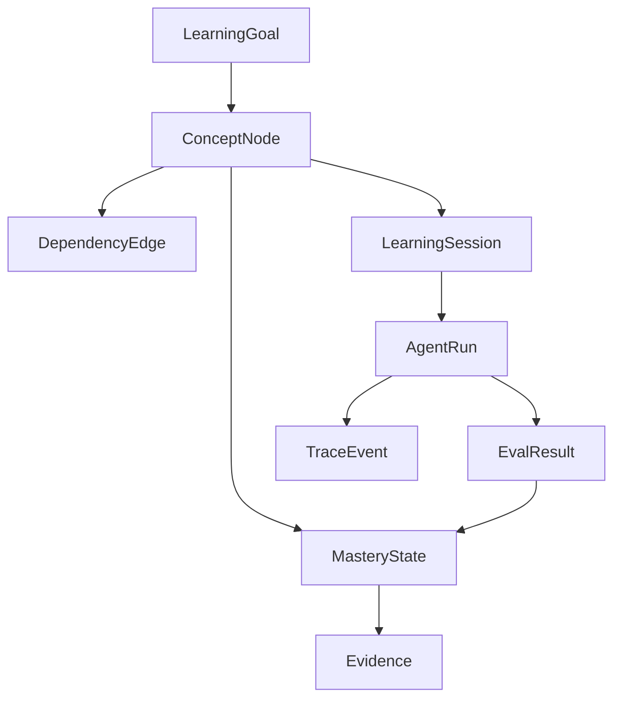

# 学习实践：R4 知识图谱驱动学习系统

## 一、路线调整

R4 不再只作为抽象的 Agent Runtime 学习主题，而升级为 **学习 + 产品实践** 双主线：

| 主线 | 目标 |
|------|------|
| 学习主线 | 掌握生产级 Agent Runtime、Trace、Eval、Checkpoint、Replay、Observability。 |
| 实践主线 | 设计并逐步实现一个知识图谱驱动的学习系统，用真实产品约束承载 R4 能力。 |

核心判断：只学 runtime/eval 仍然偏底层，必须放进一个真实系统里，才能形成作品集与职业壁垒。

## 二、产品愿景

构建一个 **知识图谱驱动的体系化学习系统**：

> 通过知识图谱表达知识结构、前置依赖、掌握程度和学习路径；通过智能体编排系统生成学习计划、解释知识、设计练习、评估效果和更新学习状态；通过 Flutter 实现多端学习体验。

### 目标

- 让学习不再只是线性笔记，而是围绕知识节点、依赖关系和掌握证据持续推进。
- 让智能体不只是聊天助手，而是围绕学习目标运行的编排系统。
- 让每次学习都有 trace、eval、复盘和图谱更新，形成可回放、可改进的学习闭环。
- 形成一个能展示 Agent 工程能力的产品级作品。

## 三、系统边界

### 本阶段纳入

| 模块 | 范围 |
|------|------|
| 知识图谱 | 知识节点、依赖边、学习目标、掌握状态、证据来源。 |
| Agent 编排 | 学习规划、概念讲解、练习生成、评估反馈、图谱更新。 |
| Runtime | 状态机、run/session、checkpoint、interrupt、trace event、terminal status。 |
| Eval | 学习任务验收、测验结果、练习完成度、节点掌握度评估。 |
| 前端 | Flutter 多端原型：图谱视图、学习路径、学习会话、练习与复盘。 |
| 后端接口 | 面向前端暴露 graph、session、agent run、eval result。 |

### 暂不纳入

| 暂不做 | 原因 |
|--------|------|
| 复杂社交/社区功能 | 与 R4 runtime/eval 主线无关。 |
| 商业化订阅/支付 | 会干扰学习系统核心闭环。 |
| 大规模推荐算法 | 先用知识图谱规则和 Agent 规划验证产品闭环。 |
| 全量云端化部署 | 先做本地/单用户 MVP，后续再进入部署与多租户。 |

## 四、核心用户故事

| 编号 | 用户故事 | 验收 |
|------|----------|------|
| US-1 | 作为学习者，我可以创建一个学习目标，并看到对应知识图谱。 | 系统能生成或加载节点、依赖边和阶段目标。 |
| US-2 | 作为学习者，我可以知道下一步最该学什么。 | Agent 根据目标、依赖关系和掌握状态推荐下一个节点。 |
| US-3 | 作为学习者，我可以围绕某个知识节点进行学习会话。 | 系统提供解释、例子、追问和练习。 |
| US-4 | 作为学习者，我完成练习后能获得评估。 | Eval 输出通过/未通过、原因、薄弱点和下一步建议。 |
| US-5 | 作为学习者，我的掌握状态会回写到知识图谱。 | 节点状态随证据更新，而不是手动随便勾选。 |
| US-6 | 作为系统开发者，我能回放一次学习会话。 | trace 记录 agent 决策、工具调用、评估结果和状态转移。 |
| US-7 | 作为系统开发者，我能对 Agent 改动做回归检查。 | golden learning tasks 可重复运行并生成回归报告。 |

## 五、知识图谱模型草案

| 实体 | 说明 |
|------|------|
| LearningGoal | 用户想达成的学习目标，例如“成为生产级 Agent 开发者”。 |
| ConceptNode | 知识节点，例如 Runtime State、Trace Event、Eval Harness。 |
| DependencyEdge | 前置依赖，例如 Eval Harness 依赖 Trace Event。 |
| LearningSession | 一次围绕节点或目标的学习过程。 |
| MasteryState | 节点掌握状态：unknown / learning / practiced / verified / retained。 |
| Evidence | 掌握证据：回答、练习、代码、测试、复盘。 |
| AgentRun | 一次智能体编排运行。 |
| TraceEvent | 运行过程中的状态转移、决策、工具调用、评估事件。 |
| EvalResult | 对学习效果或 Agent 行为的评估结果。 |

### 关键关系



## 六、智能体编排草案

| 角色 | 职责 | 输入 | 输出 |
|------|------|------|------|
| GraphCurator | 维护知识图谱结构，识别节点和依赖。 | 学习目标、资料、历史图谱 | 节点、依赖边、缺口 |
| LearningPlanner | 选择下一步学习路径。 | 图谱、掌握状态、用户目标 | 学习计划、下一节点 |
| TutorAgent | 讲解知识并答疑。 | 当前节点、用户问题、上下文 | 解释、类比、追问 |
| PracticeDesigner | 生成练习任务。 | 当前节点、目标能力 | 练习题、实践任务 |
| EvaluatorAgent | 评估学习效果。 | 用户回答、练习结果、验收标准 | 评分、原因、薄弱点 |
| ReflectionAgent | 更新图谱与学习记忆。 | EvalResult、TraceEvent、用户反馈 | MasteryState 更新、复盘摘要 |

### 编排主循环

```text
学习目标
  → 读取知识图谱
  → 判断当前掌握状态
  → 选择下一知识节点
  → 生成学习会话
  → 讲解 / 练习 / 评估
  → 写入 trace
  → 更新掌握状态
  → 生成下一步建议
```

## 七、R4 学习主题与实践映射

| R4 阶段 | 学习问题 | 在本系统中的实践 |
|---------|----------|------------------|
| R4.1 Runtime 状态契约 | 一次 Agent run 应该有哪些状态和事件？ | 定义 LearningSession、AgentRun、TraceEvent、TerminalStatus。 |
| R4.2 Checkpoint / Interrupt | 学习或工具调用中断后如何恢复？什么时候要人确认？ | 学习会话 checkpoint；图谱更新前 human review。 |
| R4.3 Trace 体系 | 如何记录决策、工具调用、评估与失败？ | 记录推荐下个节点的理由、练习生成、评估结果、状态变更。 |
| R4.4 Eval Harness | 如何判断 Agent 是否真的促进学习？ | golden learning tasks、节点掌握验收、练习评分。 |
| R4.5 Replay / Regression | Prompt/definition/runtime 改动后如何防退化？ | 回放同一学习目标，对比路径、评估结果和成本。 |
| R4.6 Production Signals | 上线后看哪些指标？ | 学习完成率、节点通过率、重试次数、学习时长、成本、失败率。 |
| R4.7 Flutter 多端原型 | 如何把 runtime 能力变成产品体验？ | 图谱页、学习路径页、会话页、练习页、复盘页。 |

## 八、MVP 切片

### MVP-0：需求与领域建模

- 明确目标用户：自学者 / 转行学习者 / 技术学习者。
- 明确核心闭环：目标 → 图谱 → 学习 → 练习 → 评估 → 图谱更新。
- 输出领域模型与核心页面草图。

### MVP-1：后端最小闭环

- 本地知识图谱存储。
- 创建学习目标。
- 查询下一知识节点。
- 记录一次 LearningSession。
- 保存 EvalResult 与 MasteryState。

### MVP-2：Agent Runtime 接入

- 引入 GraphCurator / LearningPlanner / Tutor / Evaluator。
- 用 runtime state machine 管理 agent run。
- 每一步写入 TraceEvent。
- 支持失败收口和 terminal status。

### MVP-3：Eval 与 Replay

- 建立 golden learning tasks。
- 对同一目标重复运行 eval。
- 对比不同 prompt / definition / runtime 改动。
- 输出 regression report。

### MVP-4：Flutter 多端原型

- 图谱视图。
- 学习路径视图。
- 学习会话视图。
- 练习与评估视图。
- 复盘与进度视图。

## 九、默认技术取舍草案

| 层 | 初始建议 | 原因 |
|----|----------|------|
| Agent Runtime | 先沿用当前 Python/LangGraph 学习产物 | 复用 R3 已有基础，避免一开始就重写平台。 |
| 图谱存储 | 先用本地 JSON/SQLite 表达节点和边 | 快速验证闭环，后续再考虑 Neo4j/图数据库。 |
| 后端 API | Python 服务封装 graph/session/agent/eval 接口 | 与当前 agent runtime 语言一致。 |
| 前端 | Flutter | 满足多端目标，先做核心页面原型。 |
| Eval | 离线 golden tasks + trace replay | 贴合 R4 生产化学习目标。 |

以上是初始取舍，后续可在需求设计阶段重新决策。

## 十、待完善需求设计

| 问题 | 当前状态 | 后续要产出 |
|------|----------|------------|
| 第一版目标用户是谁？ | 待细化 | persona、使用场景、核心痛点。 |
| 学习图谱如何生成？ | 待细化 | 手动创建 / 资料抽取 / Agent 生成 / 混合模式。 |
| 节点掌握度如何判定？ | 待细化 | mastery rubric、证据类型、评分规则。 |
| Agent 编排边界多宽？ | 待细化 | 哪些由代码状态机决定，哪些由 LLM 决策。 |
| Flutter 首屏是什么？ | 待细化 | 信息架构、页面列表、首版交互草图。 |
| 数据是否本地优先？ | 待细化 | 单机、本地账号、云同步、多设备同步策略。 |
| 是否支持导入已有笔记？ | 待细化 | Obsidian/Markdown/网页资料导入范围。 |

## 十一、R4 验收标准

- 不是只完成 R4 概念学习，而是形成知识图谱学习系统的可执行产品计划。
- 至少完成一个后端最小闭环：目标、节点、学习会话、评估、图谱状态更新。
- 至少完成一条 agent runtime trace，能解释每个状态为什么发生。
- 至少完成一组 golden learning tasks，用于验证学习效果和 Agent 行为回归。
- 至少完成 Flutter 多端原型的信息架构和一个可运行页面。
- 能把该项目讲成“生产级 Agent 工程作品”，而不是普通聊天 demo。

## 十二、下一步

优先进入 **R4.1：Runtime 状态契约 + 学习系统领域模型**。

第一步不写 Flutter，也不急着接模型，而是先把下面两个东西定清楚：

1. 学习系统的核心领域对象：LearningGoal、ConceptNode、LearningSession、Evidence、EvalResult。
2. Agent Runtime 的状态契约：AgentRun、TraceEvent、Checkpoint、TerminalStatus。

## 续做

```text
/resume plan=Plans/学习循环/2026-08-02-学习实践-智能体开发-09-R4知识图谱驱动学习系统.md 进度=R4 已升级为知识图谱驱动学习系统实践主线；下一步做 R4.1 Runtime 状态契约与领域模型
```

## 反馈（skill_run）

```yaml
skill_run:
  skill: workflow-router
  plan: Plans/学习循环/2026-08-02-学习实践-智能体开发-09-R4知识图谱驱动学习系统.md
  date: 2026-08-02
  contexts_used:
    - path: Plans/Epic/2026-07-08-智能体开发.md
      utility: high
      reason: "确认智能体开发学习旅程已有阶段、R3 状态与历史循环索引。"
    - path: Plans/学习循环/2026-08-01-学习记录-智能体开发-08-R3.3-声明式Agent定义.md
      utility: high
      reason: "承接 R3.3 收口结论，并把 R4 从抽象 runtime 学习升级为产品实践主线。"
  contexts_missing: []
  contexts_stale: []
```
