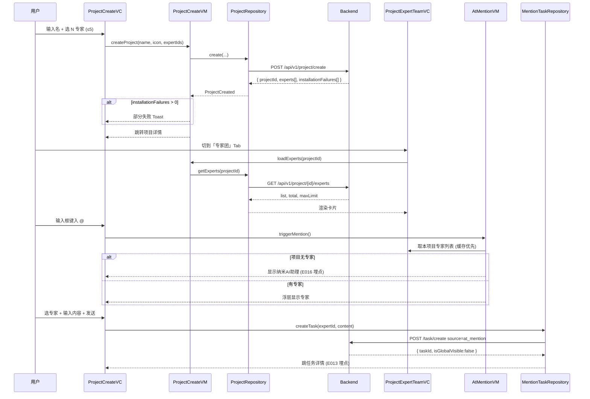

# 技术方案：项目内专家团（客户端 · v1.2.0）

> **需求依据**：`Plans/需求分析/2026-06-24-项目内专家团.md`（已采纳，P0=0）
> **服务端方案**：`Plans/服务端技术方案/2026-06-24-项目内专家团-服务端.md`
> **AC**：见需求 plan §九（12 条）
> **接口契约**：见需求 plan §十三（6 接口）
> **埋点**：见需求 plan §十四（E001-E016）

## 一、背景与目标

在一期"空项目"基础上叠加 **项目专家团** + **@ 创建任务** + **项目图标**，让用户在项目沙盒内通过 @ 直达指派，**降低开会话步骤**。

**目标用户**：纳米Work 项目用户（已雇佣 ≥ 0 专家）。
**非目标**：商店专家市场改造（v1.2.1）、云控推荐项目名（v1.2.1）。

## 二、整体架构

### 模块分层

| 层 | 新增 / 改造 | 复用 |
|---|---|---|
| Presentation | `ProjectCreateVC` 加专家选择 step；`ProjectExpertTeamVC`（新 Tab）；`AtMentionOverlay`（浮层组件改造）；`IconPickerVC`（新弹窗）| `ProjectDetailVC`（增 Tab）|
| ViewModel | `ProjectCreateVM`（加 `selectedExperts`）；`ProjectExpertTeamVM`；`AtMentionVM` | `ProjectDetailVM`（增 Tab 路由）|
| Domain | `ProjectExpertTeam`（领域实体）；`MentionTaskUseCase`；`ExpertRemovalUseCase` | `Project`、`Expert`、`Task` |
| Data | `ProjectExpertRepository`；`MentionTaskRepository`；扩展 `ProjectRepository.create()` | `TaskRepository`、`ExpertRepository` |
| Network | 6 接口 Endpoint 实现 + 错误码映射 + 重试策略 | 通用网络层 |

### 序列图：创建项目 → 添加专家 → @ 创建任务



## 三、数据模型（客户端）

```
ProjectExpertTeam {
  projectId: String
  experts: [ExpertMember]
  total: Int
  maxLimit: Int = 5
  lastSyncedAt: Date  // 用于本地缓存失效
}

ExpertMember {
  expertId: String
  name: String
  avatar: URL
  title: String?
  taskCount: Int
  status: ActiveRemoved | Dismissed   // 解雇联动用
  installStatus: Installed | Installing | Failed   // 创建时返回
}

MentionTask {
  taskId: String
  projectId: String
  expertId: String
  content: String
  status: Pending | Executing | Completed
  source: "at_mention"
  isGlobalVisible: false   // 客户端不入首页列表
  createdAt: Date
}

ProjectIcon {
  name: String         // icon-home / icon-user / ...
  color: HexColor
  isDefault: Bool      // 用户未选时
}
```

### 本地缓存策略

| 数据 | 策略 | 过期 |
|---|---|---|
| 项目专家列表 | LRU by projectId | 5 min；解雇/移除事件强失效 |
| 已雇佣专家列表（用于创建项目）| 全量缓存 | App 启动拉一次 + 商店动作后失效 |
| 图标库 | 内置 + 远端可扩展 | 不过期 |

## 四、API / 协议

| # | 客户端调用方 | 接口 | 关键点 |
|---|---|---|---|
| 13.1 | `ProjectRepository.create()` | `POST /project/create` | 入参 `expertIds[]` ≤ 5；`installationFailures` 字段需 Toast 提示 |
| 13.2 | `ProjectExpertRepository.list()` | `GET /project/{id}/experts` | 进 Tab 时 + 浮层触发时（命中缓存则免请求）|
| 13.3 | `ProjectExpertRepository.add()` | `POST /experts/add` | 批量；`failed[]` 列表逐项 Toast |
| 13.4 | `ProjectExpertRepository.remove()` | `POST /experts/remove` | 二次确认后；成功后**乐观更新**列表，失败回滚 |
| 13.5 | `MentionTaskRepository.createTask()` | `POST /task/create` | 必带 `source: at_mention`；E012 → E013 埋点 |
| 13.6 | `TaskRepository.listByProject()` | `GET /project/{id}/tasks` | 项目内"任务" Tab；增 `expertId` 筛选 |

### 错误码映射

| code | 客户端行为 |
|------|-----------|
| `40001`（超上限）| 弹原生 Toast「每个项目最多添加 5 个专家」，按钮置灰 |
| `40002`（项目名为空）| 走前端校验拦截，理论不应到此 |
| `50001`（安装服务异常）| 创建仍成功；`installationFailures` Toast 列出失败专家 |
| 通用 5xx | 「网络异常，请重试」，保留输入 |
| 网络断开 | 「无网络」Toast + 重试 |

## 五、关键流程

### 5.1 创建项目（含专家选择）

1. 入口：项目 Tab → 创建按钮
2. 步骤一：基本信息（名 + 自定义指令 + 图标）
3. 步骤二：专家选择（已雇佣列表，多选 ≤ 5；"添加更多"打开商店推荐弹窗）
4. 提交 → API 13.1 → 处理 `installationFailures`
5. 成功 → 跳项目详情，默认 Tab 维持现有策略
6. 埋点：E001（点击）→ E002（每次勾选）→ E003（结果）

### 5.2 @ 创建任务

1. 输入框监听 `@` 字符
2. 弹底部浮层（半屏）
3. **项目专家 = 0**：浮层显示纳米AI助理项 + 引导跳转专家团 Tab（按 PRD §3.5）；E016 埋点
4. **有专家**：列表显示，单选（PRD Q7）
5. 选定后输入框插入蓝色高亮 token；继续输入内容
6. 发送 → API 13.5 → 跳任务详情
7. 埋点漏斗：E010 → E011 → E012 → E013

### 5.3 专家团 Tab：增 / 删

| 操作 | 入口 | 交互 |
|------|------|------|
| 添加 | 「+」按钮 → 弹窗 | 已雇佣 + 商店推荐 Tab；勾选确认；调 13.3；安装失败保留待重试 |
| 移除 | **左滑卡片** + 红色按钮 | 二次确认弹窗：「移除后...，但无法再 @ 该专家」；调 13.4；进行中任务标灰 |

埋点：E007 → E008（确认）/ E009（取消）

### 5.4 商店解雇联动

服务端推送或拉取时返回 `status: dismissed` → 客户端：
- 该专家从 @ 浮层移除
- 「专家团」Tab 卡片标"已解雇"
- 历史任务列表标灰 + "已解雇"标签

### 5.5 项目图标弹窗

1. 入口：项目名输入框左侧图标
2. 弹窗：颜色色板 + 图标网格
3. 确认后回写到 `ProjectCreateVM` / `ProjectEditVM`
4. 埋点：E014 → E015

## 六、客户端 / 服务端拆分

| 职责 | 客户端 | 服务端 |
|------|--------|--------|
| 专家上限校验 | 前端置灰 + Toast（友好）| **强校验拦截**（防绕过）|
| 商店专家安装 | 触发请求 + Toast 反馈 | 异步安装 + 状态返回 |
| 解雇联动 | UI 响应 status 变化 | 全局解雇推 status 更新 |
| 任务归属隔离 | UI 不透出到首页 | `isGlobalVisible: false` 字段保证 |
| 进行中任务保留 | UI 标灰 + 不再 @ | 业务流不中断 |
| 二次确认 | 移除前弹窗 | 不依赖前端确认 |
| 埋点 | E001-E016 全埋 | — |
| 缓存 | LRU + 事件失效 | ETag / 条件请求 |
| 并发冲突 | 乐观更新 + 失败回滚 | 版本号或事务锁 |

## 七、风险与回滚

| 风险 | 等级 | 影响 | 应对 | 回滚 |
|------|------|------|------|------|
| 专家安装异步：用户进入项目即 @ 但专家未装好 | 中 | 任务创建可能失败 | `installStatus` 字段；installing 时浮层标"安装中"，禁选 | 显式提示，不影响主流程 |
| @ 浮层与键盘层级冲突 | 中 | 弹层覆盖输入区 | iOS 用 `inputAccessoryView` / 跟随键盘；Android 用 `WindowInsets` | UI 走查 |
| 项目专家列表多端不一致 | 中 | A 端改了 B 端 @ 不到 | 浮层触发时拉一次（命中缓存仍触发后台刷新）| 强制刷新按钮 |
| 解雇联动延迟 | 低 | 用户 @ 已解雇专家 | 服务端 13.5 拦截返回错误，客户端 Toast | — |
| 弱网创建超时 | 中 | 用户重复点击 | 防抖 + 请求幂等 `clientToken` | 超时 Toast 保留字段允许重试 |
| 商店专家批量安装高峰 OOM | 低 | App 卡顿 | 限制每次最多 5 个并发；进度条 UI | 降级单个串行 |
| 一期空项目升级 | 低 | 旧项目无专家团数据 | 服务端兜底返回空列表；客户端按空态渲染 | AC-10 验证 |
| **总回滚开关** | — | 整个 v1.2 模块异常 | **功能开关 `enable_project_expert_team`**（云控）默认 ON；异常时下发 OFF 隐藏入口；保留一期空项目能力 | 5 分钟内全量生效 |

### 灰度策略

- 阶段 1：内测 100% / 外部 1%（监控漏斗 + 创建成功率）
- 阶段 2：外部 10% / 7 天观察 / `E013 result=success` ≥ 99%
- 阶段 3：100%

## 八、Domain / UseCase 接口

```
ProjectExpertTeamRepository
  list(projectId) -> ProjectExpertTeam
  add(projectId, expertIds: [String]) -> { added: [String], failed: [{expertId, reason}] }
  remove(projectId, expertId: String) -> Void

MentionTaskRepository
  createMentionTask(projectId, expertId, content) -> MentionTask

MentionTaskUseCase
  canMention(projectId) -> Bool                              // 项目专家 > 0
  getMentionableExperts(projectId) -> [ExpertMember]         // 过滤掉 removed/dismissed
  createMentionTask(projectId, expertId, content) -> MentionTask

ExpertRemovalUseCase
  removeWithConfirm(projectId, expertId) -> Result            // 二次确认 + ongoing_task_count
  syncDismissedStatus(projectId) -> [ExpertMember]            // 解雇联动
```

## 九、待评审

- [ ] 服务端：接口字段命名 / `isGlobalVisible` 是否扩展为枚举（未来项目可见性策略）/ `clientToken` 幂等
- [ ] 客户端：iOS / Android Tab 顺序约定（PRD I2 未明）/ @ 浮层与键盘层级 / 安装中状态 UI
- [ ] 测试：12 AC 覆盖度 + 灰度阶段监控点
- [ ] PM：埋点参数 `source`、`fail_reason` 枚举封闭值

## 十、续做

```
/resume plan=Plans/客户端技术方案/2026-06-24-项目内专家团-客户端.md 进度=【】
```

## 十一、反馈（skill_run）

```yaml
skill_run:
  skill: architecture-design-assistant
  plan: Plans/客户端技术方案/2026-06-24-项目内专家团-客户端.md
  date: 2026-06-24
  contexts_used:
    - path: Plans/需求分析/2026-06-24-项目内专家团.md
      utility: high
      reason: "需求 plan §九 12 AC + §十三 6 接口 + §十四 16 埋点直接落到本方案 §三/§四/§五"
    - path: Templates/技术方案模板.md
      utility: high
      reason: "客户端方案 10 章节骨架来源"
    - path: Plans/Epic/2026-06-24-项目内专家团.md
      utility: high
      reason: "Epic 母 plan WBS 切片 3-15 决定本方案下游产物边界"
```
