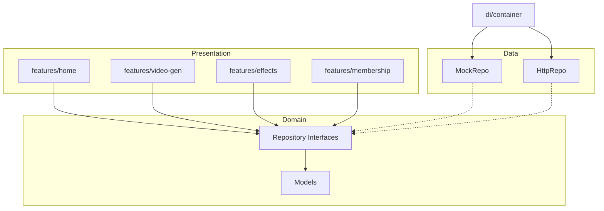

# 技术方案：纳米P视频Web

**创建日期**：2026-06-25  
**存放路径**：`Plans/客户端技术方案/2026-06-25-纳米P视频Web.md`  
**状态**：已采纳  
**lifecycle_state**：architecture  
**平台**：Web 客户端（React + TypeScript）  
**关联需求**：`Plans/需求分析/2026-06-25-纳米P视频Web.md`

---

## 一、背景与目标

- **业务需求**：龙虾口喷专用 Web 端，覆盖首页、视频生成、特效玩法及会员积分能力（仅需求∩设计稿交集）。
- **成功指标**：WBS #6 UI 1:1 走查通过；WBS #10 核心生成链路 Mock 可演示、Http 可联调。
- **非目标**：资产库、创作工具聚合、图片生成、预览作品页、v1 下载/收藏。

---

## 二、约束与前提

| 项 | 约定 |
|----|------|
| 代码仓 | `/Users/wanglongxiang/git/pvideo-frontend` |
| 分支 | `main`（功能分支 `feat/wbs-{n}-{模块}`） |
| 设计稿 | Figma `o4XtLTcw56LUmy7YfjGE4g`，根 node `2:29517` |
| 接口文档 | 飞书 API doc（联调阶段冻结 DTO） |
| 计划真理源 | **仅** AI-Work-Kit `Plans/`；代码仓 **禁止** `docs/TASKS.md` 平行切片 |
| 最低宽度 | 1280px |

---

## 三、技术栈

| 层 | 选型 |
|----|------|
| 框架 | React 18 + TypeScript strict |
| 构建 | Vite 7 |
| 路由 | react-router-dom 7 |
| 状态 | MobX + mobx-react-lite |
| UI | Ant Design 5 + Tailwind CSS 4（Design Token） |
| HTTP | Axios + 拦截器 |
| 播放器 | xgplayer |
| 上传 | tus-js-client（联调阶段） |
| 包管理 | pnpm |

---

## 四、模块边界

| 模块 | 职责 | 依赖 |
|------|------|------|
| `app/` | 路由、Layout（首页顶栏 / 工作台侧栏） | features |
| `features/home` | 首页 Banner、工具箱、灵感中心 | domain repos |
| `features/video-gen` | 参考生/首尾帧、任务右栏 | domain repos |
| `features/effects` | 特效模板、换玩法浮层 | domain repos |
| `features/membership` | 登录弹窗、头像菜单、水印/积分面板 | domain repos |
| `domain/models` | 实体类型 | 无 |
| `domain/repositories` | Repository 接口 | models |
| `data/mock` | UI 轨 Mock 实现 | domain |
| `data/http` | 联调轨 Http 实现 + DTO mappers | domain |
| `di/container` | Mock/Http 注入切换 | data |



---

## 五、路由与 Layout

| 路由 | Layout | 页面 |
|------|--------|------|
| `/` | 无（自带 HomeNavBar） | 首页 |
| `/video-gen` | WorkspaceLayout（左侧栏） | 视频生成 |
| `/effects` | WorkspaceLayout | 特效玩法 |
| `/membership` | MainLayout（可选） | 会员/积分 |

**剔除路由**：`/assets`、`/tools`、`/image-gen` — v1 不注册。

---

## 六、核心领域模型（摘要）

| 实体 | 关键字段 |
|------|----------|
| User | userId, nickname, avatarUrl, isLogin |
| Task | taskId, status, mode, modelId, prompt, params, progress, result |
| Model | modelId, displayName, config（ratios/resolutions/durations/limits） |
| Material | materialId, materialType, thumbnailUrl |
| InspirationItem | workId, coverUrl, prompt, mode, modelId, params |
| EffectTemplate | templateId, uploadType, slots |

---

## 七、Repository 契约（接口清单）

| Repository | 方法 | 联调切片 |
|------------|------|----------|
| UserRepository | getUserInfo, getPointHistory | WBS#10 |
| CloudControlRepository | getBanner, getToolBox, getInspirationTabs | WBS#10 |
| InspirationRepository | listItems, listGroups | WBS#10 |
| ModelRepository | listModels, estimatePoints | WBS#10 |
| MaterialRepository | upload | WBS#10 |
| TaskRepository | createTask, listTasks, getTask, retryTask, deleteTask | WBS#10 |
| EffectRepository | listTemplates, getTemplate | WBS#10 |
| PaymentRepository | auth, freeze, settle, unfreeze, openCashdesk | WBS#10 |

**开发顺序**：先 Mock（WBS #4–7）→ Http（WBS #10）；`di/container.ts` 逐接口切换。

---

## 八、状态机（任务）

```
queued → running → success
              ↘ failed → retry → new taskId
```

- 轮询：`ahooks useRequest` 或自研 polling hook，间隔 2s，running 时启用。
- 并发：前端提交前检查本地 running 数 < 5。

---

## 九、Figma 模块映射（WBS #3 输入）

> fileKey: `o4XtLTcw56LUmy7YfjGE4g` · 对稿须 MCP 量尺寸后写入 `Plans/功能开发/` 度量表。

| 模块 | Frame（待绑 node-id） | Skill |
|------|----------------------|-------|
| 首页未登录/已登录 | 首页 frame 组 | figma-ui |
| 视频生成 | 有提示词 · API 生图生视频 | figma-ui |
| 参考素材交互 | 参考不同类型-交互合集 | figma-ui |
| 特效玩法 | 无提示词 · 特效玩法 | figma-ui |
| 头像/积分/水印 | 已登录头像弹窗系列 | figma-ui |
| 组件库 | 色彩/按钮/图标 | figma-ui |

---

## 十、错误码映射

前端统一 `utils/error-map.ts`；接口 `error_code` → 用户文案；未知码 →「生成失败，请重试」。

---

## 十一、测试策略（摘要）

- 单测：domain 纯函数、mapper。
- 集成：Mock 链路 E2E（Playwright 后续 WBS#11）。
- 设计验收：`Templates/Figma还原自检表.md` ≥ 9 分方可标 WBS#6/#8 完成。

---

## 十二、待联调冻结项

| 项 | 说明 |
|----|------|
| API DTO 字段 | 以接口文档定稿为准，变更走 `change-impact-analysis` |
| 埋点字段 | 联调前与数据同学对齐 |

---

## 续做

```
/resume plan=Plans/客户端技术方案/2026-06-25-纳米P视频Web.md 进度=已采纳，下一步 WBS#3 figma-ui
```

**下一阶段**：`figma-ui`（WBS#3 度量表）→ `task-splitter`（WBS#4 拆功能 plan）
