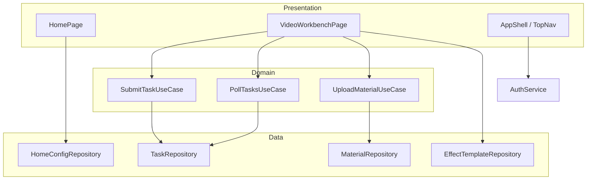
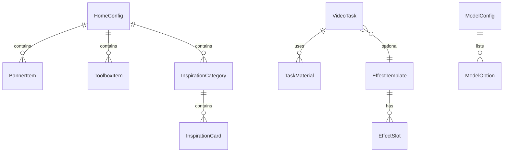
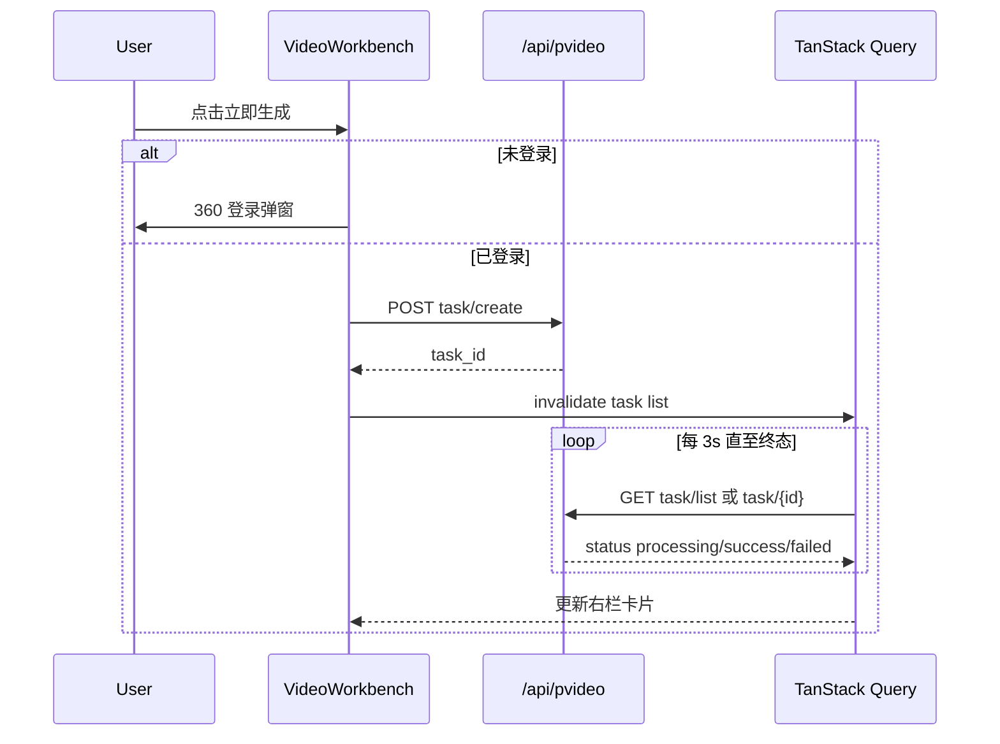

# 技术方案：纳米P视频 Web

**创建日期**：2026-06-25  
**存放路径**：`Plans/客户端技术方案/2026-06-25-纳米P视频Web.md`  
**状态**：已采纳  
**lifecycle_state**：architecture  
**平台**：Web（React SPA）  
**代码仓**：`/Users/wanglongxiang/git/pvideo-frontend`  
**关联需求（真理源）**：`Plans/需求分析/2026-06-25-纳米P视频Web.md`  
**范围矩阵**：`Plans/功能开发/2026-06-25-纳米P视频Web-Figma度量表.md`

---

## 一、背景与目标

- **业务需求**：纳米 P 视频 Web 流量入口（首页）+ 视频生成工作台（参考生视频 / 首尾帧 / 特效玩法），仅交付 PRD∩Figma 且剔除 P0-1/2/5 后的功能。
- **成功指标**：首页四区块可浏览转化；三种生成模式可提交任务；任务列表三态闭环；Figma 走查与 AC 表通过。
- **非目标**：图片生成、创作工具、资产库、积分/会员、案例预览页、站内搜索、个性化推荐。

---

## 二、技术选型

| 层 | 选型 | 理由 |
|----|------|------|
| 构建 | Vite 5 + TypeScript | 仓内已有 `.vite` 痕迹；冷启动快 |
| UI | React 18 | 组件化 + Figma 1:1 切片 |
| 路由 | React Router 6 | `/` `/video` |
| 样式 | Tailwind CSS + CSS Variables | 设计 token 对齐 Figma |
| 服务端状态 | TanStack Query v5 | 任务列表轮询、云控缓存 |
| 客户端草稿 | Zustand（按 mode 分 store） | PRD：各 Tab 独立草稿 |
| HTTP | Axios `withCredentials: true` | QtUser Cookie Q/T |
| 登录 | 360 用户中心（外链/SDK） | PRD 约定；本期不做会员/积分 |

**环境变量**（`.env`）：

| 变量 | 说明 |
|------|------|
| `VITE_API_HOST` | 网关 `{HOST}` |
| `VITE_LOGIN_URL` | 360 登录页（待运维配置） |

---

## 三、约束与前提

- 所有 `/api/pvideo/*` 需登录（QtUser）；浏览首页云控可匿名与否 **联调时确认**（PRD 写未登录可浏览首页，云控接口若需登录则首页用公开 CDN 配置或 BFF 降级）。
- **接口 path 真理源**：https://my.feishu.cn/docx/SFTodXNwWoFPFwxN7ifcNeKgnqh — 下表「Path」列为能力域推断名，**WBS#5 联调前必须与飞书逐条核对**，禁止按推断 path 硬编码上线。
- 设计稿 fileKey：`o4XtLTcw56LUmy7YfjGE4g`。

---

## 四、架构设计

### 4.1 前端分层

```text
Presentation (pages / components / hooks)
    ↓
Domain (use-cases: submitTask, pollTasks, uploadMaterial)
    ↓
Data (repositories → api client)
    ↓
Infrastructure (axios, auth, logger)
```

### 4.2 模块边界（必填）

| 模块 | 职责 | 输入/输出 | 依赖 |
|------|------|-----------|------|
| `app` | 路由、布局、ErrorBoundary | URL → Page | router, auth |
| `features/home` | Banner、工具箱、灵感中心 | 云控 DTO → UI | home-config repo |
| `features/video-workbench` | 左栏创作 + 右栏 Tab | 草稿 state、任务列表 | task/material/effect repos |
| `features/video-workbench/modes` | reference / keyframes / effect 三套 UI | mode + draft | mode-specific validators |
| `features/auth` | 登录态探测、拦截弹窗 | 401 → login redirect | auth repo |
| `shared/ui` | 顶栏、骨架屏、Toast、Modal | props | design tokens |
| `shared/api` | Axios 实例、统一 `code` 解析 | HTTP | env |
| `shared/types` | DTO / 领域类型 | — | — |



### 4.3 路由

| Path | 页面 | 说明 |
|------|------|------|
| `/` | HomePage | 首页四区块；`#inspiration` 锚点响应导航「灵感中心」 |
| `/video` | VideoWorkbenchPage | 默认 mode=reference |
| `/video?mode=keyframes` | 首尾帧 | |
| `/video?mode=effect&templateId={id}` | 特效玩法 | 工具箱/卡片跳入 |

**剔除**：`/image`、`/assets`、`/preview` 等不做。

### 4.4 顶栏（简化）

| 导航项 | 行为 |
|--------|------|
| 首页 | `/` |
| 视频生成 | `/video` |
| 灵感中心 | `/#inspiration` |
| 右侧 | 未登录「注册/登录」；已登录静态头像（无下拉，P0-2） |

---

## 五、数据模型（客户端领域）

> 前端不持久化 DB；以下为 **DTO / 领域实体**，与后端 JSON 对齐。



| 实体 | 字段 | 类型 | 必填 | 说明 |
|------|------|------|------|------|
| `BannerItem` | id, imageUrl, linkUrl, sort | string… | 是 | 手动横滑，不自动轮播 |
| `ToolboxItem` | id, title, iconUrl, targetRoute, sort | — | 是 | 仅链到 `/video` 等本期页 |
| `InspirationCategory` | id, name, layoutType | enum waterfall/group | 是 | 瀑布流 / 分组横滑 |
| `InspirationCard` | id, coverUrl, title, targetMode, templateId? | — | 是 | 点击跳 `/video`（无预览页） |
| `TaskMaterial` | id, type, url, label, duration? | image/video/audio | 条件 | 参考生视频素材 |
| `VideoTask` | id, status, mode, prompt?, coverUrl, videoUrl?, errorMsg?, supersededBy?, createdAt | status: pending/processing/success/failed | 是 | 列表去重看 supersededBy |
| `EffectTemplate` | id, name, type, coverUrl, maxImages, slots[], isActive | type: free_upload/slot_replace | 是 | 提示词不下发前端 |
| `EffectSlot` | slotId, replaceable, placeholderUrl | — | 条件 | slot_replace |
| `ModelConfig` | modelId, name, ratio, resolution, maxMaterials, allowedTypes | 云控 | 是 | 切换模型触发素材校验 |
| `DraftState` | mode, materials, prompt, modelConfig, effectTemplateId | 本地 Zustand | — | 按 mode 隔离 |

---

## 六、API Schema / 接口契约

**通用**：`https://{HOST}/api/pvideo/...` · Header `Content-Type: application/json` · Cookie `Q`+`T`

### 6.1 能力域与 Path（联调前核对飞书）

| # | 能力 | Method | Path（待核对） | 幂等 |
|---|------|--------|----------------|------|
| A1 | 首页云控聚合 | GET | `/api/pvideo/config/home` 或飞书等价 | 是 |
| A2 | 模型/参数云控 | GET | `/api/pvideo/config/models` | 是 |
| A3 | 素材上传 | POST | `/api/pvideo/material/upload` multipart | 否 |
| A4 | 创建任务（参考/首尾帧） | POST | `/api/pvideo/task/create` | 否 |
| A5 | 创建任务（特效） | POST | `/api/pvideo/task/create` 或 effect 专用 | 否 |
| A6 | 任务列表 | GET | `/api/pvideo/task/list` | 是 |
| A7 | 任务详情/轮询 | GET | `/api/pvideo/task/{id}` | 是 |
| A8 | 删除任务 | DELETE | `/api/pvideo/task/{id}` | 是 |
| A9 | 重新生成 | POST | `/api/pvideo/task/{id}/regenerate` | 否 |
| A10 | 特效模板列表 | GET | `/api/pvideo/effect/templates` | 是 |
| A11 | 特效模板详情 | GET | `/api/pvideo/effect/template/{id}` | 是 |
| A12 | 灵感列表（右栏 Tab） | GET | `/api/pvideo/inspiration/list` | 是 |

### 6.2 A4/A5 创建任务 Request（字段级契约）

```json
{
  "mode": "reference | keyframes | effect",
  "prompt": "string, optional for effect",
  "model_id": "string",
  "ratio": "string",
  "resolution": "string",
  "materials": [
    { "type": "image|video|audio", "url": "string", "label": "图片1" }
  ],
  "keyframes": {
    "first": { "url": "string" },
    "last": { "url": "string" }
  },
  "effect_template_id": "string, required when mode=effect",
  "effect_materials": [
    { "slot_id": "string, slot_replace only", "url": "string" }
  ],
  "client_draft_id": "string, optional, 幂等辅助"
}
```

### 6.3 任务列表 Response data（示例）

```json
{
  "list": [
    {
      "id": "task_xxx",
      "status": "processing|success|failed",
      "mode": "reference",
      "title": "参考生视频",
      "cover_url": "https://...",
      "video_url": "https://...",
      "error_msg": "",
      "superseded_by": "task_yyy",
      "created_at": "2025/02/08 15:32:25"
    }
  ],
  "has_more": false
}
```

### 6.4 错误码（客户端处理）

| code | 含义 | 客户端处理 |
|------|------|------------|
| 0 | 成功 | 正常 |
| 404 | 任务/素材不存在 | 从列表移除或 Toast |
| 100002 | 参数非法 | 表单高亮 + msg |
| 102009 | 未登录 | 唤起登录 |
| 401 | Token 失效 | 同 102009 |
| 500000 | 服务端异常 | Toast + 可重试 |
| 510001 | 特效模板不存在 | 引导换模板 |
| 510002 | 模板已下架 | 换玩法浮层重选 |
| 510003 | 素材数量不符 | 高亮素材区 |

### 6.5 关键流程



**轮询策略（P1 默认）**：processing/pending 时每 **3s** 拉列表；终态后停止；页面 hidden 时降频到 10s；连续失败 3 次 Toast「网络异常」。

---

## 七、目录结构（`pvideo-frontend`）

```text
src/
  app/           # router, providers
  pages/
    Home/
    VideoWorkbench/
  features/
    home/
    video-workbench/
      modes/{reference,keyframes,effect}/
  shared/
    api/
    ui/
    types/
    hooks/
  styles/
```

---

## 八、方案决策

| 决策 | 选择 | 理由 |
|------|------|------|
| 状态管理 | Query + Zustand 分治 | 服务端三态 vs 本地草稿隔离 |
| 特效提示词 | 永不进入 DOM | PRD 安全要求 |
| 任务去重 | 列表过滤 `superseded_by` 非空旧任务 | PRD superseded 链 |
| 灵感中心导航 | 首页锚点，非独立路由 | 矩阵弱交集 |

---

## 九、实施阶段（供 task-splitter）

| 阶段 | 内容 | WBS |
|------|------|-----|
| 1 | Vite 脚手架 + 路由 + AppShell | #4 |
| 2 | API Client + Repos + 类型 | #5 |
| 3 | 首页 UI 1:1 | #6 |
| 4 | 视频工作台骨架 + 三 mode | #7 #8 |
| 5 | 任务三态 + 轮询 + 异常 | #9 |
| 6 | 联调 + Figma 走查 | #10 |

---

## 十、验收标准

- [ ] 模块边界无 Presentation 直连 axios（经 Repository）
- [ ] 剔除项路由不可达
- [ ] 三种 mode 可各提交至少 1 条任务（联调环境）
- [ ] 错误码 510001–510003 有对应 UI
- [ ] Path 已与飞书文档核对并更新 `接口索引.md`

---

## 续做

```
/resume plan=Plans/客户端技术方案/2026-06-25-纳米P视频Web.md 进度=已采纳，待 task-splitter
```

**下一阶段 Skill**：`task-splitter`

---

## 反馈（skill_run）

```yaml
skill_run:
  skill: architecture-design-assistant
  plan: Plans/客户端技术方案/2026-06-25-纳米P视频Web.md
  date: 2026-06-25
  contexts_used:
    - path: Templates/技术方案模板.md
      utility: high
      reason: "模块边界/ER/API Schema 结构"
    - path: Plans/功能开发/2026-06-25-纳米P视频Web-Figma度量表.md
      utility: high
      reason: "范围与路由剔除依据"
  contexts_missing:
    - "飞书 pvideo 完整 endpoint 表（仅能引用通用约定，path 标待核对）"
  contexts_stale: []
```
