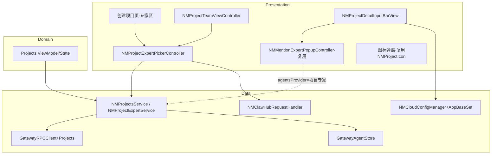
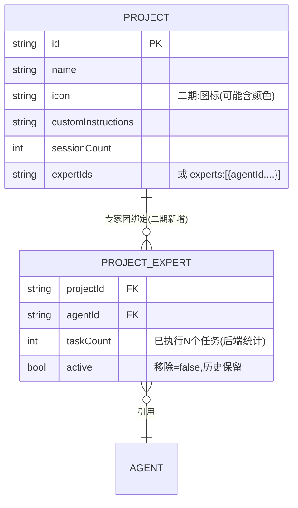
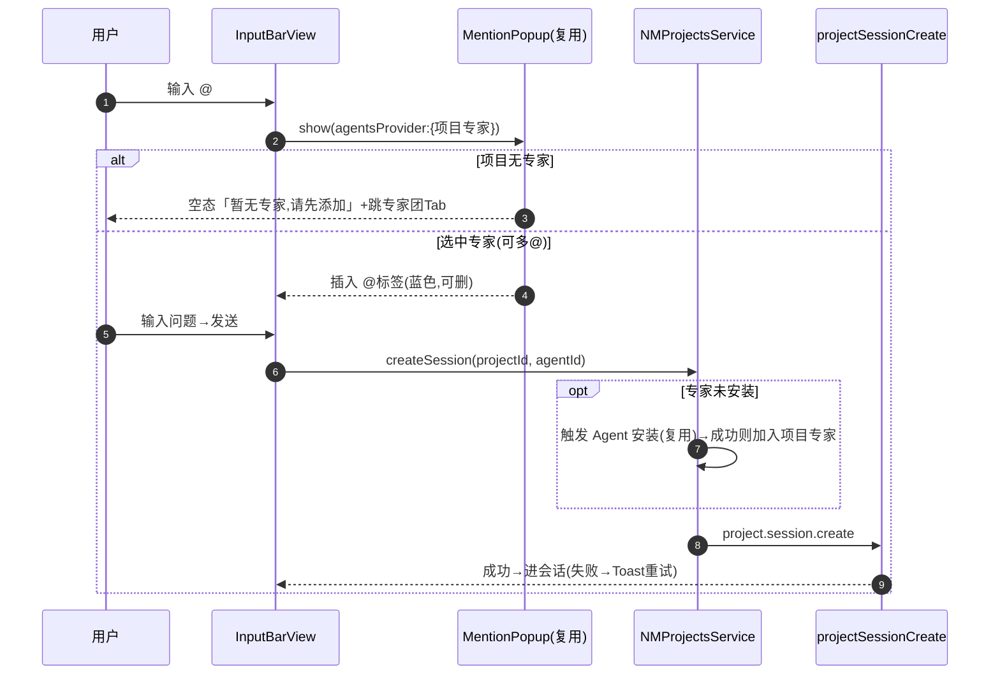
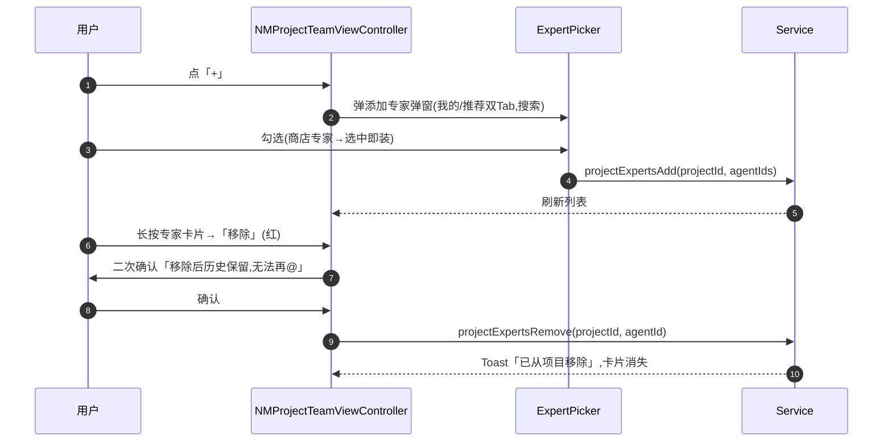

# 技术方案：纳米Work-项目二期（项目内专家团）· 客户端(iOS)

**创建日期**：2026-06-29  
**存放路径**：`Plans/客户端技术方案/2026-06-29-纳米Work-项目二期-项目内专家团.md`  
**状态**：草稿（待评审）  
**lifecycle_state**：architecture  
**平台**：客户端（iOS，Swift/MVVM，CocoaPods）  
**关联需求（真理源）**：[[Plans/需求分析/2026-06-29-纳米Work-项目二期-项目内专家团]] ← 架构变动须先回看  
**代码仓**：`/Users/wanglongxiang/git/NNamiWork`，模块 `NAMIWork/Features/Projects`

> **核心前提（需求关键澄清）**：项目「专家团」= 项目维度的**可 @ 专家名单**，**与聊天 Swarm 多专家协作无关**；项目内 @ 专家+发送，对客户端 = 一次「带 projectId + agentId 的普通发消息」（复用 `projectSessionCreate`），后端内部建任务客户端不感知。本方案据此设计，**不引入任何 Swarm（`NMSwarm*`）代码**。

---

## 一、背景与目标

- **业务需求/痛点**：一期项目只是「对话+知识+指令」容器，进项目后仍需手动挑专家。二期让项目挂一份常用专家名单，项目内可直接 @ 指定专家发起对话。
- **成功指标**：创建项目可选专家（≥0）；详情页「专家团」Tab 可增删；项目输入框 @ 仅展示项目专家、发送复用既有链路；图标弹窗 + 推荐项目名云控接入。
- **非目标（防过度设计）**：不做多专家并行协作（Swarm）；不做专家评分/付费；@ 建任务的后端逻辑不在客户端范围；不重写一期项目基础功能。

---

## 二、AI 行为准则

1. 先模块划分 + 接口草案，后实现细节。
2. UI/Handler 不直连网络，统一走 `NMProjectsService`（一期已是 Protocol + DI 模式，二期延续）。
3. 缺后端契约的字段（专家团绑定结构）列「待确认」，不猜测落库格式。
4. 复用优先：能复用 `NMMentionExpertPopupController` / `GatewayAgentStore` / 云控范式的，不另造。

---

## 三、原则对照

| 原则 | 要求 |
|------|------|
| SRP | 专家团数据（Service）、专家选择 UI（弹窗）、@ 交互（复用 Mention）、图标弹窗各自单一职责 |
| OCP | 详情页 Tab 从 2→3 通过扩展 segment titles + listContainer dataSource，不改既有两 Tab 逻辑 |
| DIP | 专家团读写经 `NMProjectsServiceProtocol`（一期已有 DI），ViewModel 不直连 RPC |
| DRY | @ 浮层、Agent 安装、云控解析全部复用既有实现 |
| KISS/YAGNI | 多 @ = 多个独立标签，不做协作编排；安装失败=提示重试，不做回滚 |

---

## 四、约束与前提

- **最低 iOS**：15.0；静态 framework；CocoaPods。
- **依赖服务**：Gateway RPC（`GatewayRPCClient+Projects`）、ClawHub 推荐接口（`NMClawHubRequestHandler`）、Agent 安装链路（`GatewayAgentStore` + `clawMasterCreateAgent`/`agents.create2`）、云控 `assistant_work_app_base_set`。
- **特性开关/灰度**：建议复用云控开关控制专家团入口（待与一期项目 Tab 开关对齐确认）。
- **Figma**：待补 → 阻塞 UI 切片 6/8，不阻塞数据层 4/5。
- **后端契约**：项目↔专家团绑定字段与 RPC 待后端给（见 §五 待确认）。

---

## 五、架构设计

### 客户端分层

Presentation（VC/View）→ Domain（ViewModel/State）→ Data（`NMProjectsService` + `GatewayRPCClient+Projects`）。延续一期 Projects 的 Protocol+DI。

### 模块边界（必填）

| 模块 | 职责 | 输入/输出 | 依赖 | 复用/新增 |
|------|------|-----------|------|-----------|
| `NMProjectExpertService`（建议新增，或并入 `NMProjectsService`） | 项目专家团 增/删/查、专家来源聚合（已雇佣+商店推荐） | in: projectId/agentId；out: `[NMAgentSummary]` | `GatewayRPCClient+Projects`、`GatewayAgentStore`、`NMClawHubRequestHandler` | 新增（薄封装） |
| `NMProjectExpertPickerController`（新增） | 添加专家弹窗：双 Tab（我的/推荐）、搜索、选中即装 | in: 已选 set；out: 选中专家回调 | `GatewayAgentStore`、ClawHub、Agent 安装 | 新增（可参考 ClawHub Recommend） |
| 创建项目页「专家区」（改造一期创建入口） | 命名+指令后新增专家卡片列表+已选计数+添加更多 | in: 选中专家；out: createProject(expertIds) | 上面 Picker + Service | 改造一期创建流程 |
| `NMProjectTeamViewController`（新增第 3 Tab） | 专家团列表、空态、增（+）、删（长按→移除+二次确认）、点击进对话 | in: project；out: 增删事件 | Service、Picker、`NMMentionExpertPopupController` 无关 | 新增，挂入 `NMProjectDetailViewController` listContainer |
| `NMProjectDetailViewController`（改造） | segment titles `["任务","知识"]`→`["任务","知识","专家团"]`；`numberOfLists` 2→3；`initListAt` 加 index==2 | — | JXSegmentedView | 改 3 处 |
| 项目内 @ 交互（复用） | 输入框输入 @ → 弹项目专家浮层 → 选→标签→发送 | agentsProvider = 项目专家 | `NMMentionExpertPopupController.show(agentsProvider:)` | **纯复用**，注入项目专家 provider |
| `NMProjectDetailInputBarView`（改造） | placeholder 改「输入问题」；agentChip 默认专家逻辑（有→首位/无→纳米AI助理）；底部「添加更多」 | — | Service、namiWorkAgentId() | 改造 |
| 项目图标弹窗（改造） | 入口从设置页移到名称框左侧图标；选颜色+图标 | in/out: icon | 一期 `NMProjectIcon` | 入口迁移 |
| 推荐项目名云控（新增方法） | `NMCloudConfigManager+AppBaseSet` 加 `projectRecommendationInfo()` | out: `[RecommendItem]` | 云控范式 | 新增 1 方法 |



### 数据模型（ER 图 + 字段）



**客户端已有模型**（`GatewaySessionModels.swift:138 NMProjectRecord`）：id/name/icon/description/createdAt/updatedAt/sessionCount/fileCount/generating/unread/isDefault/customInstructions。**无专家字段**。

| 实体 | 新增字段 | 类型 | 必填 | 说明 |
|------|---------|------|------|------|
| NMProjectRecord | experts / expertIds | array | 否 | 项目专家团成员；**字段名与结构待后端契约**（见待确认 Q1） |
| NMProjectExpert（新建模型，若后端返回对象数组） | agentId | string | 是 | 专家 Agent id |
| NMProjectExpert | taskCount | int | 否 | 「已执行 N 个任务」，后端统计口径待定（Q3） |
| 复用 NMAgentSummary | id/displayName/resolvedAvatarUrl/description/isSwarm | — | — | 专家卡片渲染直接复用（`NMGatewayModels.swift`） |
| RecommendProjectItem（云控，新建 Mappable） | icon/showName/realName/sort | — | — | `project_recommendation_info` 单项 |

### API Schema / 接口契约

> 区分三类：**A 客户端纯复用（已存在）**、**B 客户端改造（加参数）**、**C 后端待提供（新 RPC）**。

| 类 | 方法/RPC | 说明 | 状态 |
|----|----------|------|------|
| A | `projectSessionCreate(projectId, agentId, model?, providerOverride?)` | 项目内 @ 专家发消息 → 在项目下用该 agent 建会话。**即「@建任务」的客户端入口** | ✅ 已存在(`+Projects.swift:154`) |
| A | `NMMentionExpertPopupController.show(agentsProvider:selectionHandler:onDismiss:)` | @ 浮层 | ✅ 已存在 |
| A | `GatewayAgentStore.installedAgents` / `myClawDisplayAgents` | 已雇佣专家来源 | ✅ 已存在 |
| A | `NMClawHubRequestHandler.fetchAgentList/searchAgents` | 专家商店推荐/搜索 | ✅ 已存在 |
| A | Agent 安装：`clawMasterCreateAgent`/`agents.create2`（或 ClawHub 安装链路） | @/创建时安装未安装专家 | ✅ 已存在，需确认统一入口(Q4) |
| B | `projectCreate(name, icon?, description?, customInstructions?, **expertIds?**)` | 创建项目带专家 | 🔧 加参数(Q1/Q2) |
| B | `projectUpdate(...)` | — | 一般不用于专家增删，专家增删走 C |
| C | `projectExpertsAdd(projectId, agentIds:[String])` | 添加专家到项目 | ❓ 后端待提供 |
| C | `projectExpertsRemove(projectId, agentId)` | 移除（软删，历史保留） | ❓ 后端待提供 |
| C | `projectExpertsList(projectId)` | 拉项目专家团（含 taskCount） | ❓ 后端待提供（或并入 projectGet） |

**B-projectCreate 扩展 Request 示例**：

```json
{ "name": "研究记录", "icon": "icon-home", "customInstructions": "...", "expertIds": ["agent_a", "agent_b"] }
```

**C-projectExpertsList Response 示例（建议契约）**：

```json
{ "code": 0, "data": { "experts": [ { "agentId": "agent_a", "taskCount": 3, "active": true } ] } }
```

**错误码（沿用一期 project RPC 风格 + 安装失败）**：

| code | 含义 | 客户端处理 |
|------|------|------------|
| 0 | 成功 | — |
| 通用失败 | 创建/增删失败 | Toast「操作失败，请重试」（增删）/「创建失败，请重试」（创建，含安装失败，用户重新点击即可） |
| UNAVAILABLE | 项目生成中（一期已有） | 提示稍后 |

**云控键**：`assistant_work_app_base_set.project_recommendation_info`（JSON 字符串 → `mapJson` → `Mapper`，与 `homepage_bottom_input_box_expert_110` 同范式，`NMCloudConfigManager+HomepageAgent.swift:107`）。后端需配置该键（Q5）。

### 关键流程

**项目内 @ 专家发消息（复用，客户端视角无「建任务」）**



**专家团 Tab 增删**



---

## 六、方案选项与决策矩阵

**决策1：专家团数据层 —— 新建 Service vs 并入 NMProjectsService**

| 方案 | 复杂度 | 内聚 | 风险 | 备注 |
|------|--------|------|------|------|
| A 并入 `NMProjectsService` | 低 | 项目相关集中 | Service 膨胀 | 与一期 createProject 同文件，DI 已就绪 |
| B 新建 `NMProjectExpertService` | 中 | 专家职责独立 | 多一层 | 便于单测 |

**推荐 A**：专家团与项目强绑定，复用一期 `NMProjectsServiceProtocol` 的 DI 与错误处理，避免分裂；接口多时再抽 extension 文件 `NMProjectsService+Experts.swift`。

**决策2：@ 浮层数据源注入**

| 方案 | 说明 |
|------|------|
| ✅ 复用 `show(agentsProvider:)` | 注入 `{ 当前项目专家列表 }` provider，**零改动浮层**，与一期 @ 体验一致 |

**推荐**：直接复用，这是本需求最大的复用红利。

**决策3：专家团 Tab 接入方式**

| 方案 | 说明 |
|------|------|
| ✅ 扩展 `NMProjectDetailViewController` 三处 | segment titles、`numberOfLists`(2→3)、`initListAt`(加 index==2) + 新增 `NMProjectTeamViewController` 实现 `JXSegmentedListContainerViewListDelegate` |

**推荐**：与一期「任务/知识」两 Tab 完全同构，最小改动。

---

## 七、上线与回滚

- **发布步骤**：后端先上专家团绑定 RPC + 云控 key → 客户端跟随；建议云控开关控制专家团入口（与一期项目开关对齐）。
- **回滚触发**：专家团接口异常率高 / @ 发消息失败率升高。
- **回滚操作**：云控关闭专家团入口，降级为一期纯项目（创建不带专家、详情两 Tab、输入框单选专家）。
- **数据迁移**：一期已建项目（含默认「我的项目」）专家团初始为空（Q6 确认）；无破坏性迁移。

---

## 八、实施计划（对齐 Epic WBS 4–10）

| 阶段 | 内容 | 对应 WBS |
|------|------|----------|
| 1 | 数据模型：NMProjectRecord 加 experts、RecommendItem、云控方法（依赖后端契约 Q1/Q5） | 4 |
| 2 | Service：专家团增删查 + 专家来源聚合 + projectCreate 加 expertIds | 5 |
| 3 | UI：创建页专家区 / 专家团 Tab / 添加专家弹窗 / 图标弹窗 / 输入框改造（依赖 Figma） | 6 |
| 4 | 数据绑定 + @ 浮层注入项目专家 provider | 7 |
| 5 | 交互：@标签、移除二次确认、推荐名点选、多@ | 8 |
| 6 | 异常/边界：无专家空态、纳米AI助理兜底、未安装自动装、安装失败重试 | 9 |
| 7 | 联调 + 设计走查 | 10 |

---

## 九、验收标准

- [ ] 创建项目可选/不选专家（AC1-3）；详情页 3 Tab（AC4）
- [ ] 专家团增删 + 二次确认 + 移除后不可@（AC5-7）
- [ ] @ 浮层仅项目专家、@ 建会话、多@、空态（AC8-11）
- [ ] 输入框默认专家有/无、文案「输入问题」（AC12-14）
- [ ] 图标弹窗 + 推荐名点选（AC15-16）；未安装@自动装（AC17）
- [ ] 分层无违规：UI 不直连 RPC，全走 Service
- [ ] 云控缺失/接口失败静默降级，不阻塞创建
- [ ] **无任何 Swarm 代码引入**

---

## 十、待确认（转后端/产品）

- **Q1（后端·P0）**：项目专家团绑定字段名与结构——`NMProjectRecord` 加 `expertIds:[String]` 还是 `experts:[对象]`？是否随 `projectGet` 一起返回？
- **Q2（后端·P0）**：`projectCreate` 是否接受 `expertIds` 参数一次性带入，还是创建后再调 add？
- **Q3（后端·P1）**：`taskCount`「已执行 N 个任务」统计口径（含进行中/失败/移除后历史？实时性）。
- **Q4（客户端·P1）**：@/创建触发未安装专家安装，统一走哪条安装链路（`clawMasterCreateAgent` vs ClawHub 安装）？需与现有约定核对。
- **Q5（后端·P1）**：云控 `project_recommendation_info` 配置 + icon 索引与本地资源映射表。
- **Q6（产品·P1）**：一期已有项目（含默认「我的项目」）二期后专家团初始为空还是预置。

> 门禁：含业务逻辑，模块边界 ✅ / ER+字段 ✅ / API 契约 ✅（其中 C 类后端 RPC 待提供，已标注）。Q1/Q2 为后端契约阻塞 Data 层落地，建议方案评审同步推后端；不阻塞本方案「已采纳」与 UI 层先行。

---

## 续做

```
/resume plan=Plans/客户端技术方案/2026-06-29-纳米Work-项目二期-项目内专家团.md 进度=待评审/待后端契约Q1-Q2
```

**下一阶段 Skill**：方案 `status: 已采纳` 后 → `/task-splitter`，拆为 `Plans/功能开发/` 原子任务。
