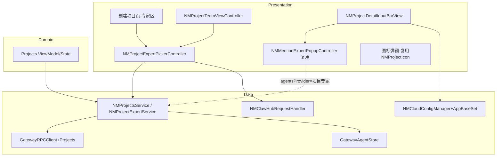
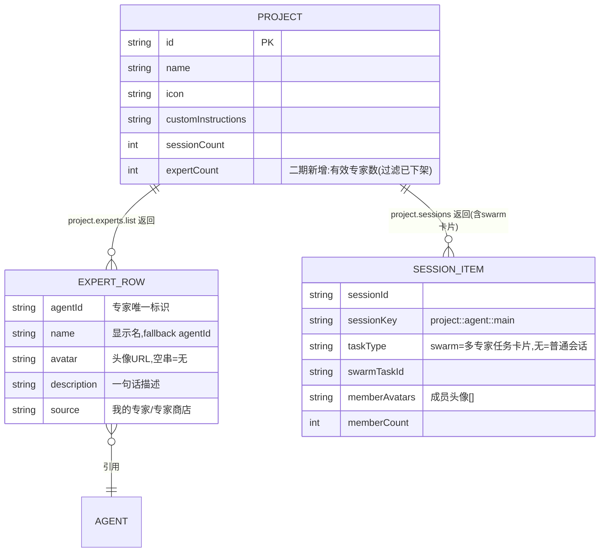
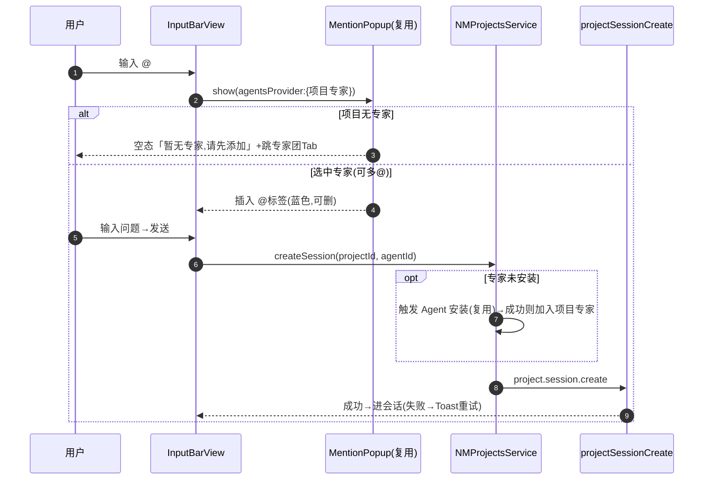
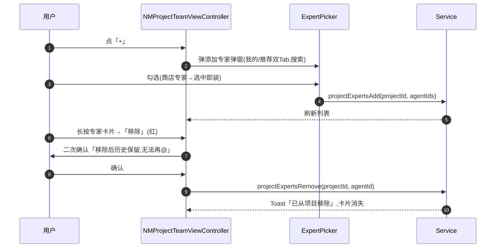

# 技术方案：纳米Work-项目二期（项目内专家团）· 客户端(iOS)

**创建日期**：2026-06-29  
**存放路径**：`Plans/客户端技术方案/2026-06-29-纳米Work-项目二期-项目内专家团.md`  
**状态**：已采纳（方案+后端契约已对齐；数量上限以后端为准，客户端不限制；无硬阻塞）  
**lifecycle_state**：architecture  
**平台**：客户端（iOS，Swift/MVVM，CocoaPods）  
**关联需求（真理源）**：[[Plans/需求分析/2026-06-29-纳米Work-项目二期-项目内专家团]] ← 架构变动须先回看  
**代码仓**：`/Users/wanglongxiang/git/NNamiWork`，模块 `NAMIWork/Features/Projects`

> **核心前提（需求关键澄清）**：项目「专家团」= 项目维度的**可 @ 专家名单**，**与聊天 Swarm 多专家协作无关**；项目内 @ 专家+发送，对客户端 = 一次「带 projectId + agentId 的普通发消息」（复用 `projectSessionCreate`），后端内部建任务客户端不感知。本方案据此设计，**不引入任何 Swarm（`NMSwarm*`）代码**。

---

## 一、背景与目标

- **业务需求/痛点**：一期项目只是「对话+知识+指令」容器，进项目后仍需手动挑专家。二期让项目挂一份常用专家名单，项目内可直接 @ 指定专家发起对话。
- **成功指标**：创建项目可选专家（≥0）；详情页「专家团」Tab 可增删；项目输入框 @ 仅展示项目专家、发送复用既有链路；图标弹窗 + 推荐项目名云控接入。
- **非目标（防过度设计）**：不做多专家并行协作（Swarm）；不做专家评分/付费；@ 建任务的后端逻辑不在客户端范围；不重写一期项目基础功能。

---

## 二、AI 行为准则

1. 先模块划分 + 接口草案，后实现细节。
2. UI/Handler 不直连网络，统一走 `NMProjectsService`（一期已是 Protocol + DI 模式，二期延续）。
3. 缺后端契约的字段（专家团绑定结构）列「待确认」，不猜测落库格式。
4. 复用优先：能复用 `NMMentionExpertPopupController` / `GatewayAgentStore` / 云控范式的，不另造。

---

## 三、原则对照

| 原则 | 要求 |
|------|------|
| SRP | 专家团数据（Service）、专家选择 UI（弹窗）、@ 交互（复用 Mention）、图标弹窗各自单一职责 |
| OCP | 详情页 Tab 从 2→3 通过扩展 segment titles + listContainer dataSource，不改既有两 Tab 逻辑 |
| DIP | 专家团读写经 `NMProjectsServiceProtocol`（一期已有 DI），ViewModel 不直连 RPC |
| DRY | @ 浮层、Agent 安装、云控解析全部复用既有实现 |
| KISS/YAGNI | 多 @ = 多个独立标签，不做协作编排；安装失败=提示重试，不做回滚 |

---

## 四、约束与前提

- **最低 iOS**：15.0；静态 framework；CocoaPods。
- **依赖服务**：Gateway RPC（`GatewayRPCClient+Projects`）、ClawHub 推荐接口（`NMClawHubRequestHandler`）、Agent 安装链路（`GatewayAgentStore` + `clawMasterCreateAgent`/`agents.create2`）、云控 `assistant_work_app_base_set`。
- **特性开关/灰度**：建议复用云控开关控制专家团入口（待与一期项目 Tab 开关对齐确认）。
- **Figma**：已到（`figma.com/design/Z3hhNwFzvLZOdnCtXkIRHn?node-id=34663-7861`）→ UI 切片 6/8 可启动；读节点尺寸一律 ÷2（见 @docs/claude/figma-sizing.md）。
- **后端契约**：项目↔专家团绑定字段与 RPC 待后端给（见 §五 待确认）。

---

## 五、架构设计

### 客户端分层

Presentation（VC/View）→ Domain（ViewModel/State）→ Data（`NMProjectsService` + `GatewayRPCClient+Projects`）。延续一期 Projects 的 Protocol+DI。

### 模块边界（必填）

| 模块 | 职责 | 输入/输出 | 依赖 | 复用/新增 |
|------|------|-----------|------|-----------|
| `NMProjectExpertService`（建议新增，或并入 `NMProjectsService`） | 项目专家团 增/删/查、专家来源聚合（已雇佣+商店推荐） | in: projectId/agentId；out: `[NMAgentSummary]` | `GatewayRPCClient+Projects`、`GatewayAgentStore`、`NMClawHubRequestHandler` | 新增（薄封装） |
| `NMProjectExpertPickerController`（新增） | 添加专家弹窗：双 Tab（我的/推荐）、搜索、选中即装 | in: 已选 set；out: 选中专家回调 | `GatewayAgentStore`、ClawHub、Agent 安装 | 新增（可参考 ClawHub Recommend） |
| 创建项目页「专家区」（改造一期创建入口） | 命名+指令后新增专家卡片列表+已选计数+添加更多 | in: 选中专家；out: createProject(expertIds) | 上面 Picker + Service | 改造一期创建流程 |
| `NMProjectTeamViewController`（新增第 3 Tab） | 专家团列表、空态、增（+）、删（长按→移除+二次确认）、点击进对话 | in: project；out: 增删事件 | Service、Picker、`NMMentionExpertPopupController` 无关 | 新增，挂入 `NMProjectDetailViewController` listContainer |
| `NMProjectDetailViewController`（改造） | segment titles `["任务","知识"]`→`["任务","知识","专家团"]`；`numberOfLists` 2→3；`initListAt` 加 index==2 | — | JXSegmentedView | 改 3 处 |
| 项目内 @ 交互（复用） | 输入框输入 @ → 弹项目专家浮层 → 选→标签→发送 | agentsProvider = 项目专家 | `NMMentionExpertPopupController.show(agentsProvider:)` | **纯复用**，注入项目专家 provider |
| `NMProjectDetailInputBarView`（改造） | placeholder 改「输入问题」；agentChip 默认专家逻辑（有→首位/无→纳米AI助理）；底部「添加更多」 | — | Service、namiWorkAgentId() | 改造 |
| 项目图标弹窗（改造） | 入口从设置页移到名称框左侧图标；选颜色+图标 | in/out: icon | 一期 `NMProjectIcon` | 入口迁移 |
| 推荐项目名云控（新增方法） | `NMCloudConfigManager+AppBaseSet` 加 `projectRecommendationInfo()` | out: `[RecommendItem]` | 云控范式 | 新增 1 方法 |



### 数据模型（ER 图 + 字段）

> 依据后端接口契约（飞书 wiki，2026-06-23 二期）。**专家明细独立于 ProjectRecord**：`ProjectRecord` 仅加 `expertCount`（数量），专家列表走独立 `project.experts.*` RPC 返回 `ExpertRow[]`。



**客户端已有模型**（`GatewaySessionModels.swift:138 NMProjectRecord`）：id/name/icon/description/createdAt/updatedAt/sessionCount/fileCount/generating/unread/isDefault/customInstructions。**无专家字段**。

| 实体 | 新增/对应客户端模型 | 字段 | 说明 |
|------|---------|------|------|
| NMProjectRecord | 加 `expertCount: Int` | int | 卡片「专家数」，过滤已下架 |
| **NMProjectExpertRow**（新建 Mappable/Codable） | agentId/name/avatar/description/source | string | `project.experts.*` 返回的 `ExpertRow`；与 `NMAgentSummary` 不同源，需独立模型（可加便捷转换） |
| SessionHistoryItem（项目内会话行，复用一期模型 + 扩展） | 加 `taskType:"swarm"?` / `swarmTaskId?` / `memberAvatars:[String]?` / `memberCount?` | — | 多专家任务卡片标识，详见决策4 |
| RecommendProjectItem（云控，新建 Mappable） | icon/showName/realName/sort | — | `project_recommendation_info` 单项 |
| 复用 NMAgentSummary | id/displayName/resolvedAvatarUrl/description | — | 选择器/卡片渲染；但项目专家最终以 `ExpertRow` 为准 |

### @ mention 协议（后端契约，前端核心实现点）

- **标记格式**：`@[显示名](agentId)`（markdown link 语法）。示例：`帮我分析 @[设计师](designer-001) 出方案`。
- **正则**：`/@\[([^\]]*)\]\(([^)]+)\)/g` — `match[1]`=显示名（渲染高亮 tag）、`match[2]`=agentId（后端分派用）。
- **chat.send 不新增字段**：message 仍为 string，前端把 @ 标记**内嵌**进 message 文本即可，后端正则提取。
- **前端职责**：① 从专家浮层选人 → 在输入框 message 插入 `@[name](agentId)`；② 渲染时正则匹配 → 替换为蓝色可点击 tag；③ 标签可删（删文本中对应标记）。
- **边界**：@ 了不在项目专家列表的 agent → 后端决定（可忽略/自动加入）；非标记格式（邮箱/代码）正则不命中不受影响。

### API Schema / 接口契约（依据后端 wiki 契约填实）

> 区分：**A 客户端纯复用（已存在）**、**B 一期接口扩展（后端已规划加字段）**、**C 二期新 RPC（后端已规划）**。后端契约见 wiki，下列均为后端**已规划/待实现**，非「待确认」。

| 类 | RPC / 入口 | 说明 | 客户端动作 |
|----|----------|------|------------|
| A | `chat.send({sessionKey(project:…), sessionId, message, idempotencyKey})` | 项目内发消息（message 内嵌 @ 标记） | 复用主聊天发送；sessionKey 用 project 域 |
| A | `project.session.create(projectId, agentId, model?)` | 项目内新建会话（选定专家发起） | ✅ 已存在(`+Projects.swift:154`) |
| A | `NMMentionExpertPopupController.show(agentsProvider:…)` | @ 浮层 | 注入项目专家 provider |
| A | `GatewayAgentStore` / `NMClawHubRequestHandler` | 已雇佣 + 商店推荐专家来源 | 喂给添加专家弹窗 |
| B | `projects.create` 加 `expertAgentIds:[String]`（≤20，未知静默过滤） | 创建项目带专家 | `projectCreate` 加参数 |
| B | `projects.update` 加 `referencedAgentIds:[String]`（与 customInstructions 同传时校验） | 指令引用专家校验 | 视产品是否做指令@，可暂不接 |
| B | `project.sessions` 返回合并 `taskType:"swarm"` 卡片 | 多专家任务卡片 | SessionHistoryItem 扩展 + 卡片渲染（决策4） |
| B | `project.session.move` 新增拒绝：swarm PM session 移出主列表 → `INVALID_REQUEST` | — | Toast「多专家任务会话不支持移出项目」 |
| C | `project.experts.list(projectId)` → `{experts: ExpertRow[]}` | 项目专家列表（实时过滤下架） | 专家团 Tab / @ 浮层 / 输入框数据源 |
| C | `project.experts.update(projectId, agentIds[])` 全量覆盖（有序,≤50） | 替换专家列表 | 可选用 |
| C | `project.experts.add(projectId, agentIds[])`（1–20，幂等） → 完整列表 | 添加专家 | 专家团 Tab「+」/ 创建后补加 |
| C | `project.experts.remove(projectId, agentIds[])`（1–20，移除不存在静默忽略） → 完整列表 | 移除专家（历史靠快照保留） | 长按移除 |

**多专家任务（chat.send 自动注册，前端无独立调用）**：当 sessionKey 为 project 域且 message 含 ≥1 个 @ 标记，后端自动：正则提取 `memberAgentIds` → 生成 memberProfiles 快照 → 写 swarm-tasks.json → 不在专家列表的被 @ 成员**自动加入项目专家列表**。**前端只需正常 chat.send。** 副作用：① 该 PM session 不可 move 出主列表；② 项目专家列表自动扩充；③ `project.sessions` 出现 swarm 卡片。

**错误码（后端契约）**：

| code | 含义 | 客户端处理 |
|------|------|------------|
| `INVALID_REQUEST` | 参数错误/项目会话不存在/未知 agent(`unknown agents`)/超上限(`EXPERT_LIMIT_EXCEEDED`)/指令引用非法(`INVALID_EXPERT_TOKEN`)/swarm 不可移出 | Toast 对应提示；创建失败让用户重试 |
| `UNAVAILABLE` | generating 中 move/delete | 提示稍后 |

**字段长度（后端校验）**：name 1–100 · icon ≤256 · description ≤500 · customInstructions ≤8000。

**云控键**：`assistant_work_app_base_set.project_recommendation_info`（JSON 字符串 → `mapJson` → `Mapper`，同 `homepage_bottom_input_box_expert_110` 范式，`NMCloudConfigManager+HomepageAgent.swift:107`）。后端需配置该键。

### 关键流程

**项目内 @ 专家发消息（复用，客户端视角无「建任务」）**



**专家团 Tab 增删**



---

## 六、方案选项与决策矩阵

**决策1：专家团数据层 —— 新建 Service vs 并入 NMProjectsService**

| 方案 | 复杂度 | 内聚 | 风险 | 备注 |
|------|--------|------|------|------|
| A 并入 `NMProjectsService` | 低 | 项目相关集中 | Service 膨胀 | 与一期 createProject 同文件，DI 已就绪 |
| B 新建 `NMProjectExpertService` | 中 | 专家职责独立 | 多一层 | 便于单测 |

**推荐 A**：专家团与项目强绑定，复用一期 `NMProjectsServiceProtocol` 的 DI 与错误处理，避免分裂；接口多时再抽 extension 文件 `NMProjectsService+Experts.swift`。

**决策2：@ 浮层数据源注入**

| 方案 | 说明 |
|------|------|
| ✅ 复用 `show(agentsProvider:)` | 注入 `{ 当前项目专家列表 }` provider，**零改动浮层**，与一期 @ 体验一致 |

**推荐**：直接复用，这是本需求最大的复用红利。

**决策3：专家团 Tab 接入方式**

| 方案 | 说明 |
|------|------|
| ✅ 扩展 `NMProjectDetailViewController` 三处 | segment titles、`numberOfLists`(2→3)、`initListAt`(加 index==2) + 新增 `NMProjectTeamViewController` 实现 `JXSegmentedListContainerViewListDelegate` |

**推荐**：与一期「任务/知识」两 Tab 完全同构，最小改动。

**决策4：多专家任务（swarm）卡片在项目「任务」Tab 的渲染 ⚠️**

> 背景：后端契约规定，项目内多 @ 发消息后，`project.sessions` 会合并 `taskType:"swarm"` 卡片（带 swarmTaskId/memberAvatars/memberCount）。这是「项目专家团≠聊天Swarm」之外、**唯一与 swarm 概念相关的客户端触点**——但仅是「列表里多一种卡片样式」，不是引入 Swarm 协作运行时。

| 方案 | 说明 | 客户端成本 |
|------|------|-----------|
| A 最小渲染 | SessionHistoryItem 加 4 个可选字段；`taskType=="swarm"` 时卡片显示成员头像叠加+数量；点击行为待产品定（跳转/进会话） | 低-中 |
| B 不特殊渲染 | swarm 卡片当普通会话显示 | 低，但与后端返回语义不符、体验缺失 |

**推荐 A（待产品确认点击跳转目标）**：列表层按 `taskType` 分支渲染成员头像；卡片数据**直接取自二期接口 `project.sessions` 返回的 swarm 卡片字段**（memberAvatars/memberCount/swarmTaskId），无需单独旧链路。点击目标（跳转专家团面板 or 进 PM 会话）需产品明确，见 §十 Q-new1。

---

## 七、上线与回滚

- **发布步骤**：后端先上专家团绑定 RPC + 云控 key → 客户端跟随；建议云控开关控制专家团入口（与一期项目开关对齐）。
- **回滚触发**：专家团接口异常率高 / @ 发消息失败率升高。
- **回滚操作**：云控关闭专家团入口，降级为一期纯项目（创建不带专家、详情两 Tab、输入框单选专家）。
- **数据迁移**：一期已建项目（含默认「我的项目」）专家团初始为空（Q6 确认）；无破坏性迁移。

---

## 八、实施计划（对齐 Epic WBS 4–10）

| 阶段 | 内容 | 对应 WBS |
|------|------|----------|
| 1 | 数据模型：NMProjectRecord 加 expertCount、新建 NMProjectExpertRow(ExpertRow)、SessionItem 加 swarm 字段、RecommendItem、云控方法 | 4 |
| 2 | Service：`project.experts.list/add/remove/update` 封装 + 专家来源聚合 + projectCreate 加 expertAgentIds | 5 |
| 3 | UI：创建页专家区 / 专家团 Tab / 添加专家弹窗 / 图标弹窗 / 输入框改造（依赖 Figma） | 6 |
| 4 | 数据绑定 + @ 浮层注入项目专家 provider + @ 标记正则渲染/插入 | 7 |
| 5 | 交互：@标签(蓝色可删)、移除二次确认、推荐名点选、多@、swarm 卡片渲染(决策4) | 8 |
| 6 | 异常/边界：无专家空态、纳米AI助理兜底、未安装@后端自动沉淀、安装失败重试、swarm不可移出提示 | 9 |
| 7 | 联调 + 设计走查 | 10 |

---

## 九、验收标准

- [ ] 创建项目可选/不选专家（AC1-3）；详情页 3 Tab（AC4）
- [ ] 专家团增删 + 二次确认 + 移除后不可@（AC5-7）
- [ ] @ 浮层仅项目专家、@ 建会话、多@、空态（AC8-11）
- [ ] 输入框默认专家有/无、文案「输入问题」（AC12-14）
- [ ] 图标弹窗 + 推荐名点选（AC15-16）；未安装@自动装（AC17）
- [ ] 分层无违规：UI 不直连 RPC，全走 Service
- [ ] 云控缺失/接口失败静默降级，不阻塞创建
- [ ] **无任何 Swarm 代码引入**

---

## 十、待确认（转后端/产品）

> 后端接口契约（wiki 2026-06-23）已拿到，原 Q1/Q2（专家团字段/创建参数）、专家增删查 RPC、@ 协议、安装沉淀逻辑**均已填实**，不再悬空。剩余如下：

**🟢 已决（数量上限）**
- **数量上限以后端为准，客户端不前置限制**（产品 2026-06-30 拍板）：客户端 UI 不做数量校验/不拦截添加，由后端按契约（默认 20 / `update` ≤50）裁决；超限时后端返回 `INVALID_REQUEST: EXPERT_LIMIT_EXCEEDED`，客户端 Toast 提示「专家数量已达上限」。前后端无需再对齐上限值。

**🟡 待产品确认**
- **Q-new1（产品·P1）**：`project.sessions` 返回的 `taskType:"swarm"` 卡片，点击跳转目标是什么？契约写「可跳转专家团面板」，但本期「专家团 Tab」是可@名单而非会话面板——是进该 PM 会话，还是别的？（决策4）
- **Q-new2（后端·P1）**：PRD 3.2 专家卡片要显示「已执行 N 个任务」，但契约 `ExpertRow` 无 taskCount 字段。需后端在 ExpertRow 补该字段，或客户端暂不显示任务数。
- **Q6（产品·P1）**：一期已有项目（含默认「我的项目」）二期后专家团初始为空还是预置（后端契约：`projects.list` 懒创建默认项目，未提初始专家）。

**🟢 客户端内部待核对**
- **Q4（客户端·P1）**：@/创建触发未安装专家安装走哪条链路（`clawMasterCreateAgent` vs ClawHub 安装）——注：契约说被 @ 的未安装成员**后端自动加入**项目专家列表（沉淀逻辑），客户端安装责任范围需据此重新界定（可能客户端只需创建时装、@ 时交后端）。
- **Q5（后端·P1）**：云控 `project_recommendation_info` 配置 + icon 索引与本地资源映射表。

> 门禁：含业务逻辑，模块边界 ✅ / ER+字段 ✅ / API 契约 ✅（后端契约已齐）。**无硬阻塞**（数量上限已决：以后端为准）；剩余均为 P1，不阻塞方案「已采纳」与开发先行。

---

## 续做

```
/resume plan=Plans/客户端技术方案/2026-06-29-纳米Work-项目二期-项目内专家团.md 进度=待评审/待后端契约Q1-Q2
```

**下一阶段 Skill**：方案 `status: 已采纳` 后 → `/task-splitter`，拆为 `Plans/功能开发/` 原子任务。
