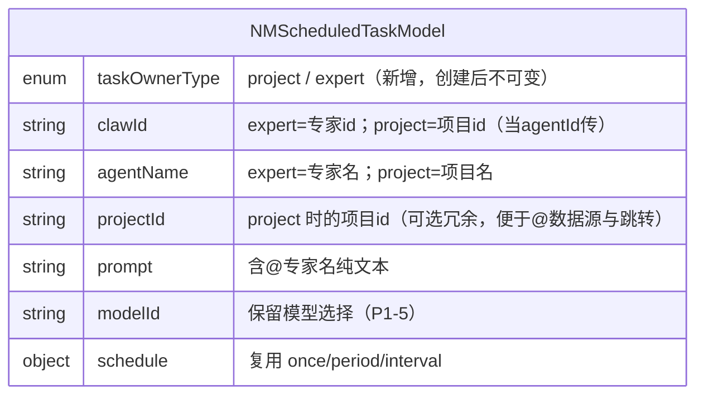
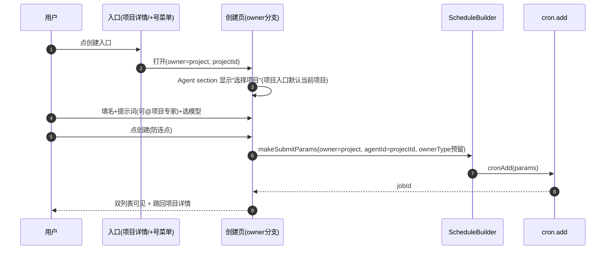

# 技术方案：纳米Work-项目支持创建定时任务（NAMI-053）

**创建日期**：2026-07-02
**存放路径**：`Plans/客户端技术方案/2026-07-02-纳米Work-项目创建定时任务.md`
**状态**：已采纳
**lifecycle_state**：architecture
**平台**：客户端（iOS）
**关联需求（真理源）**：`Plans/需求分析/2026-07-02-纳米Work-项目创建定时任务.md`

---

## 一、背景与目标

- **业务需求/痛点**：定时任务当前只能建"专家任务"、无法归属项目。要新增"项目任务"，支持从项目详情页 / 自动化页双入口创建，任务归属项目，提示词可 @ 项目专家。
- **成功指标**：项目详情页可创建归属该项目的定时任务；自动化列表混排两类任务并按图标区分；@ 项目专家可用。
- **非目标**：不改造现有专家任务创建流程；不引入后端新契约（复用 cron）；不做项目任务在会话流的卡片形态（P1-6 后置）；@所有人 / @外部专家不做。

### 核心决策（来自需求 P0 闭环，架构基石）

1. **项目 = 智能体**：项目任务创建时把 `project_id` 当作 `agentId` 传入现有 `cron.add`（`NMScheduledTaskScheduleBuilder.makeSubmitParams` 第 110 行 `params["agentId"] = clawId`）。**不新增后端 type/project_id 契约**，执行体由后端解析。
2. **整链复用**：`NMScheduledTaskCreateViewController` / `NMScheduledTaskModel` / `NMScheduledTaskScheduleBuilder` / `rpc.cronAdd` / 详情页 / 编辑页 / 启停删除 全部复用。
3. **智能体类型字段（新增·预留）**：创建任务时新增「智能体类型」字段区分 project / expert。**字段的具体命名与传参方式先在客户端预留（本地 enum + 提交参数占位），待与服务端商定后接线**——不阻塞 UI 与主流程。

---

## 二、AI 行为准则

1. 先模块划分 + 复用点，再写实现。
2. 外科手术式改动：只在现有创建链路上做"选专家↔选项目"分支与字段预留，不重写。
3. 缺信息列「待确认」（智能体类型字段传法、项目专家数据源接口）。

---

## 三、原则对照

| 原则 | 要求 |
|------|------|
| DRY / KISS / YAGNI | 最大化复用现有 cron 创建链路；项目任务与专家任务共用一套表单，仅"Agent section"分支为"项目 section" |
| OCP | 用 `taskOwnerType` 枚举扩展表单，而非在各处 if project else expert 硬编码 |
| SRP | @ 项目专家数据源经 provider 注入，不侵入输入框组件 |

---

## 四、约束与前提

- **版本/环境**：iOS 15+，分支 `feature/0701/preject`，`.xcworkspace`。
- **依赖服务**：Gateway `cron.add` / `cron.update` / `cron.jobsByIds`（已有）；项目专家名单来源（`projectExpertsList(projectId)`，项目二期占位，见下）。
- **依赖二期**：项目内专家团的 @ 输入能力（`NMInputBar.isMentionExpertEnabled` + `mentionExpertProvider`，已落地）。
- **待确认**：智能体类型字段传参方式（与服务端商定）；项目专家数据源接口是否就绪。

---

## 五、架构设计

### 客户端分层

Presentation（创建页/详情页/+号菜单/项目详情按钮/@输入页）→ Domain（`NMScheduledTaskModel` 表单态 + `taskOwnerType`）→ Data（`NMScheduledTaskScheduleBuilder` 参数构造 + `GatewayRPCClient.cronAdd`）。

### 模块边界（必填）

| 模块 | 职责 | 输入/输出 | 依赖模块 | 改动类型 |
|------|------|-----------|----------|----------|
| 项目详情页按钮（3.1） | `NMProjectDetailViewController` 右上角/列表底加「创建自动化任务」按钮 | tap → 打开创建页(project 入口，带 projectId) | 创建页 | 🆕 新增按钮 |
| +号下拉菜单（3.2） | `NMTaskListContainerViewController` 的 `handleCreateScheduledTaskTapped` 改为先弹菜单 | tap + → 菜单(专家/项目) | 菜单组件、创建页 | ⚠️ 改造入口 |
| 下拉菜单组件（3.2） | 新增浅灰圆角浮层：专家/项目两项 | 选择 → 分派创建路径 | — | 🆕 新增 |
| 创建页 owner 分支（3.3/3.4） | `NMScheduledTaskModel` 加 `taskOwnerType`；创建页 Agent section 按 owner 显示"选专家"或"选项目" | model → 表单 | 项目选择器 | ⚠️ 增量分支 |
| 项目选择器（3.4） | 自动化页项目入口顶部"执行任务的项目"选择器 | 选中 → project_id | 项目列表数据源 | 🆕 新增 |
| @ 项目专家输入（3.6/D1） | 复用 `NMInputBar` mention 能力；provider 换 `projectExpertsList` | 输入@/点@按钮 → 插入@专家名 | 项目专家数据源 | ⚠️ 复用+换源 |
| 提交参数（S1/P0-2） | `makeSubmitParams`：project 任务 `agentId = projectId`；预留 owner 字段 | model → params | RPC | ⚠️ 增量 |
| 列表卡片图标（3.5/D2） | 自动化列表 project 任务用项目图标 + 「项目名·时间」 | CronJob → cell | `NMScheduledTaskCellVM` | ⚠️ 增量分支 |
| 详情/编辑复用（P0-4） | 复用现有详情页/编辑页；按 owner 区分展示 | jobId → 详情 | — | ✅ 复用 |

```mermaid
flowchart TB
  subgraph Presentation
    Btn[项目详情按钮 3.1]
    Menu[+号下拉菜单 3.2]
    Create[创建页 owner分支 3.3/3.4]
    ProjPicker[项目选择器 3.4]
    AtInput[@项目专家输入 3.6]
    Cell[列表卡片图标 3.5]
  end
  subgraph Domain
    Model[NMScheduledTaskModel + taskOwnerType]
  end
  subgraph Data
    Builder[NMScheduledTaskScheduleBuilder]
    RPC[GatewayRPCClient.cronAdd]
  end
  Btn --> Create
  Menu --> Create
  Create --> Model
  ProjPicker --> Model
  AtInput --> Model
  Model --> Builder --> RPC
  Cell --> RPC
```

### 数据模型（表单态增量）



| 字段 | 类型 | 必填 | 说明 |
|------|------|------|------|
| taskOwnerType | enum(project/expert) | 是 | **新增**；入口决定，创建后不可变；驱动表单分支与列表卡片 |
| clawId | String? | 是 | 复用现有字段：project 任务塞 projectId（P0-2） |
| projectId | String? | project 必填 | 冗余保存，供 @ 数据源、点击跳转、列表卡片"项目名"展示 |
| 其余 | — | — | 完全复用现有 `NMScheduledTaskModel` |

### API Schema / 接口契约

**复用现有 `cron.add`**（无新增后端契约）。project 任务提交参数：

```json
{
  "name": "任务名称",
  "agentId": "<project_id>",
  "payload": { "kind": "agentTurn", "message": "含@专家名的提示词", "model": "<internalModelId>" },
  "schedule": { "kind": "cron", "expr": "..." },
  "ownerType": "project"
}
```

> `ownerType`（或后端商定的等价字段）为**预留占位**——客户端先在 `makeSubmitParams` 里带上本地 owner 值，服务端契约确定后再对齐字段名/取值。若服务端最终不需要（仅靠 agentId=projectId 即可辨识），则移除该占位，零成本。

**待确认字段（与服务端商定）**：

| 疑问 | 现状 | 决策方式 |
|------|------|----------|
| 智能体类型字段名/取值 | 客户端预留 `ownerType` | 与服务端对齐后接线 |
| 项目专家名单接口 | `projectExpertsList(projectId)` 占位（`NMChatViewController:1547` TODO） | 复用二期接口，就绪后换 provider |
| 编辑回显如何识别 project 任务 | 详情/编辑复用，靠 owner 或 agentId 命中项目 | 与服务端 job 实体字段对齐 |

### 关键流程



---

## 六、方案选项与决策矩阵

| 方案 | 复用度 | 复杂度 | 风险 | 备注 |
|------|--------|--------|------|------|
| A 复用现有创建链路 + owner 分支 | 高 | 低 | 低 | 只增量，专家流程零改动 |
| B 为项目任务新建独立创建页 | 低 | 高 | 中 | 大量重复表单/schedule 逻辑，违 DRY |

**推荐：方案 A** — 需求已明确"复用现有定时任务详情/编辑"、"项目=智能体"，方案 A 与之天然契合；专家任务流程完全不动，回归风险最小。

---

## 七、上线与回滚

- **发布步骤**：随 App 版本 v1.3.0 发布。
- **回滚触发**：项目任务创建失败率异常 / 专家任务流程回归。
- **回滚操作**：入口按钮与 +号菜单可用云控/开关隐藏，退回"仅专家任务"；owner 分支为增量代码，隐藏入口即不可达。
- **数据迁移**：无（复用 cron，历史专家任务不受影响）。

---

## 八、实施计划（对齐 WBS 4–10）

| 阶段 | 内容 | 对齐 WBS |
|------|------|----------|
| 1 | `NMScheduledTaskModel` 加 `taskOwnerType`/`projectId`；`isValidForSubmit` 兼容 project | 4 |
| 2 | `makeSubmitParams` project 分支（agentId=projectId + ownerType 预留）；@ 项目专家 provider 接线 | 5 |
| 3 | 项目详情页按钮（3.1）+ +号下拉菜单（3.2）+ 项目选择器（3.4） | 6/8 |
| 4 | 创建页 Agent section owner 分支（选专家↔选项目）；@ 输入页对稿 | 6/7/8 |
| 5 | 自动化列表卡片图标区分（3.5） | 7/8 |
| 6 | 详情/编辑复用验证 + 启停删除 + 边界（无专家降级/项目删除置空/创建失败toast） | 9 |
| 7 | 联调 + 设计走查（真机） | 10 |

---

## 九、验收标准

- [ ] project 任务经 `cron.add`（agentId=projectId）创建成功，双列表可见
- [ ] 专家任务创建流程零改动（回归通过）
- [ ] +号先弹菜单，专家路径 100% 走原流程
- [ ] @ 项目专家可插入纯文本；无专家时降级不弹
- [ ] 列表 project 任务显示项目图标 + 「项目名·时间」
- [ ] `taskOwnerType` 驱动分支，无散落硬编码
- [ ] 智能体类型字段为可摘除的预留占位（服务端未定不影响主流程）
- [ ] 分层无违规（UI 不直连 RPC，经 Builder）

---

## 十、待确认（不阻塞 UI/主流程，Data 联调前需闭环）

1. **智能体类型字段**：与服务端商定字段名/取值（客户端已预留 `ownerType`）。
2. **项目专家名单接口**：`projectExpertsList(projectId)` 是否就绪（二期占位）。
3. **编辑回显识别**：job 实体靠什么字段判定 project vs expert。

---

## 续做

```
/resume plan=Plans/客户端技术方案/2026-07-02-纳米Work-项目创建定时任务.md 进度=方案已采纳待拆任务
```

**下一阶段 Skill**：`/task-splitter`，将本方案拆解为 `Plans/功能开发/` 原子任务。

---

```yaml
skill_run:
  skill: architecture-design-assistant
  date: 2026-07-02
  utility: high
  reason: >
    通过阅读现有 cron 创建链路（makeSubmitParams 第110行 agentId=clawId、
    NMInputBar mention 能力、项目详情输入栏），确认"项目=智能体"决策可零后端契约落地，
    并把用户新增的"智能体类型"需求收敛为可摘除的预留占位，避免 Data 层被未定契约阻塞。
  followups:
    - 智能体类型字段传法 / 项目专家接口 需 Data 联调前与服务端闭环
```
