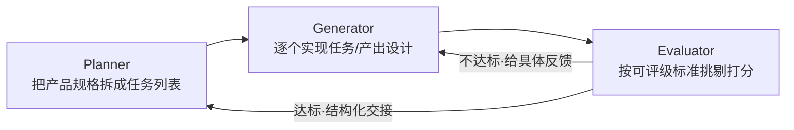

# Claude Code 使用分享 · 第 1 期（2026-07-01）

本期深挖 1 篇 Anthropic 官方工程博客文章，英文一手，中文链接经纳米Work翻译。面向技术同学，也照顾产品/设计/运营视角。

> 首期说明：为跑通周报流程，本期选文放宽到近半年（官方源本周无 8 周内新文）。后续常规期严格执行「近 8 周新发」，每期只深挖 1 篇。

---

## 长跑型编码智能体的 harness 设计：用「生成器 / 评估器」分离突破单 agent 的质量天花板

**原文**：https://www.anthropic.com/engineering/harness-design-long-running-apps
（Prithvi Rajasekaran / Anthropic Labs，2026-03-24）
**中文链接（纳米Work）**：⏸ 待回填

#### 主题

作者 Prithvi Rajasekaran 要同时解决两个方向相反的问题：让 Claude 产出有审美的前端设计（主观、靠品味，没有可自动判定的对错），以及让它无人干预地建完整应用（客观、可验证）。这两件事此前分别靠 prompt 工程和 harness 调优做，都已「well above baseline」，但**都撞到了天花板**。值得写这一篇，是因为作者没有停在「再调调 prompt」，而是去找一个能同时跨越主观与客观两个领域的通用工程方法——最后落到一个可迁移的架构范式上。

#### 想法

这一段是重点，拆解原文的推理链和机制。

**先看单 agent 为什么会到顶**。作者在长任务里观察到两个稳定的失败模式：

1. **上下文连贯性丢失 + 上下文焦虑**。随着 context window 填满，模型在长任务上会逐渐"跑偏"；部分模型还有"context anxiety"——临近它自认为的上下文上限时，会**提前草草收尾**。
2. **自评估失真**。让 agent 评价自己产出的工作时，它倾向于**自信地夸自己**，哪怕在人看来质量明显平庸。这在设计这类主观任务上尤其严重——没有像软件测试那样的二值检查，"这个布局算精致还是平庸"是个判断题，而 agent 给自己打分时可靠地偏正面。

**针对第一个问题，作者区分了两种手段——这个区分很关键**：

| 手段 | 做法 | 效果 | 代价 |
|------|------|------|------|
| Compaction（压缩） | 就地把早期对话总结成短历史，**同一个 agent** 继续 | 保留连续性 | 不给干净的白板，context anxiety 仍在 |
| Context reset（重置） | **清空上下文、起一个全新 agent**，配一份带状态和下一步的结构化交接产物 | 给了干净白板，同时消除 anxiety | 交接产物必须携带足够状态；增加编排复杂度、token 开销、延迟 |

作者实测 Sonnet 4.5 的 context anxiety 强到"光靠 compaction 不够"，所以 **context reset 成了 harness 的必需项**，而不是可选优化。

**针对第二个问题，解法是把「干活的 agent」和「评判的 agent」分开**。作者说得很诚实：分离本身**不会立刻**消除偏松——评估器仍是个 LLM，天然对 LLM 产出宽容。但关键洞察是：**把一个独立评估器调教得挑剔，远比让生成器学会自我批评容易**；一旦这个外部反馈存在，生成器就有了可迭代的具体靶子。

**而让评估器可用的前提，是把主观判断变成可打分的标准**。作者在前端设计上写了 4 条评分标准（如 Design quality：颜色/排版/布局/图像是否构成有辨识度的整体；Originality：是否有定制决策而非套模板），**同一套标准同时给生成器和评估器**——生成时照着做，评估时照着挑。这一步"把'这设计好不好'翻译成'它符不符合我们的设计原则'"，才是整个方法能跑起来的支点。

最终这套思路合成一个三角色架构：



配合从早期 harness 工作带过来的两条经验——把构建**分解成可处理的块**、用**结构化产物在会话间交接上下文**——三 agent 在多小时自主编码会话里产出了完整的全栈应用。

#### 结论

长任务的质量上限由 **harness 的分工结构**决定，而不是靠把单个 prompt 写得更长。核心可迁移的一条：**把"生成"和"评判"分给两个 agent，并为评判方预先定义可打分的标准**——这比训练同一个 agent 既会做又会自省更可行。

适用边界：这套架构有明确代价——context reset 带来编排复杂度、token 开销和延迟；评估器要额外调教且不会一步到位。任务越短、越有天然的二值检查（如单测），收益越小；任务越长、越主观，收益越大。

#### 复用

对照我们的 Kit，逐点看差距：

- **我们已有的**：Workflow 的 fan-out、subagents，相当于有了 planner+generator 的骨架；resume-assistant + Plans/Contexts 三层，对应"结构化产物跨会话交接"。
- **我们缺的**：**独立评估器这一环**。现在 feature-dev 的默认终点是"能跑/测试通过"，等于只有生成器在自评。可落地的改动——在 feature-dev 或 full-cycle 的开发阶段后，追加一个 evaluator 子 agent：喂给它一份**明确的验收标准（AC）**（正好对应 requirement-analyst 产出的可测 AC），让它挑剔打分、不达标打回 generator，把交付标准从"能运行"提升到"达标"。
- **对产品/设计/运营**：同一思路适用于需求评审、原型走查、内容审核——先把"合格"拆成可勾选的评分条目（就像作者的 4 条设计标准），再让一个角色专职按条目挑毛病，而不是让产出者自己判断"我觉得可以了"。

这也和"上下文管理"呼应：context reset vs compaction 的取舍，对我们用 `/loop`、长会话续做时该"压缩"还是"重开带交接"，是直接的决策参考。

---

## ⏸ 交接清单（待人工·纳米Work）

```text
⏸ 待人工（纳米Work）：
  1. https://www.anthropic.com/engineering/harness-design-long-running-apps → 回填中文链接到正文
发帖平台：先攒不自动发
发布后：追加去重清单 1 行、删本 plan
```
