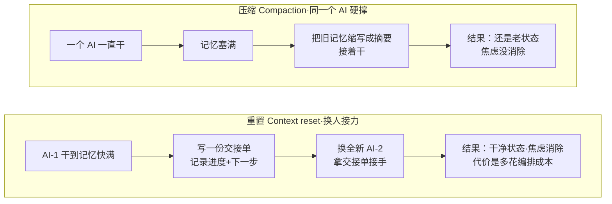
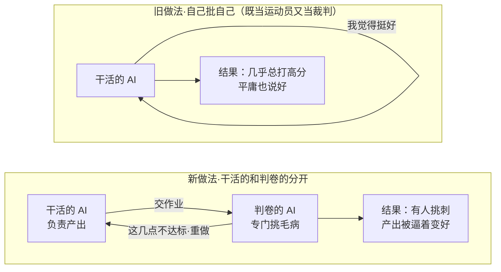

# 长跑型编码智能体的 harness 设计：用「生成器 / 评估器」分离突破单 agent 的质量天花板

> 原文：[Harness design for long-running application development](https://www.anthropic.com/engineering/harness-design-long-running-apps) · Prithvi Rajasekaran / Anthropic Labs · 2026-03-24

## 主题

作者要同时解决两个方向相反的问题：让 Claude 产出有审美的前端设计（主观、靠品味，没有可自动判定的对错），以及让它无人干预地建完整应用（客观、可验证）。这两件事此前分别靠提示词工程和 harness 调优做，都已做到明显高于基线，但**都撞到了天花板**。

真正值得讲的是：作者没有停在"再调调提示词"，而是去找一个能同时跨越主观与客观两个领域的通用方法——最后落到一个可迁移的架构范式：**把「干活」和「评判」拆成两个 AI**。它讲的是"如何用工作流放大 AI 的产出质量"，而不是"换一个更强的模型"。

## 想法

### 第一步：先搞清单个 AI 为什么会到顶

作者在长任务里观察到两个稳定的失败模式：

1. **越干越跑偏 + "上下文焦虑"**。AI 的"记忆"（上下文窗口）会被越填越满，长任务上逐渐跑偏；有的模型还会在感觉"快记不下了"时**提前草草收尾**。
2. **自己评自己，总说好**。让 AI 评价自己刚产出的东西，它倾向于**自信地夸自己**，哪怕在人看来质量平庸。设计这类主观任务尤其严重——没有像跑单元测试那样的对错标准，"这个页面算精致还是平庸"是个判断题，AI 给自己打分时可靠地偏高。

### 第二步：针对"记忆塞满"，区分两种手段

一种是"压缩"（把旧记忆缩写、同一个 AI 接着干），一种是"重置"（换一个全新 AI、拿一份交接单接手）。用图看最清楚：

作者实测 Sonnet 4.5 的"上下文焦虑"强到光靠压缩不够，所以**重置成了必需项**，不是可选优化。

### 第三步：针对"自己评自己总说好"，把干活的和判卷的分成两个 AI

作者说得很诚实：分开本身**不会立刻**变严——判卷的 AI 也是个 AI，天生对 AI 产出宽容。但关键洞察是：**把一个专职判卷的 AI 调教得挑剔，远比让干活的 AI 学会自我批评容易**；一旦有了这个外部的挑刺者，干活的 AI 就有了可以对着改的具体靶子。这就像学生自批作业和请专门判卷老师的差别：

### 第四步：让判卷的 AI 能用起来，前提是把"好不好"变成可打分的条目

作者给前端设计写了 4 条评分标准，同一套标准**同时发给干活的和判卷的 AI**——生成时照着做，评分时照着挑：

| 标准 | 判什么 | 作者的权重取舍 |
|------|--------|----------------|
| 设计质量 | 颜色/排版/布局是否构成有辨识度的整体 | **加重**——Claude 默认在这项偏平庸 |
| 原创性 | 有没有定制决策，还是套模板/一眼AI味（如白卡片配紫渐变） | **加重**——逼模型冒点审美风险 |
| 工艺 | 排版层级、间距、对比度等技术执行 | 不加重——Claude 默认就做得不错 |
| 可用性 | 用户能不能看懂界面、找到主操作 | 不加重——默认达标 |

把"这设计好不好"翻译成"它符不符合这 4 条"，才是整个方法能跑起来的支点。作者还用**打好分的样例**校准判卷 AI，避免它多轮评分标准漂移。

### 第五步：真跑起来是什么样

作者在 Claude Agent SDK 上搭这个循环，还给判卷 AI 配了 Playwright（浏览器操作工具）——它会**自己打开网页、截图、仔细看**再打分，而不是看一张静态截图。每次生成跑 5–15 轮，一整轮下来最长要 4 小时。

有个惊艳案例：给"荷兰艺术博物馆"网站命题，第 9 轮还是常规的深色落地页，**第 10 轮它直接推翻重来**，做成了一个 CSS 透视的 3D 展厅、墙上挂画、用门来导航——这是单次生成从没出现过的创意跳跃。

### 最后：这套思路迁移到写代码

生成器-评估器的循环天然对应软件开发流程——**代码评审和 QA，扮演的正是"评估器"的角色**。合成的完整架构是三角色：

## 结论

长任务的质量上限由 **harness 的分工结构**决定，而不是靠把单个提示词写得更长。最可迁移的一条：**把"生成"和"评判"分给两个 AI，并为评判方预先定义可打分的标准**——这比训练同一个 AI 既会做又会自省更现实。

适用边界要讲清：这套架构有明确代价——"重置"带来编排复杂度、token 开销和延迟；判卷 AI 要额外调教、还不会一步到位（作者跑到 4 小时/次）。**任务越短、越有天然对错检查（如单测），收益越小；任务越长、越主观，收益越大。** 别无脑套用。

## 复用

对照实际工程实践，逐点看差距：

- **通常已有的**：多智能体的任务分发、子 agent 编排，相当于有了"规划者+干活者"的骨架；断点续做 + 分层的临时/长期上下文，对应"写交接单、换人接力"。
- **通常缺的关键一环——判卷者**。多数流程的默认终点是"能跑/测试通过"，等于只有干活的 AI 在自评。可落地的改动：在开发阶段之后，追加一个独立的评估 agent，喂给它一份**明确的验收标准（AC）**，让它挑剔打分、不达标打回，把交付标准从"能运行"提升到"达标"。
- **对产品/设计/运营同样适用**：需求评审、原型走查、内容审核——**先把"合格"拆成几条可勾选的条目**（就像作者那 4 条设计标准），再让一个角色专职按条目挑毛病，而不是让产出者自己说"我觉得可以了"。
- **一个直接的决策参考**：文中"压缩 vs 重置"的取舍，对长会话续做时该"压缩历史"还是"重开+交接单"，是现成的判断依据——焦虑明显时选重置。
