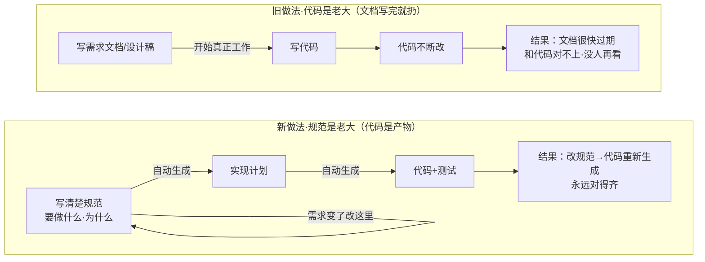
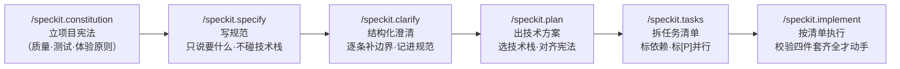
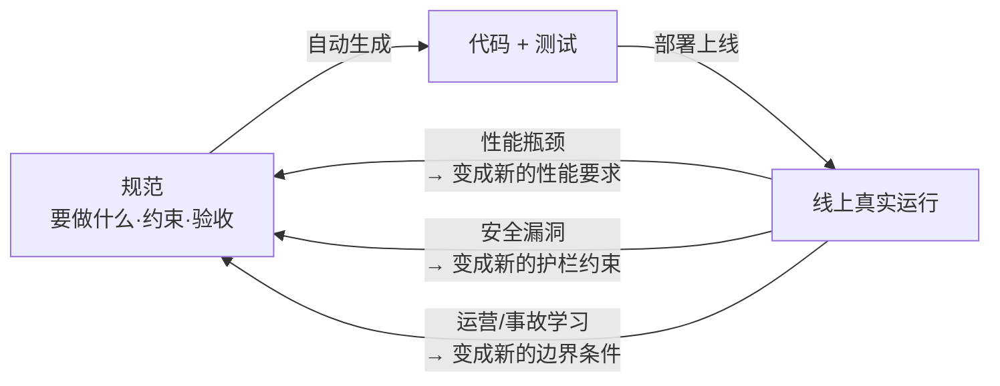
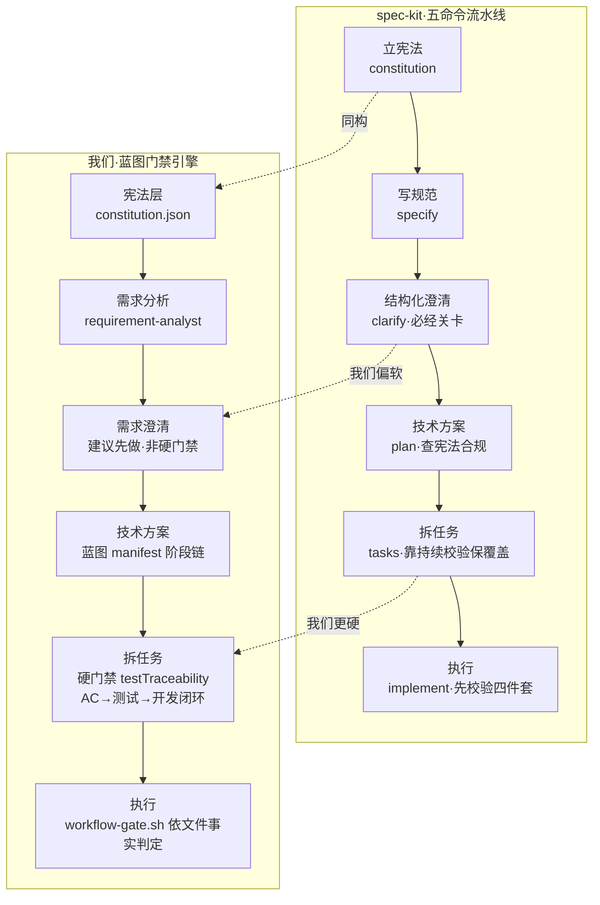

# spec-kit：把「规范」从一次性的脚手架，翻转成生成代码的唯一真理源

> 原文：[github/spec-kit](https://github.com/github/spec-kit) · GitHub 开源 · 方法论长文 [spec-driven.md](https://github.com/github/spec-kit/blob/main/spec-driven.md)

## 主题

过去几十年，写软件的默认顺序是：先写点需求文档、设计稿，然后开始"真正的工作"——写代码。文档是脚手架，代码盖起来之后就被丢在一边，很快和实际实现对不上。GitHub 开源的 spec-kit 想解决的就是这条老裂缝：**规范和代码永远对不齐**。

它的做法不是"把文档写得更细一点"，而是把主从关系整个倒过来——作者称之为「权力倒置」（Power Inversion）：不是文档服务于代码，而是**代码服务于规范**。规范不再是指导实现的参考，而是**直接生成实现的源头**。值得写这一篇，是因为这套方法论恰好是一面镜子：我们自己刚落地的工作流门禁引擎，做的其实是同一件事的另一半——而 spec-kit 把「另一半」讲得很透。

## 想法

### 为什么"文档和代码对不齐"是个治不好的老病

先讲清楚这个病的病根，才知道 spec-kit 的药方为什么不一样。

传统做法里，代码是唯一的真理源（source of truth）。需求文档、设计图、PRD 都是"好意"，但它们和代码是两份分开的资产：代码往前跑，文档很少跟得上。想在不动代码的前提下试另一种实现，几乎不可能，因为实现和代码本身是同一个东西。过去所有尝试——更好的文档、更严的流程——都默认"这条裂缝不可避免"，只想缩小它，从没想过消灭它。

spec-kit 的核心主张是：当规范精确、完整、无歧义到**足以直接生成可运行系统**时，裂缝就不存在了——只剩"转换"。规范变成主产物（primary artifact），代码只是它在某种语言/框架下的一次"表达"。维护软件 = 演进规范；调试 = 修那份生成了错误代码的规范；重构 = 为了清晰而重组规范。

### 药方落地：五个命令把「想法→规范→计划→任务→实现」串成流水线

光讲理念会飘，spec-kit 的价值在于它把这套方法固化成了可执行的命令。装好后你会在编码智能体（Claude Code、Copilot、Codex 等）里看到五个 slash 命令，它们对应一条严格有序的流水线：

每一步都产出具体、可版本化的文件，而不是聊完就散：

- **`/speckit.constitution`** —— 在 `.specify/memory/constitution.md` 写下项目的治理原则（代码质量、测试标准、体验一致性、性能要求）。后续每一步都要引用它。这是"宪法"，是所有决策的地基。
- **`/speckit.specify`** —— 把一句话功能描述变成结构化规范：自动扫已有 spec 决定下一个编号（001、002…）、自动建语义化分支、套模板生成 `specs/[分支名]/spec.md`。**重点原则：只说要做什么、为什么，绝不碰技术栈**。
- **`/speckit.clarify`** —— 规范驱动的关键一环，也是最容易被忽略的：**在做技术计划之前**，用覆盖式的结构化提问逐条澄清模糊点，答案记进规范的 Clarifications 段。官方明确说"别把 AI 的第一版当最终版"。
- **`/speckit.plan`** —— 到这一步才谈技术栈。它读规范→做**宪法合规检查**（Constitutional Compliance）→把业务需求翻译成技术架构，产出 `plan.md`、`data-model.md`、`contracts/`、`research.md`、`quickstart.md` 一整套。
- **`/speckit.tasks`** —— 把计划拆成可执行任务清单 `tasks.md`：**按用户故事分组**、**标注依赖顺序**（模型先于服务、服务先于接口）、**能并行的标 `[P]`**、每个任务写清落到哪个文件、如果要测试则**测试任务排在实现之前**（TDD）。
- **`/speckit.implement`** —— 执行前先**校验四件套齐全**（宪法、规范、计划、任务），然后按依赖顺序和并行标记执行，遵循 tasks 里定义的 TDD 流程。

这条链最值得注意的两个机制：一是 **clarify 是"必经关卡"而非可选**——官方把"在 plan 之前先澄清"列为强约束，因为返工成本在下游会指数放大；二是 **一致性校验是持续的、不是一次性门**——AI 反复分析规范里的歧义、矛盾、遗漏，作为持续精炼而非某个阶段的一次性 gate。

为什么 clarify 非要卡在 plan **之前**、而不是让 AI 一路生成完再回头修？这才是这个关卡真正的设计动机。规范里的一处模糊（比如"支持批量导入"没说单次上限、失败是否回滚），到了 plan 阶段会被 AI 用一个它自己拍脑袋的假设填上，这个假设又被 tasks 拆成具体任务、被 implement 写进代码和测试。等你在实现里发现假设错了，要改的已经不是"一句规范"，而是规范、计划、任务、代码、测试五层里所有基于那个错误假设长出来的东西——这就是"返工成本指数放大"的具体含义。clarify 把提问强制前移到假设尚未扩散时，用一轮结构化追问把模糊点在源头钉死，答案回写进规范的 Clarifications 段，让下游每一步都站在已澄清的地基上生成。它治的不是"AI 答错了"，而是"AI 在你没发觉时替你做了决定"。

### 三个原则支撑整套方法

spec-kit 把方法论收敛成几条核心原则，其中三条最关键：

- **规范即通用语（Lingua Franca）**：规范是主产物，代码是它的表达，维护软件就是演进规范。
- **可执行规范（Executable Specifications）**：规范必须精确、完整、无歧义到能生成可运行系统——这才消灭了意图与实现之间的裂缝。
- **双向反馈（Bidirectional Feedback）**：生产环境的现实反过来喂给规范。线上指标、事故、运营学习都成为下一轮规范精炼的输入——性能瓶颈变成新的非功能需求，安全漏洞变成约束所有后续生成的护栏。

第三条"双向反馈"最容易被读成一句口号，但它其实是这套方法能不能长期跑下去的关键。传统做法里，线上出了问题，工程师是去改代码；spec-kit 要求你回到规范去改，让修复从源头重新生成。这样规范才不会随时间又变回一份过期文档——它被线上现实持续校准，形成一个闭环：

这张图和前面「规范是老大」那张的区别在于：前一张讲的是**一次性从规范到代码的正向生成**，这一张讲的是**线上现实反向回灌规范**的持续闭环。缺了这条回灌线，规范会和早年的 PRD 一样越放越旧；有了它，规范才真正成为"活的真理源"。

## 结论

最该记住的一条：**spec-kit 不是"更好的文档工具"，而是把真理源从代码搬到规范**。当规范足够精确可执行，改需求就从"手工往文档/设计/代码三处传播改动"变成"改一处规范、下游重新生成"——这是它宣称能提效的根。

适用边界也要讲清楚，别当银弹：

- 它**吃 AI 模型能力**——"规范精确到能生成可运行系统"这个前提，在复杂系统里并不总成立，模糊规范照样生成模糊代码。
- 它对**绿地（Greenfield）项目最顺**；棕地（Brownfield）改造要额外区分"工具升级"和"规范演进"两条更新线，官方专门写了 Evolving Specs 指南来处理这种复杂度。
- 它带来**流程纪律成本**：五个命令、四件套、必经的 clarify 关卡，对小改动是过重的。任务越小、越一次性，这套仪式的边际收益越低。

## 复用

这一篇的价值不在"照抄 spec-kit"，而在它逐条印证了我们工作流引擎的设计方向，也照出了差距：

下面这张图把两边逐格对齐——同一条流水线上，哪几格我们已经有对应件、哪一格是 spec-kit 有而我们偏软、哪一格反过来是我们更硬：

- **我们已经有的、和 spec-kit 同构的部分**：我们的蓝图 manifest + 机械门禁（`workflow-gate.sh`）本质就是 spec-kit 那条"有序阶段链 + 每阶段产出可版本化文件"的流水线；我们的 `constitution.json` 对应 `/speckit.constitution` 的宪法层；「无 Epic 即 BLOCKED」「test-first 先于 development」的硬门禁，对应 `/speckit.implement` 执行前"校验四件套齐全"。方向是对的。

- **spec-kit 有、值得对照吸收的一点——`clarify` 作为独立必经关卡**：它把"在做技术方案之前先结构化澄清"提成一道显式 gate，答案回写进规范。我们的 `requirement-analyst` Skill 做类似的事，但它是"建议先做"而非"门禁强制先做"。可考虑把「需求澄清完成」做成 client-dev 蓝图里 requirement→test-first 之间的一道显式 exitCriteria，让它像 spec-kit 一样成为不可跳过的关卡。

- **我们刚补的 traceability，正是 spec-kit 没显式做的那一环**：spec-kit 的 tasks 会把契约/实体/场景转成任务，但它靠"持续一致性校验"这种较软的方式保证覆盖。我们这轮落地的 `testTraceability`/`devTraceability`（AC→测试→开发切片的闭环校验）是更硬的横向可追溯性门禁——这一点上我们的机械门禁比 spec-kit 更严，是我们的相对优势，值得保留并对外讲清楚。

- **对产品/设计/运营同样有用的一个迁移**：spec-kit 的核心动作——"在动手之前，先把要做什么、为什么，写成一份精确到无歧义的规范，并逐条澄清边界"——不限于写代码。需求评审、活动方案、内容规划都适用：**先把"要什么"和"为什么"写死并逐条澄清，再谈"怎么做"**，比一上来就讨论执行细节返工少得多。这正是 `/speckit.specify` 那条"只说要什么、不碰技术栈"原则的通用版本。
