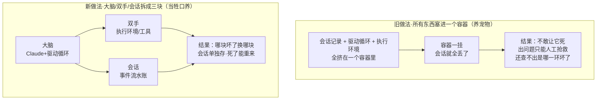
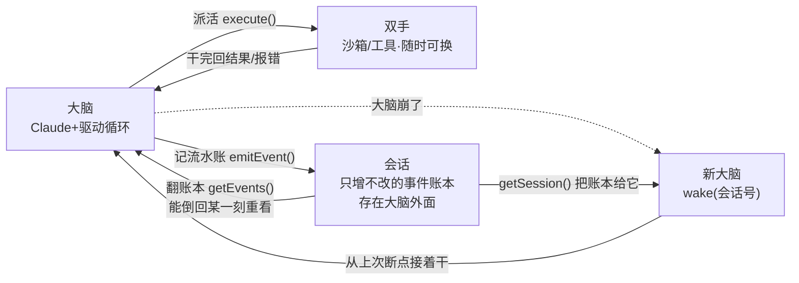
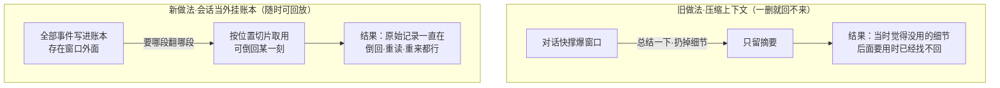

# 当 harness 开始过期：Anthropic 把 Agent 拆成「大脑 / 双手 / 会话」

#### 主题

驱动一个 Agent 干活的那层代码——负责调用模型、给它搭好工作环境、把它的工具调用转发出去——业内叫 harness。它有个隐藏属性：**每一段 harness 逻辑，本质上都是在替模型补它「暂时还做不到」的那部分**。今天是顶梁柱，明天可能就是死代码，因为模型一直在变强。

Anthropic 工程博客给了一个亲历的例子：Claude Sonnet 4.5 有个毛病，叫「上下文焦虑」——它一感觉到上下文窗口快满，就会草草收尾、提前把任务结掉。团队在 harness 里加了「上下文重置」来治它。可等把同一套 harness 换到更强的 Opus 4.5 上跑，这个毛病自己消失了，那段重置逻辑就成了纯粹的负担。

与其没完没了地给同一个 harness 打补丁，Anthropic 干脆造了 Managed Agents：一个托管服务，用「一小组刻意设计得能活得比任何具体实现都久」的接口来跑长周期 Agent。作者是 Lance Martin、Gabe Cemaj、Michael Cohen，是这条「怎么造有效的 Agent、怎么设计 harness」系列的最新一篇。

这一篇值得单独深挖，是因为它把一个抽象原则做成了产品：**别把今天的限制，焊死在本该长期稳定的那一层里**。它给这个原则起了个老名字——为「尚未被想到的程序」做设计，就像几十年前操作系统把硬件抽象成「进程」「文件」，抽象活得比硬件还久。

#### 想法

**一个容器装下所有东西，就等于养了一只「宠物」**

最初的做法很自然：把会话记录、harness、沙箱(执行环境)全塞进同一个容器。好处实打实——改文件就是直接系统调用，没有服务边界要设计。

但这么一耦合，就踩进了运维界的老坑：他们养了一只「宠物」。运维圈有个「宠物 vs 牲口」的比喻——宠物是有名有姓、你舍不得它死、坏了要精心救治的个体；牲口是可随意替换的。这里那个容器就成了宠物：容器一挂，会话就全丢；容器一卡，就得人工把它救活。

更要命的是查不了故障。他们唯一的观察窗口是一条 WebSocket 事件流，可这条流告诉不了你故障**出在哪一环**——harness 有 bug、网络丢了个包、容器下线了，三种情况看起来一模一样。真要查，就得开个 shell 钻进容器里,但那个容器同时装着用户数据,于是「进去查」这条路基本等于「没法查」。

还有第二个被焊死的假设：harness 默认 Claude 要处理的东西就在自己这个容器里。可当客户希望 Claude 去操作他们自己私有云(VPC)里的资源时,就只能要么把客户网络和 Anthropic 的对接,要么让客户自己跑这套 harness——一个藏在 harness 里的假设,一换环境就变成了障碍。

**把大脑、双手、会话拆开，让每一块都能单独死、单独换**

解法是把三样东西解耦：**大脑**(Claude + harness)、**双手**(沙箱与工具)、**会话**(事件日志)。每一样都变成一个「对别的部分几乎不做假设」的接口，都能各自失败、各自替换。

先说双手。harness 不再住在容器里，它现在**像调用任何一个工具那样调用容器**——一个统一形状:`execute(名称, 输入) → 字符串`。容器就此变成了「牲口」:它一死,harness 只是收到一个「工具调用失败」的报错,把这个错原样丢回给 Claude;要是 Claude 决定重试,就用一套标准配方 `provision({资源})` 重新拉起一个新容器。再也不用守着病容器抢救了。

再说大脑自己。harness 本身也变成了牲口——因为**会话日志存在 harness 外面**,harness 里没有任何东西是「必须活着」的。某个 harness 崩了,就用 `wake(会话号)` 重新拉起一个,用 `getSession(号)` 把整本事件账取回来,从最后一个事件接着往下干。运行过程中,它用 `emitEvent(号, 事件)` 把每一步都持久地记进账本。

**凭证不能和模型生成的代码待在同一间屋子里**

耦合设计还埋了个安全炸弹:Claude 生成的、不可信的代码,和各种访问凭证跑在**同一个容器**里。于是一次提示词注入攻击,只要骗 Claude 去读一下自己的环境变量,就能拿到令牌;拿到之后,攻击者能凭它开出全新的、不受限的会话,再把活派出去。「把令牌权限缩小」是显而易见的缓解手段,但它又在赌「Claude 用一个受限令牌干不成坏事」——而 Claude 越来越聪明,这个赌注很脆。

结构性的修法是:让令牌**从跑生成代码的沙箱里根本够不着**。他们用了两种模式。一是把认证和资源绑在一起:对 Git,初始化沙箱时用仓库的访问令牌把代码克隆下来、接进本地 git remote,之后沙箱内部 `push`/`pull` 照常工作,但 Agent 全程碰不到那个令牌。二是把认证放进沙箱外的保险库:自定义工具走 MCP,OAuth 令牌存在安全 vault 里,Claude 通过一个专用代理去调 MCP,代理拿着会话令牌去 vault 换出真凭证、再去调外部服务——harness 自始至终不知道任何凭证的存在。

**会话不是模型的上下文窗口**

这是全文最微妙、也最容易被忽略的一点。长周期任务的信息量必然超过上下文窗口装得下的。业界的常规解法——压缩(总结一遍再重开窗口)、记忆工具(写进文件)、上下文裁剪(丢掉旧的工具结果和思考)——**全都在做不可逆的取舍**:一旦决定丢掉某段,就很难要回来。而问题恰恰在于,你当下根本判断不了「未来某一步会用到哪段」。

已有研究给的思路是:把上下文当成一个**活在窗口外面的对象**——比如一个放在 REPL 里的对象,模型想用就写代码去过滤、去切片。Managed Agents 的会话给的是同一种好处,但存得更稳:它不是塞在沙箱或 REPL 里,而是**持久地落在会话日志里**。接口 `getEvents()` 让大脑能按位置切片去「审问」上下文——从上次读到的地方接着读、倒回某个时刻之前几个事件看看前因、或者在做某个动作前重读一遍上下文。取回来的事件还能先在 harness 里做转换再喂给 Claude(比如为了提高提示词缓存命中率而重新组织)。他们特意把「可恢复的存储」(会话)和「任意的上下文管理」(harness)分开,理由很清醒:**没人能预测未来的模型需要哪种上下文工程**,所以只保证会话是持久、可审问的,把具体怎么管理推给可替换的 harness。

**多个大脑、多双手:解耦顺手带来的速度与规模**

解耦不只是让系统更结实,还顺手解决了性能和扩展。

先看「多个大脑」。当大脑还住在容器里时,每个大脑都得配一个容器;容器没拉起来之前,一个字都推理不了;每个会话都得先付满额的容器启动成本——克隆仓库、启动进程、拉取待处理事件——**哪怕这个会话压根不会碰沙箱**。这段死等,体现为 TTFT(首字延迟),也就是用户「点了之后等多久才看到第一个字」的那段最扎心的等待。解耦之后,容器改成「大脑真需要时才通过一次工具调用去开」,不需要沙箱的会话就不用等它;编排层一把待处理事件拉出来,推理就能开始。效果是:**p50 首字延迟降了约 60%,p95 降了 90% 以上**。要扩到很多大脑,就是多起几个无状态的 harness 而已。

再看「多双手」。他们还想让一个大脑连上多双手。这意味着 Claude 得同时琢磨多个执行环境、自己决定把活派到哪儿——比在单个 shell 里干活烧脑得多。一开始用单容器,正是因为早期模型还没这本事;可随着模型变聪明,单容器反而成了瓶颈:它一挂,大脑伸进去的**每一双手的状态都跟着丢**。解耦后每双手都是一个 `execute(名称,输入)→字符串` 的工具,harness 根本不关心沙箱到底是个容器、一部手机、还是一个宝可梦模拟器。而且因为没有哪双手是绑死在某个大脑上的,**大脑之间还能互相传递双手**。

#### 结论

最该记住的一点:真正需要长期稳定的,不是「选哪个 harness」,而是「模型周围那组接口长什么样」。**对接口要有主见,对接口背后的实现不要有主见**——给它一个能操纵状态的会话、一个能做计算的沙箱、以及横向扩到「多大脑多双手」的能力,至于每一样具体怎么实现,留白。这正是为「尚未被想到的程序」做设计的办法,和当年操作系统把硬件虚拟成「进程/文件」、抽象活得比硬件还久,是同一招。

适用边界也要讲清楚,免得盲目照搬。这套东西是**重基础设施**,它的回报出现在平台级规模上:成百上千个并发会话、多租户的安全隔离、以及会在你脚下悄悄变化的模型。一个本地跑、只干一件短任务的 harness,不需要会话日志、不需要代理保险库、也不需要 provision/wake。判断自己是不是「养出了宠物」的信号,恰恰就是他们踩过的那几个:因为状态和执行挤在一起而**查不了故障**、有个**舍不得它死的部件**总在挂、或者你的假设**在两个模型版本之间反复过期**。对任何人都通用的那条规则是:别把今天的限制焊进本该长期稳定的那一层,把权宜之计放进一个你随时能扔掉的层里。

#### 复用

**先说我们已经做对的一半(对照)。** AI-Work-Kit 上周刚落地的工作流三层重构,和这篇文章是同一个动作。我们把 full-cycle 拆成了:积木(执行层=各子 Skill,读写 Plan 干活)、状态机(控制层=full-cycle 引擎 + 蓝图 manifest)、数据上下文(持久层=Epic Plan)。Epic 被降级为「只存不驱动」的被动数据,门禁脚本 `scripts/workflow-gate.sh` 改成读文件系统事实(子 Plan 是否存在 / status / WBS 勾选),而不再读 Epic 的 `lifecycle_state`。这正是文章的核心动作——**别让驱动流程的假设住在数据层里**——我们那一版叫「把大脑和状态解耦」。

**再说我们落后的一半(能力缺口)。** 我们缺一样文章里的关键件:**一本只增不改、可回放的事件账本(会话层)**。今天我们的状态,是从文件系统**快照**里现推出来的——子 Plan 在不在、什么 status、WBS 勾了几格。快照能回答「现在到哪一步了」,但回答不了「怎么走到这一步的」:我们没法 `getEvents()` 按位置切片,没法倒回到「阶段 X 开始之前」的那个状态,没法重放。`resume-assistant` 靠读 Plan 文件重建意图,但重建不了事件序列。具体改动:在 `.workflows/` 下补一层 `runs/<run-id>/events.jsonl` 的追加式事件流,`scripts/workflow-run.py` 在每次阶段跳转/门禁判定时写一条 `emitEvent` 式记录,`resume-assistant` 和门禁就能去切片、去回放,而不只是读当前 Plan 快照。这是我们缺的那层「会话」。

**「harness 会过期」这条,要变成一条流程。** 我们的蓝图(`client-dev.json` 等)里焊着一堆阶段与门禁的假设,它们会随着模型变强而过期——就像那段在 Opus 4.5 上变成死代码的上下文重置。建议给 `workflow-evolution-assistant` 加一个周期性的「死代码门禁审计」:拿当前模型去逐条问「这个阶段/这道门禁还配得上它占的位置吗」,把不再增值的标出来。它可以直接吃我们已经在聚合的 `skill_run.contexts_missing` 信号。

**安全那条,先记一笔备用。** 我们的 Skill 现在带着用户的完整本地权限跑文件读写,只要一切都在本地、都可信,这没问题。但一旦有哪个 Skill 开始跑**不可信的生成代码**(远程沙箱、带密钥的第三方 MCP),就要立刻上代理/保险库那套——绝不让凭证和生成代码待在同一个执行面上。这条现在优先级低,但值得在动任何远程执行之前先想好。

原文:<https://www.anthropic.com/engineering/managed-agents>(Anthropic Engineering · Lance Martin、Gabe Cemaj、Michael Cohen)
