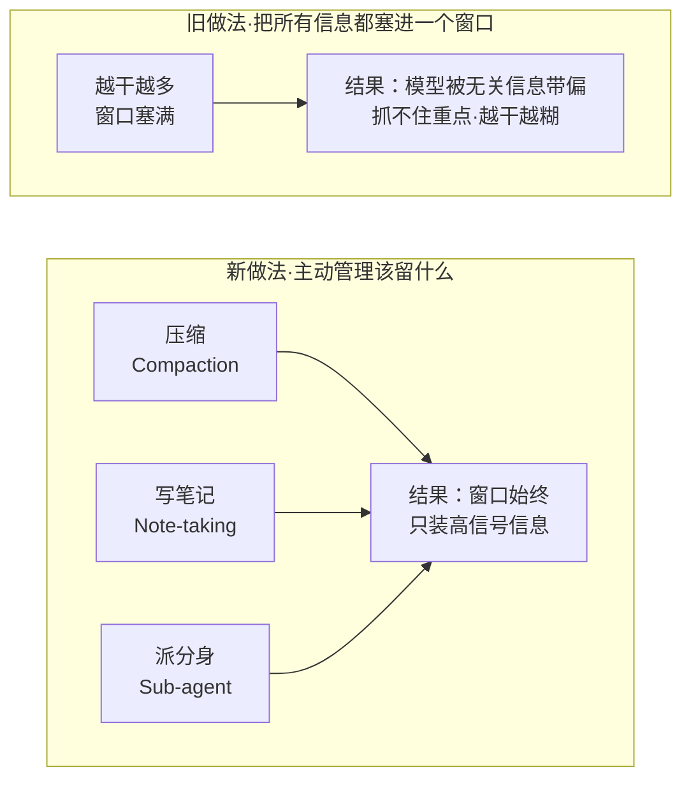
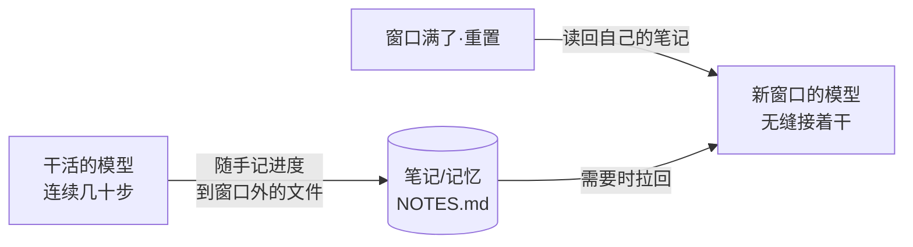

# 上下文工程：为什么给 Agent「喂得少」反而做得好

#### 主题

过去两年，让大模型把活干好的核心手艺，大家习惯叫「提示词工程」——把一段指令反复打磨到位。但 Anthropic 在这篇工程博客里提出一个更贴近现在的说法：**当模型从「回答一个问题」升级成「跨几十上百步连续干活的 Agent」，真正的手艺已经不是写好一句提示词，而是管理好模型每一步能看到的整个上下文。**他们把这门手艺叫「上下文工程」（context engineering）。

差别听起来微妙，落到实践里却是两种思路。提示词工程关心的是「我这一句话怎么说」；上下文工程关心的是「在任意一个时刻，模型的注意力窗口里到底该装哪些信息、装多少、什么时候换掉」。作者给了一个很硬的前提：**模型的注意力是有预算的，装进去的每一个 token 都在稀释其余 token 的权重。** 所以上下文工程的目标不是「尽量多喂」，而是反过来——**找到那个「最小的、高信号的 token 集合」，让模型最可能干对。** 这篇值得写，是因为它把一个反直觉的结论讲清楚了：喂得少，往往做得好。

#### 想法

先说清楚为什么「多喂」会出事。模型的上下文窗口不是越满越好，作者用了一个词叫「上下文污染」（context pollution）——窗口里堆的无关信息越多，模型越容易被带偏、抓不住重点。这跟人一样：桌上摊一百份文件，你反而找不到要用的那份。所以哪怕未来窗口做到几百万 token，「装什么」这件事依然是手艺，而不是「窗口够大就自动解决」。

作者把上下文拆成几个部件，逐个给了「装多少才刚好」的判断标准，其中最有启发的是对 **system prompt「高度」（altitude）** 的比喻。他说好的系统提示要落在一个「金发姑娘区间」（Goldilocks zone，即不多不少刚刚好），两头都是坑：

- 一头是**写得太死**：把复杂的 if-else 逻辑硬编码进提示词，试图规定模型每一种情况该怎么做。结果是脆——场景一变就崩，而且越堆越难维护。
- 另一头是**写得太虚**：给一堆「要专业」「要认真」的高层空话，模型拿不到具体信号，只能瞎猜，还假装大家有共识。

刚好的高度是：**具体到能有效引导行为，又灵活到给模型留下自己判断的空间。** 这条判断标准可以直接搬来审视我们自己写的任何 Agent 指令。

工具（tools）这块，作者的结论是「求精不求多」。最常见的翻车是工具集臃肿、功能重叠，模型面对两个都能用的工具时会犹豫。他给了一句特别好用的检验标准：**如果一个人类工程师都没法明确说出某个场景该用哪个工具，就别指望 AI 能做得更好。** 范例（few-shot）也一样——不要把所有边界情况塞进提示词当规则清单，而要精选几个有代表性的典型例子；对模型来说，「例子就是那张顶一千字的图」。

真正的重头戏在**长任务怎么办**。当一个任务要连续干几十分钟到几小时（大型代码迁移、长研究），token 总量必然超出窗口，作者给了三招正面应对，我把它们的机制拆开讲：

**第一招·压缩（Compaction）**：当对话快撑满窗口时，让模型把前面的内容总结成一份摘要，然后开一个新窗口、只带着摘要继续。Claude Code 就是这么做的——保留架构决策、没解决的 bug、关键实现细节，丢掉冗余的工具输出，然后带着「压缩后的上下文 + 最近读过的 5 个文件」接着干。作者点出压缩的艺术在于「留什么 vs 丢什么」的取舍：压得太狠，会丢掉当时看不出重要、后面才发现关键的细节。他给实现者的建议很具体——**先调到「高召回」（宁可多留，别漏），再慢慢提「精度」（去掉多余）。** 最轻量的一种压缩是「清工具结果」：一个工具在很早以前调用过了，模型没必要再看到那坨原始返回。

**第二招·结构化笔记（Note-taking / 智能体记忆）**：让模型把笔记写到窗口之外的持久存储里，需要时再拉回来。就像 Claude Code 维护一份 to-do 清单，或自定义 Agent 维护一个 `NOTES.md`。作者举了个很生动的例子：Claude 玩宝可梦时，能在几千步游戏里维持精确的进度记录——「过去 1234 步我一直在 1 号道路练级，皮卡丘已升 8 级，目标 10 级」；窗口重置后，它读自己的笔记就能接着几小时的训练。**记忆让长跨度的策略成为可能，而这在「什么都塞进窗口」的模式下根本做不到。**

**第三招·子 Agent（分身）**：与其让一个 Agent 扛下整个项目的状态，不如派专门的子 Agent 用干净的窗口处理各自聚焦的任务。主 Agent 拿着高层计划做协调，子 Agent 各自深挖——可能烧掉几万 token 探索，但只回传一份 1000–2000 token 的浓缩摘要。**好处是「关注点分离」：细节留在子 Agent 的窗口里，主 Agent 的窗口只装综合和分析的结果，不被细节污染。**

作者最后强调：这三招不是三选一，而是按任务特性搭配——需要大量来回对话的任务用压缩保连续性；有清晰里程碑的迭代开发用笔记；需要并行探索的复杂研究用子 Agent。

#### 结论

这篇最该记住的一句话：**上下文工程的目标函数是「最小的高信号 token 集」，不是「尽可能全」。** 模型的注意力有预算，喂进去的每样东西都在花预算——所以「该装什么」永远是主动的取舍，不会因为窗口变大而自动消失。

适用边界要说清楚：这套心法主要针对「长跨度、多步骤的 Agent 任务」。如果只是单轮问答、一次性调用，上下文管理的收益不明显，把提示词写清楚就够了。三招里，压缩有「丢掉后面才发现重要的信息」的风险，笔记和子 Agent 有额外的编排开销——它们是长任务的必需品，不是所有场景的默认项。

#### 复用

这篇几乎每一招都能对到本工作流的现有设计上，而且能指出我们该补的地方：

- **「right altitude」直接可用来审我们的 Skill 指令。** 我们的 Skill 文件（如 `weekly_intel_digest.md`、`feature-dev-assistant`）本质就是 system prompt。可以拿「太死 / 太虚」这把尺子做一次体检：哪些 Skill 把流程写成了脆的 if-else 硬编码（场景一变就得改），哪些又只有「要认真做」的空话缺具体信号。建议在 `Contexts/规范/` 下加一条「Skill 指令高度自查」清单，落这四个字。

- **「结构化笔记」正是我们的 auto memory 机制。** 本 Kit 已经有一套跨会话的文件记忆（`memory/` 目录 + `MEMORY.md` 索引），和作者说的「写到窗口外、需要时拉回」完全同构——说明这个方向是对的。可补的是「记忆压缩」：作者提到笔记也要控制信噪比，而我们的 `MEMORY.md` 索引已明确「200 行后截断」，但单条记忆本身还没有「先高召回、再提精度」的迭代规范，可借鉴。

- **「子 Agent 只回传浓缩摘要」印证了我们 Explore/Plan 子 Agent 的用法。** 本 Kit 的子 Agent（如 `Explore`）就是「烧大量 token 探索、只回传结论」，与作者的关注点分离一致。可补的是明确「回传摘要的 token 目标」（作者给的是 1000–2000），避免子 Agent 把原始细节一股脑倒回主上下文。

- **「工具求精不求多」可用来约束我们的 MCP 工具面。** 本环境挂了大量 MCP 工具（lark / obsidian / playwright / figma…）。作者那句「人类都说不清该用哪个，AI 更做不到」是个明确的裁剪信号——值得定期审一遍工具集，把功能重叠、决策点模糊的工具收敛，减少模型的选择负担。

具体动作建议落一条：在 `Contexts/规范/` 新增「上下文工程自查清单」，把「Skill 指令高度」「子 Agent 回传摘要 token 预算」「MCP 工具集去重」三项变成可勾选的审查项，接进现有的评审流程。

---

原文：Effective context engineering for AI agents · Anthropic Engineering
https://www.anthropic.com/engineering/effective-context-engineering-for-ai-agents
