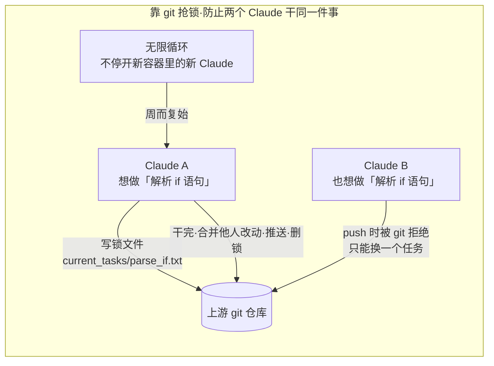
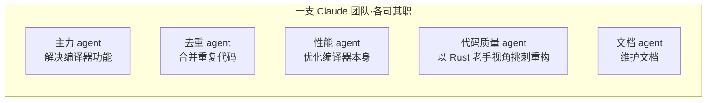

# 一群 Claude 并行造出一个 C 编译器：没有总指挥，它们靠抢锁自己分工

#### 主题

一个 C 编译器，是那种典型的「硬骨头」项目——要处理词法、语法、语义分析、代码生成、优化，任何一环出错整个程序就编译不出来，而且对错有客观标准（能不能通过测试、生成的程序跑得对不对）。Anthropic 的一位工程师做了个实验：不自己写，也不让一个 Claude 一行行写，而是**同时开一群 Claude Code，让它们并行地往同一个 C 编译器项目上干活**，最后真的造出了一个能用的编译器（项目开源在 `anthropics/claudes-c-compiler`）。

这篇值得写，不在于「AI 能写编译器」这个结论本身，而在于作者刻意用了一个**极简到近乎粗糙的协作机制**：没有总指挥 agent，没有复杂的消息总线，甚至没有高层目标管理。多个 Claude 之间怎么不打架、怎么分工、怎么保证质量不倒退——作者的答案简单到可以照搬。对任何在琢磨「多 agent 到底怎么落地」的人，这是一份难得的、去掉了花架子的一手实践记录。

#### 想法

先看最核心的问题：**多个 agent 同时改一个仓库，怎么不互相踩脏？**作者的方案朴素得让人意外——用 git 本身当同步锁。

机制是这样的：建一个裸 git 仓库（bare repo）当上游，每个 Claude 跑在自己的 Docker 容器里，把仓库克隆到自己的 `/workspace`，干完活再 push 回上游。防止两个 agent 抢同一个任务，靠的是一套「文件锁」协议：

一个 Claude 要开工，先往 `current_tasks/` 目录写一个文本文件占坑（比如 `parse_if_statement.txt`）。如果两个 agent 想抢同一个任务，git 的同步机制会让第二个 push 失败，它就只能换一个任务做。干完后，它 pull 上游、合并其他 agent 的改动、push 自己的、删掉锁文件。**合并冲突很频繁，但作者说「Claude 足够聪明，能自己搞定」。**然后一个「无限 agent 生成循环」在新容器里开出下一个 Claude，周而复始。

这里有个反直觉的设计决定值得停下来说：**作者明确没有用编排 agent（orchestrator），也没有强制任何高层目标管理。**他把「下一步做什么」完全交给每个 Claude 自己判断——大多数时候 Claude 会挑「最显而易见的下一个问题」；卡在某个 bug 上时，它会自己维护一份「试过哪些失败方法、还剩哪些任务」的运行文档。整个系统没有中枢大脑，秩序是从「抢锁 + 各自自主」里涌现出来的。

第二个关键点是**并行带来的专门化**。一群 agent 不必都干同一种活，作者给不同 agent 分派了不同角色：

为什么要专门派人去重？因为**LLM 写代码有个通病：老是重新实现已经存在的功能**。所以作者专门安排一个 agent 去合并重复代码，另一个优化编译器性能，第三个负责让编译出的目标代码更高效，还有一个「以 Rust 开发者的视角批判整个项目设计、做结构性重构」，再一个专职写文档。**单个 agent 顾不过来的横向质量维度，用专门的 agent 平行地兜住。**

但整套东西能成立，作者反复强调有一个前提——**测试验证器必须近乎完美**：

> 「Claude 会自主地解决我给它的任何问题。所以任务验证器必须近乎完美，否则 Claude 会去解决错误的问题。」

这句话是全篇的定海神针。因为没有人在逐行审查这群 agent 写的代码，唯一能把它们摁在正确方向上的，就是测试。作者为此做了很多脏活：找高质量的编译器测试套件、给开源软件包写验证脚本和构建脚本、盯着 Claude 犯的错、针对新发现的失败模式设计新测试。项目后期出现一个典型问题——Claude 每加一个新功能就容易搞坏已有功能。作者的对策是**搭一条 CI 流水线 + 更严格的强制检查，让 Claude 每次提交前都能测自己的活，新提交不许弄坏旧代码**。

#### 结论

这篇最该记住的是：**多 agent 协作的可行下限，比大多数人想象的低得多。**不需要编排 agent、不需要消息总线、不需要高层规划——一个「用 git 抢锁分任务 + 让每个 agent 自主挑活 + 无限循环开新 agent」的极简结构，就能让一群 Claude 协作完成编译器这种硬骨头。秩序可以涌现，不一定要自上而下设计。

但适用边界很硬，就一条：**这套玩法把全部赌注押在验证器上。**它之所以能放任 agent 自主、能不审查代码，是因为 C 编译器有客观、可自动化的对错标准（测试通过与否）。作者自己也说这是「很早期的研究原型」。换到没有清晰验证标准的领域（比如主观设计、开放式研究），「放手让它自己跑」会直接翻车——那时候你需要的是别的机制（比如上一篇讲的生成器/评估器分离）。**先有可靠的验证器，才谈得上放手并行。**

#### 复用

这篇几乎是对本 Kit 现有能力的一次实战印证，也点出了可补的地方：

- **「git 抢锁 + 容器隔离」印证了我们 Workflow 的 worktree 隔离。** 本 Kit 的 Workflow 引擎已经有 `isolation: 'worktree'`——让并行 agent 各自在独立 git worktree 里改文件、避免互相冲突，和作者「每个 agent 独立容器 + push 回上游」是同一思路。可借鉴的是那套**文件锁抢任务协议**：我们的并行是主控预先分好工（`parallel`/`pipeline` 派发），而作者是让 agent **自己抢**没做的任务。对「任务数量和边界事先不确定」的场景（比如扫描式修复、不定量的 bug 收集），「抢锁」比「预分派」更灵活，值得在 Workflow 里加一种「自主认领」模式。

- **「验证器必须近乎完美」正是我们上一轮的教训。** 我们刚把 Epic 看板改成从子 plan 派生、并给 pre-commit 挂了新鲜度门禁——本质就是在建「验证器」。作者这句「验证器不完美，agent 就会解决错误的问题」应当写进我们的门禁设计原则：**任何让 AI 自主推进的环节，它的门禁/验证器的可靠性，决定了自主的安全边界。** 建议在 `Contexts/决策/` 的门禁相关协议里补这一条原则。

- **「专门化角色」对应我们的子 Agent 分工，但我们缺「质量维度专职 agent」。** 作者专门派了去重 agent、代码质量 agent、文档 agent 来兜横向质量。本 Kit 的子 Agent（Explore/Plan）偏「按任务切分」，还没有「按质量维度常驻」的角色。可以考虑在 Workflow 的 review 阶段，固定并行跑几个维度专职 agent（去重/一致性/文档同步），而不是只在收尾时单点 review。

- **「LLM 老是重复造轮子」是个要主动防的失败模式。** 作者专门设一个 agent 去合并重复代码，说明这是多 agent 写代码的系统性问题。我们的 `simplify`/`code-review` 类 Skill 可以显式加一条「查重复实现」的检查项。

具体动作建议落一条：在 Workflow 能力里评估加入「自主认领任务（抢锁模式）」，并在门禁协议中补「验证器可靠性 = 自主安全边界」这条原则。

---

原文：Building a C compiler with a team of parallel Claudes · Anthropic Engineering
https://www.anthropic.com/engineering/building-c-compiler
