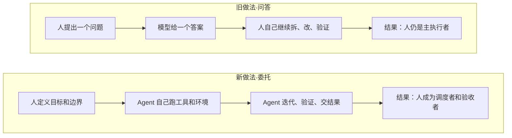
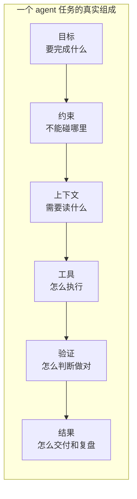
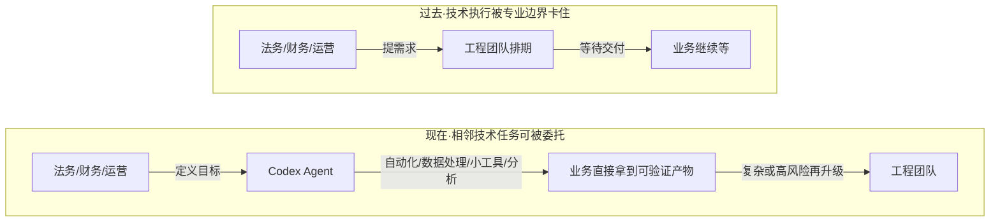

# 工作单位变了：从问答到并行委托，Codex 正在把每个人变成小型调度者

#### 主题

OpenAI 这篇《How agents are transforming work》表面上是一份 Codex 使用数据报告，真正值得看的是它把一个变化说透了：AI 在工作里的基本单位，正在从「一次聊天」变成「一段可委托、可等待、可并行的任务」。以前我们问模型一个问题，等一个答案；现在我们把一个需要跑工具、查代码、改文件、验证结果的任务交出去，让 agent 自己迭代几分钟到几小时。

这篇不是产品更新帖，而是经济研究口径的用法观察。OpenAI 统计了个人用户、组织用户和 OpenAI 内部员工过去一年的 Codex 使用变化，并把任务按「估计相当于人类工作多长时间」分层。报告里有几个数字很硬：到 2026 年 5 月，样本个人用户里，80.6% 至少发起过一次估计超过 30 分钟人类工作的 Codex 请求，70.2% 至少发起过一次超过 1 小时的请求，25.6% 至少发起过一次超过 8 小时的请求。到 2026 年 6 月，OpenAI 内部 Codex 日活用户的 99 分位，已经能在一天里产生超过 60 小时的 Codex agent turn，分散在多个并行 agent 上。

这篇值得作为第 6 期，不是因为 Codex 又多流行，而是它给了一个更基础的判断：当 agent 可以长期运行、可以并行、可以跨工具做事时，工作流设计的核心不再是「如何把提示词写好」，而是「如何拆任务、定边界、给验证、看进度、收结果」。

#### 想法

报告先把 agent 和 chatbot 的边界划开。chatbot 交互通常短、单轮、自包含；agent 交互则是长上下文、带工具、能在环境里多步迭代。这个差异听起来像产品形态变化，但落到工作里就是管理方式变化：聊天适合问答，agent 适合委托。

最有意思的是「任务时长」这条线。OpenAI 用 LLM-as-judge 读 Codex transcript，估计一个请求大概对应多少人类工作时间。这个口径不是精确工时，报告脚注也提醒它只是方向性估计，但趋势很清楚：用户正在把越来越长、越来越难、越来越需要独立执行的工作交给 Codex。近四分之一的 Codex 请求，已经对应超过 1 小时的人类工作；超过 8 小时的长任务虽然基数更低，但增长最快。

这意味着我们不能再把 agent 当成「更强的自动补全」理解。自动补全解决的是一行代码、一个函数、一个局部；长任务 agent 解决的是一个小型交付单元。它要自己在仓库里找上下文，可能要跑测试，可能要改多个文件，可能要中途发现计划不对再调整。这个变化会逼着工作流从「写提示词」升级成「建任务操作系统」。

报告第二条线，是 Codex 从工程部门扩散到非技术部门。OpenAI 内部，工程师最早把 Codex 用成主工具；但到 2026 年 4 月左右，法务、财务、招聘也跨过了「Codex 成为主要 AI 工具」的线。更夸张的是增长速度：从 2025 年 8 月到 2026 年 6 月，非开发者个人用户增长 137 倍，组织里的非开发者用户增长 189 倍，OpenAI 内部非开发者用户增长 12 倍。

这不是说法务和招聘都变成工程师了，而是他们开始把原本卡在技术门槛上的工作交给 agent：自动化、数据转换、内部工具、debug、结构化分析。报告里的职业-工作类型热力图也说明了这一点：产品、市场、运营这类部门里，51% 的 Codex 输出 token 属于知识工作，但也有 25% 落在工程/编码；业务职能里超过四分之一的 Codex 工作也属于工程或编码。agent 把「谁能做技术执行」这件事的边界往外推了。

这对技术团队不是「别人不用你了」，而是「你会被推到更高一层」。当非技术同事能自己用 agent 做一部分技术执行，工程团队的价值会更多落在三件事上：给可复用的工具和模板、定义安全边界、建设验证和审计机制。换句话说，平台工程、工作流设计、权限治理会变得更重要。

第三条线，是并行。报告说，随着 Codex 更强、更可并行，用户从「一次只要一个答案」转向「一天里编排多个 agent 任务」。这句话对我们尤其关键，因为并行不是简单地多开几个窗口。并行会带来新的管理问题：任务之间有没有依赖？哪个任务可以先跳过？多个 agent 会不会改同一块代码？验证结果怎么汇总？谁来判断一个长任务已经完成？

这也是为什么这篇和我们最近做的 WBS 分片高度相关。我们刚把 WBS 从单线性清单往「子编号、可选、跳过、看板干预」推进，下一步候选正是 DAG 和并行。OpenAI 的数据说明，这不是过度设计，而是 agent 使用方式自然演化出来的需求：当一个人一天能分发几十小时的 agent work，任务系统必须能表达并行、依赖、跳过、验收和回放。

#### 结论

这篇最该记住的一句话是：**agent 的出现，把人的工作重心从执行迁到调度和验收。**越强的 agent，越不只是回答问题，而是在替你跑一段工作。人的核心能力随之变化：不是每一步都自己做，而是把目标说清、把边界画清、把验证器建好、把多个任务排好顺序。

它也给了一个边界提醒：报告里的「任务时长」是模型估计，不是精确工时；OpenAI 内部数据也代表的是高密度前沿用户，不等于所有公司马上都会这样。但方向已经足够清楚：一旦 agent 有低摩擦入口、真实工具权限和可等待的执行环境，用户会自然把它推向更长、更复杂、更跨职能的任务。

所以，AI 原生工作流不该只问「模型能不能更聪明」，更应该问「我们的任务系统能不能承接更聪明的模型」。没有任务拆分、状态看板、权限边界、验证门禁和反馈归档，再强的 agent 也只会变成一堆难追踪的长跑进程。

#### 复用

这篇对本 Kit 的复用价值很直接：

- **把 WBS 并行/DAG 从候选升级为高优先级设计。** OpenAI 的数据说明，重度用户已经在一天里并行调度多个 agent。我们的 WBS 不能长期停留在线性 1→2→3；至少要能表达 `dependsOn`、可并行切片、可选/跳过切片，以及看板上的并行泳道。

- **给每个 agent 任务加「人类工时估计」字段。** OpenAI 用 30 分钟、1 小时、4 小时、8 小时这样的阈值观察 agent 任务长度。我们也可以在 task-splitter 或 WBS 里加一个轻量字段：`human_time_estimate`。它不追求精确，但能帮助判断任务是否该拆小、是否适合并行、是否需要更强门禁。

- **把非技术角色纳入 workflow 设计。** 如果产品、设计、运营也会把相邻技术任务交给 agent，那么模板不能只服务工程师。Epic 或子 plan 里可以增加「发起角色」「验收角色」「技术升级条件」三类字段，让非技术同事能发起任务，但高风险变更仍能回到工程审查。

- **把“调度者能力”写进 Skill 训练方向。** 后续 Skill 不应只教 agent 怎么写代码，也要教用户怎么拆任务、怎么设边界、怎么验收、怎么并行看板管理。对我们来说，这就是从「写提示词」转向「运营 agent 工作流」。

具体可落地的一条：在 WBS DAG 候选里补充 `human_time_estimate` 与 `role_owner` 两个字段，并让看板把长任务、并行任务和跨角色任务高亮出来。这样下一轮不是只支持并行，而是能管理并行。

---

原文：How agents are transforming work · OpenAI
https://openai.com/index/how-agents-are-transforming-work/
