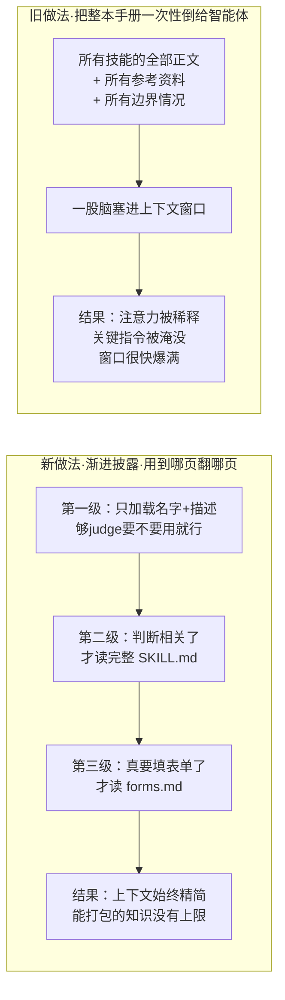

# 给智能体装“技能包”：Anthropic 用渐进披露把无限上下文塞进一个文件夹

## 主题

一个通用智能体越强，越会撞上同一堵墙：它什么都懂一点，但对**你这一摊具体活儿**的门道一无所知。让 Claude 填一张 PDF 表单、按公司规范写周报、走一套内部发布流程——这些知识不在模型权重里，得由你喂进去。

老办法是为每个场景**单独造一个定制智能体**：改系统提示词、塞一堆工具、把边界情况一条条写死。结果是每个智能体都成了一次性的手工艺品，彼此不能复用、不能组合、换个平台就报废。

Anthropic 工程团队在《Equipping agents for the real world with Agent Skills》里给出的答案，是把这份“领域知识”从提示词里剥出来，装进一个**普通文件夹**——里面放一份 `SKILL.md` 说明书、几个脚本、几份参考资料。智能体在运行时自己发现它、按需加载它。他们给这套东西起名 **Agent Skills**，并已在 2025 年 12 月把它开放成跨平台标准（agentskills.io）。

作者用了一个很朴素的比喻：给智能体做一个技能，就像给新入职的同事写一份**入职手册**。你不会在第一天就把公司所有制度、所有代码、所有历史决策一次性倒给新人——你给他一份目录，让他用到哪一章翻哪一章。这篇文章的全部技术分量，就压在这个“按需翻页”的机制上。

## 想法

### 一个技能长什么样

最简单的技能就是一个目录，里面有一个 `SKILL.md` 文件。这个文件必须以 YAML 头开场，只有两个必填字段：`name`（名字）和 `description`（描述）。

关键在于这三个层次是**分批进入上下文**的，而不是一股脑全塞。作者把这套机制叫 **progressive disclosure（渐进披露）**，它是整个 Agent Skills 设计的核心，也是这篇文章最该记住的一点。三级是这样分的：

- **第一级·元数据**：智能体启动时，只把每个已安装技能的 `name` 和 `description` 预加载进系统提示词。这点信息刚好够 Claude 判断“这个技能什么时候该用”，但不占多少上下文。
- **第二级·正文**：当 Claude 判断某个技能跟当前任务相关，它才用一个 Bash 工具去读那个技能完整的 `SKILL.md`，把正文加载进来。
- **第三级及以后·附带文件**：技能复杂到一个 `SKILL.md` 装不下时，作者可以把内容拆成多个文件（如 `reference.md`、`forms.md`），在 `SKILL.md` 里按名字引用。Claude 只有真的走到那一步——比如真的要填表单了——才会去读 `forms.md`。

文中那个 PDF 技能就是活例子：核心 `SKILL.md` 保持精简，把“怎么填表单”的细节挪到单独的 `forms.md`，作者“相信 Claude 只有在填表单时才会去读它”。

这里的因果链值得掰开：为什么要费劲分三级？因为智能体有**有限的注意力预算**（这正是前几期聊过的上下文工程主线）。如果把一个技能的全部内容——所有边界情况、所有参考手册——无差别塞进上下文，注意力就被稀释了，真正关键的指令反而被淹没。渐进披露的妙处在于，**因为智能体有文件系统和代码执行能力，一个技能里能打包的上下文事实上是没有上限的**——反正没用到的部分永远不进上下文。这是一句很重的话：它把“上下文窗口有多大”和“技能能装多少知识”这两件事解耦了。

下面这张图对比了“一次性全塞”和“分级按需加载”两种做法的后果：

### 触发一个技能时，上下文窗口发生了什么

作者给了一段很具体的操作序列，说明用户发来一条消息、技能被触发时，上下文窗口是怎么一步步变化的。这段是理解机制的关键，值得逐格复述：

注意这里有一个容易被忽略的设计选择：**加载技能靠的是 Claude 自己调 Bash 工具去读文件，而不是一个专门的“技能加载”系统机制**。技能就是文件系统里的普通文件夹，加载它就是普通的读文件。这份简单是刻意的——文章结尾专门强调，“技能是一个简单的概念，配一套同样简单的格式”，正是这份简单让组织、开发者、终端用户都能轻松造自己的技能。

### 代码：既是工具，又是文档

技能里还能放代码，让 Claude 按需当工具执行。作者点出一个常被忽视的道理：大模型擅长很多事，但**某些操作交给传统代码更划算**。比如给一个列表排序，用 token 生成去做，比直接跑一个排序算法昂贵得多；更重要的是，很多场景需要**只有代码能提供的确定性可靠性**。

PDF 技能里就带了一段预先写好的 Python 脚本，用来读 PDF、抽取所有表单字段。Claude 可以直接运行这个脚本，**既不用把脚本读进上下文，也不用把 PDF 读进上下文**。因为代码是确定性的，这个流程可复现、可重复。

这里藏着一个双关：同一份代码，既可以被 Claude **当工具执行**，也可以被 Claude **当参考文档读进上下文**。作者的开发建议里专门提醒——要写清楚到底是让 Claude 直接跑脚本，还是让它把脚本读进来当参考，否则 Claude 会拿不准。

### 怎么开发和评测一个技能

作者给了四条落地建议，每条都不是空话：

- **从评测开始**：先在代表性任务上跑你的智能体，观察它在哪儿卡壳、哪儿缺上下文，**针对这些缺口增量地造技能**——而不是拍脑袋预设它需要什么。
- **为规模而拆分**：`SKILL.md` 变臃肿时就拆文件、按名字引用。如果某些上下文互斥、或很少一起用到，**把路径分开能省 token**。
- **从 Claude 的视角想问题**：盯着 Claude 真实场景里怎么用你的技能，看有没有跑偏、有没有过度依赖某段上下文。**尤其盯 `name` 和 `description`**——Claude 就是靠这俩字段决定要不要触发这个技能。
- **和 Claude 一起迭代**：干活时让 Claude 把自己成功的做法、常犯的错，沉淀成技能里可复用的上下文和代码；跑偏了就让它自我反思哪儿错了。作者点明这么做的深层理由——**这样你能发现 Claude 真正需要什么上下文，而不是提前去猜**。

还有一条安全边界不能略过：技能通过“指令 + 代码”给 Claude 新能力，这也意味着**恶意技能可能引入漏洞、或诱导 Claude 泄露数据**。作者的建议是只从可信来源装技能；来源不那么可信时，先逐个文件审计——特别留意代码依赖、附带资源，以及任何让 Claude 连接外部不可信网络的指令。这条对我们尤其重要：我们的 Skill 里就带 `scripts/`。

### 更远的野心：让智能体自己造技能

文章末尾抛出一个方向：**让智能体自己创建、编辑、评测技能**，把自己的行为模式固化成可复用的能力。换句话说，今天是人给智能体写入职手册，将来是智能体自己写、自己改、自己验收自己的入职手册。这条正好接上我们已经在做的 `skill_run` 反馈回路。

## 结论

这篇最该记住的一句话：**渐进披露让“技能能装多少知识”和“上下文窗口有多大”彻底解耦**。因为智能体有文件系统和代码执行能力，没用到的知识永远不进上下文，所以一个技能能打包的上下文事实上没有上限。

它成立的边界也要说清楚：

- **依赖智能体有文件系统 + 代码执行能力**。没有这两样（比如纯 API 无沙箱的场景），三级披露的第二、三级就无从谈起，退化成“要么全塞、要么不给”。
- **`name`/`description` 是触发命门**。渐进披露的第一级完全押在这两个字段上——描述写糊了，该触发的技能不触发，再好的正文也是死文件。
- **简单是特性，不是缺陷**。技能就是普通文件夹、加载就是读文件，别急着给它套复杂的加载框架——那会把它最大的优点（谁都能造、谁都能审）废掉。

## 复用

我们的 AI-Work-Kit 本身就是一套 Skill 体系，这篇文章几乎是逐点在给我们做体检。对照下来有四个具体改动落点：

**一、Skill 正文该瘦身，把互斥场景拆成按需加载的附带文件。** 官方的 `SKILL.md` 只留决策骨架，把“怎么填表单”这类互斥/罕用路径拆到 `forms.md` 按需读。反观我们的 `Skills/weekly_intel_digest.md` 有 200 多行，把“怎么挑/怎么排版/写作规范/自查清单”全塞在一份文件里——这些在一次任务里往往只用到一部分。**具体动作**：把长 Skill 的互斥段落（如 `figma-ui` 的“业务逻辑门禁”vs“纯 UI 还原长文页”）拆成独立文件，主 `SKILL.md` 只留“什么时候读哪个”的路由骨架。这正是官方“为规模而拆分、省 token”那条。

**二、把 `description` 当触发命门来经营，而不是随手写。** 官方反复强调 Claude 靠 `name`/`description` 决定触发；我们的 Skill 路由硬规则（CLAUDE.md 规则 4、`.cursorrules`）同样押在 description 上——“含界面/对稿/还原/Figma → 强制 figma-ui”。**具体动作**：给每个 Skill 的 description 做一次“从 Claude 视角”的复审，确保触发词、排除项（“不响应：xxx→yyy”）写得像给新同事的说明书那样无歧义，而不是给人看的营销语。`weekly-intel-digest` 已经这么做了（描述里带“不响应：项目日报→report-assistant”），应推广到全部 Skill。

**三、`scripts/` 要按“既是工具又是文档”的双重身份标注，并补一次安全审计。** 官方提醒代码既能执行也能当参考读，且恶意技能是真实威胁。我们的 `scripts/plan-gate-check.sh`、`sync-claude-skills.sh` 就是 Skill 带的代码。**具体动作**：在引用脚本的 Skill 里写清“让 Agent 直接跑”还是“读进来当参考”；并按官方安全建议，对 `scripts/` 下会连外部网络或改全局配置的脚本做一次审计留档。

**四、把“让智能体自己造技能”接到已有的 `skill_run → workflow-evolution` 回路上。** 官方的野心（智能体自己创建/编辑/评测技能）我们已经有雏形——每期 `.meta.yaml` 的 `contexts_missing` 就是“读这篇暴露 Kit 缺什么能力”的自我诊断，喂给 `feedback-aggregate → vault-evolve`。**具体动作**：官方“从评测开始、针对缺口增量造技能”的方法论，正好可以写进 `workflow-evolution-assistant` 的沉淀判据——不是拍脑袋加 Skill，而是先有 `contexts_missing` 累计 ≥2 的证据，再增量造。这次读这篇文章本身暴露的缺口就是一条：我们缺一份《Skill 分级拆分规范》，指导长 Skill 何时该把段落拆成按需加载的附带文件。
