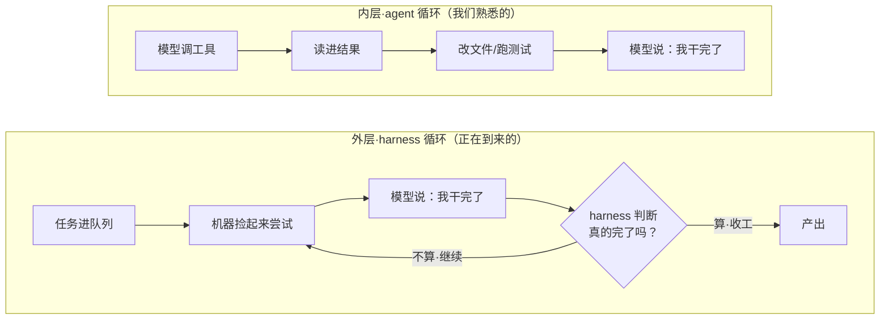
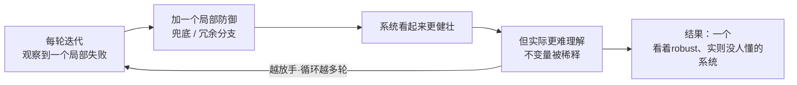

# 正在到来的循环：当 harness 而非模型来决定“活儿干完了没”

## 主题

过去几期我们一直在追同一条主线：agent 越来越能自己干长活（第 3 期 managed-agents 把大脑/双手/会话拆开、第 6 期 Codex 让每个人变成小调度者）。Armin Ronacher（Flask 作者、Sentry 前架构师，个人博客 lucumr.pocoo.org）在《The Coming Loop》里，把这条线往前又推了一格，并且第一次带着明显的**不安**在推。

他观察到的现象是：越来越多人在编码 agent **之上**又套了一层东西——把任务丢进一个队列，一台机器捡起来、尝试、停下，然后**一个 harness（外壳/脚手架）来判断这算不算真的结束**。如果不算，harness 就继续同一个会话、注入一条新消息、或者换个改过上下文的新会话、甚至把任务甩给另一台机器。任务的生命被拖过了“模型自己本来会说‘我干完了’”的那个点。

文章开篇引了 Claude Code 原作者 Boris Cherny 一句话，精准点题：

> 我已经不再 prompt Claude 了。我让一堆循环跑着去 prompt Claude、去决定接下来干什么。我的工作是写循环。

这篇值得写，是因为它不是又一篇“agent 真强”的赞歌。作者是个明确想**看懂自己 ship 的每一行代码**的人，他一边承认这个循环范式不可逆地要来，一边诚实地记录自己为什么对它不安。这种“既看好又警惕”的一手判断，比单纯唱好或唱衰都更有参考价值。

## 想法

### 两个循环：内层 agent 循环 vs 外层 harness 循环

理解全文的钥匙，是分清**两层循环**。作者说得很清楚：

- **内层·agent 循环**：模型调一个工具、读进结果、再调一个工具、读文件、改文件、跑测试，最后产出某个答案。这个循环我们已经熟悉很久了——它就在每个编码 agent 内部。
- **外层·harness 循环**：agent 循环**之外**的那个循环。模型说“我干完了”之后，外层不认这个信号，由 harness 来判断要不要再来一轮。这个循环也不新（早期 Claude Code 时代就有雏形），但最近几周它开始主导讨论。

关键的范式转变在于：**“干完了没”这个判断权，从模型手里转移到了 harness 手里**。下图对照这两层：

注意外层那个菱形判断——**这才是全文的题眼**。作者点破：harness 需要的不是一个客观、二元的“完成”信号，它只需要一个**“有用到足够驱动下一轮”**的信号就行。这个信号可以是一个二元测试用例，也可以是**另一个 LLM 当裁判**给出的判断。

### 循环在哪里已经work得很好

作者很诚实：不能假装这个范式不work，因为它在某些领域已经好用得惊人。他给出的成功案例有一个**共同特征**，这个特征是判断“该不该上循环”的核心标尺：

- **代码移植/翻译**：Bun 从 Zig 移植到 Rust、他自己把 MiniJinja 移植到 Go。
- **性能探索**：机器试各种实验、跑基准、丢掉失败的、继续搜。
- **安全扫描 / 各类研究**：探索一个复杂问题空间然后报告，不一定留下长期代码。

共同点是：**它们要么不产生新代码（只是转换已有代码），要么产出的东西本就不需要长寿命**（概念验证、想法、发现、机械翻译）。作者由此提炼出一条判据——

> 产出**不需要长期存活**的产物、或做**清晰可验证的机械翻译**的循环，比“harness 能不能机械地度量一个目标”这件事本身更重要。

换句话说：机械翻译能用一个二元测试验证，也能让 LLM 当裁判验证；harness 不需要多聪明，只要有个信号能驱动下一轮迭代就够了。**循环的适用边界，取决于产物要不要长寿命、结果好不好验证**，而不取决于 harness 有多强。

### 为什么作者对“用循环写要长期维护的代码”不安

这是全篇最有分量的判断，也是他和一味乐观者的分野。他的推理链是这样的：

当下的模型倾向于产出**过度防御、过度复杂、推理过于局部**的代码。它们回避强不变量（strong invariants），用**加兜底**代替**让坏状态根本不可能出现**。Karpathy 说模型“对异常怕得要死”（mortally terrified of exceptions）——观察到一个局部失败，就加一个局部防御。

而在有重要不变量的系统里（尤其是持久化数据格式、核心基础设施），正确的修法**不是**“处理每一种畸形输入”，而是**让畸形状态根本无法被表示、无法被写出来**。这种代码 LLM 自然写不出来；就算你手动引导它写出来了，它还会去处理那些现在已经不可能发生的错误。

把这种行为**套进循环里，就会被放大**：

越是放手（hands-off），这个正反馈就越强。作者甚至说，今天 Claude Code 开 ultracode 无人干预跑 30 分钟以上产出的代码，**比去年秋天 human-in-the-loop 时更差**。而且他看不到这一点在改善，甚至觉得方向在往错的方向走。更糟的是把这种工具丢给缺乏引导的新人——你问他们为什么这么写，他们还能振振有词地为每一个多余的兜底辩护。

### 软件从“机器”变成“有机体”

作者用一个很准的比喻收束他的忧虑：我们正从**把软件当确定性机器**，转向**把软件当有机体**。

过去他作为工程师被训练去**理解机器**：总有一层可以剥开、加深理解；好的架构让新人也能在复杂代码库里导航；团队里总有人知道不变量住在哪、哪些部分是承重的、哪些改动是安全的。理想虽然常被现实拉扯（大系统本就大到装不进任何人脑子），但“看不懂”一直被视为**需要改进的缺陷**。

而 LLM 把我们朝相反方向推得又远又快：不只用它写代码，还用它做诊断和修复。已经有工程师的生产事故第一反应是——让机器读日志、提出根因、主动挂一个 patch，然后这个 patch 又被另一台机器 review、有时**无人监督**就合进 main。作者承认这很强、很诱人，但代价是：**我们可能不再以同样的方式理解整个系统了**。我们治疗它、监控它、稳定它，但不一定再理解它。

### 你没法真正opt out

最让人不适的一点：**完全退出这个机器驱动的未来，可能不是一个选项。**作者给了三个你被迫入场的压强来源：

1. **安全**：就算你不用循环建软件，别人会用循环**攻击**你的软件。攻击者和安全研究者会让机器不停地跑，真问题和噪音会一起涌向你，量大到你不用机器就处理不过来。curl 维护者 Daniel Stenberg 已经被 AI 生成的报告淹没——curl 核心开发几乎不用 AI，照样被动承压。
2. **竞争**：有的团队靠原始速度把别人甩开，5 个人干过去 50 个人的活。甚至有人直接拿机器对着你的产品循环、让它“做得跟那个一样”——只要用户满意，真的有区别吗？
3. **依赖**：这是他最怕的。如果一个代码库由循环产出、由循环 review、由循环 patch、由循环续命，那当你**失去对同类系统的访问权**时会怎样？贸易限制拿走最强模型、成本变得无法承受、或者你和团队**丧失了不靠机器就读懂代码的能力**——我们可能造出一批**把“机器参与”当成维护模型前提**的代码库。作者说这已经在发生：越来越多人合入自己无法完全解释的代码，越来越多人不借 LLM 就没法写 issue、没法在群里把话讲清楚。

## 结论

最该记住的一句话：**编码的未来是“写循环”，而循环范式的核心权力转移，是“活儿干完了没”的裁判权从模型交到了 harness 手里。** 由此派生出两条要记牢的判断：

- **循环的适用边界，由产物决定，不由 harness 强弱决定。** 产出不需要长寿命的东西（移植、性能实验、安全扫描、研究），循环已经好用得惊人；产出需要长期维护、需要强不变量的核心代码，今天的循环会把“加局部防御”的坏习惯逐轮放大成没人能懂的有机体。
- **你没法完全 opt out，但可以选择怎么入场。** 作者的落点不是“别用循环”，而是——既然循环必然要来，问题就变成：**在一个满是循环的未来里，怎么不放弃判断力、怎么保住好工程的规矩、怎么让负责任的人还能持续监督、怎么重新架构代码以在过程中保住可理解性。**

适用边界也要说清：这是一篇**观点/判断类**一手文章，不是方法论手册。它给的是“怎么想这件事”的框架和判据，不是“照这样配 harness”的步骤。它的价值在于**帮你在该不该上循环、上到什么程度上做决策**，而不是给你一套可复制的循环实现。

## 复用

这篇不像前几期那样能直接改一个 Skill 文件，但它给我们的工作流治理提供了一把很实用的**判据尺**。四个落点：

**一、把“产物寿命 + 可验证性”写成我们上循环/放手的判据。** 作者的核心洞察——循环适合“短命产物 + 可机械验证”的活——正好能落进我们已有的 workflow 编排（`Workflow` 多 agent 编排、`workflow-evolution-assistant`）。**具体动作**：给“什么任务该丢给自动循环、什么必须 human-in-the-loop”写一条判据：可二元验证/短命产物（如批量重构、格式迁移、情报抓取去重）→ 可放手循环；改核心不变量、动持久化格式、写要长期维护的 Skill/Contexts → 强制人在环。这正好也解释了我们现有硬规则为什么对“写 Contexts 前须用户确认”（CLAUDE.md 规则 2、7）——那类产物是长寿命的。

**二、警惕我们自己的 Skill 也在“逐轮加局部防御”。** 作者说循环会放大“观察到局部失败就加兜底”的倾向，让系统看着 robust、实则没人懂。这条**直接照进本 Kit 的一条既有铁律**——CLAUDE.md 里“不为不可能的场景加错误处理/兜底/校验”“三行相似代码好过过早抽象”。**具体动作**：在 Skill 演进（`vault-evolve`）的 review 判据里加一问——“这次新增的规则/兜底，是在让坏状态不可能，还是只是在给一个局部失败打补丁？”后者应拒绝合入。作者这篇给了我们这条铁律一个更锋利的外部论据。

**三、给“harness 的完成信号”留一个人类可读的落点。** 作者最大的不适是：外层循环里，连“done”都失去意义、人被降格成“信使”。我们的 `.meta.yaml`（skill_run + contexts_missing）其实就是一个**让循环产出对人保持 legible（可读）**的机制——每期强制萃取“这轮暴露了什么缺口”，是把判断权留在人这边的月度 review。**具体动作**：延续并强化这个反馈回路，别让它退化成机器自说自话；`contexts_missing` 累计 ≥2 才由人拍板沉淀，正是作者呼吁的“不放弃判断力”。

**四、源多样性本身就是一种“不完全依赖单一机器”的实践。** 这期我特意从 anthropic-eng 单站扩到了 Armin Ronacher 的个人博客（已建 DocShark 库），呼应作者对“认知依赖单一系统”的警惕。**具体动作**：把 lucumr（及后续更多一手个人/工程博客）增补进 follow 名单，作为对官方源的独立视角对冲，避免选题和判断长期绑定在单一来源上。
