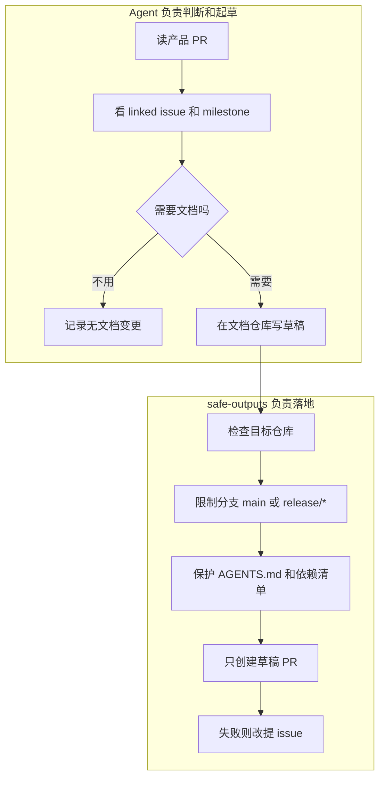
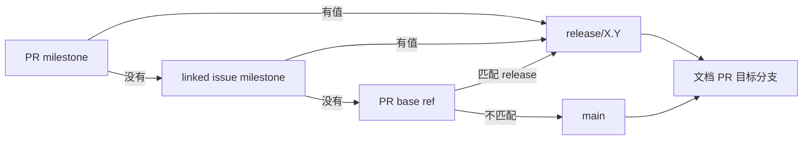
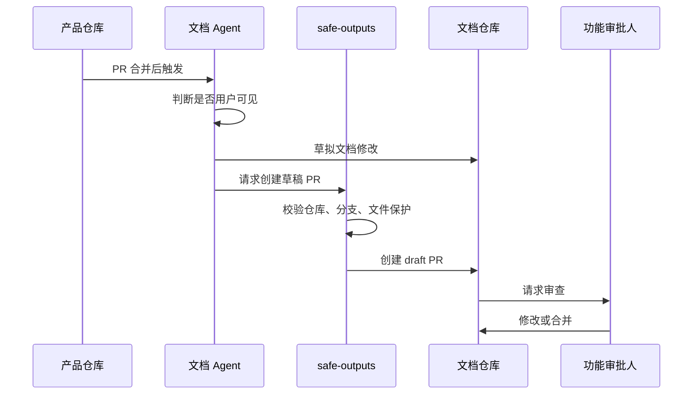

# 把 Agent 关进安全轨道：GitHub 用跨仓文档工作流证明，自动化真正难的是边界

#### 主题

GitHub 这篇《Automating cross-repo documentation with GitHub Agentic Workflows》讲的是一个很具体的问题：产品仓库的代码已经合并了，文档仓库里的说明却经常慢半拍。团队过去要靠文档作者追 diff、问工程师、补参考页，结果是功能发布和文档更新之间天然有时间差。Aspire 团队把这个空档交给 GitHub Agentic Workflows：每当产品仓库 `microsoft/aspire` 有 PR 合并，工作流就判断这次变更是否需要文档；如果需要，就在文档仓库 `microsoft/aspire.dev` 起一个草稿 PR，请真正懂这个功能的工程师审。

这篇值得写，不是因为“Agent 会写文档”这个点新鲜，而是它把一个更重要的工程原则落得很实：不要让 Agent 直接拥有无限写入权。Agent 可以读 diff、读 issue、判断是否需要更新文档、草拟内容，但跨仓写入这一步被放进一个严格的 safe-outputs 合约里。目标仓库、目标分支、文件保护、PR 标题、标签、草稿状态、失败兜底，全都写死在边界里。

原文里最有代表性的数字来自 2026 年 5 月 3 日到 6 月 2 日的 30 天窗口：产品仓库 396 个 PR 合并，触发 396 次 `pr-docs-check`，最终创建 82 个文档草稿 PR，82 个全部合并，0 个关闭，0 个遗留打开。文档 PR 的中位合并时间是 44.8 小时，38% 在 24 小时内合并，96% 在 7 天内合并。这里最有价值的不是 82 这个数量，而是“396 次里有 300 多次说不用写文档”也被视为特性：一个好 Agent workflow 不只是会动手，还要会克制。

#### 想法

这套工作流的第一层设计，是把“判断”和“落地”分开。Agent 做判断：读合并后的产品 PR、扫 linked issues、看 milestone、决定这次变更是不是用户可见；如果是，再写文档草稿。safe-outputs 做落地：它不相信 Agent 想做什么，而是只接受预先允许的输出形态，比如只能在 `microsoft/aspire.dev` 创建草稿 PR，只能打 `docs-from-code` 标签，只能落到 `main` 或 `release/*`，不能碰 `AGENTS.md`、依赖清单和安全配置。

这个拆分很关键。我们平时说 Agent 不可靠，容易把问题说成“模型不够聪明”。这篇反过来提醒：模型可以模糊，动作面不能模糊。判断一项变更是否需要文档，确实有灰度；但一旦要写入仓库，规则必须是硬的。原文里那句判断很到位：Agent 的推理是模糊的，行动面不是。

第二层设计，是把目标分支从“让 Agent 猜”改成“从已有工程信号推导”。他们先看 PR milestone，比如 `13.4` 映射到文档仓库的 `release/13.4`；如果 PR 没有，就解析 linked issue 的 milestone；还没有，就看 PR base ref 是否匹配 release 分支；最后才 fallback 到 `main`。这样 Agent 不需要凭语义想象文档该发到哪里，工作流从已有协作元数据里拿答案。

这点对工作流设计尤其重要。好的 Agent 系统不是把所有判断都塞进提示词，而是尽量把已有确定性信号喂给它。milestone、base ref、reviewer、文件保护、允许分支，这些都是系统已经知道的结构化信息。Agent 应该消费这些信息，而不是重新发明它们。

第三层设计，是人类审查位置的调整。文档 PR 一律是 draft，永远不自动合并；reviewer 不是随机找文档作者，而是取源 PR 的 SME，也就是产品团队已经信任过的功能审批人。这样文档层不再倒推功能语义，而是把草稿送回最懂功能的人那里确认。文档作者也没有被替代，他们从机械追 diff 中解放出来，去写概念页、样例程序、叙事型说明这些更需要人的部分。

原文也诚实写了失败点。第一版的“是否值得写文档”门槛太宽，CI 调整、日志重构、测试变更这类内部修改也会生成 PR，导致 69 个 PR 里有 9 个关闭，大约 13%。他们的修复不是加一句“请更谨慎”，而是收紧“用户可见变更”的定义，补上负例。另一个问题是大 diff 会吃掉提示词预算，所以他们用 pre-agent steps 先抽取 PR 元数据、linked issues、milestone、base ref，让 Agent 拿到小而结构化的摘要，而不是把巨大 payload 全塞进去。

这些失败点比成功点还值得学。Agent workflow 的稳定性通常不是靠一次漂亮 prompt，而是靠一组外围结构：负例、预处理、受限输出、失败兜底、人工审查、可度量指标。396 次触发里只有 82 次真正生成 PR，也说明“拒绝执行”本身是系统能力。

#### 结论

这篇最该记住的是：Agent 自动化的难点不只是让它会做事，而是让它只在该做的时候、用被允许的方式做事。跨仓写文档看起来是内容生成问题，真正的工程核心却是权限、分支、文件保护、审查责任和失败路径。

它适用的边界也很清楚。适合交给 Agent 的，是从已有事实中推导出来的机械性更新：参考页、配置说明、参数变更、release 分支文档补齐。暂时不适合全自动交给 Agent 的，是产品叙事、概念框架、教程结构、跨版本取舍这类需要长期判断和读者理解的内容。所以原文最后说，文档作者没有被替代，而是从反向工程功能里解放出来。

对团队来说，这个模式比“让 Agent 多拿点权限试试”稳得多。先让 Agent 产意图和草稿，再让 safe-output handler 把它变成受控动作；先让工作流利用 milestone、linked issue、base ref 这些确定信号，再让模型处理语义判断；先让人审草稿，再考虑更高自动化。这是把 Agent 放进生产流程的可复制路径。

#### 复用

这篇对 AI-Work-Kit 的复用价值很直接：我们也应该把“Agent 想做什么”和“系统允许落地什么”分成两层。

第一，工作流蓝图可以补一个 `safe_outputs` 区域。比如允许某个 Skill 创建 plan、更新看板、追加去重清单、生成 HTML，但要写清楚目标目录、允许文件类型、禁止触碰的 Contexts、失败时是否改写阻塞记录。这样 Agent 不需要每次靠自觉守规矩，工具层能替它收口。

第二，涉及跨文件或跨仓动作的 Skill，应把“结构化预处理”前置。像本篇把 PR metadata 先抽出来一样，我们的 workflow-router、task-splitter、weekly-intel-digest 也可以先产小摘要：输入来源、目标文件、依赖 plan、最近去重项、允许写入范围。Agent 拿到的上下文越结构化，越少靠猜。

第三，评审责任要跟真实业务责任绑定。GitHub 把文档 PR 交给源 PR 的 SME，而不是把责任丢给文档层。Kit 里的 Epic/子 plan 也可以显式记录 `review_owner` 和 `acceptance_owner`：谁批准需求，谁就应该参与验收相关产物；Agent 负责打草稿和提醒，不替人承担最终判断。

第四，给每条自动化保留“拒绝执行”的正当出口。396 次触发里 300 多次不生成文档 PR，是这套系统准确性的组成部分。我们的 Skill 也应该把 `not-needed` 当成合格输出，而不是逼每次都产物。尤其是情报周报、测试计划、部署检查这类任务，明确“不需要新增”的证据，和新增文件一样有价值。

可以先落地一个小改动：在 `.workflows` 蓝图 Schema 里增加 `safe_outputs` 草案字段，支持 `allowed_paths`、`blocked_paths`、`allowed_actions`、`human_review_required`、`fallback`。这会把“遵守规则”从提示词层推进到工作流契约层。

---

原文：Automating cross-repo documentation with GitHub Agentic Workflows · GitHub Blog  
https://github.blog/ai-and-ml/github-copilot/automating-cross-repo-documentation-with-github-agentic-workflows/
