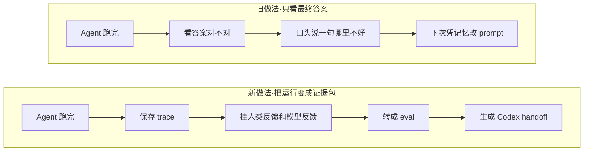
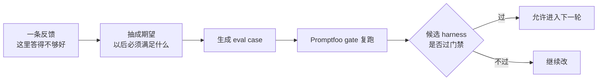
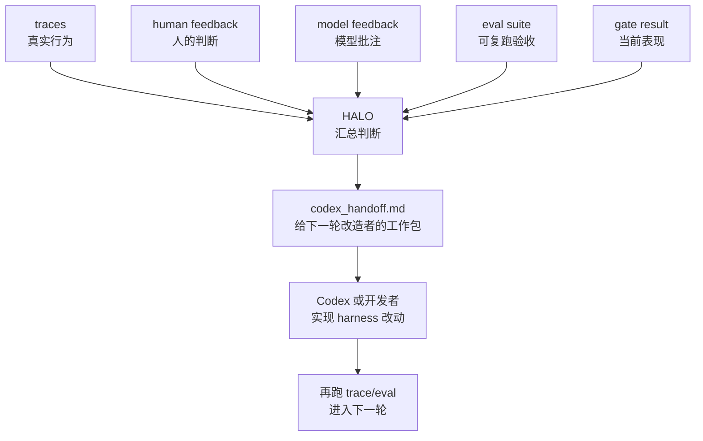

# 把每次运行变成下一版能力：OpenAI 这套 Agent Improvement Loop，像极了我们的 skill_run 进化链

#### 主题

OpenAI Cookbook 这篇《Build an Agent Improvement Loop with Traces, Evals, and Codex》不是一篇普通的 agent 教程。它真正讲的是：一个 agent 跑完以后，留下来的东西不该只是“这次答得好不好”，而应该变成下一轮系统改造的证据。

它搭了一个金融尽调 agent 的示例：agent 读取虚构公司的财务、客户、合同、安全、董事会材料，然后回答尽调问题。看起来业务场景离我们很远，但机制非常近。它让 agent 连跑 5 条任务，捕获 trace；给 trace 加上人类反馈和模型反馈；把反馈转成可复跑的 Promptfoo eval；再用 HALO 汇总 trace、feedback、eval 和 gate 结果，产出一个 `codex_handoff.md`，交给 Codex 去实现下一版 harness 改造。

这条链路最像我们 Kit 的地方在于：它不把反馈当成聊天里的临时评论，而是把反馈变成可聚合、可复测、可交接的工程对象。我们现在的 `skill_run → feedback-aggregate → vault-evolve → Contexts/Skill 改造`，本质上也是同一种结构。区别只是 OpenAI 这篇用的是 agent trace、Promptfoo eval 和 Codex handoff；我们用的是 plan 末尾或 `.meta.yaml` 里的 `skill_run`、月度聚合报告和人工 review 后的 Contexts/Skill 进化。

所以这篇值得写，不是因为它展示了一个更聪明的 agent，而是它把“怎么让 agent 系统持续变好”拆成了一条可执行的流水线：运行痕迹是证据，反馈解释为什么，eval 把经验固化成验收，handoff 把改造交给下一个执行者。

#### 想法

这篇的第一个关键点，是把 trace 提升成系统改造的原材料。传统软件里，代码是系统行为的主记录；但 agent 系统不一样。代码只能告诉你 agent 被允许做什么，trace 才能告诉你它这一次真的怎么想、怎么查、怎么调用工具、在哪里偏了。

OpenAI 的示例不是只保存最终回答，而是保存每条 run 的完整上下文：输入问题、agent 配置、工具调用、引用材料、输出、人工评论、模型评论。这样一条 trace 不只是“日志”，而是一份可审查的工作样本。

这和我们的 `skill_run` 很像。一个 Skill 完成任务后，如果只说“这次做完了”，那它就消失在对话里；但如果在 plan 末尾或 `.meta.yaml` 里写下 `contexts_used`、`contexts_missing`、`contexts_stale`、`friction`、`outcome_status`，它就从一次操作变成了一条可聚合的证据。月末 `feedback-aggregate.py` 扫到这些证据，才能知道哪些 Contexts 真正在被用，哪些能力反复缺，哪些阶段总卡住。

第二个关键点，是反馈不能停在“评价”，必须变成“可复跑验收”。OpenAI 示例里，人类和模型会对 trace 给出具体反馈，但它没有让这些反馈停在评论区，而是把它们转成 Promptfoo eval suite。Promptfoo 的作用，是把一次经验变成以后每次都能跑的门禁。

举个简化版：如果反馈说“回答 runway 和 burn 时必须翻译成近期融资风险”，那下一步不是把这句话贴进 prompt 就算完，而是生成一个 eval case。以后每次改 agent harness，都要重新跑这个 case，看它还会不会把财务指标解释成业务风险。原文里这组示例 eval 最终跑了 5 条，5 条都通过。数字不大，但闭环完整：反馈被固化成测试，而不是散在脑子里。

这点正好击中我们 Kit 现在的一个弱处：`contexts_missing` 已经能聚合“缺什么”，但还不总能转成“以后怎么验收它已经补好了”。比如多次出现“需要 safe_outputs 契约字段”，月度报告能把它列成补全候选；但如果真的改了 workflow schema，我们还需要一组验收：蓝图能声明 allowed_paths 吗？门禁能阻止写 blocked_paths 吗？失败时能落 fallback 吗？没有 eval，进化很容易停在“我们补了个文档”。

第三个关键点，是 HALO 把所有证据打包成 handoff，而不是直接神奇地改系统。原文里 HALO 不是另一个随口建议的 LLM，它读的是完整上下文：当前 harness 配置、traces、human feedback、model feedback、generated evals、Promptfoo gate results。它的输出是 ranked recommendations，再写成 `codex_handoff.md`，里面包含诊断、证据、优先级和实现指导。

这一步非常重要，因为它把“反馈进化”从散点建议变成可交接工作包。一个人或一个 agent 不必重新翻遍所有 trace，只要读 handoff，就能知道：问题是什么，证据在哪，为什么这条改动排第一，改完以后跑哪些 eval 验证。

这也解释了为什么我觉得这篇比普通 agent 现象文更适合我们。它不是告诉你“agent 会犯错”，而是告诉你犯错以后怎么进入下一轮能力建设。我们的 `vault-evolve.py` 其实已经在做类似事情：它把反馈聚合、漂移、关系、老化、链接、docrefs 合成月度进化报告。只是 OpenAI 这篇把“证据包 → handoff → Codex 实现”这段讲得更工程化：每个建议都应该带证据、排序和可验证的改造入口。

第四个关键点，是自动化程度可以分层。原文明确说，这个 loop 可以只是提出一个 reviewed change set，由开发者批准 diff；也可以在 eval gate 足够可信后，更深地接入自动 PR、merge 和部署。它没有一上来鼓吹全自动，而是把信任放在 gate 之后逐步增加。

这很像我们写 Contexts 的规则：长期资产不能让 agent 自作主张写进去，除非用户确认或是既定动作。原因不是我们不信 agent，而是长期知识和流程规则的寿命更长，必须有人类审查。OpenAI 这篇给了一个更通用的说法：自动化深度取决于 eval gate 的可信度。门禁还弱，就只生成 handoff；门禁强了，再考虑自动 PR。

#### 结论

这篇最该记住的一句话是：反馈只有变成可复跑的验收和可交接的改造包，才真正进入了系统进化。

它和我们 Kit 的对应关系很清楚：

| OpenAI loop | AI-Work-Kit |
|---|---|
| trace | plan 执行过程、Skill 输出、`.meta.yaml` |
| human/model feedback | `contexts_missing`、`contexts_stale`、`friction`、人工 review |
| Promptfoo eval suite | `plan-gate-check.sh`、`workflow-gate.sh`、回归测试、未来的改造验收用例 |
| HALO recommendations | `feedback-aggregate.py` / `vault-evolve.py` 产出的补全候选和进化报告 |
| `codex_handoff.md` | 可落地的 Skill/Contexts/workflow 改造 plan |

边界也要说清楚。OpenAI 这篇是 Cookbook notebook，不是生产系统论文；它用的是 5 条 synthetic trace，重点是演示方法，而不是证明规模化收益。但这不削弱它的价值。它给的是一套可复用的反馈工程结构，恰好能帮我们判断：哪些反馈只是评论，哪些反馈已经足够变成下一轮系统能力。

如果说前几篇文章还停在“agent 该怎么工作”，这篇更进一步：agent 工作以后，组织该怎么学习。这个问题更接近 AI-Work-Kit 的核心。

#### 复用

这篇可以直接反哺我们现有反馈进化链，重点不是新建一个大系统，而是补两段缺口。

第一，把 `contexts_missing` 从“补全候选”升级成“验收候选”。现在聚合报告能统计某类缺口出现次数，但没有强制要求每个缺口写清“补上以后怎么证明有效”。可以在 `Skill反馈协议` 的执行质量字段旁边补一个轻量约定：当 `contexts_missing` 指向可落地能力时，优先附一句 `acceptance_hint`，例如“新增 safe_outputs 字段后，workflow-gate 能阻止 blocked_paths 写入”。这不是马上改协议，而是下一轮可评审候选。

第二，给 `vault-evolve` 增加一个 handoff 视图。现在月度报告偏统计和清单；可以为每个高优先级补全候选生成一段“Codex 可执行交接”：问题、证据、影响范围、建议改哪些文件、验收命令。它不自动改长期 Contexts，只把进化项变成可执行 plan。这就对应 OpenAI 的 `codex_handoff.md`。

第三，把“反馈归因”从文件级再往步骤级推进一点。OpenAI 和 LangChain/Braintrust 这类体系都强调 trace 的价值，因为失败常常不在最终输出，而在中间步骤。我们的 `friction` 现在是一句话，可以继续保持轻量，但建议形成固定写法：`阶段/动作/卡点/建议`。例如“html自检/Playwright/浏览器缓存缺失/改用系统Chrome”。这样月度聚合时，不只是知道某个 Skill 卡了，还能知道卡在抓取、写作、网页、自检、门禁哪一步。

第四，把“自动化深度取决于 gate 可信度”写进工作流演进判断。对于短命 plan、网页自检、候选表打分，可以允许 agent 自动落地；对于 Contexts、Skill 路由规则、workflow schema 这类长寿命资产，仍保持用户确认和门禁。这样不是保守，而是把信任建立在验收能力之上。

具体下一步可以先做一个很小的实验：选择本月 `feedback-aggregate` 里出现 ≥2 次的 `contexts_missing`，手工生成一份 `Plans/工作流进化/YYYY-MM-反馈进化-handoff.md`，格式对齐 OpenAI 的 `codex_handoff.md`：证据、建议、改动入口、验收方式。先不自动改 Contexts，只验证“聚合报告能不能变成可执行改造包”。

---

原文：Build an Agent Improvement Loop with Traces, Evals, and Codex · OpenAI Cookbook  
https://developers.openai.com/cookbook/examples/agents_sdk/agent_improvement_loop
