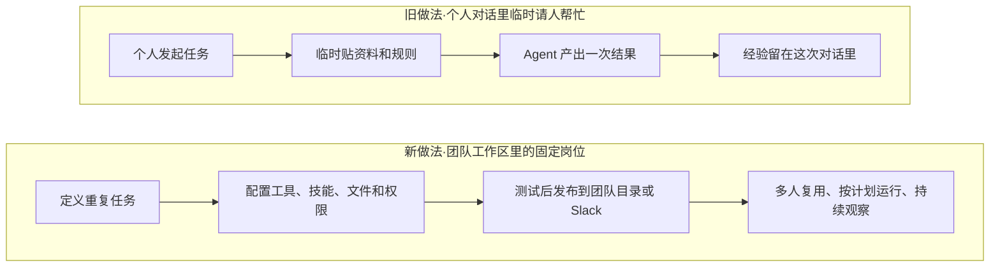
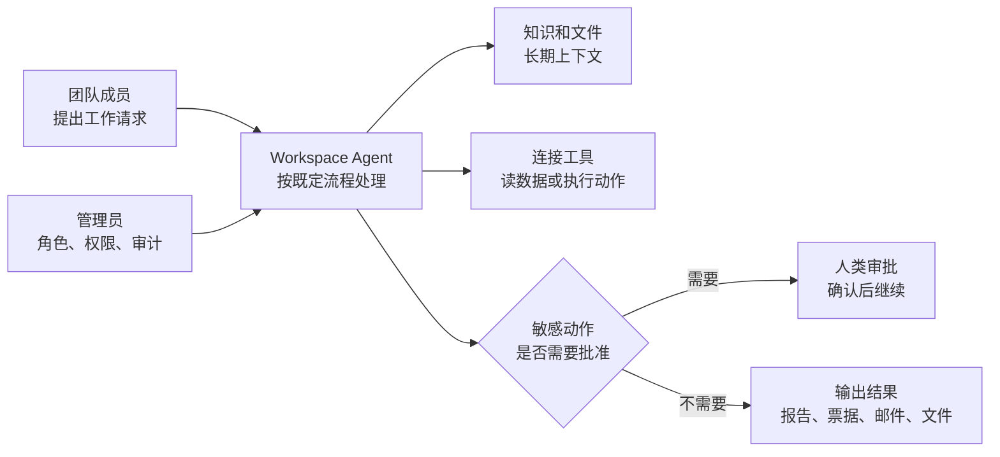
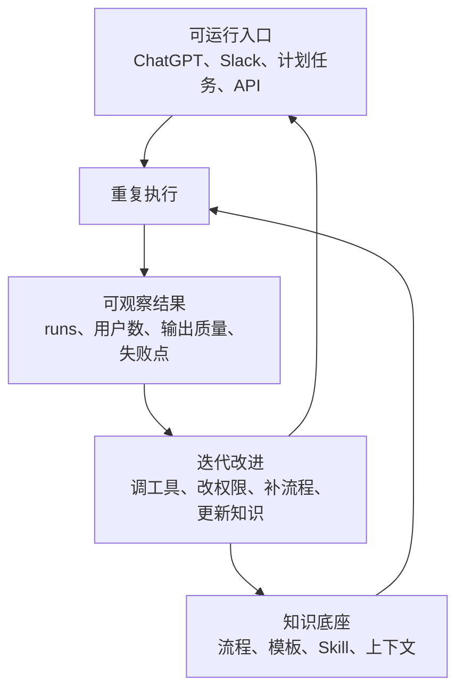

# 从个人助手到团队岗位：Workspace Agents 把 Agent 变成可治理的工作流资产

#### 主题

OpenAI 的《Introducing workspace agents in ChatGPT》和配套 Help Center，不是单纯宣布 ChatGPT 里多了一个“自动干活”的入口。它更像是在回答一个组织级问题：当 agent 不再只服务某个个人，而要被整个团队长期复用时，它应该长成什么形态。

过去两年的大多数 AI 工具默认是“个人助手”模型。一个人开一个对话，临时贴上下文，让模型帮忙写代码、查资料、生成文档。这个模式上手快，但一旦进入团队工作，就会遇到三类问题：知识散在个人对话里，流程靠人记；权限和审批很难说清；做得好的 prompt 或 workflow 很难稳定复制给别人。

Workspace Agents 的新意在这里。它把 agent 做成一个可创建、可测试、可发布、可共享、可调度、可审计的工作流对象。官方示例覆盖软件请求评审、产品反馈路由、周报、线索跟进、第三方风险评估等场景；Help Center 进一步说明，agent 可以接工具、加技能、上传文件、设置模型和 reasoning effort、接入 Slack、按计划运行，也能通过权限控制决定谁能构建、发布、运行和管理它。

所以这篇值得写，不是因为它又提供了一组模板，而是它把“组织如何复用 AI 能力”从聊天技巧推进到资产治理：一个好的 agent 不只是会回答问题，还要知道自己能看什么、能做什么、什么时候要问人、怎样被团队发现、怎样被管理员停掉。

#### 想法

这篇最关键的转变，是把 agent 从“对话里的能力”变成“工作区里的岗位”。个人 GPT 或单次聊天更像一个临时帮手：你把背景讲清楚，它这次帮你完成一件事。Workspace Agent 更像一个固定岗位：它有任务定义，有可用工具，有审批边界，有运行入口，有版本和 analytics，也可以被放到 Slack 频道里等人调用。

这件事的技术含义很直接：上下文不再只靠用户每次手动喂，流程不再只靠 prompt 描述，复用也不再靠复制一段长提示词。Workspace Agents 把这些要素拆成了更明确的层：任务说明负责“要做什么”，连接器和工具负责“能去哪拿信息、能在哪落动作”，技能和文件负责“长期知识和做法”，权限和审批负责“哪些动作必须停下来问人”。

这个拆分对非技术团队同样重要。产品反馈路由 agent 的价值，不只是能总结 Slack 和支持渠道里的声音，而是它能按团队流程把信号转成优先级、周报或票据。软件请求评审 agent 的价值，也不只是读懂员工申请，而是能按政策检查、给下一步建议、必要时开 IT ticket。换句话说，agent 开始承接的是“岗位动作链”，不是单点问答。

第二个关键点，是共享必须和治理一起出现。OpenAI 官方发布里反复强调，团队可以决定 agent 能用哪些工具和数据、能采取哪些动作、哪些敏感步骤要先审批；Help Center 也把 role-based access control、共享范围、发布前测试、管理员开关、Slack 部署、版本历史和 analytics 放在同一个能力集合里。这个排列很有意思：它没有把“分享给全公司”当成默认善事，而是把分享放进权限系统里。

这也是个人 agent 走向团队 agent 时最容易被低估的部分。个人使用时，“误发一封邮件”“改错一个表格”“读了不该读的资料”通常还能靠用户自己兜底；团队共享后，agent 的每一次运行都可能影响更多人、更真实的业务系统。此时真正的产品能力不是“全自动”，而是“可控地自动”：读可以自动，写可能要确认；普通动作可以放行，敏感动作要审批；个人私用可以轻，组织共享必须可见、可停、可追踪。

第三个关键点，是 Workspace Agents 把“最佳实践”变成了可复用资产。官方文里有一句很值得注意的判断：团队知识常常分散在人和系统里，而 workspace agents 给团队一种方式，把这些知识变成可复用的工作流。这个说法和我们 Kit 的 Skill 很接近。Skill 不是把某次对话保存下来，而是把一类任务的触发条件、必读资料、执行协议、硬规则、反馈回路固定下来，交给后续任务复用。

差异在于，Workspace Agents 更偏运行时产品化：它强调 Team directory、Slack、schedule、analytics、admin visibility；AI-Work-Kit 更偏知识库和工作流治理：它强调 `Contexts/`、`Plans/`、Skill 路由、运行记录、反馈聚合和做完删 plan。两边合起来看，能得到一个很清晰的方向：组织级 agent 资产需要同时有“能运行的入口”和“能进化的知识底座”。

第四个关键点，是“会变好”不能只靠对话纠正。官方发布说 agent 可以在使用中被指导和纠正，随着团队使用变得更好；但如果只停留在口头纠正，它仍然会掉回个人助手模式。真正可复用的改进，应该落到四个地方：任务定义是否更清楚，工具权限是否更准确，审批点是否更合理，团队知识是否更新。否则，一个 agent 今天被纠正过，明天换个人、换入口、换工具，仍然可能重复旧错误。

这一点对我们尤其有启发。AI-Work-Kit 现在已经把运行记录放进反馈回路，但它主要服务 Skill 和 Contexts 的进化；如果未来要把某些高频流程做成更像 Workspace Agent 的“团队岗位”，还需要补一层运行时视图：谁能触发，触发后读哪些资料，允许写哪些文件，哪些动作必须停下来确认，运行后留下哪些可聚合指标。

#### 结论

这篇最该记住的一句话是：团队级 agent 的核心不是更会聊天，而是把重复工作封装成可共享、可治理、可观察、可改进的工作流资产。

它和我们 Kit 的对应关系很清楚：

| Workspace Agents | AI-Work-Kit |
|---|---|
| Agent builder | Skill / workflow 蓝图 |
| Team directory | Skills 表 / 入口索引 |
| Connected apps and tools | MCP / scripts / 本地工具 |
| Files and skills | `Contexts/` / Templates / Skills |
| Schedule / Slack / API trigger | workflow-router / 自动化 / 看板触发 |
| RBAC and approvals | 用户确认规则 / gate / 写 Contexts 约束 |
| Analytics and run history | 运行记录 / AI 卷 / feedback-aggregate |

边界也要说清。OpenAI 这篇主要是产品发布和官方帮助文档，不是工程论文；它讲清楚了能力形态和治理面，但没有展开底层 runtime、调度、隔离、成本控制、失败恢复等实现细节。因此我们不能把它当成“照抄即可”的架构方案。它更像一个方向信号：agent 真正进入组织以后，竞争点会从模型单次能力，转向流程资产化、权限治理、运行可见性和持续改进。

对 AI-Work-Kit 来说，这个方向非常贴。我们已经有长期知识和反馈进化链，但还没有把“一个可复用工作流资产应该具备哪些运行时字段”系统化。Workspace Agents 给了一个很好的参照：可发布、可共享、可调度、可审批、可观测，缺一项都容易退回“个人临时对话”。

#### 复用

第一，给高频 Skill 增加“岗位化”审视。不是所有 Skill 都要变成自动化 agent，但像 `weekly-intel-digest`、`report-assistant`、`workflow-router`、`kanban-restart` 这类重复触发的流程，可以多问一层：它的固定输入是什么，运行入口是什么，能读写哪些路径，哪些动作必须确认，输出后留下什么运行指标。这个清单可以先写在 plan 里试跑，不急着改 Contexts。

第二，补一个轻量的 agent asset 字段候选。未来如果设计 workflow 蓝图或 Skill 扩展，可以考虑增加类似字段：`triggers`、`inputs`、`tools_allowed`、`write_scope`、`approval_required`、`share_scope`、`run_metrics`、`handoff_surface`。这些字段不是为了复杂化，而是为了让一个流程从“我知道怎么做”升级到“团队知道怎么安全复用”。

第三，把“发布前测试”从网页自检扩展到流程自检。Workspace Agents 强调先测试再发布；我们现在网页已经有 Playwright 自检，plan 也有 gate，但 Skill 层面的复用测试还偏弱。可以先为高频 Skill 补一个最小验收：触发词是否路由正确，必读资产是否存在，输出是否落到规定目录，是否写了 AI 卷，是否没有越权写 Contexts。

第四，把目录和分析视图分开。Workspace Agents 有 Team directory 让人找到 agent，也有 analytics 让管理员看使用情况。AI-Work-Kit 现在入口散在 AGENTS、Skill 表和 Contexts 索引里，运行效果散在 AI 卷和聚合报告里。后续可以让看板增加一个“Skill 资产视图”：哪些 Skill 高频使用，哪些连续 not-needed，哪些能力缺口最多，哪些适合岗位化。

第五，保留人的审批位置。越是像团队岗位的 agent，越不能默认全自动。写 Contexts 前确认、长期规则变更前确认、跨目录写入前 gate，这些不是阻碍效率，而是让 agent 能被组织放心复用的基础。Workspace Agents 的启发不是“把人拿掉”，而是把人放在正确的批准点上。

---

原文：Introducing workspace agents in ChatGPT · OpenAI  
https://openai.com/index/introducing-workspace-agents-in-chatgpt/

配套文档：ChatGPT Workspace Agents for Enterprise and Business · OpenAI Help Center  
https://help.openai.com/en/articles/20001143-chatgpt-workspace-agents-for-enterprise-and-business
