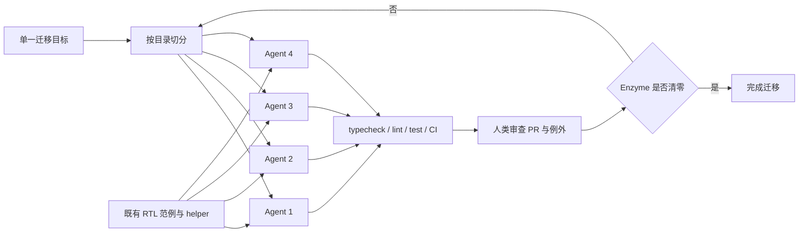

# 不是提示词变短了，而是环境变成了规格：Asana 用 Codex 两周清掉五年迁移余量

#### 文章介绍

2026 年 8 月 7 日，Asana 工程团队发表了英文一手复盘 [We migrated off Enzyme in 2 weeks. It should have taken five years](https://asana.com/inside-asana/migrating-off-enzyme-2-weeks)。文章讲的是一项很具体、也很容易被标题数字掩盖的工程迁移：把前端测试从已经失去社区支持的 Enzyme 迁到 React Testing Library（RTL）。这项工作从 2022 年开始，多个产品团队和专项项目持续推进，但按原来的速度估算，仍大约需要五年才能结束。Asana 随后把剩余工作交给 Codex，实际用约一周半工程时间、跨两个自然周清除了代码库里的 Enzyme。

原文只有约三分钟阅读量，结构却完整覆盖了一个 Agent 工程案例最需要回答的问题：为什么旧迁移会拖五年；Codex 具体怎么跑；为什么五句话的指令足够；真正的阻塞来自哪里；以及为什么团队最后把 harness 视为产品。文末还补了成本口径与边界：模型费用约 11,000 美元，基础设施约 1,000 美元；约 600 万美元的人工成本是对“完整工作范围”的粗略估算，并非独立审计的同口径对照。

这篇文章值得读，不是因为它证明“所有五年项目都能压成两周”——作者明确否认了这种外推——而是因为它展示了一类适合 Agent 的任务形状：目标单一、工作可分区、仓库里已经存在正确范例、完成条件可机器验证，而且人类可以在合并边界集中审查。对工程团队，这是一个关于代码库可读性、反馈延迟和迁移组织方式的案例；对负责排期和投入决策的人，它更重要的启发是：一些长期积压项目的经济性已经改变，但是否适合交给 Agent，必须先看验证结构，而不是先看模型能力。

#### 知识总结

##### 从 Enzyme 到 RTL，迁移的不只是 API

Enzyme 的问题不只在于老旧。它鼓励测试组件内部实现细节，和新版 React 的兼容也越来越差；RTL 则把测试目标推向用户能看到和执行的行为。换言之，这项迁移同时在更换测试库和测试哲学。旧测试不能靠机械替换 import 完成，Agent 需要从仓库里的既有 RTL 测试、helper 和约定中判断“这里正确的测试应该长什么样”。

此前迁移缓慢并不等于前几年无效。产品团队逐步迁走各自负责的部分，专项工程也建立了 RTL 的正确范例和配套工具。正是这些先行工作把“组织经验”编码进仓库，后来才成为 Codex 可以读取的隐式规格。两周的冲刺站在多年积累之上，不能把最终阶段的吞吐量倒推成整个项目从零开始的速度。

| 维度 | 传统推进状态 | Codex 冲刺状态 | 需要注意的口径 |
|---|---|---|---|
| 剩余周期 | 按当时速度约 5 年 | 约 1.5 周工程时间，跨 2 个自然周 | 5 年是剩余工期估算，不是已完成工作量 |
| 并行度 | 多团队长期分散推进 | 最多 4 个 Agent，各自处理不同目录 | 目录边界降低了并发冲突，不代表任意任务都能四路并行 |
| 指令 | 人工项目管理、分批排期 | 5 句话描述目标、范围、测试命令与优先级 | 短指令成立的前提是仓库已有范例和约定 |
| 反馈 | 原流程跨团队、周期长 | typecheck、lint、测试、CI 快速回传 | 慢或不稳定的工具仍会直接卡住 Agent |
| 成本 | 完整范围人工估算约 600 万美元 | 模型约 11,000 美元，基础设施约 1,000 美元 | 两者并非严格同口径，且数据由合作方自报 |

##### 实际运行方式：分目录并行，人类守住合并边界

Asana 没有搭建复杂的多 Agent 调度系统。团队让最多四个 Codex Agent 同时运行，每个实例指向不同目录，机器保持在线，Agent 白天和夜间持续工作；工程师每天早晚检查进度、打开并审查 pull request。原文给出的完整指令只包含五件事：从 Enzyme 迁到 RTL；遵循仓库现有规范；限定目录；用指定命令测试；优先处理容易迁移的文件。

```text
目标：把指定目录中的 Enzyme 测试迁到 RTL
约束：遵循代码库已有规范与最佳实践
范围：一次只处理一个目录
验证：运行指定测试命令
排序：优先迁移容易转换的文件
```

团队也试过更“高级”的方案：先拆成跟踪 ticket、让 Agent 维护持续更新的 notes 文件、要求它再生成 sub-agent、写更详细的 RTL 规范。作者的经验判断是，这些做法几乎都让结果变差。这里不能简单归纳成“提示词越短越好”。更准确的机制是：当目标、范围、范例和验证已经存在于执行环境里，额外的协调层会复制状态、增加同步成本，并可能与仓库事实发生冲突。五句话不是信息少，而是把信息放在了更接近事实的位置。



这张链路里，模型只占中间一段。任务可分区决定并行是否安全；仓库范例决定生成方向；自动检查决定错误能否快速暴露；人类审查决定不适合自动判断的例外能否被拦住；“Enzyme 是否清零”提供了一个清晰、可查询的完成条件。任何一环缺失，都可能把四倍并行度变成四倍返工。

##### 真正的瓶颈是陈旧知识与慢反馈

Asana 报告的两个主要阻塞都来自环境，而不是模型。第一，一些近期编写的内部文档和 Agent 指南仍把 Enzyme 指作推荐模式。对人类而言，过期文档可能只是需要辨别的噪声；对会主动检索并模仿上下文的 Agent，它会成为方向相反的控制指令。仓库同时存在 RTL 正确范例和 Enzyme 错误指南时，执行环境实际上给出了自相矛盾的规格。

第二，lint 偶尔要运行十多分钟，本地检查与 CI 也不完全一致。Agent 的生成速度再快，也必须等待反馈才能进入下一轮判断；反馈慢会降低有效吞吐，反馈不一致则会制造“本地已通过、远端再失败”的无效循环。原文因此把 harness 定义得很宽：不仅是 Agent 外层循环，也包括文档、约定、代码范例、测试工具和 CI。这些资产共同决定 Agent 能看到什么、模仿什么、以及多快知道自己错了。

| 环境资产 | 正向作用 | 失效方式 | 本案例证据 |
|---|---|---|---|
| 代码范例 | 把工程品味变成可模仿结构 | 坏模式同样会被放大复制 | 多年形成的 RTL 测试与 helper 让短指令可行 |
| 文档与 Agent 指南 | 提供显式规则和导航 | 陈旧规则会主动把 Agent 引回旧方案 | 部分文档仍推荐 Enzyme |
| typecheck / lint / test | 在本地快速缩小错误范围 | 运行慢时吞吐受反馈延迟限制 | lint 偶尔超过 10 分钟 |
| CI | 提供统一的集成判定 | 与本地不一致时产生双重真相 | 团队需要人工处理检查差异 |
| PR 审查 | 承接语义例外与最终责任 | 审查容量不足会成为新瓶颈 | 工程师每天早晚复核所有变更 |

##### 数字说明了机会，也暴露了证据边界

最终结果除了清除 Enzyme，还改善了测试覆盖、修复了质量不佳的测试、清理了遗留测试基础设施，并意外发现了比 Enzyme 更老的一套测试框架。说明当 Agent 可以低成本遍历大量相似工作时，项目范围可能从“替换接口”扩展成“清理整个历史层”。这也是约 600 万美元估算覆盖的完整范围，而不只是最初的框架迁移。

但文章没有提供测试文件总数、Agent 实际运行小时数、PR 数量、失败与回滚比例、迁移后的缺陷率，也没有给出人工审查工时。模型与基础设施成本和完整人工成本估算不是严格对照实验；Asana 与 OpenAI 还在持续合作。因此，最可靠的结论是“这个特定迁移在这个成熟仓库中完成了数量级压缩”，而不是“Codex 普遍可以提供约 500 倍成本优势”。案例证明的是可行性与任务适配条件，尚未证明可复制的平均收益。

#### 工作流提炼

##### 先做任务适配，再决定是否并行

从这个案例抽出的第一条通用原则，是把“是否使用 Agent”改写成“这个任务是否具有可执行的边界”。适合高自治并行的工作至少要同时满足四个条件：目标可以机械判定；工作可以按目录、模块或其他边界切分；仓库中存在足够多的正确范例；每个切片都能获得快速、稳定且与 CI 一致的反馈。只满足“工作量很大”并不够。

AI-Work-Kit 已有需求验收、测试先行、纵向 Story 和 Gate 原则，能够约束“做什么”和“何时完成”；但在启动多 Agent 或大规模迁移前，还缺一张统一的 harness readiness 预检：明确记录可分区边界、完成判据、范例来源、反馈命令、反馈耗时、CI 一致性和人工审查容量。这个缺口适合先作为 workflow checklist 候选进入进化链，而不是因为一篇案例就新增同名工具或固定四 Agent 模式。

##### 把文档新鲜度视为执行安全，而不只是知识管理

第二条原则是：会被 Agent 读取的文档属于控制面依赖，其陈旧程度应和测试失败同样可观测。Kit 已有 `Contexts` 漂移检测协议，通过 `verified_against` 把业务代码相关文档锚定到 commit，也有 `contexts_stale` 人工反馈；这已经覆盖了“长期资料与代码脱钩”的一部分风险。尚未完全覆盖的是执行前冲突检查：当仓库指南、代码范例和当前迁移目标同时存在时，谁是权威源，旧规则是否应该在运行前被阻断。

可落地的补强不是自动修改文档，而是在大规模 Agent 任务的预检中加入“相反范例与陈旧指南扫描”，输出证据并交由人判断。自动化可以发现 `Enzyme` 仍出现在推荐文档中，却不能仅凭关键词决定它是历史说明、兼容边界还是应删除的规范。人工决策边界必须保留在“解释冲突与确认权威源”这一层。

##### 优化反馈延迟，而不是只增加 Agent 数量

第三条原则是把反馈回路当作系统容量。Agent 数量提高后，最慢的 lint、测试和审查会变成共享瓶颈；本地与 CI 不一致还会放大无效重试。Kit 现有 Gate 能防止未验证结果跨阶段推进，但还没有一套跨项目通用的反馈回路预算：记录单次检查耗时、稳定性、本地/CI 等价性，以及并行任务对审查队列的压力。

这项能力可以先以检查清单和运行证据字段存在，不应自动规定统一时限。不同仓库的测试成本差异很大，十分钟 lint 在某些系统里可能合理。需要机器采集的是耗时、失败重试和结果差异；是否足够快、是否值得为迁移专门优化，仍由工程负责人结合风险和收益判断。

最终可迁移的不是“五句话提示词”，而是一条更严格的工程次序：先把正确范例、权威文档、可执行验收和快速反馈放进环境，再把目标压缩成短指令；先证明切片之间可以独立验证，再提高并行度；最后把人类注意力集中到冲突、例外和合并责任上。提示词之所以可以短，是因为规格已经分布在可运行的系统里。
