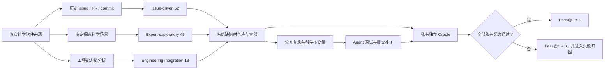

# 公开测试 96.64%，完整正确只有 47.90%：科学软件暴露了编码 Agent 的验证盲区

#### 文章介绍

2026 年 8 月 20 日，上海创智学院与复旦大学团队发布论文 [SWE-bench Science: An Agentic Coding Benchmark for Scientific Software](https://arxiv.org/abs/2608.19799)，同时开放了[代码](https://github.com/OpenMOSS/SWE-bench-Science)、[数据集](https://huggingface.co/datasets/OpenMOSS-Team/SWE-bench-Science)与[排行榜](https://swescience.github.io)。它收集了 98 个真实 GitHub 科学软件仓库中的 119 个任务，横跨化学、材料、生物、医学、物理、数学、天文等 20 个领域，要求编码 Agent 在冻结的仓库快照里定位并修复真实缺陷、补齐科学能力或完成跨模块集成。

论文最刺眼的数字不是某个模型赢了，而是两类成绩之间的断层。在八组“模型 × 编码工具”配置中，Claude Opus 5 配合 Claude Code 的公开测试平均分达到 96.64%，完整通过私有测试的 Pass@1 却只有 47.90%；GPT-5.6-sol 配合 Codex 的公开测试平均分为 99.16%，Pass@1 是 46.22%。公开反馈几乎全绿，仍有超过一半任务没有真正完成。这个差距说明：编码 Agent 已经很会顺着可见信号把局部现象修到“看起来正确”，但面对科学对象、等价表示、边界条件、跨模块契约和未见输入时，最后一公里仍然缺少独立验证。

这不是一篇“新榜单又换了第一名”的文章。SWE-bench Science 重新设计了任务来源、测试可见性、科学知识注入与失败归因，试图回答一个更接近生产的问题：当软件正确性不只由 API 和普通单测定义，还取决于物理不变量、数学等价关系与科学工作流时，什么才算真正修好？对普通工程团队，它提供了一面放大镜——科学软件把日常系统里同样存在的验证盲区放大了：公开测试可以是调试接口，却不应成为最终真相；外部知识可以帮助推理，也可能让 Agent 过早锚定；聚合分数可以比较能力，却无法替代失败机制。

本文按论文的完整证据链展开：先解释任务为什么不同，再拆解构造方法、评估协议、八组结果、四类失败和知识消融实验，最后把可迁移原则映射回 AI-Work-Kit。论文仍是 v1 预印本，领域样本不均、模型与工具框架混杂、知识实验只覆盖两组配置，因此下文会把作者实测、本文推断与工作流建议明确分开。

#### 知识总结

##### 不是把 HumanEval 做难，而是把正确性换成科学契约

传统函数级基准通常给出清晰题目和输入输出，仓库级基准则要求 Agent 在真实代码环境里修 issue。科学软件又多了一层：输出“能运行”并不等于结果在科学上成立。同一个晶体可能有不同周期表示，同一个坐标可能经不同路径转换，同一统计分布可能只在受约束的流形上定义。补丁必须同时保持数值稳定、单位和坐标一致、物理或数学不变量、旧行为兼容以及跨模块数据流。

论文把相关评测谱系放在同一张地图里。这里的区别不是难度线性增加，而是被验证对象发生了变化。

| 方法家族 | 典型代表 | 被验证的主要对象 | 核心机制 | 主要局限 | 与本基准的关系 |
|---|---|---|---|---|---|
| 函数级代码生成 | HumanEval、MBPP | 单函数输入输出 | 题面明确，运行少量单元测试 | 缺少仓库上下文、依赖和长期状态 | 提供基础代码能力下限，但不能代表维护科学系统 |
| 通用仓库修复 | SWE-bench | 真实 issue 与回归测试 | 冻结仓库，让 Agent 定位并修改多文件 | 科学语义与领域不变量覆盖有限 | 奠定真实仓库任务范式，本基准扩展科学契约 |
| 长时工程 Agent | SWE-Bench Pro、DeepSWE、Terminal-Bench | 长链工具使用与环境操作 | 增大任务跨度、终端交互和系统复杂度 | “做得久”不自动等于“科学上正确” | 补充执行跨度，本基准聚焦结果契约 |
| 科学代码生成 | SciCode、MMSciCode | 科研问题对应的函数或算法 | 用论文、公式或专家问题定义科学功能 | 多数仍是从题面生成独立代码 | 提供领域知识维度，但缺少生产仓库维护 |
| 科研工作流 Agent | ScienceAgentBench、SUPER、ResearchCodeBench 等 | 实验、研究任务或科研工作流 | 组合检索、实验设计、代码与工具 | 任务环境和最终正确性口径不一 | 覆盖“做科研”，不专门衡量维护科学软件 |
| 垂直软件工程 | AInsteinBench、SWE-Bench 5G | 少数科学/工程领域中的仓库任务 | 在垂直仓库中修复真实问题 | 前者 6 个领域/仓库，后者集中于单一领域 | 最接近的前序工作；本基准扩到 20 领域、98 仓库和三类任务 |

SWE-bench Science 的 119 个任务不是均匀抽样。化学 24 个、材料 16 个、生物 13 个、生物医学 12 个、物理 11 个，五大领域合计 76 个，占 63.9%；另有六个领域只有一个任务。仓库非空代码行平均约 80,600 行，最小 174 行、最大超过 202 万行；参考补丁平均新增 117.81 行、删除 44.53 行。这些数字说明它确实进入了生产仓库尺度，也同时意味着“某个模型更擅长天文或地学”一类细分结论暂时不可靠。

##### 三种任务，不是三档难度

作者把任务分成三种互补范式，而不是按简单、中等、困难排档。

第一类是 issue-driven，共 52 个，占 43.7%。它从历史 issue、pull request 或 commit 中寻找真实缺陷，冻结缺陷修复前的快照，在容器里复现最小现象，再把原始描述净化成不泄露补丁的题面。它的优势是分布失真较低：问题确实发生过，修复也确实进入过项目。私有测试会改变规模、边界、输入顺序或等价表示，检查 Agent 是否只记住公开复现用例。

第二类是 expert-exploratory，共 49 个，占 41.2%。专家先在真实仓库里设计科学场景、寻找异常，再区分“看见的现象”和“真正的根因”。这类任务没有可直接回滚的历史补丁，目标是发现尚未以 issue 形式固定的问题。验证重点因此不是复刻维护者的改法，而是补丁是否能跨尺度、拓扑、顺序和边界条件泛化。

第三类是 engineering-integration，共 18 个，占 15.1%。它要求补齐跨模块的完整能力链，例如解析、转换、计算和输出之间缺少的一段接口，或多个组件分别正确、组合后却破坏了状态与契约。构造者需要沿数据管线分析缺口，保留足够工程上下文，再用替代路径、状态重置和模块间契约做隐藏验证。它测的不是某个函数会不会写，而是 Agent 能否识别系统里真正的能力边界。

三类任务共同避免了两个极端：只依赖历史 issue 会受已有问题分布和泄漏影响；只靠专家出题又可能变成人工竞赛题。历史证据提供真实性，专家探索补充未知缺陷，工程集成覆盖真实系统里“局部都对、串起来不对”的能力空洞。

##### Chain-of-Evidence：先冻结事实，再分离可见反馈与最终 Oracle

论文把构造流程称为统一的 Chain-of-Evidence。第一步从 issue、PR、commit、论文和专家审计中筛任务，排除过于简单、环境不稳定、答案泄漏或任务重叠的候选。第二步冻结缺陷发生时的仓库，移除 Git 历史、远端、未来 changelog、构建缓存和解题产物，并在容器中重现。第三步从具体补丁中抽象出可公开的科学不变量和数据流约束，但不泄露修复位置。第四步建立私有 Oracle，用语义等价输入、边界条件、逆向检查和替代执行路径排除硬编码、伪修复和覆盖不完整。

Agent 能看到的是冻结仓库、题面、必需科学上下文与公开测试。评估器单独持有私有测试、契约标签、参考或其他有效补丁、定位与理由块、期望文件以及污染元数据；私有测试只在干净环境中挂载。这个隔离很关键：如果 Agent 能反复查询最终 Oracle，它就可能把本应衡量的泛化能力重新优化成对测试样本的拟合。

论文给出的物理示例很直观。两种周期表示描述同一个晶体：一种在原胞上使用 k 点采样，另一种把体系扩成超胞并只取 Γ 点。若实现正确，折算到每个原胞的能量应近似不变：

$$
\Delta E = \left|E_k-\frac{E_{\Gamma}}{N}\right| \le 5\times10^{-5}\ \text{Hartree/cell}
$$

公开测试只告诉 Agent 计算能收敛、结果有限，并暴露一个代表性表示差。私有测试则用 10 个科学场景改变 FFT 网格奇偶性、k 点顺序、几何和 MDF 积分等条件。一个补丁即使公开测试通过，私有场景只过 7/10，Pass@1 仍是 0。因为契约不是“把这个数调小”，而是“所有等价表示都保持同一物理量”。

这类设计比单纯增加隐藏样例更强。它先写出被保护的不变量，再寻找能证伪表面修复的输入族。公开测试承担定位和快速反馈，私有 Oracle 承担独立裁决，两者角色不同却共享同一科学契约。

##### 八组配置没有全能冠军，模型与工具框架也是一个整体

论文评估了八组模型与编码工具配置。它们不是只换模型：同一张表同时混入 Codex、Claude Code 和 Kimi Code，因此结果应解释为“模型 × harness 配置”的系统表现，不能完全归因于模型权重。

| 模型 / 编码工具 | 公开分 | 私有分 | Fail2Pass | Pass2Pass | 总 Pass@1 | Issue | 探索 | 集成 |
|---|---:|---:|---:|---:|---:|---:|---:|---:|
| GPT-5.6-sol / Codex | 99.16 | **78.82** | **72.30** | **97.66** | 46.22 | 36.54 | 59.18 | 38.89 |
| Claude Opus 5 / Claude Code | 96.64 | 75.11 | 68.60 | 97.37 | **47.90** | **38.46** | **65.31** | 27.78 |
| DeepSeek V4 Pro / Claude Code | **100.00** | 73.16 | 65.77 | 96.58 | 42.02 | 26.92 | 57.14 | **44.44** |
| Kimi K3 / Kimi Code | 98.32 | 66.34 | 57.55 | 94.94 | 35.29 | 25.00 | 44.90 | 38.89 |
| GLM-5.2 / Codex | 94.12 | 63.61 | 53.81 | 97.53 | 31.93 | 17.31 | 46.94 | 33.33 |
| Nex N2 / Codex | 93.28 | 61.89 | 51.09 | 94.92 | 24.37 | 11.54 | 36.73 | 27.78 |
| DeepSeek V4 Flash / Claude Code | 98.32 | 61.41 | 52.34 | 95.74 | 23.53 | 19.23 | 26.53 | 27.78 |
| Qwen3.5-397B / Codex | 96.64 | 51.79 | 38.33 | 95.16 | 14.29 | 5.77 | 24.49 | 11.11 |

PublicScore 和 PrivateScore 是平均通过的公开、私有用例比例；Fail2Pass 衡量原本失败的私有测试被修复多少；Pass2Pass 衡量原本通过的行为保留多少；Pass@1 最严格，只有全部私有测试通过才记 1。于是 78.82 的 PrivateScore 与 46.22 的 Pass@1 并不矛盾：前者允许“十个场景过八个”，后者要求任务完整闭合。

没有一组配置统治所有指标。GPT-5.6-sol 的私有分、Fail2Pass 和 Pass2Pass 最高，说明平均修复覆盖和回归保持最好；Claude Opus 5 的总 Pass@1、issue-driven 和 expert-exploratory 最高，更常把整项任务完全做完；DeepSeek V4 Pro 公开分满分、工程集成最好，却在 issue-driven 上明显落后。论文的 token 图还显示，更多上下文或更长输出并不自动换来更高 Pass@1。Claude 以中等 token 取得最高完整成功率，GPT 输出更短但接近，DeepSeek V4 Pro 输入更多仍落后于两者。真正相关的是配置如何检索、探索、验证和利用上下文，而不是单纯“想得更久”。

最稳妥的结论因此不是某模型绝对更强，而是不同配置有不同失败轮廓。选择 Agent 时，聚合榜单只能告诉你平均结果；若任务偏向跨模块集成、科学探索或历史缺陷，配置排序可能改变。更进一步，因为模型和工具框架没有做全交叉实验，论文不能回答“同一个 Claude 放进 Codex 会怎样”。

##### 四类失败揭开了“差一点”的真实含义

作者没有把所有失败归为“推理不够”，而是逐项审查补丁，建立四个互斥机制。这个分型比总分更可操作，因为它对应四种不同的补救方式。

| 失败机制 | 典型行为 | 为什么公开测试可能仍通过 | 需要的补强 |
|---|---|---|---|
| 科学知识或抽象缺失 | 选错科学对象、定义或领域抽象 | 可见样例没有覆盖定义边界 | 明确不变量、单位、坐标和适用域，并验证理解 |
| 探索误导或表面修复 | 围绕报错或单一指标打补丁 | 对公开现象局部拟合 | 建立独立 Oracle，主动寻找反例与替代解释 |
| 修复覆盖或系统集成不完整 | 局部函数合理，交互、数据流或兼容性断裂 | 公开路径只经过已改模块 | 覆盖替代路径、状态重置、模块契约与回归行为 |
| 科学泛化失败 | 修好一个案例，等价表示或边界仍错 | 可见输入与补丁假设一致 | 用变换、缩放、顺序、拓扑和边界生成测试族 |

八组配置的失败数量也呈现不同形状。GPT 的 64 个失败中，系统集成不完整最多，为 22 个；Claude 的 58 个有效失败中，知识/抽象缺失 24 个、集成不完整 21 个，另有 4 个运行时问题；DeepSeek V4 Pro 的 69 个失败里，泛化失败最多，为 23 个。更低分配置也并非同一种弱法：DeepSeek V4 Flash 有 48 个集成不完整，远高于其 6 个泛化失败；Qwen 则在知识、集成和泛化三类上都高。

这意味着“再补几个公开测试”不是统一处方。抽象错了，需要澄清领域对象；探索被误导，需要独立证伪；集成不完整，需要扩展系统路径；泛化失败，需要围绕不变量生成等价输入族。若团队只记录最终红绿，不记录失败机制，同类错误就会在下一个模块里重新出现。

##### 给 Agent 更多知识，可能帮忙，也可能让它更早确信自己是对的

119 个任务中有 91 个可以把“仓库本身无法推断的辅助科学信息”单独分离。研究者固定仓库、环境、公开入口、私有验证器和必需上下文，只切换是否提供额外的论文片段、专家指导、上游修复理由或审计发现，比较信息的边际作用。这不是“有知识”和“完全无知识”的比较，因为代码、运行轨迹和测试仍然提供大量线索。

| 配置 | 辅助信息 | 公开分 | 私有分 | Pass@1 | 平均输入 token | 平均输出 token |
|---|---|---:|---:|---:|---:|---:|
| GPT-5.6-sol / Codex | 有 | 97.80 | 74.06 | 31.87 | 3.70M | 40.25K |
| GPT-5.6-sol / Codex | 无 | 96.70 | 73.23 | **36.26** | 3.86M | 43.75K |
| DeepSeek V4 Flash / Claude Code | 有 | **100.00** | **62.53** | **23.08** | 7.40M | 159.26K |
| DeepSeek V4 Flash / Claude Code | 无 | 98.90 | 61.21 | 16.48 | 4.84M | 128.43K |

额外知识对两组配置的平均作用方向相反。GPT 有信息时通过 29 个任务、无信息时通过 33 个；二者共同通过 21 个，说明知识并不是简单地让同一批任务加分，而是改变了解题路径：8 个只在有信息时通过，12 个只在无信息时通过。DeepSeek V4 Flash 则从 15 个提升到 21 个：12 个共同通过，9 个只在有信息时通过，3 个只在无信息时通过。

作者提出两种可能机制。正面上，领域资料可以提供极限情形、坐标一致性、独立可观测量和权威接口，帮助 Agent 形成更好的 Oracle。负面上，它也可能造成锚定、范围外溢和过早依赖：Agent 把一段权威解释当成补丁指令，没有回到运行证据验证。较弱基线可能从知识中获益更多，但目前只测试了两组配置，作者明确说这些描述性差异不能建立统计显著性或因果关系。

因此，知识不是越多越好的上下文燃料。更安全的做法是把它标成“带来源的假设”：记录来自论文、维护者还是专家审计；指出它声称保护哪个不变量；再用独立用例证伪。知识通过验证后才升级为工程契约，而不是因为写得权威就直接控制修改。

##### 附录的 119 项清单说明：这不是只会算能量的窄基准

论文附录逐项列出任务、领域、仓库、对应 issue/PR、知识范围与关注点。代表性任务包括：bedtools 中 split-read 的区间重叠；Osprey 对多子谱编辑 MRS 数据的一致处理；nilearn 把离散 atlas 投影到表面时的插值模式与 NaN 行为；PyMC 的 ZeroSumNormal 在零和流形上的 log probability；SunPy 的坐标变换；MDAnalysis 的周期边界跳跃处理；SymPy 有理积分结果的导数恒等；pvlib 的时区等价性。

这些例子共同强调：科学契约并不只存在于“高深公式”。它也藏在数组的所有子谱是否一起更新、离散标签能否被连续插值、坐标系切换是否保持物理含义、跨越周期边界时轨迹是否连续、时区表示不同但太阳位置是否等价。普通业务系统里的货币、时区、权限、库存守恒和状态机，同样具有这种不变量结构。

##### 论文能证明什么，暂时不能证明什么

它能证明的是：在这 119 个真实科学软件任务上，当前强配置的公开测试表现与完整私有契约之间存在巨大差距；任务类型和失败机制会显著改变配置画像；额外知识的作用依赖 Agent 如何使用它。它还提供了可复查的数据、容器、任务清单和评测口径，便于后续复现与扩展。

它不能证明的是：科学软件一定比所有业务软件更难；某个基础模型脱离当前编码工具后仍保持同样排名；辅助知识对所有模型存在稳定的正负效应；单个小样本领域的高低分代表真实领域能力。20 个领域看起来很广，但样本高度集中；八组配置没有模型与 harness 的全因子交叉；知识消融只覆盖 91 个任务和两组配置；论文还是刚发布的 v1 预印本。排行榜未来更新时，本文数字也只对应论文当时版本。

#### 工作流提炼

##### 把“可见反馈”和“结果 Oracle”写成两个不同对象

这篇论文最值得迁移的不是私藏测试，而是双层验证职责。公开测试应当快速、可诊断，帮助 Agent 缩小问题；结果 Oracle 应独立于补丁过程，覆盖最终契约、回归行为和等价输入。两者可以共享同一个不变量，却不应共享全部样例。

AI-Work-Kit 已有 test-generator 的测试计划冻结、审核门禁、全套测试退出码要求，也在 2026-08-18 的工作流控制就绪度审计中识别了 validator/oracle 身份、`FAIL/PASS/ABSTAIN/INVALID` 语义和 Outcome Oracle 缺口。因此这里不是发现一个全新问题，而是给现有 backlog 补充了可操作的测试形状：在 `evidenceContract` 中区分 `debug_feedback` 与 `outcome_oracle`，要求后者至少包含替代路径、边界或等价变换中的一类，并声明哪些证据在执行阶段不可被修改。

机器可以检查两个对象是否存在、Oracle 是否与实现提交分离、回归集是否执行；机器不能自动决定一个物理、业务或合规不变量是否充分。契约内容仍需领域负责人审核，尤其不能让实现 Agent 自己定义最终成功标准。

##### 把失败从红灯升级成可积累的机制标签

Kit 当前能记录测试失败和 Gate 阻塞，但跨任务的失败归因仍容易停留在日志文本。可以借用论文的四分法作为初始 taxonomy：`abstraction`、`exploration`、`integration`、`generalization`，再保留 `runtime/evaluator` 作为非能力故障。每次失败不仅绑定日志，还绑定被破坏的不变量、最小反例和后来新增的回归样本。

这项能力适合进入反馈进化链，而不是立即固化成所有项目的强制枚举。业务系统可能还需要权限、并发或数据迁移等专门类型。先通过数个 Story 验证标签是否能稳定指导下一步，再决定是否写入长期 Context。自动分类可以给候选，最终归因应由开发者或评审者确认，避免模型用一个漂亮标签掩盖未知根因。

##### 把外部知识当成待验证假设，而不是提示词附件

现有 Kit 强调真理源、Contexts 新鲜度和 `verified_against`，但对一次 Agent 运行中临时引入的论文片段、专家意见或网络资料，仍缺少统一的证据状态。可补一个轻量字段组：`source`、`claim`、`applies_to`、`validation_status`、`counterexample`。知识刚进入上下文时状态为 hypothesis，只有独立测试或权威契约确认后才可变为 accepted evidence。

这里的人机边界尤其重要。Agent 可以追踪来源、生成反例、运行验证并标记冲突；是否采纳领域知识、冲突时以谁为权威、是否允许改变业务契约，必须由责任人决定。论文只说明信息可能改变解题路径，并没有给出“自动信任更多资料”的依据。

##### 评估“模型”时必须连同 harness、版本和失败轮廓一起记录

论文表格把模型与工具框架成对列出，是一个容易被忽略的提醒。Agent 结果还受上下文收集、命令执行、编辑策略、token 预算和评估器版本影响。Kit 若建立长期能力台账，至少应记录 `model`、`harness`、`reasoning_budget`、`repo_snapshot`、`evaluator_version` 和失败分型；否则一次升级后的分数变化无法定位来源。

对于选型，建议用与目标任务匹配的分层指标，而不是只看总 Pass@1。历史缺陷、开放探索和工程集成需要分别观察；同时保留 Fail2Pass 与 Pass2Pass，防止“修新问题、破旧行为”。当样本不足时应明确标注 `ABSTAIN`，不要把少数成功包装成领域优势。

最终，SWE-bench Science 给出的不是一个更难的排行榜，而是一套更严格的完成定义：公开反馈负责让 Agent 前进，独立 Oracle 负责阻止它过早宣布成功；领域知识负责提出更好的假设，反例负责决定假设能否留下；聚合指标负责比较，失败机制负责改进。科学软件只是把这些关系表现得更清楚。任何依赖不变量、跨模块契约和高代价错误的工程系统，都值得用同样的问题重新审视自己的 Gate：我们现在验证的是实现碰巧通过了可见样例，还是结果真的满足了不可妥协的契约？
