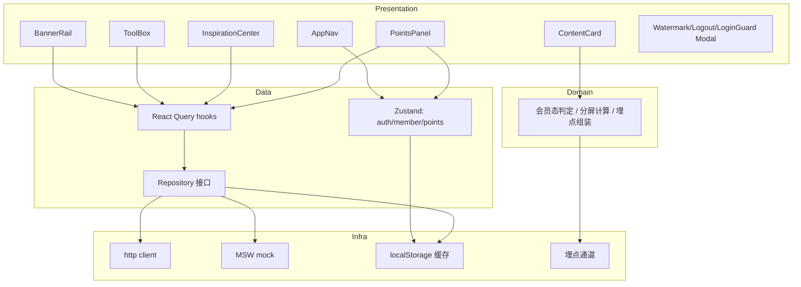
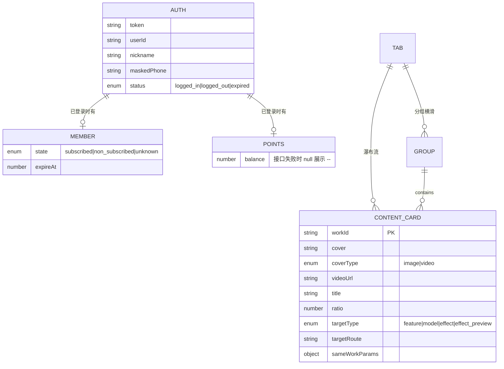
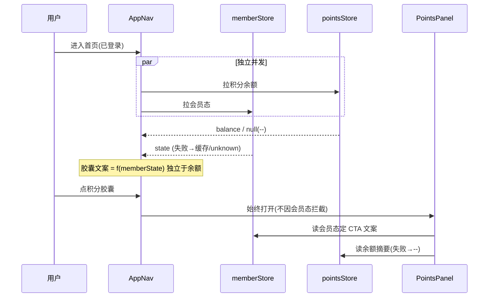

# 技术方案：纳米P视频web首页

**创建日期**：2026-07-04
**存放路径**：`Plans/技术方案/2026-07-04-纳米P视频web首页.md`
**状态**：已采纳
**lifecycle_state**：architecture
**平台**：Web 前端（React 18 + TypeScript + Vite）
**关联需求（真理源）**：`Plans/需求分析/2026-07-04-纳米P视频web首页.md`

---

## 一、背景与目标

- **业务需求/痛点**：纳米P视频 Web 首页为流量入口与转化枢纽，承接电商/营销/短视频从业者。四区块（导航栏 / Banner / 工具箱 / 灵感中心）独立渲染，云控可运营，未登录可完整浏览、生成操作后置拦截。
- **成功指标**：工具点击转化率 / 新用户首次生成率 / 灵感中心卡片点击率（含一键同款）/ Banner 点击率；首屏各区块独立骨架、先到先渲染。
- **非目标（YAGNI）**：站内搜索、个性化推荐算法、国际化/多语言、收银台内部流程、资产库/生成页/360 用户中心内部逻辑。

---

## 二、AI 行为准则

1. 先输出模块划分 + 接口草案，再写实现细节。
2. Presentation 层组件不直连 fetch；数据经 Data 层 Repository + React Query hook。
3. 缺信息列「待确认」，不猜测（H1/H3 已按选 A 假设，标注待评审回收）。

---

## 三、原则对照（必遵守）

| 原则 | 要求 |
|------|------|
| SRP | 每个区块组件单一职责；数据获取与展示分离（hook vs component） |
| OCP | 灵感中心内容形态（瀑布流/分组横滑）由云控 `layout` 驱动，新增形态不改已有组件 |
| DIP | 组件依赖 Repository 抽象接口，不依赖具体 fetch 实现（Mock/真实可换） |
| ISP | 会员态、积分态、登录态各自独立 store slice，消费方按需订阅 |
| DRY / KISS | 埋点、云控缓存、异常降级统一封装为通用工具，各区块复用 |

---

## 四、约束与前提

- **版本/环境**：React 18、TypeScript 5.x、Vite 5.x、Node ≥18；兼容 Chrome/Edge/Safari 最新两大版本 + Firefox 最新版。
- **依赖服务**：云控配置服务（Banner/工具箱/Tab/内容）、360 用户中心（登录）、会员态接口、积分余额接口、积分明细接口、水印设置接口、退出接口。
- **特性开关 / 灰度**：云控 key 抽为常量集中管理，支持不发版切换内容。
- **合规**：手机号脱敏展示；水印默认开启（账号级）。
- **数据接入策略**：**Mock 先行 + 接口抽象层**——Repository 层定义接口，开发期用 MSW/mock 实现，联调时换真实 API，组件层无感。

---

## 五、架构设计

### 客户端分层（Clean Architecture 轻量版）

```
Presentation（React 组件 + CSS Modules）
    ↓ 只依赖 hooks / store selector
Domain（类型定义 + 纯逻辑：会员态判定、Banner 分屏、埋点参数组装）
    ↓
Data（Repository 接口 + React Query hooks + Zustand store + 云控缓存）
    ↓
Infra（http client / MSW mock / localStorage 缓存 / 埋点上报通道）
```

### 模块边界（必填）

| 模块 | 职责 | 输入/输出 | 依赖模块 |
|------|------|-----------|----------|
| `AppNav` | 导航栏：Logo/主导航/资产库/积分胶囊/升级充值胶囊/头像菜单 | in: 登录态·会员态·积分 store / out: 跳转、打开面板/Modal | authStore, memberStore, pointsStore, tracking |
| `BannerRail` | Banner 横滑：分屏、箭头显隐、指示器、点击跳转 | in: useBannerQuery / out: 跳转、翻屏埋点 | cloudConfigRepo, tracking |
| `ToolBox` | 创意工具箱：工具项、查看更多 | in: useToolboxQuery / out: 跳转 | cloudConfigRepo, tracking |
| `InspirationCenter` | 灵感中心：Tab 栏 + 双形态内容区 + 内容卡片 | in: useTabsQuery/useTabContentQuery / out: 跳转、一键同款、埋点 | cloudConfigRepo, tracking |
| `WaterfallLayout` | 瀑布流形态：多列错落 + 触底分页 | in: 内容页 / out: 追加渲染 | InspirationCenter |
| `GroupScrollLayout` | 分组横滑形态：子分组堆叠 + 横滑翻页 | in: 分组列表 / out: 翻页 | InspirationCenter |
| `ContentCard` | 内容卡片：封面/标题/悬停预览/一键同款 | in: 作品数据 / out: 跳转、悬停埋点 | InspirationCenter, tracking |
| `PointsPanel` | 积分消耗明细面板：余额摘要 + 明细分页 + CTA | in: usePointsDetailQuery, memberStore / out: 跳收银台 | pointsRepo, memberStore |
| `WatermarkModal` | 水印设置 Modal：拉取/切换/保存 | in: useWatermarkQuery / out: 保存落库 | settingsRepo |
| `LogoutModal` | 退出登录确认 Modal | in: — / out: 清态、刷新导航栏 | authStore |
| `LoginGuardModal` | 登录拦截 Modal（未登录/过期两文案） | in: 拦截原因 / out: 唤起登录 | authStore |
| `SkeletonLayer` | 各区块骨架屏 + 超时/失败/空 Inline 占位 | in: loading/error 态 / out: 占位渲染 | 各区块共用 |
| `authStore` | 登录态（token、登录/未登录、过期） | Zustand slice | Infra(localStorage) |
| `memberStore` | 会员态（订阅/非订阅/未知，含缓存兜底） | Zustand slice | Infra(localStorage) |
| `pointsStore` | 积分余额 | Zustand slice | pointsRepo |
| `cloudConfigRepo` | 云控数据获取 + 缓存先渲染后刷新 | Repository | React Query, Infra |
| `tracking` | 埋点封装（show/click/hover 去重防抖） | util | Infra 上报通道 |



### 数据模型（TS 类型 + ER）



**核心 TS 类型定义**：

| 实体 | 字段 | 类型 | 必填 | 说明 |
|------|------|------|------|------|
| AuthState | status | `'logged_in'\|'logged_out'\|'expired'` | 是 | 登录态 |
| AuthState | token / userId / nickname / maskedPhone | string | 否 | 已登录时有；nickname 仅头像菜单用 |
| MemberState | state | `'subscribed'\|'non_subscribed'\|'unknown'` | 是 | 未知=接口失败无缓存兜底 |
| PointsState | balance | `number\|null` | 是 | null → 展示 `--` |
| BannerItem | cover/coverType/videoUrl?/route/sort | — | 是 | 云控下发，sort 降序 |
| ToolItem | name/cover/describe/router/sort | — | 是 | 云控下发 |
| TabItem | tabId/tabName/layout/sort | `layout: 'waterfall'\|'group_scroll'` | 是 | 形态云控驱动 |
| ContentCard | workId/cover/coverType/videoUrl?/title?/ratio/targetType/targetRoute/sameWorkParams | — | 是 | 见 ER |
| Group | groupId/groupName/groupDesc/thumbs/sort/works | — | 是 | 分组横滑子分组 |
| PointsRecord | time/desc/delta/balanceAfter | — | 是 | 明细单行；delta 带符号 |

### API Schema / 接口契约（必填）

> H1/H3 标 **【假设】**，评审回收后撤销标记。

| 方法 | 路径/云控key | 说明 | 幂等 | Request | Response |
|------|------|------|------|---------|----------|
| GET | cloud:`nano_pvideo_web_homebanner` | Banner 列表 | 是 | — | `{list:[BannerItem]}` |
| GET | cloud:`nano_pvideo_web_hometools` | 工具箱列表 | 是 | — | `{list:[ToolItem]}` |
| GET | cloud:`nano_pvideo_web_hometab`【假设H1】 | 灵感中心 Tab 列表 | 是 | — | `{list:[TabItem]}` |
| GET | `/api/home/inspiration/waterfall`【假设H3】 | 瀑布流内容分页 | 是 | `{tabId, cursor, size=20}` | `{list:[ContentCard], hasMore, nextCursor}` |
| GET | `/api/home/inspiration/groups`【假设H3】 | 分组横滑整 Tab | 是 | `{tabId}` | `{groups:[Group]}` |
| GET | `/api/user/points/balance` | 积分余额 | 是 | — | `{balance}` |
| GET | `/api/user/member/state` | 会员态 | 是 | — | `{state, expireAt}` |
| GET | `/api/user/points/detail` | 积分明细分页 | 是 | `{cursor, size=20}` | `{list:[PointsRecord], hasMore, nextCursor}` |
| GET | `/api/user/watermark` | 水印初始态 | 是 | — | `{enabled}` |
| POST | `/api/user/watermark` | 保存水印 | 是（防抖300ms） | `{enabled}` | `{code:0}` |
| POST | `/api/user/logout` | 退出登录 | 是 | — | `{code:0}` |

**灵感中心瀑布流 Response 示例【假设H3】**：

```json
{
  "list": [
    {
      "workId": "w_1001",
      "cover": "https://.../cover.jpg",
      "coverType": "video",
      "videoUrl": "https://.../preview.mp4",
      "title": "口播带货视频",
      "ratio": 0.5625,
      "targetType": "effect_preview",
      "targetRoute": "/effect/xxx",
      "sameWorkParams": { "workId": "w_1001" }
    }
  ],
  "hasMore": true,
  "nextCursor": "eyJvIjoyMH0="
}
```

**错误码 / 降级策略**：

| 场景 | 客户端处理 |
|------|------------|
| 云控空/失败无缓存 | Banner/工具箱整块隐藏；Tab 退化单「发现」 |
| 内容首屏失败/超时>10s | Inline「加载失败，请点击重试」+ 重试按钮 |
| 分页/横滑失败 | 对应位 Inline 重试，已加载保留 |
| 积分余额失败 | 展示 `--`，点击区仍可用 |
| 会员态失败无缓存 | 兜底 `unknown`→按非订阅处理，CTA「升级」 |
| 水印初始态失败 | 开关兜底开启 + Inline 重试，保存置灰 |
| 退出失败但 token 失效 | 走成功分支刷新未登录态 |

### 关键流程：会员态与积分态解耦（S6-S10 核心）



---

## 六、方案选项与决策矩阵（ADR 摘要）

### ADR-001 状态管理选型：Zustand + React Query

| 方案 | 云控缓存 | 样板量 | 学习成本 | 风险 | 备注 |
|------|------|--------|------|------|------|
| A Zustand+React Query | React Query 原生支持 stale-while-revalidate | 低 | 低 | 低 | **推荐** |
| B Redux Toolkit+RTK Query | 支持 | 高 | 中 | 低 | 样板重 |
| C Context+useReducer | 需手写缓存/重试 | 中 | 低 | 高 | 云控诉求手写易错 |

**推荐 A**：全局态（登录/会员/积分）用 Zustand 轻量 slice；云控与列表数据用 React Query（自带缓存、重试、stale-while-revalidate、分页 `useInfiniteQuery`），恰好匹配「缓存先渲染后静默刷新」。

### ADR-002 云控缓存策略：缓存先渲染 + 后台静默刷新

- localStorage 持久化云控响应（Banner/工具箱/Tab/内容），key 按云控 key 命名。
- React Query `initialData` 读缓存立即渲染 → 后台 refetch → 成功则更新缓存与 UI。
- 缓存为空且接口失败 → 区块隐藏/Inline 重试（按异常矩阵）。
- **待确认 H2**：跨页返回重新拉取的触发时机（SPA 路由 vs BFCache），方案期先按「路由进入 + `visibilitychange` 可见」双触发，联调再定。

### ADR-003 会员态与积分态解耦

- 两者独立 store + 独立接口，互不阻塞、互不依赖。
- 胶囊文案与面板 CTA 只依赖 `memberState`；余额仅用于展示，失败 `--` 不影响 CTA。
- 会员态 `unknown` 保守按非订阅（CTA「升级」）；缓存刷新成功后自动切换。
- **面板打开期间不实时切换 CTA**（B20）：CTA 文案在 `PointsPanel` 打开瞬间快照，关闭前不随 store 变化。

### ADR-004 埋点封装：统一 tracking 工具

- 单一入口 `track(event)`，固定 `key=namivideo_home`、`attr=namivideo_home`。
- 通道分流：`click` → `webqdas_c_htm`；`show/hover` → `webqdas_p_htm`。
- 去重防抖内建：`show` 同 work_id/position 会话内去重；`hover` ≥2s 且会话内去重、仅内容卡片；`click` 每次上报、300ms 内首次、Tab 切换 300ms 取最后。
- 业务必填字段（key/action/attr）缺失则不上报 + dev warning；尽力字段（user_id/mid/m2）缺失传空。
- 上报失败静默、不重试、不阻断业务。
- **积分面板曝光/CTA 埋点归全局积分组件**（H5），首页不重复定义。

---

## 七、上线与回滚

- **发布步骤**：Mock 数据自测 → 联调替换真实接口 → 灰度（云控 key 可空返回退化）→ 全量。
- **回滚触发**：首屏白屏率/JS 错误率超阈值、核心区块渲染失败率升高。
- **回滚操作**：前端制品回退上一版本；云控可即时下发空配置退化区块。
- **数据迁移**：无（纯前端，无本地 schema 迁移）。

---

## 八、实施计划

| 阶段 | 内容 | 对应 WBS |
|------|------|------|
| 1 | 脚手架 + 分层骨架 + Mock/Repository 抽象 + Zustand/React Query 接入 | 6-7 |
| 2 | 导航栏（登录态/会员态/积分/头像菜单）+ 三 Modal + 积分面板 | 8-9 |
| 3 | Banner + 工具箱 + 骨架屏 | 8-9 |
| 4 | 灵感中心（Tab + 瀑布流 + 分组横滑 + 内容卡片悬停预览） | 8-9 |
| 5 | 埋点封装接入各区块 + 全 Variant（空/错误态） | 9 |
| 6 | 单测补充 + 真机联调 + 设计走查 | 10-11 |

---

## 九、验收标准

- [ ] 四区块独立渲染、先到先展示，导航栏与 Tab 栏不参与骨架
- [ ] 会员态三分支 × 胶囊 × 面板 CTA 一致（S6-S9）
- [ ] 积分余额与会员态解耦，余额失败 `--` 点击区可用（S10）
- [ ] 灵感中心形态云控驱动、不写死；瀑布流分页 + 分组横滑一次返回
- [ ] Repository 抽象可切换 Mock/真实接口
- [ ] 埋点封装覆盖 show/click/hover 去重防抖规则
- [ ] 分层无违规：Presentation 不直连 fetch
- [ ] 关键路径（会员态判定、Banner 分屏、埋点组装）有单测

---

## 续做

```
/resume plan=Plans/技术方案/2026-07-04-纳米P视频web首页.md 进度=技术方案
```

**下一阶段 Skill**：`/task-splitter`，将本方案拆解为 `Plans/功能开发/` 原子任务。

## 反馈（skill_run）

```yaml
skill_run:
  skill: architecture-design-assistant
  plan: Plans/技术方案/2026-07-04-纳米P视频web首页.md
  date: 2026-07-04
  contexts_used:
    - path: Plans/需求分析/2026-07-04-纳米P视频web首页.md
      utility: high
      reason: "17组GWT+边界清单+异常矩阵作为方案真理源，直接映射为模块/契约/降级策略"
    - path: Templates/技术方案模板.md
      utility: high
      reason: "按模板产出模块边界/ER/API Schema/ADR/验收"
  contexts_missing:
    - "H2 跨页返回重新拉取触发时机——方案期按双触发假设，联调定"
    - "H5 全局积分组件是否已存在——影响面板埋点归属，待确认"
  contexts_stale: []
```
