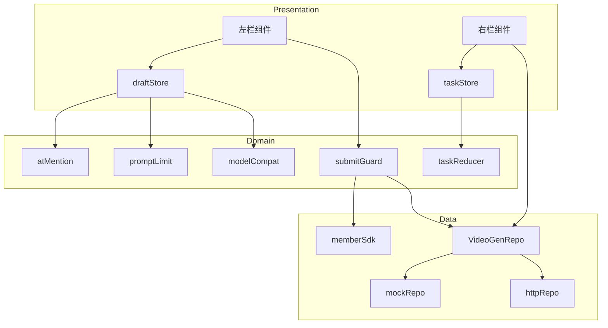

# 技术方案：纳米P视频web视频生成-参考生视频

**创建日期**：2026-07-05
**状态**：已采纳（用户授权按默认假设推进）
**lifecycle_state**：architecture
**平台**：客户端（React 19 Web）
**关联需求（真理源）**：`Plans/需求分析/2026-07-05-纳米P视频web视频生成参考生视频.md` ← 架构变动须先回看

---

## 一、背景与目标

- **需求**：视频生成工作台「参考生视频」模式，左栏创作 + 右栏任务三态。承接已交付首页，复用同一分层与基建。
- **成功指标**：首次生成率、提交转化、任务成功率、拦截转化。
- **非目标**：首尾帧/特效模式、灵感内容数据源、草稿持久化、真实后端（全 Mock）。

---

## 二、AI 行为准则

1. 复用首页已有分层（Presentation→Domain→Data→Infra）、Repo 契约模式、Zustand store、Tracker、Modal/Toast/StatusPlaceholder 基建，不重造。
2. Domain 层放**纯函数**（@引用重排、按钮可用性、计费展示、轮询状态归约），带单测；UI 不直连 repo。
3. 全 Mock 契约先行：`httpRepo` 按契约写好，`VITE_USE_MOCK` 切换。

---

## 三、原则对照

| 原则 | 要求 |
|------|------|
| SRP | @引用重排/字数校验/按钮可用性各自纯函数，与 UI 解耦 |
| DIP | UI→UseCase(hook)→Repo 接口，Mock/http 双实现 |
| DRY | 复用 Tracker/Modal/Toast/StatusPlaceholder/authStore/memberStore |
| KISS/YAGNI | 轮询而非 WS；不做草稿持久化；不做视图切换器 UI |

---

## 四、约束与前提

- **版本**：React 19 + Vite 8 + TS 6 + Zustand 5 + RQ 5 + CSS Modules + Vitest 4 + MSW（沿用）。
- **路由**：引入 `react-router-dom@7`（已装未用）：`/` → HomePage、`/video-gen` → VideoGenPage。见 ADR-1。
- **依赖服务（全 Mock）**：模型云控、estimate、submit、任务轮询、会员SDK、上传。
- **P0 假设**：见需求 plan §十，本方案据此落地，全部 `待产品确认`。

---

## 五、架构设计（客户端分层落位）

### 目录规划（新增，紧贴首页约定）

```
src/
  pages/videoGen/
    VideoGenPage.tsx / .module.css        # 两栏容器 + 顶栏复用
    useVideoGenModels.ts                  # 云控模型 query + 兜底
    useTaskList.ts                        # 任务列表 query + 轮询编排
    useSubmit.ts                          # 立即生成判定链(登录→会员→提交)
  components/videoGen/
    leftPane/
      ModeTabs.tsx                        # 生成模式Tab(参考生视频高亮, 首尾帧/特效占位灰置)
      MaterialUploader.tsx                # 素材上传区(空态框/卡片/+追加/hover浮层)
      MaterialHoverPreview.tsx            # 多张预览浮层(1/N + 箭头)
      PromptEditor.tsx                    # 富文本提示词 + @引用 + 计数器 + 工具栏
      AtMentionDropdown.tsx               # @下拉面板
      ParamCapsules.tsx                   # 比例/时长/分辨率/数量胶囊 + 浮层
      ModelCapsule.tsx                    # 模型胶囊 + 选择浮层
      GenerateBar.tsx                     # 预估消耗 + 立即生成按钮
    rightPane/
      ResultTabs.tsx                      # 任务列表/灵感中心Tab
      TaskListEmpty.tsx                   # 空态(去灵感中心链接)
      TaskCard.tsx                        # 三态卡片(生成中/成功/失败)
      TaskCardGenerating/Success/Fail.tsx
      FullscreenPlayer.tsx                # 全屏播放器
      InspirationHandoff.tsx              # 灵感中心承接(复用首页InspirationCenter或占位)
  domain/videoGen/
    types.ts                             # 领域模型(见 §六)
    atMention.ts (+test)                 # @引用插入/删除重排/回写(P0-2 保留空格)
    promptLimit.ts (+test)               # 双层字数上限(硬10000截断/软业务上限拦截)
    submitGuard.ts (+test)               # 可提交条件 + 判定链纯逻辑
    modelCompat.ts (+test)               # 切模型素材/参数纠偏
    taskReducer.ts (+test)               # 任务列表状态归约 + superseded_by去重
    estimate.ts                          # 预估消耗展示归一
  data/videoGen/
    repo.ts                              # VideoGenRepo 接口(见 §七)
    mockRepo.ts / httpRepo.ts / fixtures.ts
    stores/draftStore.ts                 # 左栏草稿(素材/提示词/参数/模型)
    stores/taskStore.ts                  # 右栏任务列表
    memberSdk.ts                         # 会员中台SDK 抽象 + Mock五态桩
  domain/tracking/                       # 泛化 tracker 支持多 key/action(见 ADR-2)
```

### 模块边界

| 模块 | 职责 | 输入/输出 | 依赖 |
|------|------|-----------|------|
| draftStore | 左栏草稿单一状态源 | 素材/提示词富文本/参数/model_id | domain/videoGen |
| atMention | @引用富文本节点增删+序号重排回写 | (nodes, materials) → nodes | 纯函数 |
| submitGuard | 可提交 + 判定链决策 | (draft, auth, member) → decision | authStore/memberStore/SDK |
| taskReducer | 任务插入/状态流转/去重 | (list, event) → list | 纯函数 |
| useTaskList | 轮询编排(3s/120s/3次) | RQ + interval | taskStore/repo |
| memberSdk | 会员可用性 + 续提交回调 | () → 五态 | Mock 桩 |



---

## 六、领域模型 / 数据模型（domain/videoGen/types.ts）

```ts
type MaterialType = 'image' | 'video' | 'audio'
interface Material { id; type: MaterialType; seq: number; thumbUrl; url; name; durationSec?; status: 'uploading'|'ready'|'error' }
// 提示词富文本扁平节点
type PromptNode = { kind:'text'; text:string } | { kind:'ref'; materialId:string; materialType:MaterialType; seq:number }
interface Draft { materials: Material[]; promptNodes: PromptNode[]; params: ParamSet; modelId: string }
interface ParamSet { ratio:string; durationSec:number; resolution:string; count:number }
interface VideoModel { modelId; name; icon; description; ratios; resolutions; durations:[min,max]; counts:number[]; promptCount; defaultConfig; refImage; refVideo; refAudio; supportMode; cost:CostRule[] }
type TaskStatus = 'generating'|'success'|'fail'|'timeout'|'deleted'
interface VideoTask { taskId; status; mode:'reference_to_video'; modelId; params; promptSummary; supersededBy?; workId?; coverUrl?; videoUrl?; durationSec?; errorCode?; errorMsg?; pollFails:number }
```

---

## 七、接口契约 / API Schema（VideoGenRepo · 全 Mock）

```ts
interface VideoGenRepo {
  getModels(): Promise<VideoModel[]>                              // 云控, 失败→缓存兜底
  uploadMaterial(file, type): Promise<Material>                   // 进度/失败/解码失败
  estimate(req:{modelId;params;count;materials}): Promise<{cost:number; breakdown:{label;value}[]}>  // P0-1
  submit(req:{draft;count}): Promise<{taskIds:string[]}>          // 返N个子任务id
  listTasks(): Promise<VideoTask[]>
  pollTask(taskId): Promise<VideoTask>                            // 轮询单任务
  deleteTask(taskId): Promise<void>
}
interface MemberSdk { check(): Promise<{result:'available'|'need_login'|'no_permission'|'insufficient_credit'; payload?}> }  // P0-4 Mock五态
```

---

## 八、关键算法与决策

### @引用删除重排（atMention.ts · P0-2）
删除 material 时：①从 materials 移除 → ②同 type 后续 seq 整体 -1 → ③扫 promptNodes：删除指向该 material 的 ref 节点（**不补空格，保留插入时追加的原空格**）；④其余同 type 且 seq 更大的 ref 节点 seq 同步 -1（缩略图刷新）。替换保留位次：仅换 material 引用目标，seq/文本不变。原子返回新 nodes。

### 双层字数（promptLimit.ts）
`硬上限 10000` 输入期实时截断；`业务上限 model.promptCount` 仅提交拦截 + 计数器标红（≤软灰、>软红）。切模型立即用新 promptCount 重算标红（P1-8），不改内容。

### 可提交 + 判定链（submitGuard.ts）
参考模式可提交 = 提示词非空。判定链串行：`checkPrompt → checkAuth(authStore) → memberSdk.check → submit`，任一失败短路返回对应 action（toast/loginModal/cashier）；拦截成功回调续跑（保存 pendingSubmit）。防抖 300ms。

### 任务轮询（useTaskList.ts · P0-5）
提交后 taskStore 插入 N 张 generating 卡（原位）。每 3s 轮询 generating 任务；单任务 120s 超时→timeout Inline；pollTask 失败 pollFails++，连续 3 次→Inline 刷新。切走/回来以 listTasks 为准。

### superseded_by 去重（taskReducer.ts · P0-3）
再次生成：submit 得新 taskId，新卡 `supersededBy=旧id` 插旧卡原位，**旧卡从列表移除**；成功卡无再次生成。

---

## 九、ADR

- **ADR-1 引入 react-router**：现 App 直渲 HomePage。新增第二页需路由。用 `react-router-dom@7` BrowserRouter，`/`+`/video-gen`。理由:已装、首页导航"视频生成"本就要跳转。
- **ADR-2 泛化 Tracker 支持多 key**：现 `trackPayload` 硬编码 `namivideo_home`。抽出 `key/attr` 为 Tracker 实例参数（`new Tracker({key,attr})`），首页保持 `namivideo_home` 不变，视频生成用 `namivideo_video_gen`+attr`video_gen_reference`，并扩 action 支持 `submit/success/fail`、扩字段 `model_id/task_id/work_id/error_code/error_msg/duration`。向后兼容，首页埋点不动。
- **ADR-3 富文本用受控扁平节点数组 + contentEditable**：@引用要求不可拆节点/整体删除/序号回写，用扁平 `PromptNode[]` 建模，渲染到 contentEditable，选区映射到节点。避免引入重型富文本库(YAGNI)。
- **ADR-4 会员/上传/estimate 全 Mock 桩**：无后端，Mock 覆盖成功+全异常态，契约固化待联调。

---

## 十、边界/异常/验收

覆盖需求 plan §四边界、§五异常矩阵、§九 14 条 AC。任务状态机见需求 §一·六。

---

## 十一、结论

| 项 | 结论 |
|----|------|
| 可否进入测试先行/开发 | ✅ |
| 关联测试 plan | `Plans/自动化测试/2026-07-05-纳米P视频web视频生成参考生视频.md` |
| 关联开发 plan | `Plans/功能开发/2026-07-05-纳米P视频web视频生成参考生视频.md` |

---

## 续做

```
/resume plan=Plans/技术方案/2026-07-05-纳米P视频web视频生成参考生视频.md 进度=已采纳→测试先行
```

**下一阶段 Skill**：`/test-generator`（验收测试先行）。

---

## 反馈（skill_run）

```yaml
skill_run:
  skill: architecture-design-assistant
  plan: Plans/技术方案/2026-07-05-纳米P视频web视频生成参考生视频.md
  date: 2026-07-05
  contexts_used:
    - path: Plans/技术方案/2026-07-04-纳米P视频web首页.md
      utility: high
      reason: "复用首页分层/Repo契约/Tracker/store模式，保持一致"
    - path: Plans/需求分析/2026-07-05-纳米P视频web视频生成参考生视频.md
      utility: high
      reason: "领域模型/状态机/AC/P0假设的唯一需求基准"
    - path: Templates/技术方案模板.md
      utility: high
      reason: "方案骨架与ADR结构"
  contexts_missing:
    - "Tracker多key泛化改造对照(埋点基建复用规范)"
  contexts_stale: []
```
