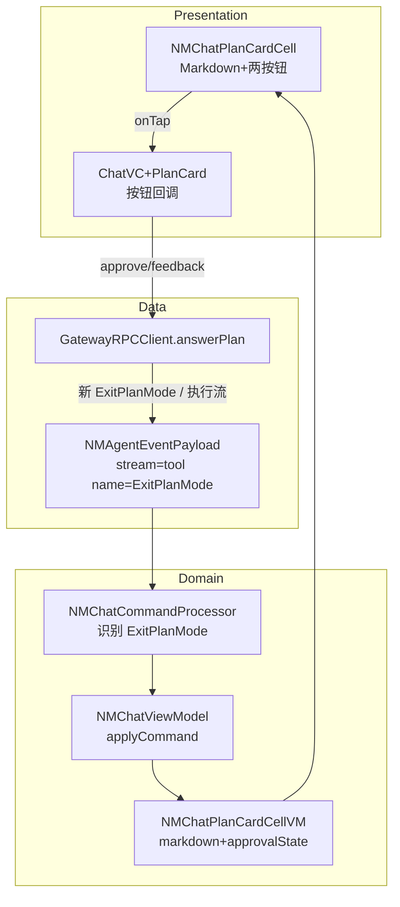
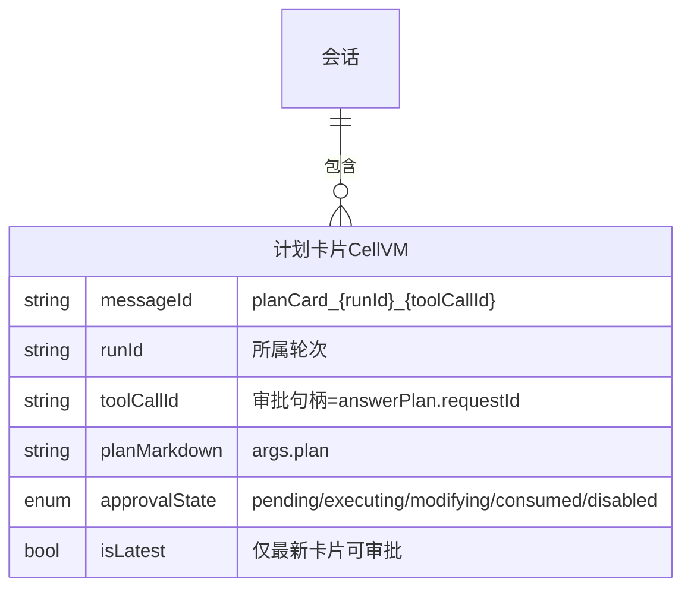
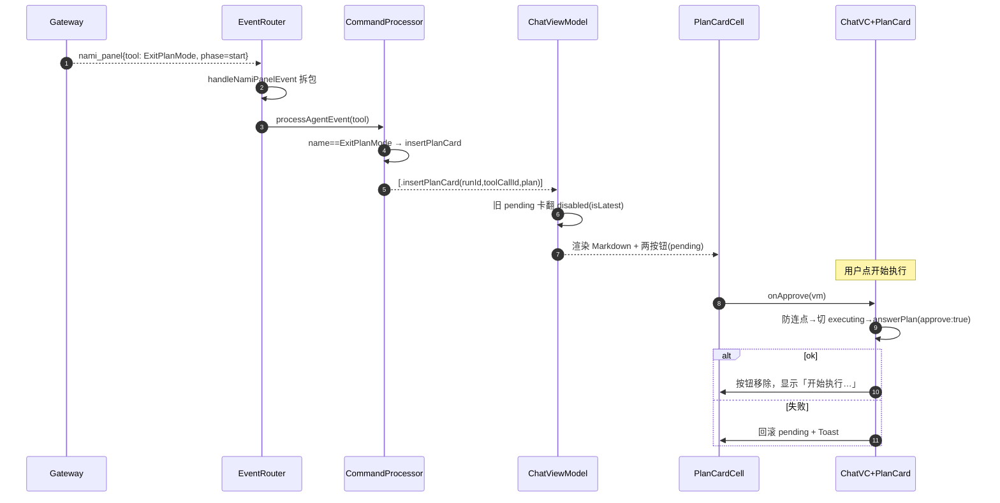
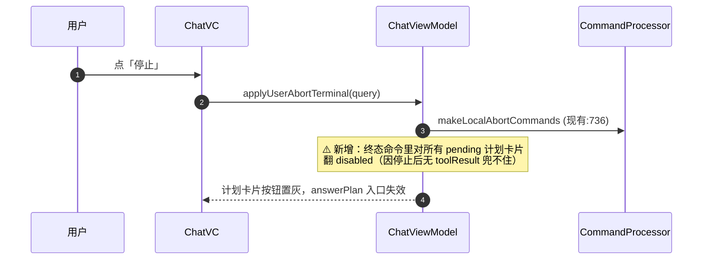

# 技术方案：纳米AI助理计划模式计划卡片（二期 · 客户端）

**创建日期**：2026-07-06
**存放路径**：`Plans/技术方案/2026-07-06-纳米AI助理计划模式计划卡片.md`
**状态**：已采纳
**平台**：客户端（iOS，仓库 NNamiWork，分支 feature/0706/plan_mode）
**关联需求（真理源）**：`Plans/需求分析/2026-07-06-纳米AI助理计划模式计划卡片.md`

---

## 一、背景与目标

- **业务需求**：计划模式（`agent:namiai`，`extraParams.mode="plan"` 一期已透传）在收到 AI 计划时，插入一张 **Markdown 计划卡片**，卡片底部「开始执行 / 修改计划」构成审批闸门；批准走执行态，打回走重规划。
- **成功指标**：AC1–AC9 全绿（见需求 plan §九）；计划卡片走**与现有 tool 节点同一条渲染链**，不新起并行管线。
- **非目标**：① 不动目标模式；② 不做结构化 steps/进度回写（卡片=静态 Markdown）；③ **多设备审批同步**、**执行态停止后可否再交互** 为遗留待办，本期不实现；④ 不改一期模式选择器/记忆。

---

## 二、AI 行为准则

1. 先定模块边界 + 事件识别契约 + RPC 契约，再写 Cell/UI 细节。
2. 外科手术式改动：复用现有 tool 渲染链（`NMChatCommandProcessor` 的 tool 分支）、现有卡片 Cell 范式（`NMGeneratedAgentCardCell`）、现有中止链（`makeLocalAbortCommands`），不造平行轮子。
3. 缺信息列「待确认」，不猜服务端行为。

---

## 三、原则对照

| 原则 | 要求 |
|------|------|
| SRP | 识别（Processor）/ 状态（CellVM）/ 渲染（Cell）/ 网络（RPC）四层各司其职，不混。 |
| OCP | 新增 `.planCard` cellType + 一条 `name=="ExitPlanMode"` 分支，不改既有 tool 渲染逻辑。 |
| DIP | Cell 按钮点击经 VC 回调 → 调 `GatewayRPCClient.answerPlan`，Cell 不直连网络。 |
| KISS/YAGNI | 按钮态 = `phase==toolCall && 未终止` 两个布尔与，不引入自定义持久化状态字段。 |

---

## 四、约束与前提

- **仅 `agent:namiai` 生效**：识别信号 tool `ExitPlanMode` 仅在纳米AI助理会话出现；不影响龙虾/教练/专家团。
- **依赖服务端**：`ExitPlanMode` tool 下发格式 + `chat.answerPlan` RPC（接口文档 docx Hh2rdLmLSo4cgyxiTALc69pJncf 已定）。
- **无云控开关**：本期**不引入** Feature Flag，直接上线（已确认无灰度）。

---

## 五、架构设计

### 5.1 模块边界（必填）

| 模块            | 职责                                   | 输入 / 输出                                                         | 依赖               | 落点文件                                                               |
| ------------- | ------------------------------------ | --------------------------------------------------------------- | ---------------- | ------------------------------------------------------------------ |
| **识别层**       | 在 tool 事件里认出 `ExitPlanMode`，转成计划卡片命令 | in: `NMAgentEventPayload`(stream=tool) / out: `[NMChatCommand]` | CommandProcessor | `Command/NMChatCommandProcessor.swift`（tool 分支 :278）               |
| **命令层**       | 新增计划卡片命令 case                        | in/out: `NMChatCommand`                                         | —                | `Command/NMChatCommand.swift`                                      |
| **状态层**       | 计划卡片 CellVM，持 markdown + 审批态         | in: 命令 / out: 渲染数据                                              | BaseCellVM       | `ViewModel/CellViewModels/NMChatPlanCardCellVM.swift`（新增）          |
| **ViewModel** | applyCommand 落卡片、终止时置灰按钮             | in: 命令 / out: snapshot                                          | CellVM           | `ViewModel/NMChatViewModel.swift`                                  |
| **渲染层**       | 计划卡片 Cell（Markdown + 两按钮）            | in: CellVM / out: UI + 点击回调                                     | BaseCell         | `View/Cells/NMChatPlanCardCell.swift`（新增）+ 注册表                     |
| **交互层**       | 按钮点击 → 调 RPC / 进等待态                  | in: 点击 / out: RPC 调用                                            | RPCClient        | `NMChatViewController+PlanCard.swift`（新增，仿 +ClawMaster）            |
| **网络层**       | `chat.answerPlan` RPC 封装             | in: requestId/approve/feedback / out: ok                        | session          | `GatewayCore/Connection/GatewayRPCClient.swift`（仿 abortChat :1221） |



### 5.2 数据模型（CellVM 状态机）



**approvalState 语义（核心，映射需求 §D P0-3）**：

| 状态 | 触发 | 按钮 | 说明 |
|------|------|------|------|
| `pending` | 收到 ExitPlanMode(phase=start，即 toolCall) | 两按钮**可点** | 草稿待审批 |
| `executing` | 点开始执行→`answerPlan(approve:true)` | 移除，显示「开始执行…」 | 单次消费 |
| `modifying` | 点修改计划 | 移除，显示「等待输入意见」→提交后「提交修改意见…」 | 输入框聚焦 |
| `consumed` | 收到该 toolCallId 的 toolResult(phase=result) | 不可点 | 正常审批已消费 |
| `disabled` | **会话终止(final/error/aborted)** 且仍在 toolCall | **置灰不可点** | ⚠️ 停止后无 toolResult，靠此兜底 |

> **按钮可点 = `approvalState==pending && !sessionTerminated`**。`sessionTerminated` 由 ViewModel 在收到终态命令时对所有 `pending` 计划卡片翻成 `disabled`（见 5.5）。`isLatest`：新卡片插入时把同会话旧 `pending` 卡片翻 `disabled`（对齐 AC2-反）。

### 5.3 事件识别契约（原 P0-1，已定）

`ExitPlanMode` 经 **`nami_panel` 外层包裹**（见接口文档样例），端已有 `handleNamiPanelEvent` 拆包（`NMChatServerEventRouter.swift:312`）拆出内层 `stream=tool` 事件，故识别逻辑落在**统一的 tool 分支**即可，无需碰 Router。

内层 tool 事件字段（拆包后）：

| 字段 | 值 | 用途 |
|------|-----|------|
| `data.phase` | `"start"` / `"result"` | start=toolCall(可审批)，result=consumed |
| `data.name` | `"ExitPlanMode"` | **识别信号** |
| `data.toolCallId` | `toolu_xxx` | 审批句柄 → answerPlan.requestId |
| `data.args.plan` | `"# 计划：..."` | 卡片 Markdown 主体 |

**识别落点**：`NMChatCommandProcessor.processAgentEvent` 的 `case "tool"`（:278），仿现有 `if name == "swarm_plan"`（:288）加一支：

```
if name == "ExitPlanMode" {
    if let cmds = processExitPlanModeTool(agentEvent, phase: phase) { return cmds }
}
```
- `phase=="start"` → `.insertPlanCard(messageId, runId, toolCallId, planMarkdown)`
- `phase=="result"` → `.updatePlanCardState(toolCallId, .consumed)`

### 5.4 API Schema / 接口契约（必填）

**下发（服务端 → 端）**：ExitPlanMode tool 事件（见 5.3，非端定义）。

**审批回传（端 → 服务端）**：`chat.answerPlan`，仿 `abortChat`（`GatewayRPCClient.swift:1221`）新增：

| 方法 | 说明 | 幂等 | Request | Response |
|------|------|------|---------|----------|
| `chat.answerPlan` | 审批计划卡片 | 是（同 requestId 重复无副作用，端仍需防连点） | 见下 | `{ ok: true }` |

**Request**：
```json
{
  "requestId": "toolu_014dLLRchCEbrB9JMMp3cFmF",
  "approve": true,
  "feedback": ""
}
```
- `requestId` = 卡片 `toolCallId`；`approve:true`=开始执行；`approve:false`+`feedback`=打回修改（feedback=用户补充意见文本）。

**端方法签名（落点 GatewayRPCClient.swift）**：
```
func answerPlan(requestId: String, approve: Bool, feedback: String? = nil) async throws
// method: "chat.answerPlan", timeoutSeconds: 15（对齐 create/update agent 口径）
```

**错误码**：

| 场景 | 端处理 |
|------|--------|
| RPC 超时/失败 | `NMToastView` 提示「操作失败，请重试」，卡片状态**回滚到 pending**（按钮恢复），不进 executing/modifying |
| ok:true | 按 approve 分支切 executing / modifying |

> **修改意见发送时序（原 P1-7，已确认）**：点「修改计划」后端本地切 `modifying`+**复用现有输入框**（聚焦、键盘弹起，支持图片/文件/语音转文字）；用户提交时 → **把输入框里的 prompt 文本直接作为 `feedback` 调 `answerPlan(approve:false, feedback:prompt)`**，**不额外插用户气泡**（复用输入框，走 answerPlan 透传，不走普通 chat.send）→ 服务端重出新 ExitPlanMode tool 事件 → 走 5.3 同一识别链渲染新卡片。附件解析计入规划计费（R1）。**端不关心新卡片走同 runId 还是新轮次，按到达的 tool 事件渲染即可。**

### 5.5 关键流程

**流程一：计划卡片生成 → 审批**


**流程二：停止后按钮置灰（AC9，核心边界）**

> **落点**：`NMChatViewModel` 收到终态（`finishLoading`/aborted/error 批处理末尾）时，遍历 cellViewModels 把 `NMChatPlanCardCellVM` 里 `pending` 的翻 `disabled`。历史恢复时若该轮 completionState 为 aborted/error，`NMChatHistoryMapper` 映射出的计划卡片直接置 `disabled`。

---

## 六、方案选项与决策矩阵

**决策点：计划卡片是"独立新 cellType"还是"复用 assistantTool 特化渲染"？**

| 方案 | 复杂度 | 风险 | 与现有一致性 | 备注 |
|------|--------|------|--------------|------|
| A 独立 `.planCard` cellType + 新 Cell/CellVM | 中 | 低 | 高（对齐 generatedAgentCard/switchFBCard 先例） | 审批态、按钮、Markdown 自成一体，不污染 tool 渲染 |
| B 复用 `assistantTool`，在 ToolCell 里塞按钮 | 高 | 高 | 低 | tool cell 承载审批态会把通用工具渲染搞脏，违 SRP |

**推荐 A** — 与项目已有的"带底部按钮卡片"范式（`NMGeneratedAgentCardCell` + `handleAgentCardButtonTap`、`NMChatSwitchFullBloodCell.onButtonTap`）完全一致，识别在 Processor 层分流、渲染独立，改动面最小且不碰通用 tool 链。

---

## 七、上线与回滚

- **发布步骤**：随分支 `feature/0706/plan_mode` 集成；依赖服务端 `ExitPlanMode` 下发 + `answerPlan` 就绪后联调。
- **回滚触发**：计划卡片渲染异常 / answerPlan 联调阻塞。
- **回滚操作**：识别层一处开关——`NMChatCommandProcessor` 里 `name=="ExitPlanMode"` 分支不命中即退化为**普通 tool 卡渲染**（args.plan 作为 tool 参数展示），不 crash、不阻断对话。（无云控，回滚靠改码/热修，不设 Feature Flag）
- **数据迁移**：无（纯渲染 + 一个新 RPC，无本地持久化 schema 变更）。

---

## 八、实施计划（对应 Epic WBS 6–11，供 task-splitter 拆分）

| 阶段 | 内容 | 落点 |
|------|------|------|
| 1 | RPC：`answerPlan` | `GatewayRPCClient.swift`（仿 abortChat） |
| 2 | 命令：`NMChatCommand` 新增 `insertPlanCard`/`updatePlanCardState` | `Command/NMChatCommand.swift` |
| 3 | 识别：Processor tool 分支加 `ExitPlanMode` | `Command/NMChatCommandProcessor.swift:278` |
| 4 | 状态：`NMChatPlanCardCellVM` + `.planCard` cellType + 注册 | `CellViewModels/` + `NMChatCellViewModel.swift:29` + `NMChatCellRegistrable.swift:15` |
| 5 | 渲染：`NMChatPlanCardCell`（Markdown 复用现有渲染 + 两按钮） | `View/Cells/` |
| 6 | 交互：`NMChatViewController+PlanCard`（按钮回调→answerPlan/进等待态） | 仿 `+ClawMaster` |
| 7 | 终态置灰：ViewModel 终态命令翻 pending→disabled + 历史 aborted 置灰 | `NMChatViewModel.swift` / `NMChatHistoryMapper.swift` |
| 8 | 修改意见：等待态 + 提交 feedback（复用输入能力） | `+PlanCard` + 输入框 |

---

## 九、验收标准

- [ ] AC1–AC9（含 AC9 停止置灰、AC2-反 旧卡不可审批、AC6-反 计划态不计执行费）全绿
- [ ] 分层无违规（Cell 不直连 RPC；识别只在 Processor）
- [ ] `ExitPlanMode` 分支不命中时退化为普通 tool 渲染（回滚可用）
- [ ] 历史恢复：末轮 aborted → 计划卡片按钮置灰；停在 toolCall 且未终止 → 可点
- [ ] `xcodebuild build`（见 CLAUDE.md 编译验证）通过
- [ ] UI 走查：卡片 Markdown 渲染 + 两按钮 + 等待态（截图或 manual-only 标注）

---

## 十、已确认决策（无遗留待确认）

- ✅ **无云控灰度**：直接上线，不设 Feature Flag。
- ✅ **修改意见无用户气泡**：复用现有输入框，用户 prompt 直接作为 `answerPlan.feedback` 透传，不额外插用户气泡、不走普通 chat.send。
- ✅ 识别信号（ExitPlanMode）、按钮态模型（pending/consumed/disabled）、停止置灰、RPC 契约均已定，见 §五。

> 本期客户端范围内无阻塞待确认项，可进 `/task-splitter`。遗留待办（多设备审批同步、执行态停止后可否再交互）见 Epic，不属本期。

---

## 续做

```
/resume plan=Plans/技术方案/2026-07-06-纳米AI助理计划模式计划卡片.md 进度=方案评审
```

**下一阶段 Skill**：`/task-splitter`，将本方案拆为 `Plans/功能开发/` 原子任务（对应实施计划 1–8）。

---

## 反馈（skill_run）

```yaml
skill_run:
  skill: architecture-design-assistant
  plan: Plans/技术方案/2026-07-06-纳米AI助理计划模式计划卡片.md
  date: 2026-07-06
  contexts_used:
    - path: Plans/需求分析/2026-07-06-纳米AI助理计划模式计划卡片.md
      utility: high
      reason: "P0 闭环结论(ExitPlanMode识别/toolCall-toolResult按钮态/停止置灰)直接定架构分层与状态机"
    - path: Templates/技术方案模板.md
      utility: high
      reason: "模块边界+ER+API Schema+错误码骨架单一可信源"
  contexts_missing:
    - "客户端聊天渲染链(CommandProcessor/CellVM/Cell注册)的架构索引——本次靠读码还原,vault内无对照文档(项目docs/claude有但不在AI-Work-Kit)"
    - "Gateway RPC 新增方法的统一规范(超时/错误码/幂等口径)"
  contexts_stale: []
```
