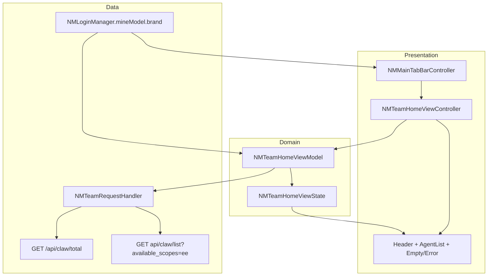
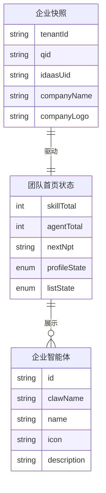
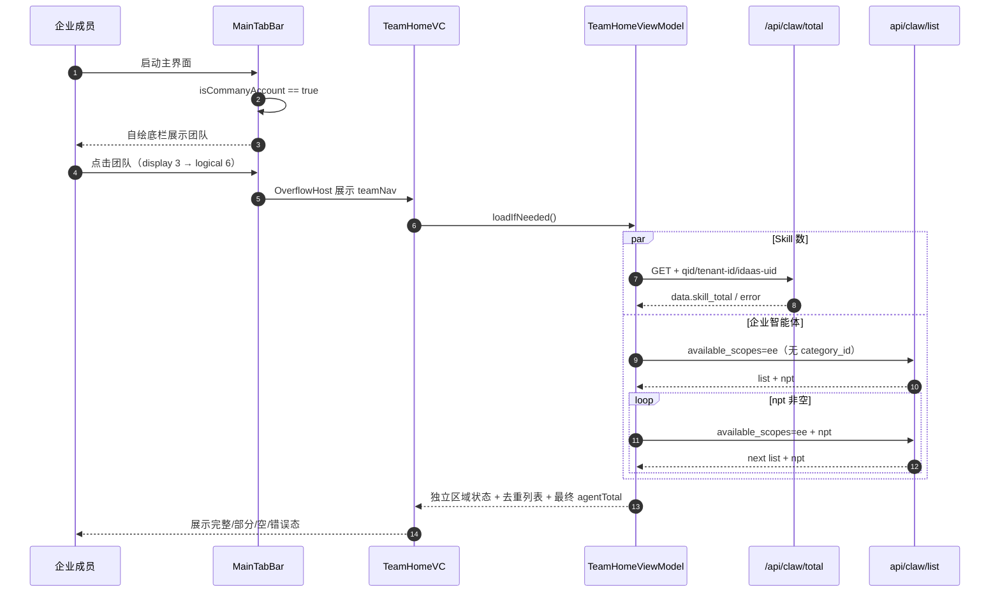

# 技术方案：团队首页（iOS）

**创建日期**：2026-07-16  
**存放路径**：`Plans/技术方案/2026-07-16-团队首页.md`  
**状态**：已采纳  
**lifecycle_state**：architecture  
**平台**：客户端（iOS 15+，NamiWork，分支 `feature/0714/enterpirce`）  
**关联需求（真理源）**：`Plans/需求分析/2026-07-16-团队首页.md`

---

## 一、背景与目标

- **业务目标**：仅企业账号在主底栏看到“团队”Tab；进入后展示企业 Logo/名称、Skill 数、企业范围智能体总数、“全部员工”视觉入口和智能体列表。
- **成功标准**：需求 plan AC1–AC17 中本期 P0 全部可实现；旧 Tab 的路由、导航栈和逻辑下标保持语义兼容。
- **非目标**：组织架构页面及跳转、“全部员工”业务行为、智能体卡片跳转、“雇佣”请求/状态、服务端改造、本地持久化。

## 二、架构原则

| 原则 | 落地约束 |
|------|----------|
| SRP | Team 的页面、状态与请求放入独立 `Features/Team`；MainTabBar 只负责入口和导航映射。 |
| OCP | 现有 `fetchAgentList(categoryId:)` 调用方不改契约；为团队新增明确的 `fetchEnterpriseAgents`，避免把 `ee` 语义塞进 category 参数。 |
| DIP | Controller 只绑定 ViewModel 状态；Cell 不直连请求。 |
| KISS | 不新建跨业务 Repository/UseCase 层；按本项目 MVVM 形态以 RequestHandler + ViewModel + Controller 落地。 |
| YAGNI | “全部员工”和“雇佣”仅渲染，不预埋空路由、占位页或雇佣状态机。 |

## 三、约束与前提

- 仅 `NMLoginManager.shared().isCommanyAccount()` 为真时创建并展示团队入口；企业信息读取当前 `mineModel.brand`。
- Figma 节点 `13:1519` 为新增入口后的首页，`14:1090` 为团队首页；所有标注尺寸按项目规则 ÷2。
- `api/claw/list` 请求必须固定 `available_scopes=ee`，不得传 `category_id`，后续页仅追加 `npt`。
- Skill 数请求 `GET /api/claw/total`，读取 `data.skill_total`；请求头使用登录 Cookie，并补齐 `qid`、`tenant-id`、`idaas-uid`。
- `api/claw/list` 当前端侧只解析 `data.list` 与 `data.npt`，没有已验证的总数字段；本方案以去重后的完整分页结果数量作为 `agentTotal`，不使用 `/api/claw/total.data.claw_total` 替代。
- 按仓库约定，不主动新增/运行测试或执行 `xcodebuild`，除非用户明确要求。

## 四、模块边界

| 模块 | 职责 | 输入 / 输出 | 依赖与落点 |
|------|------|-------------|------------|
| MainTabBar | 企业身份门控、逻辑 Tab 映射、团队 Nav 生命周期、自绘底栏顺序 | in: `isCommanyAccount`；out: Team Nav | `Features/MainTabBar/NMMainTabBarController.swift` |
| OverflowHost | 在第 5 个系统槽位承载 Team/Cloud/Profile 三个 Nav，切换当前可见 Nav | in: logical tab；out: visible Nav | 扩展 `NMTabOverflowHostViewController.swift` |
| Team Presentation | 企业头部、数量区、“全部员工”、列表、空/错/加载态 | in: ViewState；out: 用户可见页面 | 新增 `Features/Team/Controller`、`View` |
| Team ViewModel | 读取企业快照、并发加载 Skill 与智能体、分页去重、隔离旧企业响应 | in: refresh/loadMore；out: section states | 新增 `Features/Team/ViewModel/NMTeamHomeViewModel.swift` |
| Team Data | 封装 `/api/claw/total` 与企业范围 agent list 契约 | in: enterprise headers/npt；out: totals/page/error | 新增 `Features/Team/Network/NMTeamRequestHandler.swift`；复用 `NMClawAgentModel` |
| Login | 提供企业身份、名称、Logo 和平台请求头字段 | `brand` 快照 | 只读 `NMLoginManager` / `NMMineModel`，不改登录流程 |



## 五、主导航设计

### 5.1 逻辑下标兼容

保留所有既有下标，新增团队为 6：

| 语义 | 逻辑下标 | 系统槽位 | 底栏显示位置 |
|------|----------|----------|----------------|
| 首页 | 0 | 0 | 0 |
| 项目 | 1 | 1 | 1 |
| 专家 | 2 | 2 | 2 |
| 自动化 | 3 | 3 | 4 |
| 云盘（隐藏入口） | 4 | 4/OverflowHost | 不显示 |
| 我的 | 5 | 4/OverflowHost | 5 |
| 团队（新增） | 6 | 4/OverflowHost | 3 |

- 企业账号 `visibleLogicalTabs = [0, 1, 2, 6, 3, 5]`。
- 非企业账号保持 `[0, 1, 2, 3, 5]`，不创建 Team VC，不发 Team 请求。
- `logicalTabCount` 调整为 7；`teamLogicalTabIndex = 6`。
- `NMTabOverflowHostViewController` 从二选一扩展为 Team/Cloud/Profile 三选一，但继续只占系统 index 4；自动化仍保留系统 index 3，旧路由无需迁移。
- `navigationController(forLogicalTab:)`、`selectedTabNavigationController()`、`viewControllerForLogicalTab(_:)` 增加 Team 分支；既有 0–5 行为不变。
- 团队埋点标识暂用 `team_btn`；若统计平台要求其他值，在联调前替换常量，不影响页面架构。

### 5.2 企业身份变化

- 主 Tab 构建时读取 `isCommanyAccount()`；非企业不出现入口。
- 登录态/企业身份发生全局变化时，沿用现有重建主根流程；本任务不在运行中的 TabBar 动态插拔按钮，避免导航栈错位。
- Team ViewModel 捕获 `tenantId/qid` 快照；回包时快照与当前 `brand` 不一致则丢弃。

## 六、数据模型



| 类型/字段 | Swift 类型 | 必填 | 来源/规则 |
|-----------|------------|------|-----------|
| `NMTeamEnterpriseSnapshot.tenantId` | `String` | 是 | `brand.tenant_id`；用于响应隔离和请求头 |
| `qid` | `String` | 是 | `brand.qid` |
| `idaasUid` | `String` | 是 | `brand.idaas_uid` |
| `companyName` | `String` | 是 | `brand.company_name`；空值显示 `--`，不使用 Figma 示例 |
| `companyLogoURL` | `String?` | 否 | `brand.company_logo`；失败显示本地企业占位图 |
| `skillTotal` | `Int?` | 否 | `/api/claw/total.data.skill_total`；`nil` 表示未完成/失败，0 为有效业务值 |
| `agentTotal` | `Int?` | 否 | `ee` 范围分页完整后去重数组数量；加载完成前显示 `--` |
| `agents` | `[NMClawAgentModel]` | 是 | 以 `id ?? clawName` 去重，均空时使用稳定字段组合兜底 |
| `nextNpt` | `String?` | 否 | `/api/claw/list.data.npt`；空表示分页结束 |
| `profileState/listState` | enum | 是 | `.idle/.loading/.loaded/.empty/.failed(message)`，两区域独立 |

## 七、API Schema / 接口契约

### 7.1 企业智能体列表

| 方法 | 路径 | 幂等 | Query | 成功数据 |
|------|------|------|-------|----------|
| GET | `api/claw/list` | 是 | `appsource=bot&available_scopes=ee`；加载更多追加 `npt`；**禁止 `category_id`** | `data.list: []`、`data.npt?: String` |

请求示例：

```text
GET api/claw/list?appsource=bot&available_scopes=ee
GET api/claw/list?appsource=bot&available_scopes=ee&npt=<cursor>
```

端方法签名：

```swift
static func fetchEnterpriseAgents(
    npt: String? = nil,
    completion: @escaping (Result<NMTeamAgentPage, NMTeamRequestError>) -> Void
) -> NMSimpleRequest?
```

`NMTeamAgentPage` 包含 `agents`、`nextNpt`。首次加载为保证智能体总数口径，ViewModel 持续请求后续 `npt` 直到游标为空；每页到达可增量渲染列表，但顶部 `agentTotal` 仅在完整分页结束后从最终去重数组赋值。加载更多入口在该策略下无需再次请求。

### 7.2 Skill 数量

| 方法 | 路径 | 幂等 | Header | Query | 成功数据 |
|------|------|------|--------|-------|----------|
| GET | `/api/claw/total` | 是 | Cookie、`qid`、`tenant-id`、`idaas-uid` | 本页不传可选分类参数 | `data.skill_total: Int`；`data.claw_total` 忽略 |

成功响应示例（公共响应字段省略）：

```json
{
  "data": {
    "claw_total": 2222,
    "skill_total": 2222
  }
}
```

端方法签名：

```swift
static func fetchSkillTotal(
    enterprise: NMTeamEnterpriseSnapshot,
    completion: @escaping (Result<Int, NMTeamRequestError>) -> Void
) -> NMSimpleRequest?
```

`NMTeamRequest` 继承 `NMClawHubRequest`，在 `headerFieldDictionary()` 合并企业快照的三个平台 Header；Cookie/access-token 继续由父类生成，不在业务层手拼。

### 7.3 错误归一

接口文档未提供稳定业务错误码枚举，端按 HTTP/解析场景归一，不臆造服务端 code：

| 归一错误 | 条件 | UI 处理 |
|----------|------|---------|
| `.unauthorized` | HTTP 401/403 | 清 Team 敏感状态；交给现有登录失效/权限链处理 |
| `.invalidEnterpriseContext` | 企业 Header 缺失或回包时企业已切换 | 丢弃响应；当前企业重新加载 |
| `.network(message)` | 超时、断网、5xx | 对应区域错误态，可单独重试 |
| `.invalidPayload` | 缺 `data`、`list` 或 `skill_total` 类型错误 | “数据加载失败”，记录 `BRLogInfo`，可重试 |

## 八、关键流程



### 并发与生命周期规则

- Skill 和智能体链并发；任一区域成功不被另一区域失败清空。
- ViewModel 持有两个 `NMSimpleRequest`（智能体分页链逐个替换）；刷新、销毁、企业快照变化时取消当前请求。
- 每次 `reload()` 递增 generation；completion 仅在 generation 和 enterprise key 均匹配时落状态。
- 连续分页增加最大页数/重复 `npt` 守卫（建议 100 页）；检测到游标循环时以 `.invalidPayload` 结束，防无限请求。
- 首次已成功后重复切 Tab 不自动重拉；页面提供区域重试。刷新策略若后续补充下拉刷新，可复用 `reload()`。

## 九、UI 与状态设计

- `NMTeamHomeViewController` 继承 `NMBaseViewController`，根视图使用 `UICollectionView` 或 `UITableView`；建议单列表承载 header + agent cells，避免嵌套滚动。
- 企业头部、数字区、入口、卡片严格按 Figma `14:1090` ÷2；颜色使用 `UIColor(hexA:)`，图片加载复用项目现有加载能力。
- “全部员工”使用不可触发业务的视觉控件；如用 `UIButton`，不注册 target，Accessibility 文案标注“全部员工，功能建设中”以避免误导。
- “雇佣”按钮仅视觉：不发请求、不显示 loading/Toast、不改 Model；Cell 复用时显式清空 target，避免残留行为。
- Header 区与 List 区独立渲染 loading/failed/loaded；列表空时展示真实空态，不放 Figma 示例数据。
- 新增团队 Tab normal/selected 图片资源；资源名建议 `tab_team_normal`、`tab_team_selected`。

## 十、方案选项与决策

### 10.1 Tab 承载方式

| 方案 | 旧下标兼容 | 改动 | 风险 | 结论 |
|------|------------|------|------|------|
| A：Team logical=6，扩展 OverflowHost 承载 Team/Cloud/Profile | 全兼容 | 中 | 低 | **采用** |
| B：Team 插入 system viewControllers，整体后移 | 不兼容 | 低 | 高，DeepLink/统计错位 | 拒绝 |
| C：第六个 system VC | 不兼容系统行为 | 低 | 高，触发 More | 拒绝 |

### 10.2 智能体总数口径

| 方案 | 符合产品口径 | 性能 | 风险 | 结论 |
|------|--------------|------|------|------|
| A：完整分页去重计数 | 是，严格来自 list | 中 | 列表很大时请求多 | **采用**；加游标循环/最大页守卫 |
| B：使用 `/api/claw/total.claw_total` | 否 | 高 | 与明确要求冲突 | 拒绝 |
| C：首屏 `list.count` | 否 | 高 | 分页时少算 | 拒绝 |

### 10.3 请求 Handler 复用

采用“旧方法不改 + 新增 Team 专用方法”。直接改 `fetchAgentList(categoryId:)` 为 scope 参数会影响 ClawHub、项目专家选择器等既有调用方，风险不必要。

## 十一、上线、回滚与观测

- **上线**：随当前客户端版本发布；无数据库/缓存迁移。
- **回滚点**：企业入口创建条件为单点；若页面阻断，可临时令 Team 不进入 `visibleLogicalTabs`，旧 Tab 逻辑下标仍完整。
- **日志**：请求失败、payload 解析失败、游标循环、企业回包被丢弃使用 `BRLogInfo/BRSfSimpleLog`，不记录 Cookie 或企业 Header 明文。
- **埋点**：本期至少保留 tab 点击 `team_btn`；页面曝光/重试如统计字段未确认，不阻塞功能且不自造事件名。

## 十二、实施计划

| 阶段 | 内容 | 主要落点 |
|------|------|----------|
| 1 | MainTabBar 企业门控、logical 6、OverflowHost Team 支持 | `Features/MainTabBar` |
| 2 | Team API、Request Header、分页 page model | `Features/Team/Network` + `NMClawAPI` |
| 3 | EnterpriseSnapshot、ViewState、并发/分页/响应隔离 | `Features/Team/ViewModel` |
| 4 | Team 页面、Header、Agent Cell、全状态 | `Features/Team/Controller` + `View` |
| 5 | Team Tab 资源与 Figma 尺寸走查 | `Assets.xcassets/TabBar` + Team UI |
| 6 | 既有路由/导航栈人工回归 | 首页/项目/专家/自动化/云盘/我的 |

## 十三、架构验收

- [x] 需求 P0=0，非目标明确排除组织架构页面与雇佣业务。
- [x] 模块边界、ER 图、字段、API Schema、错误归一和关键时序齐全。
- [x] `api/claw/list` 固定 `available_scopes=ee` 且禁止 `category_id`。
- [x] Skill 总数契约固定为 `/api/claw/total.data.skill_total`，Header 来源明确。
- [x] 旧逻辑 Tab 0–5 不变，团队使用 logical 6；系统 VC 仍只有 5 个槽位。
- [x] 智能体总数严格来自 list 完整去重结果，不混用 `claw_total`。
- [x] UI 不直连网络，企业旧响应有 generation + enterprise key 双守卫。

## 续做

```text
/resume plan=Plans/技术方案/2026-07-16-团队首页.md 进度=技术方案已采纳，下一步验收测试先行
```

**下一阶段 Skill**：`/test-generator`。

## 反馈（skill_run）

```yaml
skill_run:
  skill: architecture-design-assistant
  plan: Plans/技术方案/2026-07-16-团队首页.md
  date: 2026-07-16
  contexts_used:
    - path: Plans/需求分析/2026-07-16-团队首页.md
      utility: high
      reason: "作为企业门控、API 参数、组织架构延期和验收口径的唯一需求真理源"
    - path: Templates/技术方案模板.md
      utility: high
      reason: "用于覆盖模块边界、ER 图、API Schema、错误码和决策矩阵等方案门禁"
    - path: Contexts/决策/Skill反馈协议.md
      utility: high
      reason: "用于生成可被门禁校验的 architecture-design-assistant 执行反馈"
  contexts_missing: []
  contexts_stale: []
  outcome_status: pass
  revisit_needed: false
```
