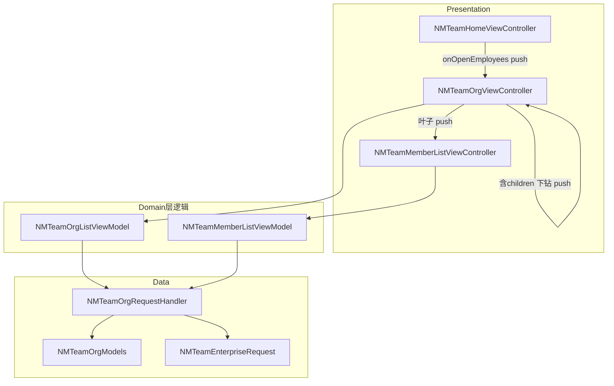
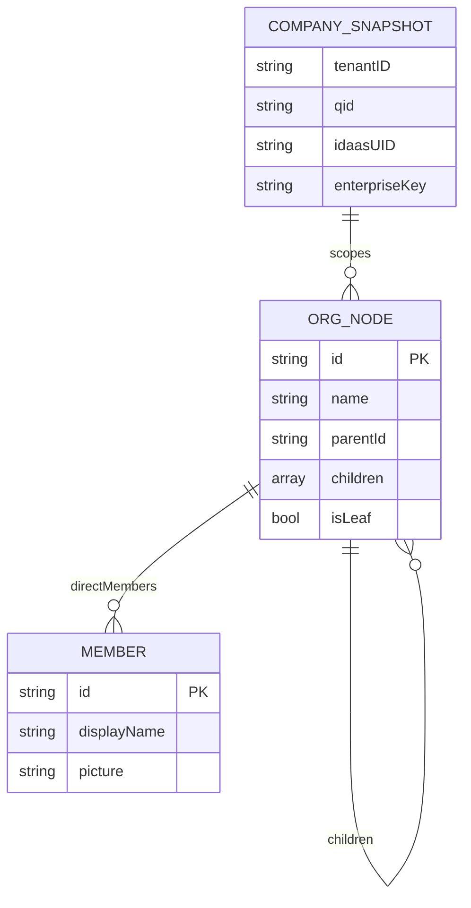
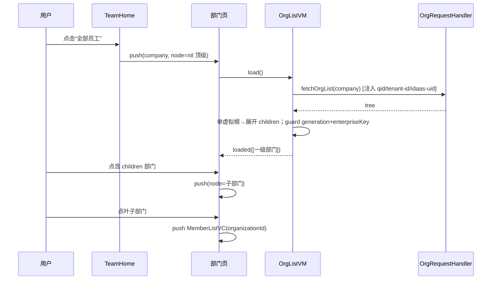
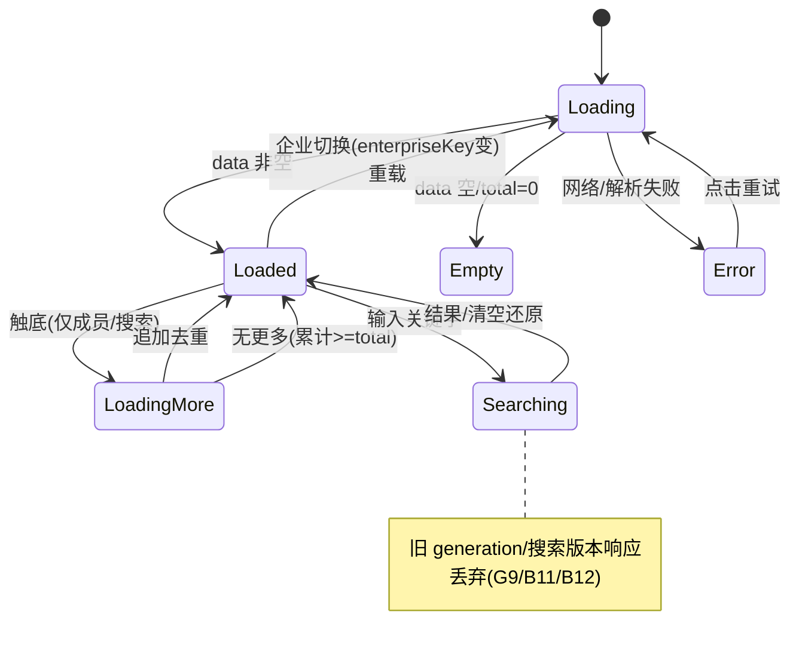

# 技术方案：团队组织架构（iOS）

**创建日期**：2026-07-23
**存放路径**：`Plans/技术方案/2026-07-23-团队组织架构.md`
**状态**：已采纳
**lifecycle_state**：architecture
**平台**：客户端（iOS，Swift + 部分 Objective-C 桥接）
**关联需求（真理源）**：`Plans/需求分析/2026-07-23-团队组织架构.md` ← 架构变动须先回看

---

## 一、背景与目标

- **业务需求**：企业账号用户从团队首页点击“全部员工”进入组织架构页，逐级浏览部门 → 下钻子部门 → 进入叶子部门直属成员列表 → 全租户搜索成员，覆盖 loading/空/错误/重试态，且严格企业隔离、企业切换与快速搜索不串数据。真理源见需求 plan 的 G1–G15、B1–B13 与异常矩阵。
- **成功指标**：
  - 15 组 GWT（G1–G15）全部可由验收测试映射并通过。
  - 非企业账号零 `api/claw/ent/*` 请求（G8）。
  - 企业切换 / 快速搜索场景下旧响应 100% 被丢弃（G9/B11/B12）。
- **非目标（防过度设计）**：员工-智能体详情页与 `member_brief`、含子部门聚合成员 `org_members_include_sub`、成员写操作、离线缓存（见需求「十二、范围与非目标」）。不引入独立 UseCase/Repository 抽象层——沿用现有 Team `ViewModel → RequestHandler` 两层（见 ADR-1）。

---

## 二、AI 行为准则

1. 先定模块边界 + 接口契约，再写实现细节。
2. VC/Handler 不直连存储；企业身份只从既有登录态派生，不新增全局单例。
3. 复用现有类型与模式（`NMTeamCompanySnapshot`、`NMClawHubRequest` 头合并、`NMSimpleRequest` handler、generation+enterpriseKey 陈旧响应保护、`NMTeamListStateView`、`NMCommonImageView`），不造平行轮子。
4. 缺信息列「待确认」，不猜测（本方案「待确认」项见四）。

---

## 三、原则对照（必遵守）

| 原则 | 要求与落地 |
|------|-----------|
| SRP | Models（解析）/ RequestHandler（网络+映射）/ ViewModel（状态机+防串）/ ViewController（渲染+导航）职责单一 |
| DIP | ViewModel 依赖 handler 静态函数签名（可注入桩闭包做测试），不依赖具体网络实现 |
| OCP | 组织节点递归模型对“任意层级”开放，无需按层级改类型 |
| DRY | 复用 `NMTeamCompanySnapshot`/`enterpriseKey`/`NMTeamEnterpriseRequest` 头注入与状态视图，不复制 |
| KISS/YAGNI | 不加 UseCase 层、不加缓存、不加 include_sub；分页用最简 pageNum 累加（ADR-1/ADR-4） |

---

## 四、约束与前提

- **版本/环境**：iOS App，Swift 主体 + Objective-C 桥接（`NMLoginManager`/`NMBrandInfo`/`NMSimpleRequest`）。模块名 `Claw`，测试 `@testable import Claw`。
- **依赖服务**：客户端代理 `api/claw/ent/*`（底层 IDaaS `/out/torg/list`、`/out/torgM/list`、`/out/tmember/userbykey`）。
- **企业身份来源**：`NMLoginManager.shared().mineModel.brand`（`tenant_id`/`qid`/`idaas_uid`/`company_name`/`company_logo`）→ `NMTeamCompanySnapshot`。请求头 `qid`/`tenant-id`/`idaas-uid` 由 `NMTeamEnterpriseRequest` 注入。
- **特性开关/灰度**：随团队 Tab 企业账号可见性生效，无独立开关（沿用 `NMLoginManager.isCommanyAccount()`）。
- **构建约束**：Xcode 经典 `.pbxproj` 注册——每个新增 `.swift` 必须补 PBXFileReference + PBXBuildFile + Team PBXGroup 子节点 + 目标 Sources；测试文件注册到 `NAMIWorkTests` 目标。
- **导航约束**：Team Tab 根 VC 在 `viewWillAppear` 隐藏导航栏；组织架构各页需自行 `setNavigationBarHidden(false)` 以显示标题与返回。
- **待确认（不阻塞开发，联调核对）**：
  1. 代理 `search_member` 关键字参数名（默认按底层 `keyWord`，若代理层改名以联调为准）。
  2. `org_member_list` 分页参数位置（按需求：`pageNum`/`pageSize` 走 query，`tenantId`/`organizationId` 走 body）。
  3. 代理响应外层包字段名（`code`/`data`/`total`/`success` 具体命名以真实回包为准，解析层用容错映射）。

---

## 五、架构设计

### 客户端分层

Presentation（ViewController）→ Domain 逻辑内聚于 ViewModel（状态机 + 防串 + 分页）→ Data（RequestHandler + Models）。**不设独立 UseCase/Repository**（ADR-1，对齐现有 `NMTeamHomeViewModel → NMTeamRequestHandler`）。

### 模块边界（必填）

| 模块 | 职责 | 输入/输出 | 依赖模块 |
|------|------|-----------|----------|
| `NMTeamOrgModels` | ObjectMapper 解析组织树 / 成员 / 分页包 | 输入：JSON；输出：`NMTeamOrgNode`（递归）、`NMTeamMember`、`NMTeamOrgPage<T>` | ObjectMapper |
| `NMTeamOrgRequestHandler` | 组装企业请求头、发 3 个 `api/claw/ent/*` 请求、映射结果/错误 | 输入：company + 查询参数；输出：`NMSimpleRequest?` + 完成回调 | `NMTeamEnterpriseRequest`、`NMClawAPI.Ent`、Models |
| `NMTeamOrgListViewModel` | 部门列表状态机、单虚拟根展开、下钻判定、防串（generation+key） | 输入：company + 当前节点；输出：state 回调（loading/loaded/empty/error） | RequestHandler |
| `NMTeamMemberListViewModel` | 直属成员分页、全租户搜索版本控制、清空还原、防串 | 输入：company + organizationId；输出：state 回调 + 分页项 | RequestHandler |
| `NMTeamOrgViewController` | 部门列表渲染、逐级 push、状态视图、返回 | 输入：company + 节点；输出：导航 | ListViewModel、`NMTeamListStateView` |
| `NMTeamMemberListViewController` | 成员列表 + 搜索框渲染、头像、分页触底、状态视图 | 输入：company + 叶子部门 | MemberListViewModel、`NMCommonImageView` |
| `NMTeamHomeViewController`（改） | “全部员工”点击回调 → push 一级部门页 | 输出：导航触发 | 现有 header 闭包模式 |



### 数据模型（必填：ER 图 + 字段定义）



**`NMTeamOrgNode`（递归组织节点，映射 `/out/torg/list`）**

| 字段 | 类型 | 必填 | 说明 |
|------|------|------|------|
| id | String | 是 | 部门 id，作为 `organizationId` 传成员接口 |
| tenantId | String | 否 | 租户 id |
| code | String | 否 | 部门编码 |
| name | String | 是 | 部门名，列表行标题/导航标题 |
| parentId | String | 否 | 父部门 id |
| parentName | String | 否 | 父部门名（面包屑辅助） |
| children | [NMTeamOrgNode] | 否 | 子部门；空/缺失即叶子 |
| leaderFlag / position / distance / extId / idsList / forceDelete | 依样例 | 否 | 本期不展示，保留解析容错 |
| **isLeaf**（派生） | Bool | — | `children` 为空 → true，决定下钻 vs 进成员 |

**`NMTeamMember`（映射 `/out/torgM/list`、`/out/tmember/userbykey`）**

| 字段 | 类型 | 必填 | 说明 |
|------|------|------|------|
| id | String | 是 | 稳定标识，分页去重键 |
| displayName | String | 否 | 展示名（缺失回退 `name`/`username`） |
| picture | String | 否 | 头像 URL，缺失走占位 |
| name / username / mobile / email / status / memberId / userinfoid | String | 否 | 保留解析，本期仅展示 displayName+picture |

**`NMTeamOrgPage<T>`（分页包）**：`items: [T]`、`total: Int`。用于 `org_member_list` / `search_member`（`org_list` 返回树，不分页）。

### API Schema / 接口契约（必填，客户端代理前缀 `api/claw/ent/`）

| 方法 | 路径 | 说明 | 幂等 | Request | Response |
|------|------|------|------|---------|----------|
| GET | `api/claw/ent/org_list` | 组织树；客户端不传显式参数，身份走请求头 | 是 | 无 query/body | 递归树（单虚拟根或顶层数组） |
| POST | `api/claw/ent/org_member_list` | 叶子部门直属成员分页 | 是 | query `pageNum`/`pageSize`；body `tenantId`/`organizationId` | `{data:[member], total}` |
| GET | `api/claw/ent/search_member` | 全租户成员搜索 | 是 | query `pageNum`/`pageSize`/`keyWord` | `{data:[member], total}` |

**org_member_list Request 示例**：

```json
{
  "query": { "pageNum": 1, "pageSize": 20 },
  "body": { "tenantId": "<从企业上下文注入>", "organizationId": "<叶子部门id>" }
}
```

**成员分页 Response 示例**：

```json
{
  "code": 0,
  "data": [
    { "id": "u1", "displayName": "张三", "picture": "https://.../a.png" }
  ],
  "total": 42,
  "success": true
}
```

**错误码 / 失败处理**（代理层为业务包，客户端不 switch 具体数字码，按“是否成功解析”统一判定，对齐现有 `NMClawHubRequestHandler`）：

| 情况 | 客户端处理 |
|------|------------|
| 网络失败/超时 | 错误态 + 重试，文案 `error?.errorMsg ?? "网络请求失败"` |
| 解析失败 / `success=false` / 结构非法 | 视为失败，错误态 + 重试，文案 `"数据解析失败".localized`；绝不用设计稿示例兜底（R5） |
| `data` 空 + `total`=0 | 空态（成员“暂无成员”/搜索“无匹配成员”），非错误 |
| 企业身份缺失/非企业账号 | 不发起请求（前置拦截，G8/B1） |

### 关键流程（时序）



### 状态机（列表页通用：部门 / 成员 / 搜索）



### 客户端交互确认（2026-07-23 用户逐项勾选）

| 项 | 结论 |
|----|------|
| 成员头像组件 | `NMCommonImageView`（占位/gif/复用取消） |
| 成员分页 pageSize | 20 |
| 成员行点击（本期） | 不跳转、不发 `member_brief` 请求 |
| 成员页标题 | 完整面包屑「父>子」 |
| 搜索触发 | 实时输入防抖 |
| 搜索防抖间隔 | 300ms |
| 搜索框出现范围 | 仅叶子成员页（部门层级页无搜索） |
| 中间部门（含 children） | 只下钻，不提供看直属成员入口 |
| 一级部门页标题 | 「部门」 |
| 列表分页触发 | 自动触底加载 |
| 下拉刷新 | **支持**（部门页与成员页均可下拉重载当前层，非原架构草案默认，追加） |
| 组织架构页标题栏 | 显示导航栏（各页自行 `setNavigationBarHidden(false)`），返回团队首页时恢复隐藏 |

> 下拉刷新落地：复用现有下拉刷新控件（若无则 `UIRefreshControl`）；刷新与触底加载/搜索共用同一 generation+key 防串 guard，刷新即 `generation += 1` 丢弃在途旧响应。

### 陈旧响应与企业隔离机制（复用现有 generation+key 模式）

- 每个 ViewModel 持有 `private var generation = 0`；`reload()`/新搜索关键字/清空 各自 `generation += 1`，请求时捕获 `expectedGeneration`。
- 请求时捕获 `expectedKey = company.enterpriseKey`；回调中双重 guard：`self.generation == expectedGeneration && currentEnterpriseKey() == expectedKey`，否则**丢弃**（不写状态、不追加分页）。`currentEnterpriseKey()` 读实时 `NMLoginManager` brand，保证 pushed 栈中途切企业也能失效旧响应（B12）。
- 搜索另设 `searchToken`（关键字版本），保证快速输入仅最新关键字渲染（B11）；空/纯空白关键字不发请求，还原直属成员列表（B10/G7）。

---

## 六、方案选项与决策矩阵（ADR）

| # | 决策点 | 选项 | 决策 | 理由 |
|---|--------|------|------|------|
| ADR-1 | 分层 | A: 加 UseCase+Repository / B: 沿用 VM→Handler 两层 | **B** | 对齐现有 Team 代码，YAGNI；无跨端复用需求 |
| ADR-2 | 组织模型 | A: 按层级建多类型 / B: 单一递归 `NMTeamOrgNode` | **B** | 服务端为递归 `children`，单类型天然支持任意深度 |
| ADR-3 | 防串数据 | A: 存储并 cancel 在途请求 / B: generation+enterpriseKey 回调 guard | **B** | 现有 Team 已用 B 且经测试；A 改动大且 `NMSimpleRequest` 未暴露稳定 cancel 契约 |
| ADR-4 | 成员分页 | A: token(npt) / B: pageNum/pageSize 累加 | **B** | 成员接口按需求用 `pageNum`/`pageSize`（与首页 agent 的 npt 不同源） |
| ADR-5 | 入口交互 | A: delegate / B: header 闭包 `onOpenEmployees` + tap 手势 | **B** | 与现有 `onRetrySkill` 闭包模式一致，改动最小 |
| ADR-6 | 状态视图 | A: 复用 `NMClawEmptyView` / B: 复用/仿 `NMTeamListStateView` | **B** | 后者已含 retry，且与团队首页视觉一致 |

**推荐**：全部取 B —— 最小改动、最大复用、可测试。

---

## 七、上线与回滚

- **发布步骤**：随包发版；入口仅企业账号团队 Tab 可见。
- **回滚触发**：组织/成员接口异常率升高或串数据。
- **回滚操作**：将 `employeeView` 的 `onOpenEmployees` 置空（点击无跳转），组织架构页与 Handler 代码保留、零调用即无副作用。
- **数据迁移**：无。

---

## 八、实施计划（对应 Epic WBS 6–11）

| 阶段 | 内容 | 对应 WBS |
|------|------|----------|
| 1 | Models 解析（递归树/成员/分页包）+ 单测（先红） | 6 |
| 2 | RequestHandler 3 接口 + 企业头注入 + 映射 | 7 |
| 3 | ViewModels 状态机 + 防串 + 分页/搜索版本 + 单测 | 6/10 |
| 4 | 部门页 UI 骨架 + 逐级 push + 入口接线 | 8 |
| 5 | 成员页 + 搜索 + 头像 + 全 Variant（空/错/重试/分页） | 9 |
| 6 | 真机联调（企业隔离/切换/搜索防串）+ 设计走查 | 11 |

**新增/改动文件**（均需 pbxproj 注册）：
- 新增 `NAMIWork/Features/Team/Org/NMTeamOrgModels.swift`
- 新增 `NAMIWork/Features/Team/Org/NMTeamOrgRequestHandler.swift`
- 新增 `NAMIWork/Features/Team/Org/NMTeamOrgViewModel.swift`（含 List/Member 两个 VM）
- 新增 `NAMIWork/Features/Team/Org/NMTeamOrgViewController.swift`
- 新增 `NAMIWork/Features/Team/Org/NMTeamMemberListViewController.swift`
- 新增 `NAMIWorkTests/NMTeamOrgTests.swift`
- 改 `NAMIWork/Features/Team/NMTeamHomeViewController.swift`（header `onOpenEmployees` + tap，setupUI 接线）
- 改 `NAMIWork/Core/Networking/NMClawAPI.swift`（新增 `enum Ent { org_list / org_member_list / search_member }`）

---

## 九、验收标准

- [ ] 分层无违规（VC 不发网络、Handler 不持 UI、身份只从登录态派生）
- [ ] G1–G15 均可由 `test-generator` 映射到自动化用例
- [ ] 递归下钻/叶子进成员/单虚拟根展开正确（G2/G3/G4）
- [ ] 非企业账号零 `api/claw/ent/*` 请求（G8）
- [ ] 企业切换 + 快速搜索旧响应被丢弃（G9/B11/B12）
- [ ] 空/错误/重试/分页态齐备（G11/G12/G13/G15）
- [ ] 回滚（入口置空）验证无残留副作用

---

## 续做

```
/resume plan=Plans/技术方案/2026-07-23-团队组织架构.md 进度=方案已采纳，下一步验收测试先行
```

**下一阶段 Skill**：`/test-generator`（外层 TDD 先红），随后 `/task-splitter` 拆 `Plans/功能开发/` 原子任务。

## 反馈（skill_run）

```yaml
skill_run:
  skill: architecture-design-assistant
  plan: Plans/技术方案/2026-07-23-团队组织架构.md
  date: 2026-07-23
  contexts_used:
    - path: Plans/需求分析/2026-07-23-团队组织架构.md
      utility: high
      reason: "GWT/边界/异常矩阵/接口清单是方案的验收与契约真理源"
    - path: Templates/技术方案模板.md
      utility: high
      reason: "确定模块边界/ER/API Schema/错误码/流程等必填章节结构"
    - path: Plans/需求分析/2026-07-16-团队首页.md
      utility: high
      reason: "复用企业快照、enterpriseKey 防串、导航与占位数据约束"
  contexts_missing: []
  contexts_stale: []
  outcome_status: pass
  friction: ""
  revisit_needed: false
```
