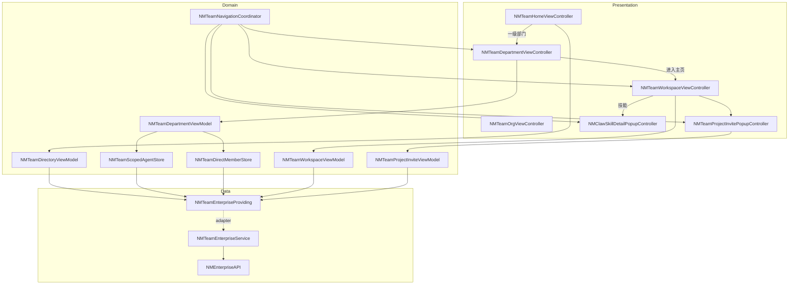
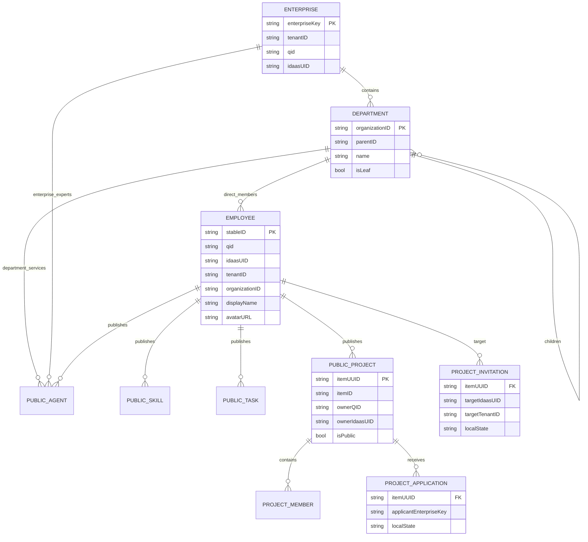
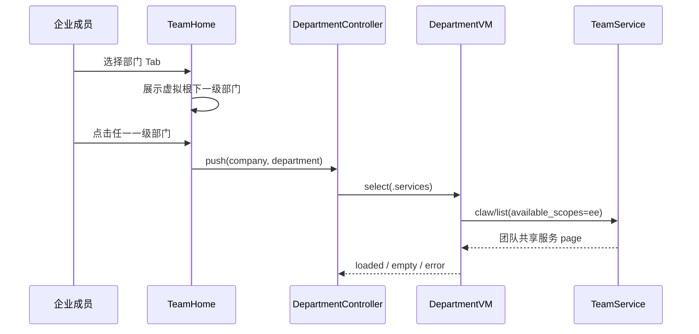
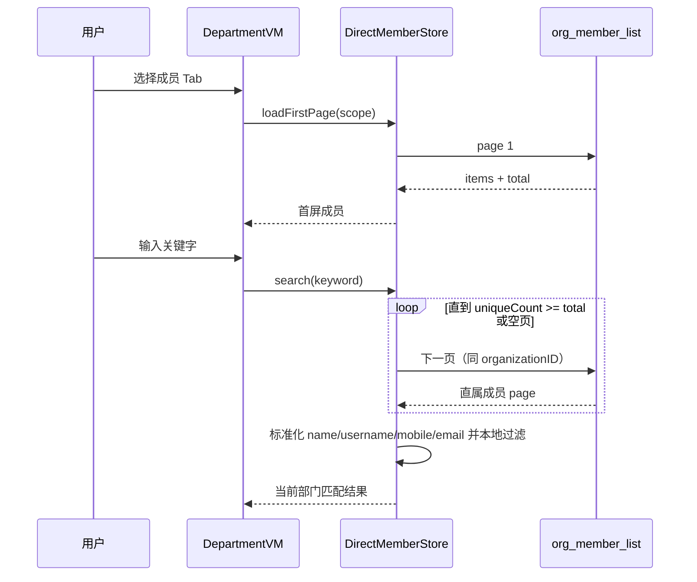
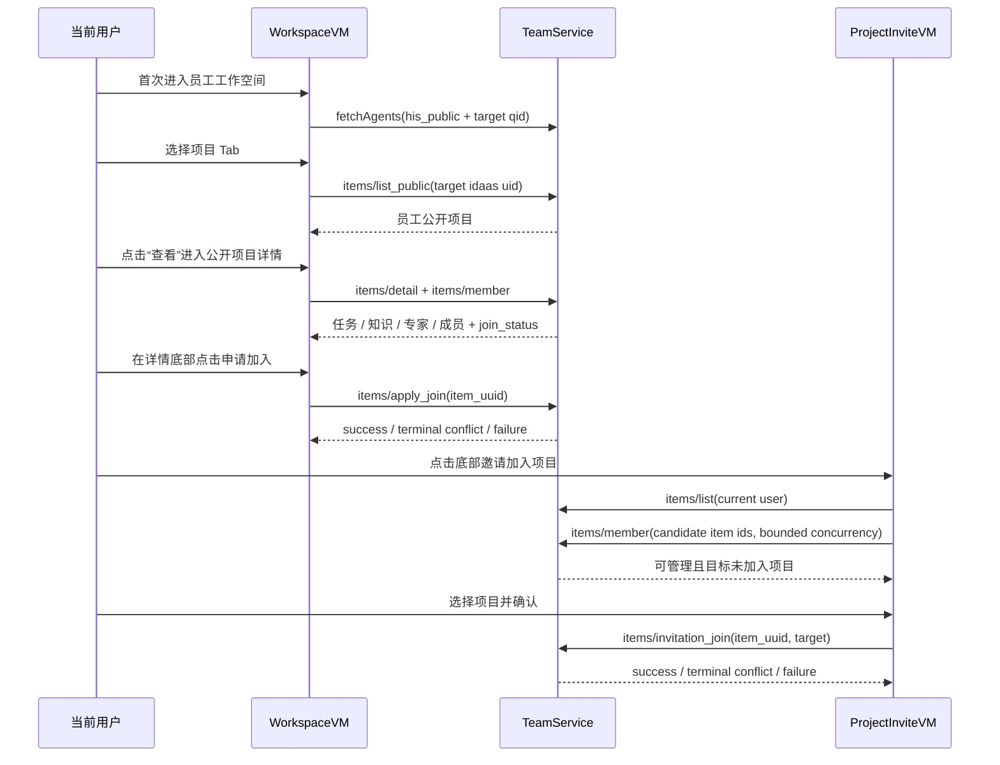
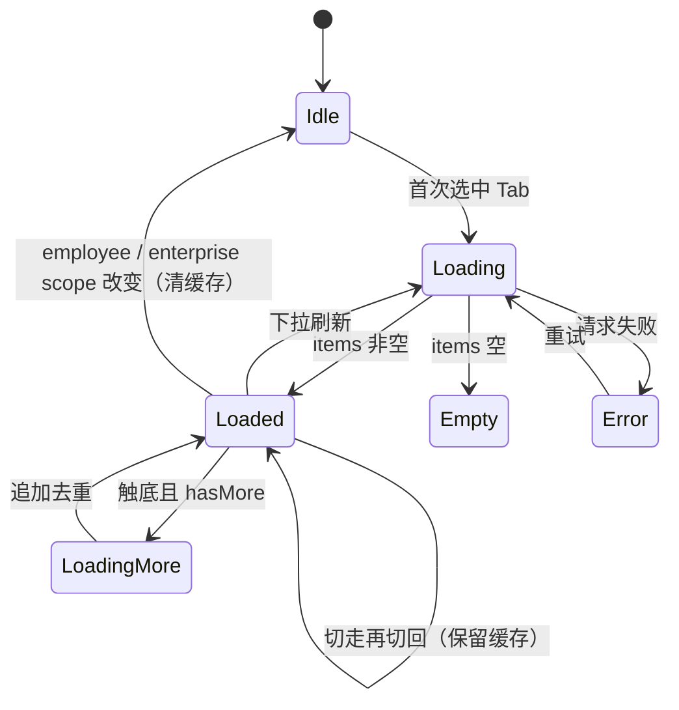

# 技术方案：团队模块重构（iOS）

**创建日期**：2026-07-24  
**更新日期**：2026-07-27  
**存放路径**：`Plans/技术方案/2026-07-24-团队模块重构.md`  
**状态**：已采纳  
**平台**：iOS（UIKit + Swift，部分 Objective-C 桥接）  
**关联需求真理源**：`Plans/需求分析/2026-07-24-团队模块重构.md`

## 一、背景与目标

### 背景

现有企业团队能力分散在团队首页与组织架构页面：团队首页展示企业资料 / 企业智能体，组织架构独立完成部门与成员列表。新版设计要求合并为“部门 / 专家”统一入口，团队页只展示一级部门，点击后直接进入部门服务与成员双 Tab，并新增员工公开工作空间、公开项目只读详情、项目申请与项目邀请。

当前 `NMEnterpriseAPI.swift` 已覆盖所需大部分 HTTP API，但 Presentation 仍是多个独立页面；员工公开内容没有统一领域状态，部门内成员搜索与部门服务搜索也没有服务端作用域搜索接口。

### 目标

- 对齐需求 AC1–AC26，保持个人版零企业请求与企业切换强隔离。
- 复用已有 `NMTeamCompanySnapshot`、组织树 / 成员模型、`NMEnterpriseAPI`、技能详情弹窗和项目 API。
- 建立可注入的 Team 领域服务边界，让 ViewModel 可用 XCTest 桩验证分页、搜索、防串和双项目写操作。
- 用明确的本地作用域快照解决“仅搜索当前部门”的契约缺口，不调用全租户 `search_member` 冒充部门搜索。

### 非目标

- 不重写 `NMEnterpriseAPI` 的底层请求工厂 / JSON 响应解析器。
- 不实现组织编辑、成员管理、员工私有内容、公开项目内容编辑、申请审核中心。
- 不给员工智能体、员工任务增加业务行为；部门服务“雇佣”与专家“+”分别复用既有安装 / 对话与教练路由。
- 不新建技能详情弹窗，不改变既有技能安装 / 使用语义。

## 二、原则对照

| 原则 | 落地方式 |
|------|----------|
| SRP | VC 只渲染 / 导航；ViewModel 管状态；`NMTeamEnterpriseService` 管 API 映射；作用域 Store 管完整快照与本地搜索 |
| DIP | ViewModel 依赖 `NMTeamEnterpriseProviding` 协议，不直接调用 `NMEnterpriseAPI` 静态方法 |
| OCP | 统一 `NMTeamRemoteListState` / `NMTeamPagedResult` 支持智能体、技能、任务、项目四类内容扩展 |
| ISP | 领域服务按组织、目录、员工内容、项目动作分组；测试桩只实现目标用例所需方法 |
| DRY | 复用 `NMTeamCompanySnapshot`、`NMTeamOrgNode`、`NMTeamMember`、`NMEnterpriseJSONPage` 与现有技能弹窗 |
| KISS | 不引入跨 App Repository / UseCase 大体系；只在 Team Feature 内新增一个可注入 Service Adapter |
| YAGNI | 员工智能体 / 任务 / 项目卡片等视觉-only 控件不挂 target；部门服务“雇佣”只接旧安装 / 对话链路；专家“+”复用旧教练路由；项目卡片不建详情路由；不接 `org_members_include_sub` |

## 三、约束与前提

- 企业身份来自 `NMLoginManager.shared().mineModel.brand`，转换为 `NMTeamCompanySnapshot`；三要素 `tenantID/qid/idaasUID` 缺一不可请求。
- 请求头继续由 `NMEnterpriseIdentity.headers` 注入 `qid`、`tenant-id`、`idaas-uid`。
- `NMSimpleRequest` 无稳定取消契约，所有异步回调必须以 `generation + enterpriseKey + scopeKey` 三重校验保证结果有效。
- 组织树可为“单虚拟根 + children”或顶层数组，继续复用 `NMTeamOrgTree.firstLevel`。
- 移动端不展示下一级部门页；`children` 只用于识别虚拟根与提取一级列表，不参与页面下钻。
- `org_member_list` 只支持直属成员分页，没有 keyword；`search_member` 是全租户搜索，不能满足当前部门范围。
- 部门服务必须保持旧团队智能体列表语义，不能改走专家搜索；搜索需在共享完整快照上本地完成。
- 团队根一级部门列表新增下拉刷新；连同企业版其他刷新入口统一使用项目 Tab 的 `MJRefreshNormalHeader` 配置：显示箭头 / loading 图标与状态文字、隐藏最后更新时间。根部门刷新保留现有内容，失败只提示不清空；复用旧专家页时仅 Team 组合模式启用该样式，普通版专家页保持原行为。
- `items/list_public` 与 `items/list` 未提供完整“已申请 / 可管理 / 目标已加入”聚合状态，需要客户端用项目成员接口补齐。
- 新 Swift 文件须登记 `NAMIWork.xcodeproj/project.pbxproj` 的 FileReference、BuildFile、PBXGroup 与 Sources；测试登记到 `NAMIWorkTests`。

## 四、总体分层与模块边界

### 分层

```text
Presentation (UIKit VC / View / Cell)
        ↓ render + intent
Feature Domain (ViewModel / State / Scoped Store / Coordinator)
        ↓ protocol
Data Adapter (NMTeamEnterpriseService)
        ↓
NMEnterpriseAPI + existing models / mappers
```

### 模块边界

| 模块 | 职责 | 输入 / 输出 | 依赖 |
|------|------|-------------|------|
| `NMTeamHomeViewController`（重构） | 团队 Tab 根容器；部门目录与旧专家页切换；搜索入口；专家态“+”复用旧专家教练流程 | company → 部门目录 / 专家容器的渲染与导航 | Directory VM / `NMClawRecommendController` / Coordinator / 旧教练路由 |
| `NMTeamDirectoryViewModel` | 一级部门、一级搜索状态、企业切换；不再维护第二套专家数据 | company + intent → `departmentState` | Service、OrgTree |
| `NMClawRecommendController`（复用扩展） | 旧专家分类、榜单、搜索；Team 模式把“我的”插入二级分类 | `includesMineCategory` → 旧推荐列表 / `NMClawMineController` | ClawHub 既有组件与请求 |
| `NMTeamOrgViewController`（兼容保留） | 旧组织页兼容入口；新版 Team 根不再 push 该页面 | department → Department Detail | Coordinator |
| `NMTeamDepartmentViewController` | 一级部门“部门服务 / 成员”容器、搜索框、独立状态 | department + company → 服务 / 成员列表 | Department VM |
| `NMTeamDepartmentViewModel` | 部门服务与直属成员分页 / 搜索 / 缓存 / 防串 | department scope → 两个 `RemoteListState` | Scoped Stores / Service |
| `NMTeamScopedAgentStore` | 拉全旧团队共享智能体单列表，建立去重快照并本地搜索 | enterprise scope → agents / filtered agents | Service |
| `NMTeamDirectMemberStore` | 直属成员分页、按 total 拉全、建立当前部门搜索快照 | organizationID → members / filtered members | Service |
| `NMTeamWorkspaceViewController` | 员工“智能体 / 技能 / 任务 / 项目”与底部邀请入口 | member context → 四 Tab | Workspace VM / Coordinator |
| `NMTeamWorkspaceViewModel` | 四 Tab 懒加载、独立缓存 / 分页、项目申请状态 | employee + selectedTab → state | Service |
| `NMTeamProjectInviteViewModel` | 列出可管理且员工未加入项目；提交邀请 | current user + target → invite candidates / result | Service |
| `NMTeamEnterpriseProviding` | Team 领域所需的窄接口协议 | 领域参数 ↔ 领域结果 / Error | 无静态依赖 |
| `NMTeamEnterpriseService` | 调用 `NMEnterpriseAPI`、映射现有模型、统一错误 | API JSON → Team models | `NMEnterpriseAPI` / ObjectMapper |
| `NMTeamNavigationCoordinator` | 集中 department detail / workspace / skill popup / invite popup 路由 | route intent → UIKit presentation | VC / existing popup |



## 五、状态与数据模型

### 通用远端列表状态

```swift
enum NMTeamRemoteListState<Item> {
    case idle
    case loading(previous: [Item])
    case loaded(items: [Item], hasMore: Bool)
    case empty
    case error(message: String, previous: [Item])
}

struct NMTeamRequestScope: Equatable {
    let enterpriseKey: String
    let scopeKey: String      // org:<id> / employee:<id>:<tab> / expert
    let generation: Int
}
```

规则：`previous` 只允许来自同一 `enterpriseKey + scopeKey`；企业或 scope 变化时必须清空，不得跨范围保留。

### 核心实体 ER 图



### 字段定义

| 实体 | 字段 | 类型 | 必填 | 说明 |
|------|------|------|------|------|
| `NMTeamCompanySnapshot` | tenantID/qid/idaasUID | String | 是 | 企业身份与请求头来源 |
|  | enterpriseKey | String | 是 | 三要素拼接；防串主键 |
| `NMTeamOrgNode` | id/name/children | String/String/Array | 是/是/否 | children 仅用于虚拟根展开；一级部门是否含 children 不影响详情路由 |
| `NMTeamOrgPath` | nodes/breadcrumb | Array/String | 是 | 新版 Team 只保存当前一级部门上下文 |
| `NMTeamMember` | stableID/displayName/pictureURL | String/String/URL? | 是/是/否 | 列表展示与去重 |
|  | qid/idaasUID/tenantID/organizationId | String | qid 或 idaasUID 至少一个 | 工作空间和项目动作身份 |
| `NMEnterpriseAgentListOptions`（沿用） | categoryID/teamUserQID/availableScopes/npt/size | 可选字段 | 按场景 | 部门服务只设置 `availableScopes/npt/size`，不增加部门参数 |
| `NMTeamWorkspaceContext` | company/member | Struct | 是 | 员工工作空间不可只传展示模型，必须保留请求身份 |
| `NMTeamProjectActionState` | idle/submitting/succeeded/failed | Enum | 是 | `apply_join` 与 `invitation_join` 独立实例 |

## 六、API Schema / 接口契约

### Team 领域协议

```swift
protocol NMTeamEnterpriseProviding {
    func fetchOrganizations(company: NMTeamCompanySnapshot, completion: ...)
    func fetchDirectMembers(company: NMTeamCompanySnapshot, organizationID: String, page: Int, size: Int, completion: ...)
    func fetchAgents(company: NMTeamCompanySnapshot, options: NMEnterpriseAgentListOptions, completion: ...)
    func searchEnterpriseExperts(company: NMTeamCompanySnapshot, keyword: String, page: Int, size: Int, completion: ...)
    func fetchEmployeeSkills(company: NMTeamCompanySnapshot, employeeQID: String, page: Int, size: Int, completion: ...)
    func fetchEmployeeTasks(company: NMTeamCompanySnapshot, employeeQID: String, npt: String, size: Int, completion: ...)
    func fetchEmployeeProjects(company: NMTeamCompanySnapshot, employeeIdaasUID: String, lastID: Int, size: Int, completion: ...)
    func fetchCurrentUserProjects(company: NMTeamCompanySnapshot, lastID: Int, size: Int, completion: ...)
    func fetchProjectMembers(company: NMTeamCompanySnapshot, itemID: String, completion: ...)
    func applyToJoinProject(company: NMTeamCompanySnapshot, itemUUID: String, completion: ...)
    func inviteEmployee(company: NMTeamCompanySnapshot, itemUUID: String, employee: NMTeamMember, completion: ...)
}
```

实际协议可按 Swift 编译约束拆成 typealias / 方法组；原则是 ViewModel 不直接依赖静态 API。

### HTTP 契约总表

| 方法 | 路径 | 场景 | 幂等 | 关键 Request | 关键 Response |
|------|------|------|------|--------------|---------------|
| GET | `api/claw/ent/org_list` | 企业部门树 | 是 | 企业 headers | `data:[org]` |
| POST | `api/claw/ent/org_member_list?pageNum=&pageSize=` | 当前一级部门直属成员 | 是 | body `tenantId/organizationId` | `data:[member], total` |
| GET | `api/claw/list` | 部门服务 / 员工智能体 | 是 | 部门服务仅 `available_scopes/npt/size`；员工按 `category_id/team_user_qid` 组合 | page `items,total,npt` |
| GET | 既有 ClawHub 分类 / 列表 / 搜索 | 团队专家 Tab | 是 | 完全复用旧专家页请求契约 | 旧专家分类与列表模型 |
| GET | `api/skill/claw/list` | 员工公开技能 | 是 | `category_id=his_public,team_user_qid,page,size,npt` | page |
| GET | `api/claw/message/list` | 员工公开任务 | 是 | `category_id=his_public,team_user_qid,npt,size,with_total=true` | page |
| POST | `api/items/list_public` | 员工公开项目 | 是 | `idaas_uid,tenant_id,last_id,size` | project page |
| POST | `api/items/detail` | 公开项目详情及加入状态 | 是 | `item_uuid` | project detail |
| POST | `api/items/list` | 当前用户项目 | 是 | `last_id,size` | project page |
| POST | `api/items/member` | 过滤已加入员工 / 当前用户 | 是 | `item_id` | `data:[member]` |
| POST | `api/items/apply_join` | 当前用户申请加入员工公开项目 | 业务幂等依赖服务端 | `item_uuid,join_reason` | success envelope |
| POST | `api/items/invitation_join` | 邀请员工加入当前用户项目 | 业务幂等依赖服务端 | `item_uuid,members:[idaas_uid,tenant_id]` | success envelope |

### 场景参数矩阵

| 场景 | category_id | organization_id | team_user_qid | available_scopes | 搜索方式 |
|------|-------------|-----------------|---------------|------------------|----------|
| 部门服务 | 无 | 无 | 无 | `ee` | 拉全旧团队共享列表后本地过滤；所有部门同源 |
| 专家 | 由旧 ClawHub 分类决定 | 无 | 无 | 旧专家页契约 | 复用旧专家分类 / 榜单 / 搜索；“我的”为 Team 二级分类 |
| 员工智能体 | `his_public` | 无 | 目标员工 qid | `ee` | 本期无搜索 |
| 员工技能 | `his_public` | 无 | 目标员工 qid | — | 本期无搜索 |
| 员工任务 | `his_public` | 无 | 目标员工 qid | — | 本期无搜索 |

### 请求示例：部门服务

```http
GET api/claw/list?available_scopes=ee&size=40&npt=
qid: <current qid>
tenant-id: <current tenant>
idaas-uid: <current idaas uid>
```

```json
{
  "code": 0,
  "data": [
    { "id": "agent-1", "name": "部门服务", "desc": "...", "icon": "https://..." }
  ],
  "total": 1,
  "npt": ""
}
```

### 请求示例：直属成员

```http
POST api/claw/ent/org_member_list?pageNum=1&pageSize=50
Content-Type: application/json
```

```json
{
  "tenantId": "tenant-1",
  "organizationId": "org-123"
}
```

```json
{
  "code": 0,
  "data": [
    { "id": "member-1", "displayName": "张三", "qid": "q1", "idaas_uid": "u1", "organizationId": "org-123" }
  ],
  "total": 27
}
```

### 请求示例：双项目操作

```json
// 当前用户申请加入公开项目
{
  "path": "api/items/apply_join",
  "body": { "item_uuid": "project-uuid", "join_reason": "" }
}
```

```json
// 邀请目标员工加入当前用户项目
{
  "path": "api/items/invitation_join",
  "body": {
    "item_uuid": "project-uuid",
    "members": [{ "idaas_uid": "target-user", "tenant_id": "tenant-1" }]
  }
}
```

### 错误码 / 状态处理

后端业务数字码未在现有契约中稳定枚举，客户端不得硬编码猜测具体数值；以 `NMEnterpriseResponse.validate` / `NMEnterpriseAPIError` 为统一入口，并按以下可观察分类处理：

| code / 情况 | 含义 | 客户端处理 |
|-------------|------|------------|
| `0` / success | 成功 | 映射 data；空 data 按空态，不按错误 |
| HTTP 401 / 业务未登录 | 登录失效 | 停止请求并走现有登录失效处理；清企业数据 |
| HTTP 403 / 业务无权限 | 无权查看 / 管理 / 邀请 | 当前区域提示无权限；刷新候选集合 |
| HTTP 404 / 业务对象不存在 | 部门、员工、项目已失效 | 移除失效项；部门详情 / 工作空间必要时返回上级 |
| HTTP 409 或服务端“已申请 / 已加入 / 重复邀请”消息 | 幂等冲突 | 视为终态：移出可操作集合并提示当前状态，不重复提交 |
| 其他非零业务 code | 服务端拒绝 | 展示服务端 message；保留安全的同 scope 旧数据和重试入口 |
| 网络超时 / 5xx | 暂时失败 | 解除 submitting；保留同 scope 数据并允许重试 |
| 解析失败 | 契约异常 | `数据解析失败`；记录脱敏日志，绝不用示例数据兜底 |

## 七、关键流程与状态机

### 一级部门 → 部门详情



### 当前部门直属成员搜索



若完整快照构建失败，搜索显示错误并保留关键字；不得退化为全租户 `search_member`，也不得仅过滤已加载首屏并伪装完整结果。

### 员工工作空间与双项目写操作



### 员工 Tab 状态机



### 陈旧响应保护

每个请求捕获：

```text
expectedGeneration
expectedEnterpriseKey
expectedScopeKey
```

回调只在三者仍等于当前值时落状态。以下动作必须推进 generation：reload、刷新、新搜索、清空搜索、切企业、切员工、scope 参数变化；仅切回同一员工已成功 Tab 不推进对应 Tab generation。

## 八、方案选项与 ADR

| ADR | 决策点 | 选项 | 决策 | 理由 |
|-----|--------|------|------|------|
| ADR-1 | Team 数据依赖 | 继续静态 API / Feature 内协议 Adapter | **协议 Adapter** | 多 ViewModel 与写操作需要稳定注入点；测试可控，改动仍局限 Team |
| ADR-2 | 当前部门成员搜索 | 全租户 search 后过滤 / 仅过滤已加载页 / 拉全直属成员后本地搜 / 改服务端 | **拉全直属成员后本地搜** | 唯一能用现有接口保证当前部门且结果完整的客户端方案；禁止全租户越界 |
| ADR-3 | 部门服务搜索 | `claw/search` / 拉全旧团队共享列表后本地搜 | **拉全共享列表后本地搜** | 服务与旧团队智能体同源且所有部门相同；完整快照保证搜索完整 |
| ADR-4 | 根 Tab 复用 | 新建企业专家 VM / 嵌入旧专家页 | **嵌入旧专家页** | 保持分类、榜单、搜索、缓存和埋点一致；Team 模式只把“我的”下沉为二级分类 |
| ADR-5 | 员工内容加载 | 首屏并发四类 / 选中懒加载 | **选中懒加载** | 降低首屏与无效请求；每 Tab 独立状态 |
| ADR-6 | 项目双向动作 | 共用一个“加入”状态 / 申请与邀请分离 | **分离** | API 主体、权限、入参、幂等完全不同，避免串操作 |
| ADR-7 | 邀请候选过滤 | 直接展示 items/list / 拉成员后过滤 | **owner 过滤 + 成员过滤** | 必须满足“可管理且目标未加入”；成员查询采用最大 4 并发，支持进度与重试 |
| ADR-8 | 技能详情 | 新建 Team 弹窗 / 复用既有 | **复用 `NMClawSkillDetailPopupController`** | 需求明确，保留安装 / 使用状态与埋点 |
| ADR-9 | 控件动作边界 | 全部禁用 / 按业务语义分流 | **雇佣按钮发出 `hireService` intent；服务行与员工智能体 / 任务 / 项目整卡不挂动作** | 雇佣复用 `installAgentWithURL` → `handleAgentInstalled` → 新对话；其余从根源保证零副作用 |
| ADR-10 | 企业 API 结构 | 拆分整个 `NMEnterpriseAPI.swift` / 沿用既有 options | **沿用既有 options** | 部门服务恢复旧团队请求后无需新增 `organizationID`；避免无业务用途的底层扩展 |

### ADR-2 性能与正确性护栏

- 成员默认分页 `pageSize=50`；列表首屏可先展示第一页。
- 用户开始搜索时，Store 从当前页继续拉到 `uniqueCount >= total`；以 stableID 去重。
- 空页、页码重复、uniqueCount 不增长连续 2 页视为契约异常并失败，禁止无限循环。
- 不设置“截断后当成功”的最大成员数；若触发安全页数上限（1000 页），以错误结束并记录诊断，避免不完整搜索。
- 完整快照仅在当前 `enterpriseKey + organizationID` 生命周期内存缓存，离开企业或收到内存警告清理，不落盘。

### ADR-7 项目候选过滤

- `items/list` 先过滤 `ownerQID == current.qid || ownerIdaasUID == current.idaasUID`，没有所有者标识的项目不作为“可管理”候选。
- 对候选以最多 4 并发调用 `items/member`；目标 `idaasUID/tenantID/qid` 任一稳定身份命中即排除。
- 任一候选成员请求失败时，该项目不展示为可邀请（fail closed），同时给选择器局部重试；不允许在未知成员状态下邀请。
- 邀请 / 申请成功后写入当前 scope 的 session terminal set 并移出操作集合；服务端重复状态消息也按终态处理。

## 九、实施文件边界

### 复用 / 改造

- `NAMIWork/Features/Team/NMTeamHomeViewController.swift`：改为部门目录 / 旧专家页根容器，保留 Team Tab 根路由。
- `NAMIWork/Features/ClawHub/Recommend/NMClawRecommendController.swift`：增加 Team 组合模式，将“我的”作为榜单后的二级分类。
- `NAMIWork/Features/ClawHub/MyClaw/NMClawMineController.swift`：补充 JXCategory 容器协议复用，不改我的专家业务。
- `NAMIWork/Features/Team/NMTeamSupport.swift`：保留 CompanySnapshot；迁移 / 扩展公共状态与 Team service adapter。
- `NAMIWork/Features/Team/Org/NMTeamOrgModels.swift`：复用组织树、成员、路径；补搜索标准化字段 helper。
- `NAMIWork/Features/Team/Org/NMTeamOrgViewController.swift`：兼容保留；新版 Team 不再进入下一级页面，节点点击统一路由 Department Detail。
- `NAMIWork/Core/Networking/NMEnterpriseAPI.swift`：沿用既有 Agent list options；部门服务不新增 `organizationID`。
- `NAMIWork/Features/Skills/NMClawSkillDetailPopupController.swift`：只复用，不改业务语义。

### 新增建议

- `NAMIWork/Features/Team/Domain/NMTeamEnterpriseService.swift`
- `NAMIWork/Features/Team/Domain/NMTeamRemoteListState.swift`
- `NAMIWork/Features/Team/Directory/NMTeamDirectoryViewModel.swift`
- `NAMIWork/Features/Team/Department/NMTeamDepartmentViewController.swift`
- `NAMIWork/Features/Team/Department/NMTeamDepartmentViewModel.swift`
- `NAMIWork/Features/Team/Department/NMTeamScopedAgentStore.swift`
- `NAMIWork/Features/Team/Department/NMTeamDirectMemberStore.swift`
- `NAMIWork/Features/Team/Workspace/NMTeamWorkspaceModels.swift`
- `NAMIWork/Features/Team/Workspace/NMTeamWorkspaceViewController.swift`
- `NAMIWork/Features/Team/Workspace/NMTeamWorkspaceViewModel.swift`
- `NAMIWork/Features/Team/Workspace/NMTeamProjectInvitePopupController.swift`
- `NAMIWork/Features/Team/Workspace/NMTeamProjectInviteViewModel.swift`
- `NAMIWork/Features/Team/NMTeamNavigationCoordinator.swift`
- `NAMIWorkTests/NMTeamModuleRefactorTests.swift`

文件可在 task-splitter 阶段按独立编译 / 验收边界进一步拆分；本方案不提前建立空文件。

## 十、测试策略与可观测性

### 自动化测试分层

| 层 | 覆盖重点 |
|----|----------|
| UT | 虚拟根展开、一级部门过滤与直接详情路由、独立 Tab 状态、scope guard、本地搜索标准化、分页去重 / 终止、owner / member 候选过滤、双写操作防重 |
| IT | 请求参数矩阵、组织 / 服务 / 成员 / 员工内容映射、企业切换丢回包、技能弹窗路由、apply / invite 成功失败 |
| UI / E2E | 一级部门直接进入双 Tab、部门服务雇佣安装后进对话、专家“+”旧教练路由、工作空间视觉-only 点击无副作用、底部按钮与小屏安全区 |
| 真机 | 企业真实身份头、分页联调、弹窗 presentation、物理设备 XCTest 运行与截图对稿 |

### 日志

- 记录 endpoint、scopeKey、generation、page / npt、result count、丢弃原因；不得记录 Cookie、手机号、邮箱、完整 qid / idaasUID。
- `apply_join` / `invitation_join` 记录操作类型、项目脱敏 ID、结果分类与耗时，禁止记录加入理由原文。
- 搜索日志只记录 keyword 长度与命中数，不记录关键字内容。

## 十一、上线与回滚

- **发布**：随企业版分支发包；非企业账号入口仍由 `isCommanyAccount()` 控制。
- **灰度**：首轮只对现有企业账号生效；若已有远程配置基础设施，路由层接 `teamModuleV2` 开关；没有则不新造配置系统。
- **回滚触发**：跨企业数据、一级部门导航错误、部门搜索越界、项目写操作重复、崩溃率明显上升。
- **回滚操作**：路由层切回旧 `NMTeamHomeViewController` 组合或回退本变更提交；底层 `NMEnterpriseAPI` Agent list 契约未新增部门字段。
- **数据迁移**：无；所有新增缓存均为内存 scope 缓存。

## 十二、实施顺序（供 test-generator / task-splitter）

| 顺序 | 内容 | 对应 AC / WBS |
|------|------|---------------|
| 1 | 先写 Team service 协议桩、通用状态与 scope guard 测试 | AC2/AC5/AC21，WBS4/6 |
| 2 | 一级部门根容器与直接详情路由 | AC1/AC3/AC4/AC6/AC7，WBS6/8 |
| 3 | 旧团队共享服务 options + 完整快照搜索 + 雇佣安装 / 对话复用 | AC8–AC10，WBS7/8/9 |
| 4 | 直属成员 Store + 完整分页本地搜索 | AC11/AC12/AC23，WBS6/7/9 |
| 5 | 员工工作空间四 Tab 懒加载与技能复用 | AC13–AC17，WBS6/8/9 |
| 6 | 公开项目申请 + 邀请候选过滤 / 提交 | AC18–AC20/AC25，WBS6/7/9 |
| 7 | 全 Variant、真机、截图对稿和回归 | AC22/AC24/AC26，WBS10/11 |

## 十三、方案验收

- [x] 需求 Plan 已采纳、P0=0、AC1–AC26 可追溯。
- [x] 模块边界、ER 图、字段定义、API Schema 与错误分类齐全。
- [x] 当前部门成员搜索不使用全租户 `search_member`，完整性策略明确。
- [x] 部门服务复用旧团队共享智能体请求，并在共享完整快照上本地搜索。
- [x] `apply_join` 与 `invitation_join` 状态 / 权限 / 入参分离。
- [x] 企业 / 员工 / 部门 scope 变化的陈旧响应保护明确。
- [x] 复用技能弹窗、无动作控件与项目不可进详情的边界明确。
- [x] 无持久化数据迁移，回滚路径明确。

## 续做

```text
/resume plan=Plans/技术方案/2026-07-24-团队模块重构.md 进度=方案已采纳，下一步验收测试先行
```

**下一阶段 Skill**：`test-generator`（外层 TDD 先红），随后 `task-splitter`。

## 反馈（skill_run）

```yaml
skill_run:
  skill: architecture-design-assistant
  plan: Plans/技术方案/2026-07-24-团队模块重构.md
  date: 2026-07-27
  contexts_used:
    - path: Plans/需求分析/2026-07-24-团队模块重构.md
      utility: high
      reason: "28 组 GWT、边界、异常矩阵与 AC1-AC26 是方案范围和追溯真理源"
    - path: Plans/技术方案/2026-07-23-团队组织架构.md
      utility: high
      reason: "复用组织树、直属成员分页、导航路径与 enterpriseKey 防串实现约束"
    - path: Plans/技术方案/2026-07-16-团队首页.md
      utility: high
      reason: "复用企业团队入口、旧专家页能力与 Team ViewModel 分层背景"
    - path: Templates/技术方案模板.md
      utility: high
      reason: "用于校验模块边界、ER、API Schema、错误码、ADR 和回滚章节完整性"
    - path: Contexts/决策/Skill反馈协议.md
      utility: high
      reason: "按统一协议记录本次架构方案反馈"
  contexts_missing:
    - "项目申请 pending 状态查询与项目批量成员判定 API；当前只能用成员列表和服务端幂等错误补偿"
  contexts_stale:
    - path: Plans/技术方案/2026-07-23-团队组织架构.md
      reason: "旧方案把成员搜索定义为全租户 search_member；本次产品已改为只搜索当前选中部门"
  outcome_status: pass
  friction: "现有直属成员搜索缺少部门作用域参数，需拉全当前部门后本地过滤；共享团队服务沿用旧列表接口并拉全后本地过滤"
  revisit_needed: false
```
