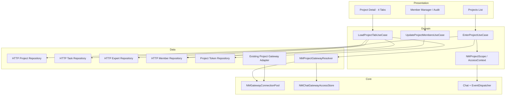
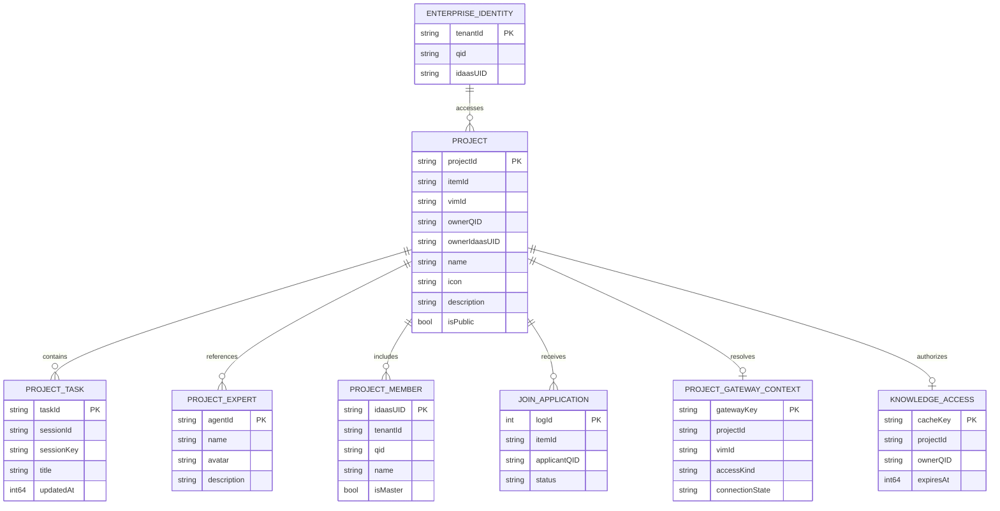
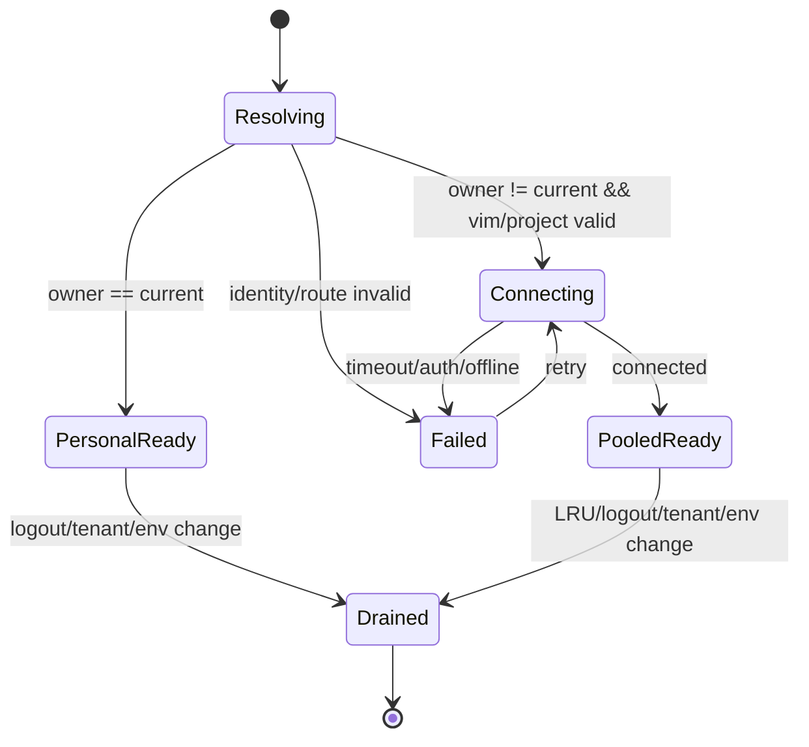
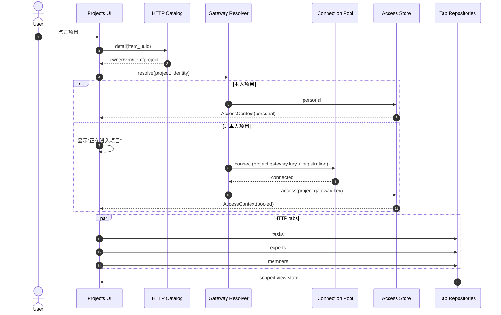

# 技术方案：项目模块重构

**创建日期**：2026-07-27  
**存放路径**：`Plans/技术方案/2026-07-27-项目模块重构.md`  
**状态**：已采纳  
**平台**：iOS / UIKit / Swift Concurrency  
**关联需求（真理源）**：`Plans/需求分析/2026-07-27-项目模块重构.md`

---

## 一、背景与目标

### 1.1 背景

现有 `NMProjectsService` 将项目列表、详情、任务会话、专家和创建能力集中在个人 `GatewayService.activeRPC`，项目模型 `NMProjectRecord` 也只包含 Gateway 字段。新需求要求：

- 创建项目继续复用既有 Gateway；
- 项目、任务、专家、成员的展示数据以企业 HTTP 为权威来源；
- 知识库按项目隔离 Token；
- 本人项目复用个人主 Socket；
- 非本人项目必须按项目所有者的 `vim_id + projectId` 创建独立 Socket，会话、历史、发送与流式事件都不能落到个人主连接；
- 项目详情升级为任务、知识、专家、成员四 Tab。

### 1.2 成功指标

1. 本人项目进入时连接池新增连接数为 0。
2. 非本人项目首次进入只创建 1 条项目连接；重复进入同项目复用相同 `gatewayKey`。
3. 同一所有者的两个项目仍使用不同 `gatewayKey`，任务和流式事件无跨项目写入。
4. 项目 A→B 快切时，A 的 HTTP、Token、Socket 晚回包写入 B 的次数为 0。
5. 项目任务、专家、成员的列表读取不调用个人 `activeRPC`。
6. 项目知识 Token 缓存命中必须同时匹配环境、租户、当前用户与项目。
7. 登出、切企业、切环境后池化连接、Access、Token 和作用域任务全部清空。

### 1.3 非目标

- 不重写底层 `GatewayManager`、RPC 编解码和 Chat 流式渲染。
- 不改变个人项目以外的普通聊天连接策略。
- 不在本次客户端方案中定义服务端数据库表。
- 不猜测未公开的任务/专家写接口路径；通过 Repository 保持 Domain/UI 稳定，开发时只接服务端确认的 HTTP Route。
- 不提高通用连接池现有 `maxConnectionCount = 3`。

---

## 二、原则对照

| 原则 | 本方案落点 |
|------|------------|
| SRP | Catalog、Task、Expert、Member、Knowledge Token、Gateway Resolver 分责 |
| OCP | 任务/专家可替换 HTTP Adapter，不改 ViewModel 与 UI |
| DIP | ViewModel 依赖 Repository / UseCase 协议，不直连 `NMEnterpriseAPI` 或 RPC |
| ISP | 拆分查询、命令、成员、Token、会话协议，避免继续扩大单体 Service |
| LSP | 复用 `NMChatGatewayAccess`；个人与池化 Access 对 Chat 调用方等价 |
| DRY | 复用 `NMEnterpriseAPI`、`NMGatewayConnectionPool`、`NMChatGatewayAccessStore`、`NMPooledChatGatewayAccess` |
| KISS | 使用一个项目上下文对象显式携带 HTTP 身份、权限和 Gateway Access |
| YAGNI | 不另建第二套 Socket 栈，不引入持久化数据库，不实现连接池优先级调度 |

---

## 三、约束与前提

| 约束 | 方案 |
|------|------|
| 项目创建必须走 Gateway | 保留 `projects.create` 和现有表单校验；成功后用 HTTP 项目列表对账 |
| 项目展示必须含本人/协同项目 | `POST /api/items/list` 作为项目列表权威来源 |
| 任务/专家/成员走 HTTP | 任务/专家先从 `items/detail.item_config` 映射；成员沿用已存在 Items API |
| 他人项目独立 Socket | `NMProjectGatewayResolver` fail-closed 判定归属并构建池化 Access |
| Gateway URL 需要项目上下文 | 通用 Registration 增加只读 query items，至少包含 `project_id`；无法改 host 时附加 `vm_id` |
| 连接配置签名 | 继续由 `GatewaySocketRequestBuilder` 对最终 URL 签名 |
| 知识库 Token | `POST /api/brand/claw/yp/project_token?appsource=so`，body `{project_id}` |
| API 文档现状 | Geelib 引用接口汇总页当前无正文；已存在 Items API 与 Web 落地实现作为已验证契约 |
| 灰度 | 新入口受企业项目模块开关控制；关闭后恢复旧项目入口 |
| 数据迁移 | 无数据库迁移；旧项目磁盘缓存升级为按 scope 重新拉取，不迁移 owner/vim 字段 |

---

## 四、总体架构

### 4.1 分层与模块边界

| 层 / 模块 | 职责 | 输入 / 输出 | 依赖 |
|-----------|------|-------------|------|
| Project Presentation | 项目列表、四 Tab、成员管理、申请记录、连接中/错误/只读态 | `NMProjectDetailState`、用户事件 | UseCase |
| Project UseCase | 进入项目、创建项目、加载各 Tab、成员差异提交、申请审核 | `NMProjectScope` / View State | Repository、Gateway Resolver |
| Project Domain | 项目、任务、专家、成员、申请、权限、作用域 | 纯 Swift 值对象 | 无传输层依赖 |
| HTTP Repository | Items、组织、项目 Token 的 async 封装与 DTO Mapper | HTTP DTO → Domain | `NMEnterpriseAPI` / `NMSimpleRequest` |
| Project Command Gateway | 创建/编辑项目以及项目会话 RPC | Domain Command → Gateway response | 既有 `NMProjectsService` 能力的 Adapter |
| Project Gateway Resolver | 判断本人/他人、生成连接键、构建/复用项目 Access | `NMProject + NMEnterpriseIdentity` → `NMProjectAccessContext` | Gateway Endpoint Builder、连接池、Access Store |
| Gateway Endpoint Builder | 规范化环境前缀、替换 VIM host、附加项目 query | base registration + project route → registration | Gateway Core |
| Knowledge Token Store | 单飞请求、按 scope 缓存、失效和生命周期清理 | project token | Token HTTP Repository |
| Chat Navigation Bridge | 将已解析的 `NMChatGatewayAccess` 显式传给 Chat | route + gateway | `NMClawChatPushHelper` |



### 4.2 目录与类型落点

| 建议路径 | 类型 |
|----------|------|
| `Features/Projects/Domain/` | `NMProject`, `NMProjectTask`, `NMProjectExpert`, `NMProjectMember`, `NMProjectScope`, `NMProjectPermission` |
| `Features/Projects/Data/HTTP/` | Items DTO Mapper、async `NMEnterpriseAPI` Adapter、Task/Expert/Member Repository |
| `Features/Projects/Data/Gateway/` | `NMProjectCommandGatewayAdapter`, `NMProjectGatewayResolver`, `NMProjectGatewayEndpointBuilder` |
| `Features/Projects/Data/Knowledge/` | `NMProjectKnowledgeTokenStore`, project-token API |
| `Features/Projects/UseCase/` | 进入项目、加载 Tab、创建并对账、成员差异提交 |
| `Features/Projects/Presentation/` | 四 Tab Controller / ViewModel / State |
| `Core/Services/GatewayCore/Models/` | 通用 `GatewayRegistration.connectionQueryItems` 扩展 |

### 4.3 核心协议

```swift
protocol NMProjectCatalogRepository {
    func list(scope: NMEnterpriseIdentity) async throws -> [NMProject]
    func detail(projectId: String, scope: NMEnterpriseIdentity) async throws -> NMProject
}

protocol NMProjectTaskRepository {
    func list(project: NMProject, scope: NMEnterpriseIdentity) async throws -> [NMProjectTask]
}

protocol NMProjectExpertRepository {
    func list(project: NMProject, scope: NMEnterpriseIdentity) async throws -> [NMProjectExpert]
    func replace(project: NMProject, expertIDs: [String], scope: NMEnterpriseIdentity) async throws
}

protocol NMProjectMemberRepository {
    func list(project: NMProject, scope: NMEnterpriseIdentity) async throws -> [NMProjectMember]
    func applyDiff(project: NMProject, diff: NMProjectMemberDiff, scope: NMEnterpriseIdentity) async throws
}

@MainActor
protocol NMProjectGatewayResolving {
    func resolve(project: NMProject, identity: NMEnterpriseIdentity) async throws -> NMProjectAccessContext
}
```

任务/专家 DTO 与既有领域模型字段完全一致时，Mapper 可返回现有 `SessionHistoryEntry` / `NMProjectExpertRow`；只要字段语义、必填性或错误容忍不同，就保留独立 Domain 类型。禁止让 `[String: Any]` 或 HTTP DTO 进入 Presentation。

---

## 五、数据模型

### 5.1 ER 图



### 5.2 字段定义

| 实体 | 字段 | 类型 | 必填 | 来源 / 规则 |
|------|------|------|------|-------------|
| `NMProject` | `projectId` | String | 是 | HTTP `item_uuid`；Gateway create 返回 ID 用于对账 |
| `NMProject` | `itemId` | String | 成员场景是 | HTTP `id/item_id` |
| `NMProject` | `vimId` | String | 他人项目是 | HTTP `vim_id`；建 Socket 路由 |
| `NMProject` | `ownerQID` | String | 知识场景是 | HTTP `qid/userinfoid` |
| `NMProject` | `ownerIdaasUID` | String | 是 | HTTP `idaas_uid/userinfoid`；归属判断不可猜 |
| `NMProject` | `isPublic` | Bool | 是 | HTTP `is_pub == 1` |
| `NMProjectTask` | `taskId` | String | 是 | HTTP row `id/session_id` |
| `NMProjectTask` | `sessionId` | String | 打开会话时是 | HTTP `sessionId/session_id` |
| `NMProjectTask` | `sessionKey` | String | 打开会话时是 | HTTP `sessionKey/session_key`；不得客户端猜测 |
| `NMProjectExpert` | `agentId` | String | 是 | HTTP `agentId/id` |
| `NMProjectMember` | `idaasUID` | String | 是 | 邀请/移除 payload |
| `NMProjectMember` | `tenantId` | String | 是 | 邀请/移除 payload |
| `NMProjectMember` | `isMaster` | Bool | 是 | HTTP `is_master == 1`；true 永不可删 |
| `NMProjectScope` | `scopeID` | String | 是 | `env:tenant:user:project:generation` |
| `NMProjectAccessContext` | `gateway` | `NMChatGatewayAccess` | 是 | personal 或 pooled；必须显式传递 |
| `NMProjectAccessContext` | `gatewayKey` | String | 是 | personal 或项目池 key |
| `NMProjectAccessContext` | `generation` | UUID | 是 | 丢弃旧请求/事件 |
| `KnowledgeToken` | `accessToken` | String | 是 | project-token 响应；禁止日志与磁盘明文 |

### 5.3 作用域和缓存键

```text
projectScopeKey = <environment>:<tenantId>:<currentIdaasUID>:<projectId>
projectGatewayKey = project:<environment>:<tenantId>:<formattedVimId>:<projectId>
projectTokenKey = <environment>:<tenantId>:<currentIdaasUID>:<projectId>
```

- `gatewayKey` 不含 Token。
- 同项目并发进入由同一 key 合流。
- Token 缓存在内存，收到过期或鉴权错误立即失效；不跨账号、租户、环境恢复。
- 所有 async 完成回调提交状态前比较 `scopeID + generation`。

---

## 六、项目 Socket 架构（核心 ADR）

### ADR-001：用项目感知 Resolver 复用通用连接池

**状态**：采纳

#### 决策

新增 `NMProjectGatewayResolver`，先严格判断项目归属：

1. `ownerIdaasUID` 或当前 `idaasUID` 为空：抛 `invalidProjectIdentity`，不得默认为本人。
2. 两者相同：返回 `NMChatGatewayAccessStore.shared.personal`，不触碰连接池。
3. 两者不同：要求 `vimId`、`projectId` 非空，构建项目专属 Registration，调用 `NMGatewayConnectionPool.connect`，成功后从 `NMChatGatewayAccessStore` 获取同 key 的 `NMPooledChatGatewayAccess`。
4. 连接失败：停留错误态，可重试；绝不回退 personal。

#### Gateway Endpoint 构建

`GatewayRegistration` 增加通用、不可变的 `connectionQueryItems: [String: String]`，`GatewayConnectConfig.make` 在生成 URL 后追加并参与 `shouldReconnect` 的 URL 比较。

```text
VIM 子域环境：
wss://<formatted-vim>.<gateway-domain>?project_id=<projectId>

非 VIM 子域环境：
wss://<base-host>?vm_id=<formatted-vim>&project_id=<projectId>
```

`formatted-vim` 规则与 Web 对齐：先剥离旧 `t/p` 前缀，再按当前环境补 `t` 或 `p`。目标 host、`vm_id`、`project_id` 都必须通过 `URLComponents` 生成，禁止字符串拼 URL。

#### 选项矩阵

| 方案 | 性能 | 复杂度 | 复用 | 串线风险 | 结论 |
|------|------|--------|------|----------|------|
| A. 所有项目使用个人主连接 | 高 | 低 | 高 | 极高，违反需求 | 淘汰 |
| B. 项目模块自建 WebSocket 栈 | 中 | 高 | 低 | 中，双栈生命周期易漂移 | 淘汰 |
| C. Resolver + 通用连接池 + 显式 Chat Access | 高 | 中 | 高 | 低，可按 key/事件双重隔离 | 采纳 |

#### Chat 显式注入

- `NMClawChatPushHelper.pushHistoryChat` 与 `pushAgentChat` 增加显式 `gateway:` 参数。
- 项目详情、iPad 项目详情、项目深链先得到 `NMProjectAccessContext` 再导航。
- 项目入口禁止使用带 `NMPersonalChatGatewayAccess.shared` 默认值的重载。
- `NMChatViewController`、`NMChatNetworkHandler` 继续使用既有 `NMChatGatewayAccess` 抽象。
- `NMChatEventDispatcher` 继续按 `gatewayKey` 过滤；再由页面的 `scopeID/generation` 拦旧项目事件。

#### 生命周期



连接池保持现有上限 3 与 LRU。增加“企业上下文切换”清理调用，执行顺序：

1. 取消所有 Project scope Task；
2. `NMGatewayConnectionPool.disconnectAll()`；
3. `NMChatGatewayAccessStore.removeAllPooledAccesses()`；
4. `NMProjectKnowledgeTokenStore.removeAll()`；
5. 清空项目 HTTP 内存缓存。

---

## 七、API Schema / 接口契约

### 7.1 已验证 HTTP 接口

| 方法 | 路径 | 说明 | 幂等 | Request | Response / 映射 |
|------|------|------|------|---------|-----------------|
| POST | `/api/items/list` | 本人 + 协同项目列表 | 是 | `{last_id?, size}` | `data.list[]` → `NMProject` |
| POST | `/api/items/detail` | 项目详情、任务/专家 HTTP 快照 | 是 | `{item_uuid}` | `data`；解析 `item_config.sessions/experts` |
| POST | `/api/items/member` | 项目成员 | 是 | `{item_id}` | `data[]` → `NMProjectMember` |
| POST | `/api/items/invitation_join` | 批量邀请成员 | 业务幂等 | `{item_uuid, members[]}` | `code == 0` 后刷新成员 |
| POST | `/api/items/remove_member` | 批量移除成员 | 业务幂等 | `{item_id, members[]}` | `code == 0` 后刷新成员 |
| POST | `/api/items/apply_join` | 申请加入 | 否；服务端防重 | `{item_uuid, join_reason}` | `code == 0` 后刷新详情 |
| POST | `/api/items/audit_list` | 申请记录 | 是 | `{last_id, size}` | `data.list[]`、`has_more` |
| POST | `/api/items/audit` | 通过/拒绝申请 | 业务幂等 | `{log_id, status}` | 最终状态后刷新申请/成员 |
| POST | `/api/items/public` | 更新公开状态 | 业务幂等 | `{item_uuid, is_pub}` | `code == 0` |
| POST | `/api/claw/ent/org_list` | 组织树 | 是 | identity headers | 树节点 |
| POST | `/api/claw/ent/org_members_include_sub` | 当前部门成员候选 | 是 | 部门 + 分页 | 候选成员 |
| POST | `/api/brand/claw/yp/project_token?appsource=so` | 项目知识 Token | 是 | `{project_id}` | `data.access_token` 或 `data.list[0]` |

> 任务/专家的当前 Web 兼容契约是 `items/detail.item_config.sessions/experts`。若服务端提供独立 HTTP 列表/写接口，只替换 `NMProjectTaskRepository` / `NMProjectExpertRepository` Adapter；未确认路径不得用 Gateway 回退，也不得在客户端硬编码猜测。

### 7.2 项目详情响应示例

```json
{
  "code": 0,
  "data": {
    "id": 123,
    "item_uuid": "project-uuid",
    "vim_id": "p0123456789abcdef0123456789abcdef",
    "qid": "owner-qid",
    "idaas_uid": "owner-idaas",
    "item_name": "项目名称",
    "is_pub": 1,
    "item_config": "{\"sessions\":[{\"session_id\":\"s1\",\"session_key\":\"project:project-uuid:agent:main:main\",\"title\":\"任务\"}],\"experts\":[{\"id\":\"agent-1\",\"name\":\"专家\"}]}"
  }
}
```

Mapper 要求：

- `item_config` 支持 JSON 字符串或对象；
- 非法 JSON 映射为空快照并记录脱敏错误，不导致项目详情崩溃；
- 任务缺 `session_id/session_key` 时可以展示不可点击行，不能自行构造会话标识；
- 专家缺唯一 `agentId/id` 时丢弃该行。

### 7.3 成员变更 Request

```json
{
  "item_uuid": "project-uuid",
  "members": [
    {
      "idaas_uid": "member-idaas",
      "tenant_id": "tenant-id"
    }
  ]
}
```

`NMProjectMemberDiff` 在客户端先完成去重，并从 remove 集合强制剔除 `isMaster == true` 的成员。邀请与移除分两次请求；任一失败都重新拉取权威成员列表，不做本地部分成功猜测。

### 7.4 知识 Token Response

```json
{
  "code": 0,
  "data": {
    "access_token": "sensitive-token",
    "expires_in": 3600
  }
}
```

兼容 `data.list[0].access_token`。非本人项目使用 owner QID 创建云盘 Service；本人项目清除上一个共享项目 Token 上下文并使用个人 Token。

### 7.5 Gateway RPC

| RPC | 使用范围 | Access |
|-----|----------|--------|
| `projects.create` | 创建项目 | personal |
| `projects.update/delete` | 本人项目管理 | 由权限与项目 Access 显式决定 |
| `project.session.create` | 创建项目任务会话 | `NMProjectAccessContext.gateway` |
| 项目 session history/send/share/delete | 项目任务会话 | 同一 `NMProjectAccessContext.gateway` |

Gateway 调用参数中仍传业务 `projectId`；Socket URL 同时携带 `project_id`，二者不一致时客户端拒绝请求。

### 7.6 统一错误

服务端具体非零 `code/msg` 保留到日志与用户提示；Domain 归一化为：

| Domain Error | 触发条件 | 客户端处理 |
|--------------|----------|------------|
| `invalidProjectIdentity` | owner/current identity 缺失 | 阻断进入，提示项目数据异常 |
| `projectRouteMissing` | 他人项目缺 vim/projectId | 连接失败态，不回退 personal |
| `projectNotFound` | HTTP 404/空详情 | 返回列表并刷新 |
| `gatewayConnectFailed` | Socket 超时、鉴权、离线 | 错误页 + 重试 |
| `gatewayScopeMismatch` | Access project 与请求 project 不一致 | 中止调用并上报 |
| `knowledgeTokenUnavailable` | Token 空/过期/业务错误 | 知识 Tab 错误态 + 重试 |
| `ownerRemovalForbidden` | remove 集合含 owner | 本地拦截，不发请求 |
| `staleProjectScope` | scope/generation 已变化 | 静默丢弃响应 |
| `memberMutationConflict` | 申请/成员被其他端处理 | 刷新权威状态 |
| `httpBusiness(code, msg)` | HTTP `code != 0` | 展示安全 msg；支持重试 |
| `invalidPayload` | DTO 缺必需字段 | 丢弃坏行；整页不可用时错误态 |

日志严禁包含 Gateway Token、project token、Cookie、完整手机号。

---

## 八、关键流程

### 8.1 进入项目



### 8.2 创建项目与 HTTP 对账

1. 使用 personal Gateway 调用既有 `projects.create`，企业模式默认 `isPub = 1`。
2. 成功后记录返回 `projectId`，禁用重复提交。
3. 以有限退避刷新 `/api/items/list`，直到出现相同 `item_uuid` 或达到超时。
4. 超时时展示“已创建，正在同步”，保留 Gateway 返回的临时项目行，但不重复 create。
5. HTTP 对账成功后用 HTTP Domain 实体替换临时行。

### 8.3 打开/创建任务会话

1. 项目任务列表从 HTTP Repository 读取。
2. 点击已有任务前校验 `sessionId + sessionKey + AccessContext.projectId`。
3. 创建会话通过当前 `AccessContext.gateway.rpc` 执行。
4. `pushHistoryChat(..., gateway: context.gateway)`；项目入口不允许省略 gateway。
5. 创建成功后短暂使用 pending overlay，并刷新 HTTP 详情完成对账。
6. 流式事件必须同时匹配 `gatewayKey` 和当前 `scope generation`。

### 8.4 项目切换

1. 生成新 `generation`，旧页面 state 失去写权限。
2. 取消旧项目 HTTP/Token Task；旧 Socket 可留在池中供 LRU 复用。
3. 清除旧共享知识 Service 引用。
4. 解析新项目 Access；失败时不进入详情。
5. 所有回包经 `scopeID + generation` 再提交。

---

## 九、状态管理与权限

```swift
enum NMProjectEntryState {
    case idle
    case resolving
    case connecting(projectID: String)
    case ready(NMProjectAccessContext)
    case failed(NMProjectEntryError)
}

struct NMProjectDetailState {
    var scope: NMProjectScope
    var access: NMProjectAccessContext
    var permission: NMProjectPermission
    var tasks: NMAsyncListState<NMProjectTask>
    var knowledge: NMAsyncListState<NMProjectKnowledgeItem>
    var experts: NMAsyncListState<NMProjectExpert>
    var members: NMAsyncListState<NMProjectMember>
}
```

权限规则：

- 未加入公开项目：四 Tab 只读，申请按钮按 none/pending/joined 决定。
- 本人项目：完整项目设置与成员管理。
- 协作者：可使用项目资源；成员能力按服务端权限显示，但无论如何不能删除 owner。
- UI 隐藏不是安全边界；UseCase 再校验一次，服务端终态为准。

---

## 十、兼容与迁移

### 10.1 复用

- 复用 `NMGatewayConnectionPool` 的合流、失败移除、LRU 和登出/环境清理。
- 复用 `NMChatGatewayAccess`、`NMPooledChatGatewayAccess`、`NMChatGatewayAccessStore`。
- 复用 `NMChatEventDispatcher` 的 `gatewayKey` 隔离。
- 复用 `NMEnterpriseAPI` 已有项目、成员、申请、组织接口。
- 复用 `NMProjectsService.createProject` 的校验与 Gateway RPC；通过 Adapter 隔离旧单体协议。
- 任务/专家字段真正同构时复用既有展示模型；判断依据是语义和必填性，不只看字段名。

### 10.2 必改

| 现状 | 改造 |
|------|------|
| `NMProjectRecord` 缺 item/vim/owner | 新建 `NMProject` Domain，经 Gateway/HTTP 双 Mapper |
| `NMProjectsService.listProjects` 走 activeRPC | Catalog 改为 HTTP Repository |
| 任务/专家列表走 Gateway | 改为 HTTP Adapter |
| 详情只有任务/知识/专家 | 增加成员 Tab 与成员/审核页面 |
| 项目 Chat 导航默认 personal Access | 项目路径强制显式传 `NMProjectAccessContext.gateway` |
| Registration 不支持项目 query | 增加通用 query items 并纳入 URL/重连比较 |
| 连接池不感知切企业 | 企业身份切换显式 drain |
| 知识库沿用个人云盘 Token | 加 project-token Provider 与 scope cache |

### 10.3 不兼容保护

- 旧缓存没有 owner/vim 时只用于列表占位，点击必须 HTTP 补详情后再解析连接。
- HTTP 任务缺 Socket 会话标识时只读展示，禁止从 task id 拼 session key。
- 未确认任务/专家写 Route 时能力标记为 unavailable；禁止偷偷回退 Gateway。

---

## 十一、可观测性与安全

| 事件 | 字段（脱敏） |
|------|--------------|
| `project_entry_resolve` | project hash、owned/shared、result |
| `project_gateway_connect` | gatewayKey hash、reuse/new、latency、result |
| `project_scope_stale_drop` | old/new generation、source=http/token/socket |
| `project_token_fetch` | project hash、latency、result |
| `project_http_map_drop` | endpoint、row reason、count |
| `project_member_diff` | add/remove count、result |

安全要求：

- Token 不写日志、不进入 Analytics、不持久化明文。
- owner/vim 缺失 fail-closed。
- URL query 由 `URLComponents` 构建并在最终 URL 上签名。
- 项目 Gateway TLS 继续使用既有 Pinning/TOFU；stableID 含项目 scope，避免错误复用指纹上下文。
- 连接失败不可降级到 personal。

---

## 十二、测试策略

| 层级 | 必测 |
|------|------|
| Mapper UT | item_uuid/id/vim/owner；item_config string/object/坏 JSON；任务/专家坏行 |
| Resolver UT | 本人 personal；他人 pooled；缺 owner/vim fail；环境前缀；同 VIM 不同项目 key |
| Endpoint UT | host 重写、vm_id fallback、project_id、URL 编码、签名输入 |
| Pool UT | 同 key 合流、不同 key 隔离、失败移除、上限 3、LRU |
| Token UT | 单飞、切项目失效、owner QID、过期重取、登出/切企业清理 |
| Scope UT | A→B HTTP/Token/Socket 晚回包全部丢弃 |
| Member UT | owner 锁定、diff 去重、部分失败刷新 |
| Chat IT | 项目入口显式 Access；历史/新建/发送/分享/流式均使用同一 gatewayKey |
| API IT | Items、组织、project-token envelope 与错误 msg |
| UI/E2E | 连接中/失败重试、四 Tab 空错态、只读、申请置灰、iPhone/iPad |

测试先行阶段至少把 AC3–AC7、AC9、AC11、AC14、AC17 写成失败测试后再实现。

---

## 十三、上线与回滚

### 发布

1. 先合入 Core 的 query items 与 Resolver/Mapper 单测，不开启入口。
2. 接入 HTTP Catalog、Task、Expert、Member、Token Repository。
3. 接入四 Tab 与项目 Chat 显式 Access，完成真机联调。
4. 企业项目功能开关小流量灰度，监控建连失败率、stale drop、HTTP 映射丢弃。
5. 指标稳定后全量。

### 回滚触发

- 他人项目会话串入个人连接任意 1 例；
- 项目知识 Token 跨项目复用任意 1 例；
- 他人项目建连失败率显著高于 Web 同环境；
- 项目列表或四 Tab 核心接口不可用且无法恢复。

### 回滚操作

- 关闭新企业项目入口开关；
- `disconnectAll + removeAllPooledAccesses + removeAllTokens`；
- 恢复旧项目 UI 路由；保留 Gateway Core 向后兼容字段；
- 无数据库迁移，无需数据回滚。

---

## 十四、实施计划

| 阶段 | 内容 | 验收 |
|------|------|------|
| 1 | Domain、DTO Mapper、HTTP async Adapter | Mapper / API 契约测试 |
| 2 | Gateway Registration query、Endpoint Builder、Resolver | Resolver / Pool / Endpoint 测试 |
| 3 | Token Provider 与 scope 生命周期 | Token / stale response 测试 |
| 4 | 项目 Facade / UseCase 与 Chat 显式 Access | Chat 集成测试 |
| 5 | 四 Tab、成员管理、申请记录 | Figma 静态与交互走查 |
| 6 | 全链路回归、灰度、回滚演练 | AC1–AC20 |

---

## 十五、架构验收

- [x] 需求 `status=已采纳`、`p0_open=0`
- [x] 模块边界明确，Presentation 不直连 HTTP/RPC
- [x] ER 图与字段定义齐全
- [x] 已验证 API Schema、请求、响应和错误处理齐全
- [x] 本人/他人项目 Socket 决策和失败分支明确
- [x] Chat Access 显式传递，禁止项目路径默认 personal
- [x] HTTP/Token/Socket 都有项目作用域防串
- [x] 生命周期、上线、回滚和安全边界明确
- [x] 未公开的任务/专家写 Route 未被猜测，Adapter 替换点明确

---

## 续做

```text
/resume plan=Plans/技术方案/2026-07-27-项目模块重构.md 进度=技术方案已采纳，Socket ADR、模块边界、API Schema、错误码和测试边界完成，进入验收测试先行
```

**下一阶段 Skill**：`test-generator`。

## 反馈（skill_run）

```yaml
skill_run:
  skill: architecture-design-assistant
  plan: Plans/技术方案/2026-07-27-项目模块重构.md
  date: 2026-07-27
  contexts_used:
    - path: Plans/需求分析/2026-07-27-项目模块重构.md
      utility: high
      reason: "作为真理源确认24组GWT、20条AC、项目级Socket规则、协议边界和异常矩阵"
    - path: Templates/技术方案模板.md
      utility: high
      reason: "用于覆盖模块边界、ER与字段、API Schema、错误码、决策矩阵、上线回滚和实施计划"
    - path: Contexts/决策/Skill反馈协议.md
      utility: high
      reason: "用于按全库协议记录本次架构Skill的上下文使用与执行结果"
    - path: Plans/Epic/2026-07-27-项目模块重构.md
      utility: high
      reason: "用于核对WBS 3、五个Figma节点、Gateway/HTTP约束和Socket需求变更"
  contexts_missing:
    - "任务与专家写操作的正式HTTP Route及Request/Response文档"
  contexts_stale: []
  outcome_status: pass
  friction: "Geelib引用的接口汇总页当前无正文；读取契约以现有NMEnterpriseAPI和Web已落地实现交叉确认，未猜测写接口路径"
  revisit_needed: false
```
