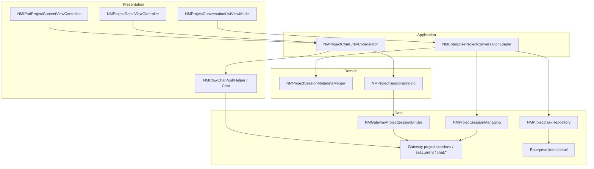
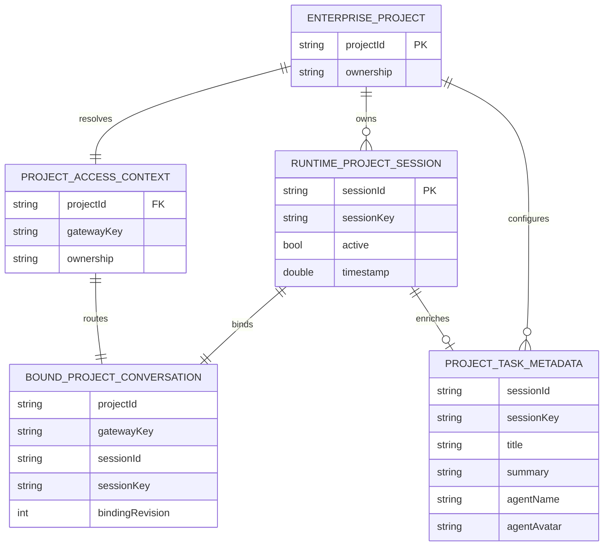
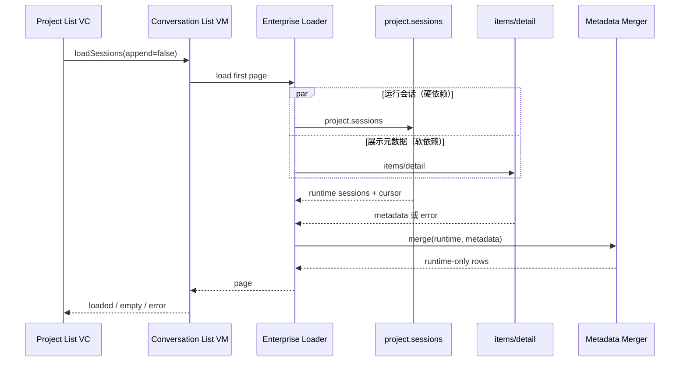
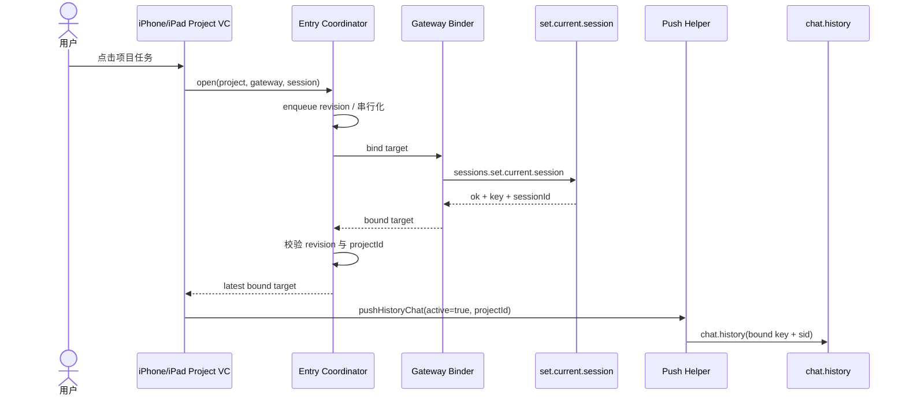

# 技术方案：企业项目对话与任务入口 Web 对齐

**创建日期**：2026-07-28  
**存放路径**：`Plans/技术方案/2026-07-28-企业项目对话与任务入口Web对齐.md`  
**状态**：已采纳  
**平台**：iOS（iPhone / iPad）  
**关联需求（真理源）**：`Plans/需求分析/2026-07-28-企业项目对话与任务入口Web对齐.md`

## 一、背景与目标

### 1.1 现状问题

1. 企业项目任务列表当前只读取 HTTP `items/detail.item_config.sessions`，没有以 Gateway `project.sessions` 判断会话是否仍可进入。
2. HTTP 任务被映射成 `active=true` 的 `SessionHistoryEntry`，既有任务进入后可能直接调用 `chat.history/chat.send`，跳过 `sessions.set.current.session`。
3. iPad 既有任务入口未传递 `projectId`，新建任务入口却有传递，项目上下文不一致。
4. Gateway 查询失败与项目无任务可能被折叠成同一空态。

### 1.2 成功指标

- HTTP-only 任务进入对话的数量为 0。
- iPhone / iPad、自有 / 共享项目的绑定前置场景全部通过。
- 绑定失败时 `chat.history` 与 `chat.send` 调用次数均为 0。
- 同一项目快速选择 A、B 两个任务时，最终绑定与展示目标必为 B。
- App 主任务页相关客户端代码变更为 0。

### 1.3 非目标

- 不修改 `NAMIWork/Features/Conversation/MainList/` 和任务搜索入口。
- 不增加 App 主任务页的项目任务过滤或项目网关路由。
- 不重构项目权限、专家、成员、知识库或定时任务。
- 不修改 Web。
- 不以本需求补齐 `chat_source=namiwork`；若服务端后续确认为协议必填，另开接口契约变更。

## 二、架构原则

| 原则 | 本方案应用 |
|------|------------|
| SRP | 会话查询、元数据合并、会话绑定、页面导航分别承担单一职责 |
| DIP | Loader 依赖 `NMProjectSessionManaging` 与 `NMProjectTaskRepository` 协议，不依赖具体 HTTP/RPC 实现 |
| ISP | 绑定器只暴露项目会话绑定能力，不把完整 `GatewayRPCClient` 泄漏给 Controller |
| DRY | iPhone 与 iPad 共用任务 Loader 和绑定协调器 |
| KISS | 不引入持久化数据库、不改服务端契约、不重写 Chat 内核 |
| YAGNI | App 主任务页、`chat_source`、项目权限重构明确排除 |
| Fail closed | 无法证明项目、Gateway、会话三者一致时禁止历史加载和消息发送 |

## 三、约束与前提

- `project.sessions` 是项目运行会话真相源；请求失败必须进入错误态，不能回退成 HTTP 任务列表。
- `items/detail.item_config.sessions` 只提供标题、摘要、专家名称和头像等可选元数据。
- 自有项目沿用个人 Gateway；共享项目沿用 `NMProjectGatewayResolver` 解析出的项目 Gateway。
- `sessionId` 与 `sessionKey` 均非空才允许进入绑定流程；不从 `taskId` 推导 Socket 会话身份。
- `sessions.set.current.session` 是企业项目既有任务的必需能力；不支持时提示服务升级，不盲发消息。
- HTTP 元数据失败可以降级为 Gateway 会话展示字段；Gateway 会话失败不可降级。
- 不新增数据迁移。

## 四、模块边界

| 模块 | 类型 | 职责 | 输入 / 输出 | 依赖 |
|------|------|------|-------------|------|
| `NMProjectConversationListViewModel` | Presentation | 驱动加载、分页、空/错状态；不直接拼两套数据 | 项目、分页动作 → 列表状态 | Enterprise Loader |
| `NMEnterpriseProjectConversationLoader`（新增） | Application | 首屏并行查询运行会话和 HTTP 元数据；分页只查询运行会话 | 项目访问上下文、游标 → `NMEnterpriseProjectConversationPage` | Session Managing、Task Repository、Merger |
| `NMProjectSessionMetadataMerger`（新增） | Domain | 只以运行会话形成列表，按会话身份补充展示元数据 | 运行会话、元数据 → 展示会话 | 无外部依赖 |
| `NMProjectChatEntryCoordinator`（新增） | Application | 串行执行 `setCurrentSession`，采用 last-wins，成功后生成绑定目标 | 项目会话目标 → `NMBoundProjectConversation` | Gateway Access、Binder |
| `NMProjectSessionBinding`（新增协议） | Domain Port | 定义项目会话绑定契约，隔离具体 RPC | sessionKey/sessionId → 绑定结果 | 无 |
| `NMGatewayProjectSessionBinder`（新增） | Data Adapter | 通过注入 Gateway 调用 `sessions.set.current.session` 并校验响应 | 绑定请求 → 绑定结果/错误 | `NMChatGatewayAccess` |
| `NMProjectTaskRepository` | Data Port（既有） | 获取 HTTP 项目任务元数据 | 项目、企业身份 → `[NMProjectTask]` | Enterprise HTTP |
| `NMProjectSessionManaging` | Data Port（既有） | 通过显式 Gateway 获取 `project.sessions` | projectId、分页、Gateway → RPC 响应 | Gateway RPC |
| iPhone / iPad Project Controller | Presentation | 发起进入动作；只在绑定成功后 push Chat | 用户点击 → 导航/错误提示 | Entry Coordinator、Push Helper |
| `NMClawChatPushHelper` / Chat Network | Presentation / Data（既有） | 使用已绑定的 Gateway 与显式项目上下文加载历史、发送消息 | `ClawHistoryRouterParams` → Chat | Gateway Access |



### 4.1 明确不允许的依赖

- Project Controller 不直接调用 `GatewayRPCClient.setCurrentSession`。
- HTTP Repository 不返回或制造“可进入状态”。
- Metadata Merger 不依赖 UIKit、Gateway 或 HTTP。
- Chat 不自行从 `sessionKey` 猜测 `projectId`；项目入口必须显式传入。
- App 主任务页不依赖本次新增 Loader、Merger 或 Entry Coordinator。

## 五、数据模型

### 5.1 ER 图



### 5.2 字段定义

| 模型 | 字段 | 类型 | 必填 | 来源 | 规则 |
|------|------|------|------|------|------|
| `NMEnterpriseProjectConversationPage` | `sessions` | `[SessionHistoryEntry]` | 是 | Merger | 只含 Gateway 运行会话 |
| 同上 | `hasMore` | Bool | 是 | `project.sessions` | 不由 HTTP 决定 |
| 同上 | `nextBeforeTimestamp` | Int64? | 否 | `project.sessions` | append 游标 |
| 同上 | `metadataState` | enum | 是 | Loader | `loaded / unavailable`，仅影响展示 |
| `NMProjectTaskDisplayMetadata` | `sessionId` | String? | 否 | HTTP | 首选关联键 |
| 同上 | `sessionKey` | String? | 否 | HTTP | 仅在唯一匹配时作为次级关联键 |
| 同上 | `title/snippet/clawName/clawAvatar` | String? | 否 | HTTP | 非空时才覆盖对应展示字段 |
| `NMBoundProjectConversation` | `projectId` | String | 是 | 项目入口 | 与访问上下文一致 |
| 同上 | `gatewayKey` | String | 是 | Gateway Access | 绑定、历史、发送保持一致 |
| 同上 | `sessionId` | String | 是 | 运行会话 | 必须与绑定响应一致 |
| 同上 | `sessionKey` | String | 是 | 绑定响应优先 | 响应为空时才沿用请求值 |
| 同上 | `bindingRevision` | UInt64 | 是 | Entry Coordinator | 只有最新 revision 可以导航 |

### 5.3 合并不变条件

1. 输出集合是运行会话集合的子集，HTTP-only 元数据绝不创建列表行。
2. 缺少 `sessionId` 或 `sessionKey` 的运行会话保留诊断日志，但不进入可点击集合。
3. 元数据重复时，`sessionId` 唯一匹配优先；冲突或多重 `sessionKey` 匹配时放弃覆盖。
4. 元数据只覆盖展示字段，不能覆盖运行会话的 `active`、swarm、未读和分页字段。
5. 同名不同 `sessionId` 的行保持独立。

## 六、接口契约 / API Schema

> 本方案不新增服务端接口，只重新编排现有 HTTP 与 Gateway RPC。

### 6.1 HTTP：项目任务元数据

| 方法 | 路径 | 说明 | 幂等 |
|------|------|------|------|
| POST | `api/items/detail` | 获取项目详情及 `item_config.sessions` 展示元数据 | 是 |

**Headers**

```json
{
  "qid": "<current-qid>",
  "tenant-id": "<tenant-id>",
  "idaas-uid": "<current-idaas-uid>"
}
```

**Request**

```json
{
  "item_uuid": "project-uuid"
}
```

**Response（关注字段）**

```json
{
  "code": 0,
  "data": {
    "item_uuid": "project-uuid",
    "item_config": {
      "sessions": [
        {
          "session_id": "session-1",
          "session_key": "project:project-uuid:agent:main:main",
          "title": "任务标题",
          "summary": "最近摘要",
          "agent_name": "项目专家",
          "avatar": "https://example.invalid/avatar.png"
        }
      ]
    }
  }
}
```

`item_config` 允许为 JSON 字符串或对象，继续由 `NMProjectItemConfigMapper` 容错解析。

### 6.2 RPC：项目运行会话

| RPC 方法 | 说明 | 必需 |
|----------|------|------|
| `project.sessions` | 获取项目中当前有效运行会话与分页信息 | 是 |

**Request**

```json
{
  "projectId": "project-uuid",
  "limit": 20,
  "beforeTimestamp": 1722140000000,
  "query": ""
}
```

首屏省略 `beforeTimestamp` 与空 `query`。

**Response**

```json
{
  "sessionsList": [
    {
      "sessionId": "session-1",
      "sessionKey": "project:project-uuid:agent:main:main",
      "active": false,
      "title": "Gateway 兜底标题",
      "timestamp": 1722140000,
      "unread": false
    }
  ],
  "hasMore": false,
  "nextBeforeTimestamp": null
}
```

### 6.3 RPC：绑定当前会话

| RPC 方法 | 说明 | 必需 |
|----------|------|------|
| `sessions.set.current.session` | 将目标项目会话绑定为当前会话 | 是 |

**Request**

```json
{
  "sessionId": "session-1",
  "sessionKey": "project:project-uuid:agent:main:main"
}
```

**Response**

```json
{
  "ok": true,
  "key": "project:project-uuid:agent:main:main",
  "sessionId": "session-1",
  "normalized": true,
  "renamed": []
}
```

校验规则：`ok == true`；响应 `sessionId` 非空时必须等于请求值；响应 `key` 非空时作为后续历史和发送的权威 key。

### 6.4 RPC：历史与发送

| RPC 方法 | 关键 Request | 使用前提 |
|----------|--------------|----------|
| `chat.history` | `sessionKey`，能力支持时带 `sessionId/limit` | 绑定成功 |
| `sessions.messages` | `sessionId/sessionKey/limit` | 仅保留现有非活跃历史兼容路径 |
| `chat.send` | `sessionKey/message/idempotencyKey`，能力支持时带 `sessionId` | 绑定成功且目标未变化 |

**chat.send Request**

```json
{
  "sessionKey": "project:project-uuid:agent:main:main",
  "sessionId": "session-1",
  "message": "继续处理这个任务",
  "thinking": "default",
  "timeoutMs": 30000,
  "idempotencyKey": "<uuid>"
}
```

- 本次不新增 `extraParams.chat_source`。
- 旧服务不支持 `chat.send.sessionId` 时，只有已成功执行本次项目会话绑定且 revision 未失效，才允许沿用现有去参重试。
- 不支持 `sessions.set.current.session` 时禁止进入 Chat，不允许以 HTTP `active=true` 或去参发送绕过。

### 6.5 错误码与客户端处理

| 本地错误 | 来源 | 含义 | 客户端处理 |
|----------|------|------|------------|
| `invalidEnterpriseIdentity` | HTTP 前置校验 | 企业身份不完整 | 提示重新登录，不请求 Gateway/HTTP |
| `projectGatewayUnavailable` | Access Context | 项目 Gateway 未连接或 RPC 为空 | 项目错误态/重试，不显示为空列表 |
| `runtimeSessionsUnavailable` | `project.sessions` | 运行会话查询失败 | 硬失败；不使用 HTTP 列表兜底 |
| `metadataUnavailable` | `items/detail` | 展示元数据失败 | 软失败；使用 Gateway 展示字段 |
| `invalidConversationTarget` | Merger / Entry | `sessionId/sessionKey/projectId` 缺失 | 行不可点击；记录脱敏日志 |
| `sessionBindingUnsupported` | unknown method | 服务不支持绑定 RPC | 提示升级服务，禁止进入 Chat |
| `sessionBindingRejected` | set current 响应 | `ok=false` 或响应身份不一致 | 保留列表/草稿，允许重试 |
| `staleSelection` | revision fence | 较旧选择完成 | 静默丢弃，不导航 |
| `permissionDenied` | HTTP/RPC 4xx/业务拒绝 | 权限已撤销 | 退出可发送态并提示无权限 |

用户文案统一经项目错误映射输出；日志只记录 `projectId/sessionId/sessionKey/gatewayKey/errorCode`，禁止消息正文、企业令牌和身份 Headers。

## 七、关键流程

### 7.1 首屏任务加载



- `project.sessions` 失败：`state=error`，不能写成 `.empty`。
- HTTP 失败：列表仍成功，标题使用 Gateway 值。
- append：复用当前项目元数据索引，只请求下一页 `project.sessions`；项目切换或 refresh 时清空索引。

### 7.2 既有任务进入



**并发规则**：绑定 RPC 按点击顺序串行；较新选择等待当前在途绑定结束后执行，保证最后一次选择最后写入服务端。完成后只有最新 revision 可以导航，中间选择不 push。

### 7.3 新建任务与首条消息

1. `project.session.create` 成功得到 `sessionId/sessionKey`。
2. 进入与既有任务相同的 Entry Coordinator 绑定流程。
3. 绑定成功后 push Chat，并携带原 `NMInputState`。
4. Chat `viewDidAppear` 消费 pending delivery，使用现有 `idempotencyKey` 只发送一次。
5. 绑定失败不 push，输入状态由调用方保留以便重试。

### 7.4 iPad 项目上下文

`NMIPadProjectContentViewController.openChat(session:)` 创建 `ClawHistoryRouterParams` 时必须传：

```swift
projectName: project.name,
projectId: project.id
```

iPhone 与 iPad 均从同一个 `NMBoundProjectConversation` 生成 Router Params，`active` 固定为绑定后的 `true`，不再沿用 HTTP 元数据推导值。

## 八、方案选项与决策矩阵

### 8.1 任务列表真相源

| 方案 | 正确性 | 复杂度 | 降级 | 风险 |
|------|--------|--------|------|------|
| A. HTTP-only（现状） | 低 | 低 | HTTP 可用即展示 | 失效会话仍可进入 |
| B. Gateway-only | 高 | 低 | 无展示元数据补充 | 标题等信息可能退化 |
| C. Gateway 真相 + HTTP 元数据（采纳） | 高 | 中 | HTTP 失败可软降级 | 需合并与分页测试 |

**决策 ADR-001**：采用 C。输出集合完全由 Gateway 决定，HTTP 只做字段覆盖。

### 8.2 会话绑定位置

| 方案 | 历史安全 | 发送安全 | UI 改造 | 风险 |
|------|----------|----------|---------|------|
| A. Chat 首次发送时绑定 | 低 | 中 | 小 | 历史可能先串台 |
| B. Chat bootstrap 内绑定 | 高 | 高 | 中 | 所有普通 Chat 路径受影响 |
| C. 项目入口 push 前绑定（采纳） | 高 | 高 | 中 | 需处理点击并发 |

**决策 ADR-002**：采用 C；用项目专属 Entry Coordinator 隔离普通 Chat。

### 8.3 快速选择并发

| 方案 | 最终服务端目标 | 实现复杂度 | 结论 |
|------|----------------|------------|------|
| 只取消旧 Task | 不保证；旧 RPC 可能晚完成 | 低 | 拒绝 |
| 并行 + revision 丢 UI | 不保证服务端最终目标 | 中 | 拒绝 |
| 串行绑定 + last-wins 导航 | 保证最后选择最后绑定 | 中 | 采纳 |

**决策 ADR-003**：绑定请求串行化，revision 只负责阻止陈旧导航。

### 8.4 兼容与范围

- **ADR-004**：`sessions.set.current.session` 为企业项目对话必需能力；unknown method 失败关闭并提示升级。
- **ADR-005**：保留既有 `chat.send.sessionId` 能力探测；只有本次绑定有效时允许去参重试。
- **ADR-006**：App 主任务页数据源不返回项目任务，不新增过滤或路由代码。
- **ADR-007**：`chat_source` 无已确认路由依赖，本次不改；未来以独立接口契约处理。

## 九、代码改动范围

### 9.1 预计新增

- `NAMIWork/Features/Projects/Service/NMEnterpriseProjectConversationLoader.swift`
- `NAMIWork/Features/Projects/Service/NMProjectChatEntryCoordinator.swift`

### 9.2 预计修改

- `NAMIWork/Features/Projects/ViewModel/NMProjectConversationListViewModel.swift`
- `NAMIWork/Features/Projects/Controller/NMProjectDetailViewController+Navigation.swift`
- `NAMIWork/Features/Projects/IPad/NMIPadProjectContentViewController.swift`
- `NAMIWork/Core/Services/GatewayCore/Models/GatewaySessionModels.swift`（保留所有运行态字段的展示元数据 copy）
- `NAMIWorkTests/ClawTests.swift` 或拆分后的 Projects 测试文件

### 9.3 明确不修改

- `NAMIWork/Features/Conversation/MainList/`
- `NAMIWork/Features/Conversation/NMTaskSearchViewController.swift`
- `NAMIWork/Features/ClawChat/Config/NMChatInitConfig.swift` 的普通会话构造语义
- `NAMIWork/Core/Networking/NMEnterpriseAPI.swift` 的接口路径和身份 Header

## 十、测试设计

| 测试 ID | 层级 | 场景 | 断言 |
|---------|------|------|------|
| UT-M01 | Unit | Gateway 2 行、HTTP 3 行含 1 个 HTTP-only | 输出只有 Gateway 2 行 |
| UT-M02 | Unit | HTTP 缺失/失败 | 使用 Gateway 标题，列表成功 |
| UT-M03 | Unit | 同名不同 sessionId | 输出 2 行且身份不合并 |
| UT-M04 | Unit | 元数据覆盖 | 只覆盖展示字段，active/swarm/unread 不变 |
| UT-M05 | Unit | 元数据重复/冲突 | 放弃歧义覆盖并记录诊断 |
| UT-L01 | Unit | append | 复用元数据索引，仅请求下一页 Gateway |
| UT-L02 | Unit | Gateway 失败、HTTP 成功 | 返回硬错误，不输出 HTTP 任务 |
| UT-B01 | Unit | set current 成功 | 返回 bound key/sid，active=true |
| UT-B02 | Unit | ok=false / sid 不一致 | 返回 bindingRejected，不导航 |
| UT-B03 | Unit | A、B 快速点击且 A 慢 | RPC 串行顺序 A→B，最终只导航 B |
| IT-P01 | Integration | iPhone 既有任务 | set current 完成后才请求 history |
| IT-P02 | Integration | iPad 既有任务 | Router Params 含 projectId |
| IT-P03 | Integration | 共享项目 | list/bind/history/send 使用同一项目 Gateway |
| IT-P04 | Integration | 网关不可用 + HTTP 成功 | 展示错误态，不显示为空列表 |
| IT-P05 | Integration | 新建任务首条消息 | create→bind→push→send，send 恰好一次 |
| CT-01 | Contract | App 主任务页数据源 | 不返回企业项目任务；客户端无过滤实现 |

现有 `testEnterpriseProjectTasksLoadFromHTTPWithoutInventingSessionKey` 必须重写：新断言应证明 HTTP-only 任务不会形成列表行，而不是验证其只读展示。

## 十一、上线、观测与回滚

### 11.1 发布

1. 合入 Loader / Merger 与单元测试。
2. 合入 Entry Coordinator 和 iPhone/iPad 接入。
3. 在新旧 Gateway 能力组合上执行集成测试。
4. 真机覆盖自有/共享项目、iPhone/iPad、既有/新建任务。

### 11.2 观测

- 记录阶段：`runtime_list`、`metadata_load`、`merge`、`bind`、`history`、`send`。
- 记录关联字段：脱敏后的 `projectId/sessionId/sessionKey/gatewayKey`、binding revision、错误类型。
- 禁止记录消息正文、企业身份 Header、访问 token。
- 重点观察：Gateway 查询失败率、绑定失败率、HTTP-only 被丢弃数量、绑定后 history/send 失败率。

### 11.3 回滚

- 无数据迁移，回滚不需要清理持久化数据。
- 触发条件：项目任务列表大面积不可用、绑定失败率显著上升、普通 Chat 回归。
- 回滚方式：回退本需求客户端提交；不修改服务端数据。
- 禁止以恢复 HTTP-only 可进入行为作为长期降级方案。

## 十二、实施顺序

| 阶段 | 内容 | 依赖 |
|------|------|------|
| 1 | Merger + Loader + 列表状态与分页测试 | 无 |
| 2 | Binding Port / Adapter + Entry Coordinator + 并发测试 | 阶段 1 |
| 3 | iPhone 项目入口接入 | 阶段 2 |
| 4 | iPad 项目入口接入并补 `projectId` | 阶段 2 |
| 5 | 新建任务绑定与 pending delivery 回归 | 阶段 2 |
| 6 | 集成测试、真机验证与日志检查 | 阶段 1–5 |

## 十三、架构验收

- [x] 需求 `status: 已采纳` 且 `p0_open: 0`
- [x] 模块边界、依赖方向与非目标明确
- [x] ER 图和字段规则完整
- [x] HTTP / RPC Schema 与错误处理完整
- [x] Gateway 失败不回退 HTTP-only 列表
- [x] 进入任务前绑定，绑定失败不加载历史、不发送
- [x] iPhone / iPad 使用同一绑定协调器并显式携带 `projectId`
- [x] App 主任务页无代码改动
- [x] 新旧 Gateway 兼容为失败关闭，不盲发
- [x] 测试、观测和回滚方案完整

## 续做

```text
/resume plan=Plans/Epic/2026-07-28-企业项目对话与任务入口Web对齐.md 进度=验收测试先行 / WBS 4
```

**下一阶段 Skill**：`test-generator`

## 反馈（skill_run）

```yaml
skill_run:
  skill: architecture-design-assistant
  plan: Plans/技术方案/2026-07-28-企业项目对话与任务入口Web对齐.md
  date: 2026-07-28
  contexts_used:
    - path: Plans/需求分析/2026-07-28-企业项目对话与任务入口Web对齐.md
      utility: high
      reason: "以已采纳需求的事件链、边界、异常和 16 组 AC 作为架构真理源"
    - path: Templates/技术方案模板.md
      utility: high
      reason: "按模板补齐模块边界、ER、API Schema、错误码、决策矩阵和回滚"
    - path: Skills/architecture_design_assistant.md
      utility: high
      reason: "遵循客户端架构门禁和与 test-first 阶段的交接要求"
    - path: Contexts/决策/Skill反馈协议.md
      utility: high
      reason: "按协议记录技术方案生成的上下文使用与执行结果"
  contexts_missing: []
  contexts_stale: []
  outcome_status: pass
  revisit_needed: false
```
