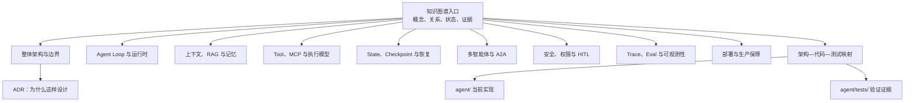
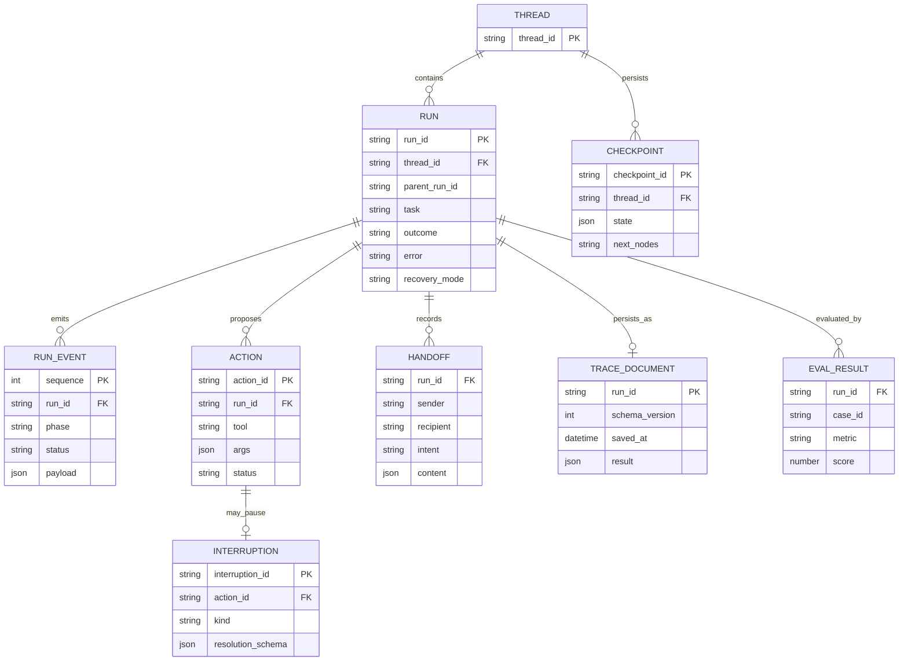

# 技术方案：智能体开发知识图谱与详细设计体系

**创建日期**：2026-07-31  
**关联真理源**：`Plans/Epic/2026-07-08-智能体开发.md`、当前 `agent/` 代码与 `agent/tests/`  
**目标**：把临时学习记录中的稳定知识迁入 `Contexts/`，形成一套从真实问题出发，经方案比较和架构决策，最终落到代码与测试的学习型知识体系。

## 一、范围与验收

### 目标

1. 建立一个长期知识图谱入口，表达概念、模块、运行状态、协议与证据关系。
2. 建立十个专题设计文档，覆盖单/多智能体、工具、记忆、安全、恢复、评测和部署。
3. 每个核心模块明确职责/非职责、输入输出、状态、异常、安全、代码和测试映射。
4. 纠正旧 Epic 中已删除代码和已变化实现，旧记录保留为演进证据。
5. 每个专题保留完整学习链，而不是只罗列最终架构。

### 非目标

- 本次不修改 `agent/` 业务实现。
- 不把参考架构误写成当前已经实现。
- 不引入 Neo4j 等图数据库；先以可版本控制的 Markdown + Mermaid 表达。
- 不复制所有学习过程，只保留稳定结论与来源链接。

### 验收标准

- [x] `Contexts/智能体开发/` 至少包含总图、整体架构、运行时、上下文记忆、工具、安全、状态恢复、多智能体、观测评测、部署、代码测试映射。
- [x] 必含模块边界、ER 图与字段、接口 Schema、错误码。
- [x] Mermaid 图分别表达结构、时序、状态与 ER，不用一张普通流程图替代全部语义。
- [x] 所有“已实现”结论能指向真实文件；所有“已验证”结论能指向测试或本次命令结果。
- [x] 更新根索引与学习 Epic 的长期知识入口。
- [x] 文档链接、YAML、Mermaid 基础语法和 `skill_run` 通过机械校验。
- [x] 每份专题均回答：问题是什么、朴素方案为何失败、有哪些约束、为何选择当前方案、代码和测试如何证明。

### 学习型文档固定结构

```text
1. 场景与问题：用户/系统遇到了什么具体困难
2. 失败方式：最直觉的做法为什么不够
3. 约束与目标：安全、恢复、成本、质量边界
4. 方案空间：至少比较两个可行方向
5. 设计决策：选择什么、放弃什么、为什么
6. 架构设计：模块、流程、状态、数据、接口
7. 代码落点：类、函数、配置和调用链
8. 异常推演：超时、拒绝、重放、脏数据等
9. 验证证据：成功测试、失败测试、人工检查
10. 学习复盘：能否脱离文档重新设计与编码
```

## 二、信息架构



## 三、模块边界

| 文档模块 | 负责 | 不负责 | 主要事实源 |
|---|---|---|---|
| 知识图谱 | 关系、导航、掌握度、新鲜度 | 展开全部实现细节 | Epic、所有专题文档 |
| 整体架构 | 系统边界、分层、依赖方向 | 单函数算法细节 | `agent/` 目录结构 |
| 运行时 | 图节点、条件边、循环、终止 | 工具具体实现 | `langgraph_runtime.py` |
| 上下文与记忆 | 读取、写入、压缩、生命周期 | 编排控制流 | `memory.py`、`self_improve.py` |
| 工具与 MCP | 注册、Schema、执行会话、结果契约 | 规划策略 | `capabilities/act.py`、`tools/` |
| State 与恢复 | Run/Thread/Checkpoint/Action 数据关系 | 业务工具语义 | `runtime.py`、checkpoint/trace store |
| 多智能体 | 角色、共享能力、交接证据、重试 | 真正的跨进程 A2A 传输 | `team_graph_runtime.py`、`roles/` |
| 安全 | 信任边界、审批、未知结果、审计 | 替代 OS 沙箱与 IAM | `safety.py`、`act.py` |
| 观测与评测 | Trace、指标、数据集和判定 | 业务执行 | `trace_store.py`、`agent/tests/` |
| 部署 | 生产拓扑、并发、隔离、SLO | 声称当前已生产化 | 当前 CLI 与参考目标架构 |

## 四、数据模型



字段的当前落地与目标差异详见 `05-State-Checkpoint与故障恢复.md`。

## 五、接口契约

当前实现是 Python API/CLI，并没有 HTTP 服务。文档提供两层契约：

1. **当前真实契约**：`run/resume/recover/checkpoint_history` 与 `RunResult`。
2. **参考服务契约**：未来 HTTP 化时的请求、响应和错误码，明确标注“未实现”。

| 操作 | 当前入口 | 幂等性 | 关键返回 |
|---|---|---|---|
| 创建执行 | `run(task)` | 否，每次新建 Run/Thread | `RunResult` |
| 恢复暂停 | `resume(thread_id, decision)` | 决策语义决定；不得盲重放副作用 | `RunResult` |
| 回放/分叉 | `recover(thread_id, checkpoint_id, state_patch)` | replay 可重复；fork 新建 Run | `RunResult` |
| 查询检查点 | `checkpoint_history(thread_id)` | 是 | `tuple[CheckpointInfo]` |

### 统一错误码

| code | 含义 | 当前映射 | 调用方处理 |
|---|---|---|---|
| `AGENT_INVALID_INPUT` | 请求或人工决策不满足 Schema | `ValueError`/validation error | 修正输入，不自动重试 |
| `AGENT_UNKNOWN_THREAD` | Thread 不存在或过期 | `ValueError` | 重新创建任务或选择有效 Thread |
| `AGENT_EXECUTION_FAILED` | 图节点或业务执行失败 | `RunResult.error` | 展示失败并保留 Trace |
| `AGENT_ACTION_REJECTED` | 策略或人工拒绝行动 | Tool error/action event | 不执行副作用，交回模型或终止 |
| `AGENT_ACTION_UNKNOWN` | 工具可能已执行但响应未知 | `unknown` interruption | 人工核对，禁止直接重试 |
| `AGENT_TOOL_CONTRACT_ERROR` | 工具输出不符合 outputSchema | `contract_error` | 停止执行并修复适配器 |
| `AGENT_TRACE_DEGRADED` | Trace 持久化失败 | `RunResult.warnings` | 业务可成功，但审计型任务应升级 |
| `AGENT_LIMIT_REACHED` | 工具轮次/图递归/Team 重试达到上限 | 结果或失败 | 缩小任务或人工接管 |

## 六、关键决策

| 决策 | 结论 | 理由 |
|---|---|---|
| 长期资料位置 | `Contexts/智能体开发/` | `Plans/` 是进行中事实，稳定知识应迁入 `Contexts/` |
| 图谱粒度 | 薄图谱 + 深专题 | 防止单图无法维护，也避免概念和实现混在一起 |
| 证据口径 | 已实现、测试存在、本次通过三档分开 | 防止把历史结论或测试文件误报成当前已验证 |
| 单/多智能体复用 | capability 写一份，runtime 两种组装 | 保留能力一致性，差异集中在控制流和责任分离 |
| 配置与控制流 | Definition 声明策略，LangGraph 代码拥有控制流 | 避免把图路由塞进配置 DSL |
| 图谱载体 | Markdown + Mermaid | 可审阅、可 diff、无额外基础设施 |

## 七、实施步骤

1. 对照当前代码与测试建立 as-is 事实清单。
2. 创建知识图谱入口和九个领域专题。
3. 建立完整代码/测试证据矩阵与已知缺口清单。
4. 更新 `索引.md` 和学习 Epic，使后续学习增量回写长期图谱。
5. 执行文档、关系、Mermaid、plan gate 与测试环境校验。

## 八、当前验证限制

- 本次发现系统 Python 与工作区 Python 均未安装 `openai/jsonschema/langgraph`，43个测试函数目前只能确认“存在”，不能声称本次运行通过。
- `pyproject.toml` 声明了 `jsonschema/langgraph/langgraph-checkpoint-sqlite`，但代码还直接依赖 `openai`，当前依赖声明不完整。
- 这些事实将进入 `10-架构代码测试映射.md` 的漂移与缺口区，不在本次文档任务中修改代码。

## 续做

```text
/resume plan=Plans/技术方案/2026-07-31-智能体开发知识图谱与详细设计体系.md 进度=继续编写 Contexts 专题文档并执行校验
```

## 反馈（skill_run）

### material-prep-assistant

```yaml
skill_run:
  skill: material-prep-assistant
  plan: Plans/技术方案/2026-07-31-智能体开发知识图谱与详细设计体系.md
  date: 2026-07-31
  contexts_used:
    - path: Contexts/智能体开发/00-智能体开发知识图谱.md
      utility: high
      reason: "将现有Epic、学习记录和agent代码事实归位为长期知识入口与专题索引。"
    - path: Contexts/决策/Kit核心原则.md
      utility: high
      reason: "依据Plans临时、Contexts长期的边界完成资料迁移。"
  contexts_missing: []
  contexts_stale: []
  outcome_status: pass
  revisit_needed: false
```

### architecture-design-assistant

```yaml
skill_run:
  skill: architecture-design-assistant
  plan: Plans/技术方案/2026-07-31-智能体开发知识图谱与详细设计体系.md
  date: 2026-07-31
  contexts_used:
    - path: Contexts/决策/Kit核心原则.md
      utility: high
      reason: "确定长期稳定知识进入Contexts、Plans只保留进行中任务事实。"
    - path: Contexts/决策/Skill反馈协议.md
      utility: high
      reason: "按协议为技术方案补齐可聚合的skill_run反馈。"
    - path: Contexts/智能体开发/00-智能体开发知识图谱.md
      utility: high
      reason: "作为十个专题的长期聚合根和问题驱动学习入口。"
  contexts_missing: []
  contexts_stale:
    - path: Plans/Epic/2026-07-08-智能体开发.md
      reason: "历史滚动图谱仍保留已删除system1/system2/MessageBus表达，已加历史快照说明并迁移长期真理源。"
  outcome_status: pass
  revisit_needed: false
```
