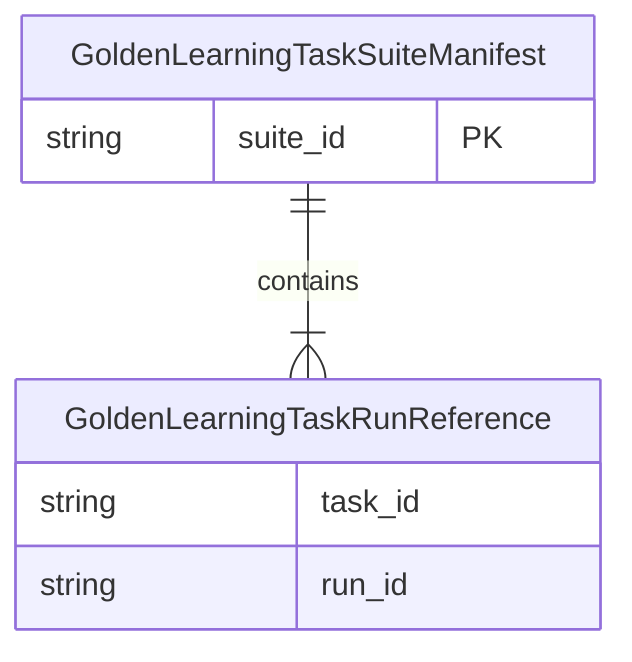
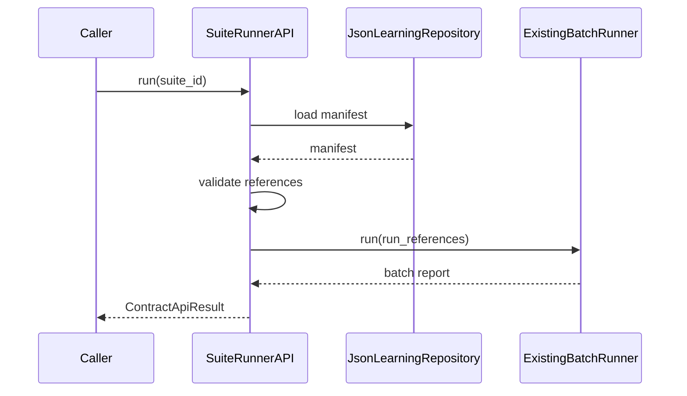

# 技术方案：Golden Learning Task Suite Manifest

## 一、背景与目标

需求真理源：`Plans/需求分析/2026-08-03-GoldenLearningTaskSuiteManifest.md`。

目标是在现有 runtime-neutral learning contracts 中加入 suite manifest 持久化与按 suite_id 运行入口，保持 JSON 本地优先和既有 batch report 语义。

## 二、模块边界

| 模块 | 职责 | 输入/输出 | 依赖 |
|------|------|-----------|------|
| Manifest Contract | 表达 suite_id 与 run references，校验空/重复 | dataclass / domain error | 无 I/O |
| JsonLearningRepository | 保存/加载 manifest JSON | manifest ↔ JSON | filesystem |
| Suite Runner API | 从 suite_id 加载 manifest 并调用现有 batch runner | ContractApiResult | repository、TraceStore、replay repository |
| Existing Batch Runner | 加载 task/trace、replay、生成并保存 reports | batch report | 现有实现，不改判定规则 |

边界：Manifest 不拥有运行逻辑；Repository 不做回归判定；Runner 不重新定义 report schema。

## 三、数据模型



| 实体 | 字段 | 类型 | 必填 | 约束 |
|------|------|------|------|------|
| GoldenLearningTaskSuiteManifest | suite_id | str | 是 | repository 主键 |
| GoldenLearningTaskSuiteManifest | run_references | tuple | 是 | 非空 |
| GoldenLearningTaskRunReference | task_id | str | 是 | suite 内唯一 |
| GoldenLearningTaskRunReference | run_id | str | 是 | suite 内唯一 |

JSON 示例：

```json
{
  "suite_id": "suite-main-loop",
  "run_references": [
    {"task_id": "golden-pass", "run_id": "run-pass"}
  ]
}
```

## 四、接口契约

| Python API | 输入 | 输出 | 幂等 |
|------------|------|------|------|
| `save_golden_learning_task_suite_manifest_api` | manifest、repository | `ContractApiResult[manifest]` | 同 suite_id 覆盖保存 |
| `load_golden_learning_task_suite_manifest` | suite_id | manifest | 只读 |
| `run_golden_learning_task_batch_by_suite_id` | suite_id、repositories、TraceStore | `ContractApiResult[batch report]` | reports 按 task/run 与 suite_id 覆盖保存 |

错误码：

| code | 触发 |
|------|------|
| `GOLDEN_LEARNING_TASK_SUITE_MANIFEST_NOT_FOUND` | suite_id 无记录 |
| `EMPTY_GOLDEN_LEARNING_TASK_SUITE_MANIFEST` | run_references 为空 |
| `DUPLICATE_GOLDEN_LEARNING_TASK_REFERENCE` | task_id 重复 |
| `DUPLICATE_GOLDEN_LEARNING_RUN_REFERENCE` | run_id 重复 |

## 五、关键流程



## 六、实现与回滚

- 测试先行：先添加 manifest 往返、空、重复、缺失、suite_id 运行测试。
- 生产代码只修改 `agent/learning_contracts.py`；测试修改 `agent/tests/test_learning_contracts.py`。
- 不迁移现有 JSON；新 collection 为 `golden_learning_task_suite_manifests/`。
- 回滚时删除新增 API/类型/测试即可，不影响旧的 run_references batch 入口。

## 七、验收标准

- [x] 模块边界、ER、字段、API 与错误码已明确。
- [x] P0=0，方案不引入外部依赖。
- [x] AC-S2-1–AC-S2-5 契约测试通过。
- [x] 全量 agent/tests 109 tests 通过。

## 反馈（skill_run）

```yaml
skill_run:
  skill: architecture-design-assistant
  plan: Plans/技术方案/2026-08-03-GoldenLearningTaskSuiteManifest.md
  date: 2026-08-03
  contexts_used:
    - path: Plans/需求分析/2026-08-03-GoldenLearningTaskSuiteManifest.md
      utility: high
      reason: "以 AC-S2-1–AC-S2-5 和事件边界作为 manifest 模型、API 与错误码设计真理源。"
    - path: Templates/技术方案模板.md
      utility: high
      reason: "按模块边界、ER、字段、API Schema、错误码与关键流程收敛已确认方案。"
    - path: Plans/学习循环/2026-08-02-学习实践-智能体开发-09-R4知识图谱驱动学习系统.md
      utility: high
      reason: "复用现有 JsonLearningRepository 与 batch runner 取舍，避免扩大 R4 范围。"
  contexts_missing: []
  contexts_stale: []
  outcome_status: pass
  revisit_needed: false
```
